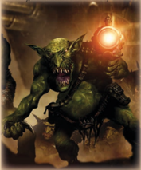

## Skills

Possessed  of  a  natural  inclination  to  goad  slaves  and  wild animals into the service of the Orks, Runtherds, also known as Slavers, gain Wrangling (Int) as a Trained Basic Skill.

### Common Lore (advanced, Investigation)

Aiding  the  Huntas  during  an  Ork  tribe's  formative  years, Trappas  are  skilled  at  setting  traps  and  guiding  their  kin through  the  most  dangerous  environments.  Trappas  gain Survival (Int) as a Trained Basic Skill.| Table 2-2: Ork Characteristics   | Table 2-2: Ork Characteristics   |
|----------------------------------|----------------------------------|
| Characteristic                   | 2d10+                            |
| Weapon Skill                     | 25                               |
| Ballistic Skill                  | 10                               |
| Strength                         | 30                               |
| Toughness                        | 30                               |
| Agility                          | 20                               |
| Intelligence                     | 15                               |
| Perception                       | 20                               |
| Willpower                        | 20                               |
| Fellowship                       | 15                               |

### Intelligence, Skill Group: Orks

As with human characters, characteristics  are  generated  one at a time for Orks. However, where human characteristics are all generated in the same way, by rolling 2d10 and adding 25 to the total, Orks have different basic values for each characteristic. These are detailed on Table 2-2: Ork Characteristics.

Starting Wounds: Ork characters roll 1d5+1 and add twice their  starting  Toughness  Bonus  to  the  result  to  determine their starting number of wounds. They do not take the effects of Unnatural Toughness into account for this purpose.

Starting  Fate  Points: Roll  1d10  to  determine  an  Ork character's starting Fate Points. On a 1-5, he begins with 1 Fate Point. On a 6-10, he begins with 2 Fate Points.

### Ork Language

Orks,  being  a  distinct  and  separate  race,  possess  a  set  of unique Skills and Talents. Most of these are for use soely with Ork characters and NPCs, but a GM may grant a non-Ork player a specific Skill-such as Common Lore (Ork)-as an Elite Advance where appropriate.

### Literacy (advanced)

The following new skill groups are intended for use with Ork characters.

### Intelligence, Skill Groups: Ork

## Talents

The  Common  Lore  Skill  allows  the  Explorer  to  recall general information, procedures, divisions, traditions, famed individuals,  and  superstitions  of  a  particular  world,  group, organisation, or race. The following additional skill group has been added to those available. The manner in which this skill functions is unchanged.

Ork: Knowledge  of  Greenskin  'Kultur,'  covering  their caste system, their approach to law, and the basic nature of their  Klans,  along  with  an  understanding  of  nature  of  the Greenskins themselves.

### Da Nekst Best Fing

Orks generally speak a debased and primitive form of Low  Gothic,  with  mangled  pronunciation  and  more than a few 'Ork' words mixed in. Therefore, it is possible for Orks and humans to communicate (although rarely easy).  Therefore,  Orks  start  with  Speak  Language (Low Gothic), although their pronunciation and grasp of  grammar  is  uniformly  atrocious.  The  Ork  written language, however, is a crude glyphic script. The core of the script is composed of glyphs that indicate clan, common Ork concepts, and elements of  Ork  names. This is augmented by a rudimentary series of phonetic runes.

#### Prerequisites: Ork, Mob Rule

#### Example

Since an Ork's written  and  spoken  languages  are  not intrinsically  related,  this  Skill  relates  specifically  to  reading and writing the Ork language. The manner in which this skill functions is unchanged.

Ork: A  crude  glyphic  script,  augmented  by  rudimentary phonetic  runes,  this  language  is  unsuitable  for  conveying anything but the most basic concepts.

#### Gretchin, Snotlings, and Squigs

The  following  new  talents  are  intended  for  use  with  Ork characters,  and  are  available  for  Ork  player  characters  to purchase at various ranks of the Ork Freebooter Career Path.

#### Gretchin

#### Squigs

The  Ork  has  become  sufficiently  familiar  with  and comfortable  around  non-Orks  that  he  draws  a  measure of  confidence  and  resolve  from  their  presence.  When determining the bonus to Willpower gained from the Mob Rule  trait,  the  Ork  counts  every  two  non-Orks  (which may  not  have  the  Machine  Trait,  as  they're  not  really people; wild animals, or any lesser Orkoid creatures like Gretchin, Squigs or Snotlings don't count either) within 10m as an Ork.

### Ded 'ard

Grakzog, an Ork Freebooter working for humans, is preparing to lead  a  boarding  action  onto  an  enemy  vessel.  There  are  no  Orks around, but there are 4 humans within 10m of him. Because he has Da Nekst Best Fing, he gains a +20 bonus to his Willpower against Pinning and Fear, because each human counts as half an Ork for the purposes of Mob Rule. The Gretchin cowering behind his legs doesn't count at all, with or without the talent.### Enemy

Since Orks often have 'help' in the form of lesser greenskins, the stats for Gretchin and Squigs are provided here. The stats  for  Snotlings  are  not  provided,  as  these  tiny  little  annoyances  are  barely  sentient,  unable  to  communicate  with more than squeaks, yips, and obscene gestures, and too small to hurt anyone, or really do much of anything. If need be, they should be counted as a Tiny creature that dies when hit with any weapon, and can carry roughly 1 kilogram of weight.

### Give It Sum Dakka!

Gretchin are small, devious, and generally only dangerous in large numbers. They serve Orks to avoid being killed and/or eaten by the larger Greenskins, although this is by no means a guarantee. They are able to shoot better than their larger cousins, and are slightly more intelligent, not that it helps them in the greenskin's social hierarchy. their larger cousins, and are slightly more intelligent, not that it helps them in the greenskin's social hierarchy.

Move: 3/6/9/18

Wounds: 5

Skills: Awareness (Per), Concealment (Ag), Dodge (Ag), Search (Int), Shadowing (Ag), Silent Move (Ag)

Talents: Heightened Senses (Hearing),  Melee  Weapon  Training (Primitive), Pistol Weapon Training (Primitive, SP)

Traits: Mob Rule, Size (Scrawny), Unnatural Toughness (x2) Armour: None

Weapons: Gretchin  may  be  armed  with  any  one-handed  SP Pistol procured by the controlling character, although Sluggas are likely the most common. They inevitably have a sneaky boot knife as well (1d5+1 R) † .

### Good Reputation

There  are  countless  sub-species  of  Squigs  in  the  greenskin  ecosystem,  although  most  share  the  same  basic physiological characteristics. Squigs are primarily a gigantic fang-filled maw with a large tongue, plus powerful legs and beady eyes. They have voracious appetites, and eat anything they can fit between their grossly oversized jaws, as well as plenty of things that don't. Orks and gretchin often keep squigs as pets (and food sources), being one of the few races that find any redeeming qualities in them.

Move: 3/6/9/18

Wounds: 10

Skills: Awareness +10 (Per), Tracking +20 (Int)

Talents: Furious Assault

Traits: Bestial, Improved Natural Weapons (Bite) †† , Unnatural Toughness (x2)

Weapons: Grossly oversized maw (1d10+6 † , R, Tearing)

†Includes Strength Bonus

††Improved Natural Weapons are not Primitive.

### Lissen Ta Me, Cos I'z Da Biggest

Prerequisites: Ork, 'Ard, Toughness 50

The Ork is extremely resilient, to the point where even normally fatal  wounds  are  survivable.  When  suffering  from  Blood Loss, the Ork needs only test to avoid death every five rounds instead of every round. Additionally, the Ork may re-roll any failed Toughness Tests to avoid dying immediately due to a Critical Damage.

64

### More Fer Me!

Talent Groups: Bad Moons, Blood Axes, Death Skulls, Evil Suns, Goffs, Snakebites, Mekboys, Painboys, Runtherdz, Freebooterz. This  talent  functions  exactly  as  described  in  the ROGUE TRADER Core Rulebook, but with the additional Talent Groups listed above. References in the advance scheme to 'Own Klan' require the Ork to pick the appropriate option for his listed Klan, chosen during character generation. References to 'Any Ork' allow any of the above Ork-specific options to be chosen.

### Peer

Prerequisites: Ork, Bulging Biceps, Strength 50

The Ork uses his Shoota with great enthusiasm, forcing the enemy to keep their heads down as he approaches. The Ork may use Suppressive Fire as a Half Action instead of a Full Action.

### Rival

Talent  Groups: Bad  Moons,  Blood  Axes,  Death  Skulls,  Evil Suns, Goffs, Snakebites, Mekboys, Painboys, Runtherdz, Freebooterz.

This  talent  functions  exactly  as  described  in  the ROGUE TRADER Core  Rulebook,  but  with  the  additional  Talent Groups  listed  above.  References  in  the  advance  scheme  to 'Own Klan' require the Ork to pick the appropriate option for  his  listed  Klan,  chosen  during  character  generation. References to 'Any Ork' allow any of the above Ork-specific options to be chosen.

### Runtz

Prerequisites: Ork, Might Makes Right, Intimidate +10 The Ork knows how to get his way and bully his way around, even amongst non-Orks. The Ork may use his Might Makes Right rule with any allies, not just Greenskins. Additionally, he may affect a number of creatures with Might Makes Right equal to ten times his Strength bonus.

#### Prerequisite: Ork

Prerequisites: Ork, Weapon Skill 40

When  confronted  by  numerous  foes,  the Ork  is only encouraged  by  the  prospect  of  so  many  enemies.  When outnumbered  in  melee,  he  gains  the  same  bonus  to  hit  as his  enemies  would.  This  bonus  applies  even  if  he  has  the Combat Master Talent, which would deny his enemies the outnumbering bonus.

### Too 'ard Ta Care

Talent Groups: Bad Moons, Blood Axes, Death Skulls, Evil Suns,  Goffs,  Snakebites,  Mekboys,  Painboys,  Runtherdz, Freebooterz.

This  talent  functions  exactly  as  described  in  the ROGUE TRADER Core  Rulebook,  but  with  the  additional  Talent Groups  listed  above.  References  in  the  advance  scheme  to 'Own Klan' require the Ork to pick the appropriate option for  his  listed  Klan,  chosen  during  character  generation. References to 'Any Ork' allow any of the above Ork-specific options to be chosen.

### Waaagh!

Talent Groups: Bad Moons, Blood Axes, Death Skulls, Evil Suns,  Goffs,  Snakebites,  Mekboys,  Painboys,  Runtherdz, Freebooterz.

This  talent  functions  exactly  as  described  in  the ROGUE TRADER Core  Rulebook,  but  with  the  additional  Talent Groups  listed  above.  References  in  the  advance  scheme  to 'Own Klan' require the Ork to pick the appropriate option for  his  listed  Klan,  chosen  during  character  generation. References to 'Any Ork' allow any of the above Ork-specific options to be chosen.

### Xenos Weapon Proficiency (ork)

#### Prerequisites: Ork

The  Ork  is  constantly  followed  by  slaves  and  pets,  some of which may even have been spawned from the spores he sheds.  The  Ork  has  a  number  of  Runts  in  his  impromptu entourage  equal  to  the  number  of  times  he  has  taken  this talent. These may be Attack Squigs, Gretchin, or Snotlings, in any combination. Snotlings, due to their lack of size and general uselessness, count as half a Runt for the purposes of this talent. Should any of the Ork's Runts die due to battle or simple mistreatment (more than a few Gretchin have died due to being accidentally sat on by their masters, or from injuries suffered when kicked a little too hard), a new one will take its place, at the next opportunity the GM deems appropriate (such as the next time you're on a planet's surface for more than a few hours). An Ork's Runts will follow its commands, often under the threat of being kicked by the Ork, and as Greenskins are subject to the Might Makes Right rule.

*Source:* `Battle Fleet of the Koronus, pages 63–66`
