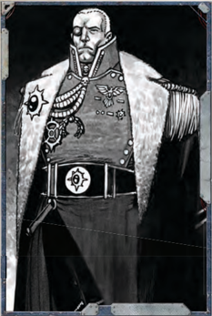
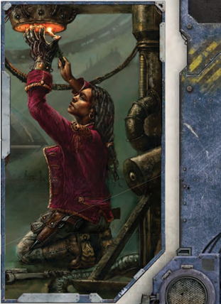

## Acrobatics (advanced, Movement) Agility

Acrobatics training supplements the Explorer's natural agility to perform feats the less athletic would not even consider. Leaping between catwalks in the enginarium and flipping over the heads of shorter foes is possible with this skill. The difficulty of the Test depends on the difficulty of the feat involved: dodging around the legs of an enraged xeno and leaping from stone to stone in a swirling magma flow would both present significant challenges. The more Degrees of Success obtained, the more stylish or dramatic the end result.

Skill Use: Full Action unless otherwise noted.

### Special Use: Disengage

When taking the [Disengage](starship-combat-rules.md) Action in [Combat](rules-combat-overview.md), the Explorer may make an Acrobatics Test to reduce it to a Half Action.

### Special Use: Jump and Leap

An Acrobatics Test may substitute for an Agility Test when jumping or a Strength Test when leaping, according to the appropriate rules on page 266.

## Awareness (basic, Exploration) Perception

Awareness encompasses the Explorer's subconscious ability to react to things his conscious mind may not perceive. He can use this Skill to notice threats-such as ambushes, traps, or cleverly hidden objects-or slight changes in the environment-such as a faint vibration in the deck plating or the smell of the air recyclers.

When  using  Awareness  against  an  opponent,  the  test  is always Opposed. This use includes noticing ambushes, spotting traps, and other things involving another's actions. However, noticing  environmental  factors  is  a  Standard  Test.  This  use includes perceiving trace scents, motion, or similar things. Skill Use: Free Action made in reaction to something.

## Barter (basic, Interaction) Fellowship

The  Barter  skill  allows  the  Explorer  to  negotiate  better prices or exchange for goods and services. This can modify the [Acquisition](economy-acquisition-rules.md) Modifier for items where the price is not set, but rather the result of negotiation. Thus, the Explorer could not use it to change the cost for promethium at an Imperial Guard depot, but he could definitely use it to haggle with the representatives of House Dimico over the cost of equipping his personal guard with handcrafted bolters. All Barter Tests are Opposed, as they involve [Interaction](rules-interaction.md) by their very nature.

Barter may sometimes be used to assist with [Acquisition Tests](economy-acquisition-rules.md) (see page 271).

Skill  Use: A  typical  Barter  Test  takes  about  five  minutes, but  delicate  dealings  and  intricate  negotiations  may  involve [Extended Tests](rules-tests.md).

## Blather (advanced, Interaction) Fellowship

Blather allows the Explorer to stall for time with a confusing or distracting stream of conversation. Blather Tests are always Opposed by the target's Willpower, or Scrutiny if the target actively suspects the tactic. Winning the Opposed Test results in the opponent's bemused inaction for his entire round. For every degree of success, the Explorer has dumbfounded the target  for  an  additional  round.  Loosing  the  Opposed  Test means that everyone involved may act normally.

Some Talents  allow  the  Explorer  to  use  Blather  against many opponents.  However,  even  without  these  Talents,  he can affect a number of targets equal to his Fellowship Bonus if  he  is  able  to  win  the  Opposed  Test.  If  the  group  shares similar [Characteristics](starship-anatomy-detailed.md), the GM may roll a single Willpower Test for the group to save time.

While the Explorer's opponents may be confused by his banter, they will not remain inactive in the face of obvious danger  or  preparations  to  harm  them.  The  character  and his  target  must  share  a  common  Language  or  the  Test  fails automatically.

Skill Use:

Full Action.

## Carouse (basic) Toughness

The Carouse Skill is used to resist the effects of alcohol and narcotics. Frequent imbibers can build up quite a tolerance to inebriants, remaining clear-headed and lucid while those across the table find their judgement or capabilities diminished. The Explorer makes a Skill Test whenever he suffers the effects of alcohol or similar intoxicants.

Each time he would otherwise suffer from the effects of an intoxicant, make a Carouse Test. Failure indicates he has gained a level of [Fatigue](character-injury.md) or suffers the side effects of the substance. Should he lose conscious, the Explorer will remain passed out for a number of hours equal to 1d10 minus his Toughness Bonus (minimum 1 hour).

Skill  Use: Free  Action  taken  whenever  the Explorer imbibes.## [Charm](equipment-gear.md) (basic, [Interaction](rules-interaction.md)) Fellowship

The Explorer can use the [Charm](equipment-gear.md) Skill to improve the disposition of  others  towards  him,  making  a  Charm  Test  whenever  he wishes to change the minds of an individual or small group. He need not make a Charm Test each time he speaks with others in a pleasant manner, but only when he wishes to change their opinion, disposition, or convince them to do something.

All Charm Tests are Opposed by Willpower and can affect a number of targets equal to the Explorer's Fellowship Bonus. His targets must be able to see and hear clearly, and share a common Language.

Skill Use:

1 minute.

### Special Use: Inspire

Those in a position of authority can use the [Charm](equipment-gear.md) skill to [Inspire](psychic-disciplines-list.md) a group-related test, either with positive or negative reinforcement. Success provides a +10 bonus to the next Skill Test  of  the  motivated  group.  Thus,  the  ship's  priest  might [Inspire](psychic-disciplines-list.md) the gunnery crews to greater effort, or the [Explorator](career-explorator.md) might speed the efforts of the Tech-adepts under his command by putting the [Fear](character-fear-and-damnation.md) of the Omnissiah into them! When used on board a starship during [Combat](rules-combat-overview.md), this is known as the Put Your Backs Into It! Action (see page 218).

Characters can also use this skill as an Extended Test for purposes  on  improving  morale  on  board  their  vessel.  (See page 226).

## Chem-use (advanced, Investigation) Intelligence

The  Chem-Use  skill  allows  the  Explorer  to  safely  identify, handle and prepare a variety of chemicals, toxins, poisons, and drugs. While Chem-Use covers the use and basic combination of these substances, the Trade (Chymist) skill deals with their manufacture from base [Components](starship-anatomy-detailed.md).

Success in a Chem-Use Test, modified by the appropriate difficulty for the chemical or drug in question, indicates it has been applied correctly for the desired results. Failure indicates the dose was wasted without effect. See Chapter V: Armoury for more information on drugs, chemicals, and their effects.

When using a medicae [Injector](equipment-drugs-and-consumables.md) or narthecium, the Skill Test to administer a drug or antidote is reduced to a Half Action.

Employing Chem-Use to apply particularly complex combinations  of  substances  or  toxins  uses  an  Extended  Test of duration and difficulty set by the GM for the treatment in question.

Skill Use: Full Action.

## Ciphers (advanced) Intelligence

Skill  Groups: Rogue  Trader,  Mercenary  Cant,  Nobilite Family, Astropath Sign, and Underworld

Many groups and organizations employ ciphers as a secret, shorthand  code  to  communicate  basic  ideas,  warnings,  or information rapidly. The Explorer can use and understand the hand signals,  physical  markings,  or  other  subtle  signs  employed to express these concepts. Skill Tests are not required to either leave or read basic messages but are necessary to communicate or decipher complicated meanings or signs obscured by the passage of time.

Rogue Trader: Each trader, vessel, or fleet develops its own code to help coordinate negotiations and keep secrets from other Merchants or the authorities.

Mercenary  Cant: Many  mercenary  companies  operate  in the  Expanse,  and  each  has  an  abbreviated,  clipped  battle Language for [Orders](combat-orders.md) and commands. Though there are some commonalities, each is essentially unique.

Nobilite Encoding: The secretive families of the [Navigators](psychic-psyker-types.md) have  histories  stretching  back  for  millennia,  and  many  use languages or dialects long-dead to modern ears. Each family uses a specific one tied to their history.

Astropath: Owing to the sensory changes involved in soul binding,  this  special  Language  has  [Components](starship-anatomy-detailed.md)  on  many levels, including [Whispers](talents-descriptions.md) of the mind.

Underworld: Crime  lords  have  used  ciphers  since  time immemorial,  and  their  sophistication  has  only  increased over  this  period.  Each  organisation  uses  its  own  to  deter competition.

Skill Use:

Full Action.

## Climb (basic, Movement) Strength

With the Climb skill the Explorer can ascend or descend ropes, pipes, and both natural and man-made walls. This skill is not used for ladders or other easily ascended ways, but for climbs without [Ready](rules-combat-overview.md) handholds or other poor [Climbing](combat-movement.md) conditions. The condition of the surface or item and the environmental conditions  can  impose  additional  bonuses  or  penalties.  It's far  more  difficult  to  ascend  an  icy  rock  face  in  a  blizzard than a ship's bulkhead crisscrossed with pipes and conduits. A successful Test allows the character to ascend or descend at one-half his half move rate. See [Climbing](combat-movement.md) in Chapter Ix: Playing the Game for more details.

Skill Use:

Half Action.

## Command (basic) Fellowship

The Explorer utilizes the Command skill to both direct those under his authority and establish actions for groups to execute on command, such as bringing a ship to battle stations. This skill is only effective upon those under the Explorer's authority. A successful Command Test indicates that those whom he directs follow his instructions in a timely manner. Failure on the Skill Test when used on an individual simply means that he does not

follow the Explorer's directions, though additional Degrees of Failure can indicate that the individual accepts the task with no intention of actually doing it, or could even misinterpret the command or take contradictory actions. For directing groups, Degrees of Success or Failure will increase or decrease the time necessary to execute the [Orders](combat-orders.md), with three or more Degrees of Failure subjecting them to confused inaction.

A Command Test can affect a number of targets equal to the Explorer's Fellowship Bonus. They must be able to see and hear him, though this could be done remotely through a vox- or pict-caster, and use speak a common Language.

Skill Use: Half Action for simple commands, Full Action for more involved direction.

## Commerce (advanced) Fellowship

The  Explorer  use  the  Commerce  skill  to  build  business ventures, negotiate contracts, and  form  trade networks. Commerce can be an Opposed Test, pitting the character's Commerce Skill against one of several possibilities, depending on the situation at hand. For negotiations, the character Tests against his opponent's Commerce Skill. If attempting to bilk an easy mark, it would be against the target's Scrutiny Skill. It can also be a standard Skill Test, representing the knowledge involved in managing a commercial venture-in the absence of others acting specifically against the Explorer. Commerce is the main skill for utilising the Explorers' [Profit Factor](economy-wealth-and-acquisitions.md) to make Acquisitions (see page 271).

The time necessary for a Commerce Skill Test varies from instant, such as recalling details about a recent venture, to the months necessary to build complex financial networks. Skill Use: Variable (see Acquisitions on page 271).

## Common Lore (advanced, Investigation) Intelligence

Skill  Group: Adeptus  Arbites,  Adeptus  Astra  Telepathica, Adeptus  Mechanicus,  Administratum,  Ecclesiarchy,  Imperial Creed,  Imperial  Guard,  Imperial  Navy,  Imperium,  Koronous Expanse, Navis Nobilite, Rogue Traders, Tech, War

The Common Lore Skill allows the Explorer to recall general information, procedures, divisions, traditions, famed individuals, and superstitions of a particular world, group, organisation, or race. This Skill differs from Scholastic Lore, which represents scholarly learning, and Forbidden Lore, which involves hidden or proscribed knowledge, in that it deals with basic information learned from prolonged exposure to a Culture or area.

The GM will determine what extra information to provide for additional Degrees of Success.

Adeptus Arbites: Knowledge of the various arms and subsects of the Arbites, including details of rank structure, common procedures, and the basic tenants of Imperial Justice.

Adeptus Astra Telepathica: Knowledge of how psykers are recruited  and  trained  for  the  Adeptus  Terra,  including  how [Astropaths](psychic-psyker-types.md) are used throughout the Imperium, and The Basics of sending and receiving astro-telepathic messages.

Adeptus  Mechanicus: A  general understanding of the symbols and practices of The Adeptus Mechanicus, as well as its hierarchy, identifiable ranks, and the existence of the Sixteen Universal laws.

Administratum: Broad knowledge of the labyrinthine workings, rules, traditions, and dictates of the Adeptus Administratum.

Ecclesiarchy: Understanding of the structure of The Adeptus Ministorum and its role in the worship of the Emperor.

Imperial  Creed: Knowledge  of  the  rites,  practices,  and personages of the Imperial Cult, the most common observances, festivals, and holidays in honour of the Emperor.

Imperial Guard: Basic information about the ranking system, logistics, structure, and basic tactical and strategic practices of The Imperial Guard, as well as particularly famed regiments.

Imperial Navy: Basic information about the ranks, customs, uniforms, and particular traditions of The Imperial Navy, as well as famous admirals and ships.

Imperium: Knowledge  of  the  segmenta,  Sectors,  and  most well known worlds of the Imperium.

Koronous  Expanse: Information  concerning  the  general astrography of the Expanse, including known warp passages, regions, and legends of what may be found there.

Navis Nobilite: Information about the [Size](character-traits.md), customs, dress, and predominant characters of the Navigator families. Rogue Traders: Understanding of the most famed Warrants of Trade,  their  bearers,  and  the  vessels carrying them throughout the Imperium.

Tech: An  understanding  of  simple  litaniesKnowledge of great battles, notable commanders, heroes, and famous stratagems employed by the Imperium in its many

and rituals to sooth and appease machine spirits. War: campaigns.

Skill Use: Free Action.

## Concealment (basic) Agility

The  Concealment  Skill  is  used  to  hide  things,  from  small objects to vehicles to starships, or objects on the character's person. Use of the Skill requires an appropriate environment to mask the item in question: buildings and trees for a small shuttle or an [Asteroid Field](starship-travel-non-combat.md) and space anomaly for a starship. Concealment is always an Opposed Test, pitting the Explorer's Concealment against his opponent's Awareness or Scrutiny. Conceal represents  active  efforts  to  foil  another  character's search attempts.

If  the  character  or  the  object  being  hidden  remains perfectly still, he gains a +10 bonus to the Skill Test. Skill Use: Half Action.

## Contortionist (basic, Combat) Agility

Explorers with the Contortionist Skill can make use of their innate  flexibility  to  allow  them  to  [Escape](combat-escape-action.md)  bonds,  squeeze through opening normally too small for passage, or fit into an area normally too small for their body. It also provides an alternative to brute strength in grappling.

Skill Use: Full Action unless otherwise noted below.

### Special Use: Escape Bonds

The  Explorer  can  make  a  Contortionist  Test  to  slip  free of  bonds.  This  is  an  Opposed  Test,  using  the  character's Contortionist Skill against his opponent's Characteristic Test using Intelligence. The quality of the bonds and the time used to employ them will affect the difficulty of the Test. It may be impossible to [Escape](combat-escape-action.md) adamantine [Manacles](equipment-tools.md) properly employed by a bounty hunter, but it is far easier to slip out of the crude ropes  hastily  applied  by  a  feral  tribesman-especially  after applying grox fat to one's wrists.

Escaping bonds requires one minute, with each Degree of Success reducing this time by 10 seconds.

### Special Use: Escape Grapple

After an opponent has grappled the Explorer in [Combat](rules-combat-overview.md), he may [Escape](combat-escape-action.md) using the Contortionist Skill. Make an Opposed Test  with  the  Contortionist  Skill  against  by  the  grappler's Strength Characteristic Test.  Success  indicates  the  Explorer has freed himself. Failure means he remains grappled.

### Special Use: Squeeze Through

The Explorer can make a Contortionist Test to squeeze through a tight space, such as through a maintenance conduit aboard a ship or a gap in blast doors warped open by [Damage](character-injury.md).

He can also use this aspect of the skill to cram himself into a space normally too small to fit a human body. The GM sets the difficulty of the Test according to the [Size](character-traits.md) of the passage or opening, and is well within his rights to rule that some spaces are simply too small to allow use of this Skill. A successful Skill Test indicates that the character has managed to squirm through the gap or into the crate. Failure means that he cannot pass the area or will not fit into the space. Four or more Degrees of Failure mean he has become stuck until he can succeed in another Contortionist Test or someone else pulls him free. Squeeze Through takes 1 minute, with each Degree of Success reducing this time by 10 seconds.

## Deceive (basic, Interaction) Fellowship

The Deceive skill enables the Explorer to mislead others as to  his  true  intent.  Any  time  he  tells  a  lie,  reveal  only  part of  the  truth  or  spin  information  to  his  advantage  with  the intent to mislead someone, the character must make a Deceive Test. He need not make a Deceive Test for every lie, but only when that deception would change someone's mind, opinion, or  actions.  Deceive  is  always  an  Opposed  Test,  using  your Deceive Skill against the opponent's Scrutiny.

A Deceive Test affects a number of targets equal to the Explorer's Fellowship Bonus. The targets must be able to see and  hear  him  clearly,  either  in  person  or  via  vox-  or  pictcaster. They must also speak a common Language.

Skill Use: 1 minute, or more for complex deceptions.

### Special Use: Con

The [Ship's Master](crew-role-ships-master.md) or officers can use deception to temporarily increase the crew's morale during [Combat](rules-combat-overview.md) by plying them with exaggerated  battle  reports  or  idle  suppositions  concerning what Ork Freebooters do to prisoners.

Outside of [Combat](rules-combat-overview.md), the Explorer can use this skill to reduce the effect of long warp passages on the crew's morale. Each failure  imposes  a  cumulative  -10  penalty  upon  subsequent attempts, as character's audience becomes  wise to the deceptions (See page 293).

## Demolition (advanced, Crafting) Intelligence

The Explorer can use  the  Demolition  Skill  to  employ  explosives in the proper quantity to achieve a desired effect, from cutting through the hatch of a Land Raider to destroying a [Plasma](weapons-general.md) conduit without significantly damaging the reactor behind it. It can also be used to diffuse the explosive left by others or to manufacture demolition materials, from slow fuses to blasting caps to the explosives themselves. This Skill pertains to set charges rather than grenades and other devices intended for use against the enemy in [Combat](rules-combat-overview.md).

Skill Use: Full Action unless otherwise noted.### Special Use: Manufacture Explosives

Much like the Trade Skills, the Demolition Skill allows the Explorer to make explosive materials from basic [Components](starship-anatomy-detailed.md). This use of the Demolition Skill is an Extended Test, and the GM will assign a difficulty and duration in accordance with the complexity of the compound and the materials at hand. Constructing breaching charges in a wellstocked Munitorum warehouse is far easier than making a fuse from dried vines and animal droppings.

Skill Use: Full Action unless otherwise noted.

### Special Use: Place Explosives

The effectiveness of explosive devices is greatly dependent upon  the  skill  with  which  they  are  placed.  Success  on  a Demolitions  Test  indicates  the  Explorer  has  successfully planted the explosive [Charge](rules-combat-overview.md), set with his trigger of choice. Possible triggers are only limited by one's imagination, and can include trip wires, timers, proximity [Sensors](starship-anatomy-detailed.md), or remote activators. Failure indicates that the explosives will fail to go off when triggered, though the character will not know this till  the  time  of  activation.  Four or more Degrees of Failure indicates the Explorer has detonated the device on himself !

Some  tasks,  such  as  rigging  a  building  for  demolition or setting a series of charges to scuttle a cargo bay, require an Extended Test. The GM will set difficulty and duration depending on the extent of the undertaking.

When  placing  explosives,  make  sure  to  note  the  total Degrees  of  Success  Test  result,  as  it  may  be  used  in  an Opposed Test if someone attempts to defuse the explosive.

### Special Use: Defuse Explosives

Defusing charges also falls under the Demolition Skill. Make an  Opposed  Test  against  the  Demolition  Skill  Test  of  the individual who set the explosives. Winning the Test indicates that  the  bomb  has  been  defused.  Simple  failure  means  that while the [Charge](rules-combat-overview.md) has not been disarmed, neither has it gone off. Four or more Degrees of Failure indicates the Explorer has set off the device, suffering the consequences of the explosion.

Defusing multiple charges or complex trigger mechanisms may require an Extended Test as determined by the GM.

## Disguise (basic) Fellowship

The Disguise skill allows the Explorer to mask his features and even assume another's appearance. The difficulty of the test  depends  upon  the  materials  available,  the  differences between the character and the desired appearance, and any other elements that would affect the deception. Disguise is an Opposed Skill Test against a foe's Scrutiny.

The application of the most elementary of disguises takes one minute. The more elaborate the deception, the more time required, up to weeks or months in the case of impersonations involving prosthetics, surgery, or xeno mannerisms. The GM will assign an appropriate difficulty and set the time required for the desired effect.

Skill Use: 1 minute or more.

## Dodge (basic, Combat) Agility

Use the [Dodge](rules-combat-overview.md) skill as a Reaction to nullify a successful handto-hand or ranged [Attack](combat-attack-rules.md). Success on the Skill Test means [The Attack](rules-combat-overview.md) has been avoided and deals no [Damage](character-injury.md). See Chapter Ix: Playing the Game for more information on Dodge. Skill Use: Reaction.

## Drive (advanced, Operator) Agility

[Skill Groups](skills-groups.md): Ground Vehicle, Skimmer/Hover, Walker The  Drive allows the Explorer to control land-based, hover-, or skimmer-type vehicles. Vehicles include Cargo-8s, Rhinos,  Land  Speeders,  Sentinels,  and  other  ground-based [Transports](hulls-overview.md). Normal driving does not require a Skill Test, but one is required for hazardous conditions, excessive speed, or dangerous manoeuvres.

Skill Use: Half Action.

## Evaluate (basic, Investigation) Intelligence

The Explorer can use Evaluate to determine the approximate value of an object or group of items. Thus, the Skill can be used on a single power [Sword](weapons-general.md) or a cargo hold full of lasrifles. Success  on  the  Evaluate  Test  reveals  the  item's  [Availability](economy-availability-rules.md) Modifier (see page 272). Additional Degrees of Success will give additional information about the objects. A failure results in the miscalculation of an item's true value, with the degree of  error  increasing  with  each  Degree  of  Failure.  The  GM should roll Evaluate Tests and only reveal what the Explorer believes to be true.

The  difficulty  of  the  Test  should  be  adjusted  for  the Explorer's  access  to  the  item  and  the  time  allowed  by  the seller. Using Evaluate on large cargoes requires an Extended Test, though the Explorer can appraise single items in about a  minute.  Additionally,  Evaluate  can  be  used  at  the  GM's discretion  to  assist  with  determining  the  [Requirements](economy-endeavours.md)  for [Endeavours](economy-endeavours.md) (see page 277).

Skill Use: 1 minute or more.

## Forbidden Lore (advanced, Investigation) Intelligence

Adeptus  Mechanicus,  Archeotech,  Daemonology, Heresy, The Inquisition, Mutants, [Navigators](psychic-psyker-types.md), Pirates, Psykers,

Skill  Groups: [The Warp](warp-imperial-space-travel.md), and Xenos

Forbidden Lore skills represent knowledge usually hidden,  veiled,  or  proscribed  by  an  organisation  or  society . Mere possession of this knowledge may cause difficulties for those  not  associated  with  the  group  in  question.  Excessive knowledge of the hidden truths of powerful Navigator houses can  be  decidedly  bad  for  one's  health  for  those  outside  the Navis Nobilite.

A successful Forbidden Lore Test indicates the Explorer canrecall basic information about the subject. The GM will reveal additional information as appropriate to the Degree of Success on the roll.

Adeptus Mechanicus: An in-depth understanding of followers of the Machine God, including such things as their rituals,  observances,  common  beliefs,  core  philosophies,  and specific knowledge of the Universal Laws.

Archeotech: Knowledge of the great, lost tech devices of past times and clues to their mysterious functions and purposes.

Daemonology: Lore about some of the most infamous warp entities and their twisted physical manifestations.

Heresy: Wisdom  concerning  acts  and  practices  deemed heretical by the Imperium, the most contemptible heretics of history, and their acts.

The Inquisition: Understanding the secretive organisation of the Imperium, its common tenets and famous Inquisitors.

Mutants: The study of stable and [Unstable](weapons-general.md) [Mutations](character-mutations-list.md) within humanity, their cancerous [Influence](economy-influence-rules.md) and mutagenic development over time, and some of the studies and books on the topic.

[Navigators](psychic-psyker-types.md): Secret  knowledge  about  the  Navis  Nobilite families,  their  breeding  programs,  common  [Mutations](character-mutations-list.md),  and prominent patriarchs.

Pirates: Knowledge of the scourge of the  warp  lanes,  their tactics, infamous vessels, and inhuman [Captains](imperial-starship-types.md).

Psykers: Skill  in  identifying  psykers,  the  physical  effects  of their powers, the danger they cause, and the general extent of their capabilities.

[The Warp](warp-imperial-space-travel.md): An understanding of the energy of the warp, its [Interaction](rules-interaction.md) and interrelation with realspace and how its tides and eddies affect travel between the stars.

Xenos: Knowledge  of  the  minor  and  major  alien  species known to the Imperium, the threat they pose, and their general appearance.

Skill Use: Free Action…although  the consequences of knowing such things can last a lifetime.

## Gamble (basic) Intelligence

The Explorer uses Gamble when participating in games of chance  popular  amongst  both  officers  and  crew  of  trader fleets. Each participant wagers an amount, though these are typically  the  same,  and  makes  an  Opposed  Test  with  the Gamble Skill. The player with the most Degrees of Success or fewest Degrees of Failure wins the pot. The Explorer may choose to lose against any player with a worse result as part of a Deceive attempt.

Those with both Skills may use Sleight of Hand instead of Gamble to hide cards or alter dice rolls. Success gives the character a +20 bonus to his tests, but four or more Degrees of Failure indicates he has been caught in the act.

Skill Use: Full Action for an entire day of gaming.

## Inquiry (basic, Investigation) Fellowship

The Explorer can use Inquiry to gain information by asking questions,  through  conversation  or  simple  eavesdropping. Inquiry allows him to pick up general information about an area: its news, recent events, and more. Additional Degrees of Success reveal more detailed or more secretive tidings.

Inquiry can also be used as an Investigation Skill, allowing the  Explorer  to  hunt  after  a  particular  item  of  information from  either  individuals  or  resources,  such  as  the  ship's librarium. This use is virtually always an Extended Test, with Difficulty and Duration set by the GM. Additional information on Investigation can be found on page 264 of Chapter Ix: Playing the Game .

Skill Use:

1 hour or more.

### Special Use: Hunt for Sedition

A character may use his skills of inquiry among members of the crew to plumb for malcontents, malingerers and mutineers. Successful use of Inquiry improves Morale by 1d5 by removing of negative influences from the rest of the crew, but for every point the ship's Morale improves, the Population is reduced by 1 in turn as the seditious elements are purged.

## Interrogation (advanced) Willpower

Interrogation allows the Explorer to extract information from an  unwilling  subject.  The  application  differs  from  torture, where a subject will frequently say anything to stop the ordeal. Rather, it represents skilled application of psychology, various devices, serums, and other techniques. The GM may modify the Difficulty of the Test according to the [Availability](economy-availability-rules.md) of [Tools](equipment-tools.md), facilities, and other conditions.

Interrogation  is  always  an  Opposed  Test,  pitting  the Explorer's Interrogation Skill against an opponent's Willpower.  If  he  wins  the  Opposed  Test,  the  Explorer  gets one answer, plus one answer for each Degree of Success. If the opponent wins the Opposed Test, the Explorer gets nothing of worth. Two or more Degrees of Failure inflict 1d10 plus the character's Willpower Bonus in [Damage](character-injury.md), and prevents any further interrogation for 1d5 days. If the Explorer suffers four or more Degrees of Failure, he deals the same [Damage](character-injury.md) and his subject gains a +30 bonus to Willpower Tests made to resist Interrogation at the hands of the Explorer or his allies. Each Interrogation Test inflicts one level of Fatigue on the target.

Skill Use:

1d5 hours.

## Intimidate (basic, Interaction) Strength

The Explorer uses Intimidate to pressure an individual to give in to his demands. The character does not make an Intimidate Test every time he makes a threat, but only when it involves coercion. Though Intimidate lists Strength as its associated characteristic, the Explorer may substitute either Intelligence or Fellowship if the threat involves more subtle methods than brute force, such as blackmail or humiliation.An Intimidate  Test  affects  a  number  of  targets  equal  to the  Explorer's  Strength,  Intelligence,  or  Fellowship  Bonus, depending on the characteristic used for the test. His targets must be able to see and hear him clearly, either in person or via pict- or [Vox-caster](equipment-tools.md), and speak a common Language. Skill Use: Full Action.

## Invocation (advanced) Willpower

An Invocation test is a Full Action. For the duration of the round, the Explorer clears his mind of external [Influence](economy-influence-rules.md) and focuses his will more intently. This may be through recitation of mantras, use of psychic foci, or meditation. A successful test indicates that his mind is [Ready](rules-combat-overview.md) to channel [The Warp](warp-imperial-space-travel.md) more intensely than usual while still limiting his exposure. On the next round, the Explorer adds +1 to the final [Psy Rating](talents-descriptions.md) of any Fettered Power Test.

Failure on the Invocation Test indicates that the Explorer's attempts to focus have backfired, and he suffers a -1 penalty to the final [Psy Rating](talents-descriptions.md) of a Fettered Power Test. If this reduces the Psy Rating to zero, the power fails to activate. Skill Use: Full Action.

## Literacy (advanced) Intelligence

Literacy allows the Explorer to read and write any Language he speaks. Everyday activities do not require Literacy Tests, but situations involving regional variations, damaged manuscripts, archaic usage, or colloquial phrases necessitate a Test.

Skill Use: 1 minute for 1 page of text, roughly 750 words.

## Logic (basic) Intelligence

The Explorer uses Logic to solve problems, decipher puzzles, and deal with other situations involving demonstration and inference.  A  Logic  Test  might  infer  the  [Missing](combat-special-circumstances.md)  symbol  in a series or to solve a particularly troublesome mathematical equation.  He  can  also  use  the  Skill  to  prepare  a  reasoned argument for debate or philosophical exchange.

The  preparations  of  complex  reasoning  or  complicated problems are [Extended Tests](rules-tests.md).

Skill  Use: 1  minute,  or  longer  for  particularly  complex problems.

## Medicae (advanced) Intelligence

The  Medicae  Skill  helps  diagnose  and  treat  injuries  by suturing [Wounds](character-injury.md), applying counterseptic, and use of medical devices  such  as  the  Narthecium.  On  individual  patients Medicae provides First Aid and Extended Care for short- and long-term treatment.

On larger groups of wounded, Medicae can help save the lives of those that can be saved and apply the Emperor's Grace to those who cannot, resulting in fewer overall deaths. It can also help diagnose widespread medical problems and apply the ounce of prevention before the pound of cure becomes necessary.

### Special Use: First Aid

The Medicae Skill performs first aid for the injured, removing a small amount of [Damage](character-injury.md) by suturing lacerations, bandaging abrasions, and plugging punctures. A successful Medicae Test removes [Damage](character-injury.md) equal to the Explorer's Intelligence Bonus on [Lightly Damaged](character-healing.md) characters or 1 damage point from heavily or [Critically Damaged](character-healing.md) characters.

Skill Use: Full Action.

### Special Use: Extended Care

Using the Medicae Skill for extended care speeds the [Healing](character-healing.md) process. The Explorer can properly treat a number of patients equal to his Intelligence Bonus. Each additional patient imposes a  cumulative  -10  penalty  to  the  Medicae  Tests  to  provide extended care. For [Lightly Damaged](character-healing.md) patients, make one Test at the end of each day. For heavily or critically damaged patients, Test once at the end of each week. Success allows the patient to remove twice the normal [Damage](character-injury.md)-removing [Critical Damage](character-injury.md) first-plus 1 point for each Degree of Success. Failure does not adversely affect the patients, who heal at the normal rate. Two or three Degrees of Failure indicate that all lightly and heavily damaged patients take 1 Damage each, using Sudden Death to resolve any Critical Damage (see page 250). Four or more Degrees  of  Failure  indicate  all  patients  take  1d10  Damage, using Sudden Death to resolve Critical Damage.

For  additional  information  on  Healing,  see Chapter  IX: Playing the Game .

### Special Use: Diagnose

Medicae can also be used to diagnose disease and other ailments, both on one's fellow Explorers and also on the crew at large. On individuals, a successful Skill Test yields the name of the ailment and basic treatments. When used on groups, a successful Skill Test prevents casualties to the Crew Population due to disease or malnutrition due to extended voyages.

## Navigation (advanced, Exploration) Intelligence

Skill Group: Surface, Stellar, Warp

The  Explorer  uses  the  Navigation  Skill  to  plot  a  course between two points. The course might be across a continent or through the tides of the empyrean. A successful Navigation Test also provides an estimated travel time based on geography, cosmography, prevailing conditions, weather, warp tides and the like.

Surface  Navigation  is  used  to  navigate  across  a planet's surface, using logi-compasses, map readouts, and geographical knowledge.

Stellar  Navigation  is  used  to  navigate  in space  between  planets,  using  star-charts,and carto-mantic rituals.

[Warp Navigation](warp-imperial-space-travel.md)  reflects  the  Navigator's  ability  to  steer a  starship  through  the  tides  of  the  empyrean,  using  the beacon  of  the  Astronomicon  as  a  reference.  It  determines how quickly a ship reaches its destination. When conditions are particularly challenging, the Skill also determines if the ship reaches its destination at all. For further information, see [Warp Travel](warp-imperial-space-travel.md) on page 183.

A  Navigation  Test  represents  several  hours  of  charting courses,  consulting  maps,  and  making  necessary  trajectory corrections. However, one minute is adequate for the purpose of finding one's current location so long as the ship is not in the warp.

Skill  Use: 1  minute  for  simple  location;  1d5  hours  for plotting courses or routes.

## Performer (advanced) Fellowship

[Skill Groups](skills-groups.md): Dancer, Musician, Singer, Storyteller The Explorer uses the Performer Skill to entertain and enthrall groups of spectators. Performer Tests take an amount of time dependent on the art form involved. Skill Use: Variable.

### Special Use: Charming Performance

The Explorer may make a Difficult (-10) Performer (Storyteller) or Performer (Singer) Test instead of [Charm](equipment-gear.md), to win round the audience, causing their disposition to improve by one level, or to temporarily improve the Morale of the crew. When used to improve Morale, a successful Test adds +5 to the ship's Morale, with an additional +10 for every two Degrees of Success, for the

duration of the [Combat](rules-combat-overview.md).

Special Use: Enthralling Performance The Explorer may make a Difficult (-10) Performer (Musician) or Performer (Singer) Test instead of a Blather Test, utterly enthralling and distracting the audience for a moment. When used in place of Blather, it is subject to the same rules and conditions.

## Pilot (advanced, Operator) Agility

[Skill Groups](skills-groups.md): Personal, Flyers, Space Craft

Explorers use the Pilot Skill  to  fly  anything  from  personal jump packs to small atmospheric craft-such as landers or gun-cutters-to  void-faring  fighters,  bombers,  and  capital vessels.  Under normal conditions, piloting does not require a  Test,  but  unusual  or  difficult  conditions  such  as  storms, obstacles, or dangerous manoeuvres do require a Skill Test.

When chasing another vehicle or ship or contesting for position,  the  Explorer  make  an  Opposed Pilot Test against his opponent.

Complete  rules  for  starships  can  be  found  in Chapter Viii: Starships .

Skill Use: Half Action.

## Psyniscience (advanced) Perception

Those  with  the  Psyniscience  Skill  sense  the  currents  and eddies of [The Warp](warp-imperial-space-travel.md). The Explorer can use the Skill to detect the presence or absence of daemons and the use of psychic powers. The Skill also allows detection of [Psychic Phenomena](psychic-phenomena-table.md), disturbances,  voids,  or  other  areas  where  the  flow  of  the immaterium  has  been  unsettled  or  disrupted.  The  general results of Psyniscience tests are summarised below:

| Degrees of Success   | Result                                                                   |
|----------------------|--------------------------------------------------------------------------|
| Standard Success     | Awareness of immaterium disruption or number of entities present         |
| One                  | Approximate direction of the phenomena or creatures                      |
| Two                  | Rough location of [The Warp](warp-imperial-space-travel.md) creatures or beings affecting the immaterium. |
| Three +              | Exact position of the creatures or psykers present                       |

Skill Use: Full Action.

### Special Use: Astropathic Interference

[Astropaths](psychic-psyker-types.md) can also use the Psyniscience skill to block the communications of other [Astropaths](psychic-psyker-types.md). Used in this way, this is an Opposed Test, with the interfering Astropath suffering a -10 penalty for each Void Unit between himself and the target. If successful, the blocking Astropath stops the blocked Astropath's ship from sending or receiving Astropathic transmissions.

## Scholastic Lore (advanced, Investigation) Intelligence

Skill  Groups: Archaic,  Astromancy,  Beasts,  Bureaucracy, Chymistry, Cryptology, Heraldry, Imperial Warrants, Imperial Creed,  Judgement,  Legend,  Navis  Nobilite,  Numerology, Occult, Philosophy, Tactica Imperialis

Scholastic  Lore  grants  the  Explorer  knowledge  of  a particularly  complex  or  esoteric  subject.  A  successful  Skill Test allows him to recall necessary information or research a particular subject should appropriate reference material be readily available. Scholastic Lore grants a depth of knowledge far beyond that of Common Lore, requiring both experience and study to obtain.

Scholastic Lore Tests can identify things that fall within the Explorer's area of expertise-a person, book, starship or machine  spirit.  A  successful  Skill  Test  within  the  realm  of the character's specialty reveals basic information about the object in question in accordance with the following table:| Degrees of Success   | Result                                                                       |
|----------------------|------------------------------------------------------------------------------|
| Standard success     | Reveals basic information knownto scholars on the topic.                     |
| One                  | Reveals uncommon information, known to few dedicated academics.              |
| Two                  | Reveals obscure information, known to only serious scholars.                 |
| Three +              | Reveals extremely rare information, known only to true experts in the field. |

Scholastic Lore overlaps with Common Lore and Forbidden Lore in some areas, but it represents more in-depth, academic information. An Explorer with Common  Lore (Navis Nobilite)  might  know  conventional  information  about  the Navigator families and their ability to direct the starships of the Imperium, but one with Scholastic Lore (Navis Nobilite) would be able to trace Lineage and historic agreements of a family over the millenia.

Scholastic  Lore  Tests  require  no  time,  as  the  Explorer either knows the fact or not. Researching, however, requires an Extended Test of a Duration and Difficulty appropriate to the task at hand. See page 231 of Chapter Ix: Playing the Game for details.

Archaic: An understanding of the Imperium's dark past, its proscribed eras and how the long millennia have changed the face of mankind.

Astromancy: A  knowledge  of  stars,  singularities,  and  the worlds around them, as well as theoretical understanding of how to use telescopes, astrolithic charts, and the like.

Beasts: An understanding of the genus and families of animals and  familiarity  with  the  [Characteristics](starship-anatomy-detailed.md)  and  appearance  of many semi-sentient creatures.

Bureaucracy: A  familiarity  with  the  rules  and  regulations involved with governments, particularly the Adeptus Administratum,  and  their  many  and  varied  departments, bureaus, and policies.

Chymistry: A  knowledge  of  chemicals,  their  alchemical applications  in  a  number  of  uses,  and  their  prevalence  or scarcity throughout the Imperium.

Cryptology: An understanding of codes, ciphers, cryptographs, secret languages, and numerical keys. This may be used to either create or decipher encryptions.

Heraldry: A grasp of the principles and devices of Heraldry, as  well  as  a  knowledge  of  the  most  common  seals  and heraldic devices used by the Imperium's most noble houses and families.

Imperial Warrants: Information concerning the establishment, legal scope, and use of the warrants used to by Rogue Traders, as well as the most well known and dynastic warrants of the Imperium.

Imperial Creed: An understanding of the specific rituals and practices of the Ecclesiarchy, from the traditional construction of  their  temples  to  specific  points  from  its  texts.  This information may be used to conduct the rituals for others.

Judgement: Knowledge of the proper punishments for the myriad of crimes and heresies punishable by Imperial law.

Legend: Going beyond archaic knowledge, this encompasses most secretive portions of Imperial history, such as the Dark Age of Technology, the Age of Strife, the Great Crusade, and the Horus Heresy.

Navis Nobilite: Lore concerning the family trees, contracts, and histories of The Great Houses of the [Navigators](psychic-psyker-types.md).

Numerology: An  understanding  of  the  mysterious  link between numbers and the physical universe, from Catastrophe theory to the Sadleirian litany.

Occult: An  understanding  of  occult  rituals,  theories,  and superstitions,  as  well  as  the  better-known  mystical  uses  of occult items.

Philosophy: Knowledge concerning the theories of thought, belief,  existence,  and  other  intangibles.  As  it  also  includes logic  and  debate,  it  may  be  used  for  argument  or  creating philosophical works.

Tactica Imperialis: The theories of the Tactica Imperialis, as  well  as  other  systems  of  troop  deployment  and  battle techniques used by the Imperium. This knowledge may be used to devise a battle plan or deduce the likely flow of war fought by Imperial forces.

Skill Use:

Free Action.

## Scrutiny (basic) Perception

The Scrutiny Skill helps assess the people or objects the Explorer encounters. The character uses it to determine an individual's truthfulness, his motives and generally appraise his personality and Temperament. It can also be used to examine an object in detail, noticing small details and [Characteristics](starship-anatomy-detailed.md) that might pass unseen in a casual inspection. For starship auspex returns, it allows determination of a vessel's mass, velocity, and more.

Scrutiny is an Opposed Test against the target's Deceive Skill when trying to perceive falsehoods or deceptions.  However, Scrutiny does not reveal hidden secrets or a target's carefully concealed intent, and should never replace good roleplaying in  an  interactive  situation.  This  Skill  counters  the  [Opposed Tests](rules-tests.md) of many manipulative [Interaction Skills](skills-descriptors.md), such as [Charm](equipment-gear.md), Deceive, and Intimidate.

Aboard starships, this skill operates and interprets the ship's sensors,  which  require  special  skills  for  interpretation  of  the raw data involved. (See Chapter Viii: Starships for details) Skill Use: Full Action, though special uses may require more time.

## Search (basic, Exploration) Perception

The Explorer uses the Search Skill to discover things that are physically hidden, from a secreted holdout pistol to a shuttle code. Search involves active investigation, whereas Awareness deals with passive or subconscious detection. Each Search Test covers a small room or area. When an object or individual has been deliberately hidden, the Search Test is an Opposed Test against the target's Concealment.

Skill Use: 1 minute.

### Special Use: Inspection

The Search skill can also be used to find hidden stores, contraband, stowaways, and even evidence of sabotage on vehicles and starships. Depending on the [Size](character-traits.md) of the vehicle, the GM may designate this as an Extended Test with an appropriate Duration.

## Secret Tongue (advanced) Intelligence

[Skill Groups](skills-groups.md): Administratum, Ecclesiarchy, Military, Navigator, Rogue Trader, Tech, Underdeck

Secret  Tongue  represents  comprehension  of  a  particularly obscure and arcane Language known to only those of a specific class or organisation. Some resemble codes or ciphers more than an actual Language, and some even use a common tongue in unusual ways. Code words, ciphers, sub-sonics, visual cues, and countless other techniques allow secret [Communication](rules-communication.md) while  maintaining  normal  appearances.  Skill  Tests  are unnecessary  so  long  as  all  speakers  know  the  secret language.  Situations  involving  adverse  conditions, such  as  speaking  over  a  poor  vox  link  or communicating  complex  concepts,  require  a Skill Test of appropriate Difficulty. Groups of Explorers may even develop their own secret tongue, which would become available as an Elite [Advance](combat-advance-action.md).

Administratum: A  collection of acronyms, jargon,  and procedural litanies used by the Adeptus Administratum. It  should  be  noted  that  this  language  can  be  exceedingly longwinded.

Ecclesiarchy: An allegorical language of devotion and politics, it makes use of religious metaphors and passages of holy texts in archaic High Gothic.

Military: A selection of coded phrases, jargon, hand gestures, references to ancient battles, and a surprising number of terms for death.

Navigator: A  number  of  archaic,  dead  tongues  or  dialects, now only know to the ancient Nobilite families that keep the old languages alive.

Rogue  Trader: A  prearranged  series  of  code  phrases  and inflections intelligible only to those in the same vessel or fleet. Each trader eventually develops his own system of clandestine [Communication](rules-communication.md).

Tech: This coded binary cant includes high and low frequency sound waves and occasionally optical pulses.

Underdecks: A crude version of Low Gothic originating in the underhives, but migrated to the bilges and [Lower Decks](components-lower-decks.md) of most vessels; it incorporates a mishmash of colourful slang terms. Skill Use: Free Action.

## Security (advanced, Exploration) Agility

Security is used to bypass mechanical locks and other physical security systems. This differs from many systems that employ codes  or  cogitators  that  are  more  suited  to  the  Tech-Use Skill.  The  GM  sets  the  Difficulty  of  the  Test  according  to the complexity of the mechanism. In most cases one Test is sufficient, but large, intricate systems may require [Extended Tests](rules-tests.md). See the Tech-Use Skill for systems that combine both mechanical and technical challenges. Using this Skill without proper [Tools](equipment-tools.md) or equipment is extremely challenging, and any attempt  to  bypass  a  lock  or  other  security  system  without using a [Multikey](equipment-tools.md) or other set of appropriate tools suffers from a -20 penalty.

Skill Use: 1 minute, reduced by 10 seconds for each Degree of Success.

## Shadowing (advanced) Agility

Shadowing allows the Explorer to follow others on foot or using vehicles and starships. It contrasts with Concealment because it  involves  movement  and  blending  into  one's  surroundings. On foot, it might involve using physical [Cover](combat-special-circumstances.md) or the press of bodies in a crowd; in a vehicle, techniques might include false [Turns](rules-combat-overview.md) or using a cargo hauler as [Cover](combat-special-circumstances.md); aboard ships it can entail the use of asteroids or other stellar objects or busy space lanes around major systems. Shadowing Tests are always [Opposed Tests](rules-tests.md) against the opponent's Awareness or Scrutiny Skill.

A single Shadowing Test is sufficient to follow an opponent unseen for one minute.

Skill Use: 1 minute.## Silent Move (basic, Movement) Agility

Use  the  Silent  Move  Skill  anytime  silence  and  secrecy  is essential in the Explorer's activities. The GM sets the Difficulty of the Test depending on the environment, where the echoing steel halls of a cargo bay yields a greater Difficulty than the wood-panelled,  carpeted  environs  of  the  officers'  quarters. Silent  Move  Tests  are  always  Opposed  Tests  against  the opponent's Awareness or Scrutiny Skill.

Skill Use: Free Action as part of Movement.

## Sleight of Hand (advanced) Agility

Explorers  use  Sleight  of  Hand  for  any  task  requiring  a combination  of  deception  and  dexterity.  Examples  include palming small objects, picking pockets, or performing tricks. The GM sets the Difficulty for the Test according to the [Size](character-traits.md) of the object and the intensity of observation. Sleight of Hand is always an Opposed Test against the opponent's Awareness or Scrutiny.

The Explorer can use Sleight of Hand instead of Gamble to employ deception and alter the odds in games of chance. See the Gamble skill for more information.

Though Sleight of Hand usually requires a Half Action, the Explorer may make a Test as a Free Action with a -10 penalty.

Skill Use:

Half Action.

## Speak Language (advanced) Intelligence

Skill  Groups: Eldar,  [Explorator](career-explorator.md)  Binary,  High  Gothic,  Low Gothic, Ork, Techna-Lingua, Trader's Cant

Speak  Language  is  used  to  communicate  with  others using the same Language. The Imperium has nearly as many languages as it has star systems, but for all this variety, most people can speak or understand a variation of Low Gothic. In most situations,  Skill  Tests  are  unnecessary  so  long  as  those involved all speak a common tongue. However, [Communication](rules-communication.md) with those using obscure dialects or cryptic, complex concepts will require a Test at an appropriate Difficulty .

Eldar: Though  no  human  can  hope  to  capture  the  subtle nuances and sub-tones of this extremely complex and ancient language, it is enough to make one's meaning clear.

[Explorator](career-explorator.md) Binary: Very similar to Techna-Lingua, the binary language of the Explorator fleets has diverged from its parent tongue; the Mechanicus permits its use, but frowns on it for official discourse. Questors and other field operatives use it to keep conversations private from their planet-bound brethren.

High Gothic: The official language of the Imperium, used by Imperial  officials,  nobility ,  members  of  the  Ecclesiarchy ,  and those involved in high-level negotiations.

Low Gothic: The common tongue of the Imperium, used by the countless billions of ordinary citizens.

Techna-Lingua: The official language of The Adeptus Mechanicus, this binary language has been optimized for rapid [Communication](rules-communication.md) of technical data and [Servitor](equipment-tools.md) commands.

Trader's  Cant: Many Rogue Traders employ this language when dealing with their fellow traders, which allows for rapidfire negotiations and interchange.

Skill Use:

Free Action.

## Survival (advanced, Exploration) Intelligence

Survival allows the Explorer to endure for prolonged periods in unusual or alien environments. A skilled outdoorsman, the character can find edible plants, hunt for game, and determine if food is safe for consumption. He can also construct viable shelters from native materials or [Improvised](weapons-general.md) substances and ensure they're located away from flood-chutes or the territory of  predators.  The  Difficulty  of  these  Tests  depends  on  the location-barren  deserts  provide  much  greater  challenge than verdant tropical forests.

This Skill can also apply to man-made environments, such as artificial worlds, the depths of the Underhive, or the belly of massive starships. In this case, it can provide safe resting areas away from [Plasma](weapons-general.md) vents and knowledge about which [Sacred Unguents](equipment-drugs-and-consumables.md) also provide minimal nutrition.

Skill Use: Full Action.

## Swim (basic, Movement) Strength

Swim  allows  the  Explorer  to  swim  through  various  liquid mediums.  Under  normal  conditions  [Swimming](combat-movement.md)  does  not require a Test. More difficult waters, unusual circumstances, or long distances call for a Skill Test. For more information on Swim, see the [Swimming](combat-movement.md) section on page 267 of Chapter Ix: Playing the Game .

Skill Use:

Full Action.

## Tech-use (advanced, Exploration) Intelligence

Tech-Use  allows  the  Explorer  to  use  or  repair  complex mechanical  items  or  fathom  the  workings  of  unknown technical artefacts. Using a basic piece of equipment under typical circumstances requires no Test, such as using a voxcaster or opening a shuttle hatch. Tech-Use Tests are necessary for  unusual  or  unfamiliar  [Gear](equipment-gear.md),  malfunctioning  or  broken items, and any situation where conditions are less than ideal, such as attempting to use the same [Vox-caster](equipment-tools.md) near a [Plasma](weapons-general.md) core or coaxing the machine spirit of a strange vessel's [Warp Drive](warp-drive-rules.md) to reignite its fires.

The  Explorer  can  also  use  Tech-Use  to  repair  damaged or defective items, using an Extended Test of Duration and Difficulty set by the GM depending on the item's complexity and  the  extent  of  the  [Damage](character-injury.md).  Tech-Use  does  not  include building  an  item  from  scratch,  which  requires  the  relevant Trade Skill.

A  Tech-Use  Test  to  determine  the  function  of  a complex system takes one minute, but the GM may adjust  this  depending  on  the  complexity.  Tests made  to  repair  items  are  Extended  Tests, the  Duration  of  which  will  depend  uponthe [Size](character-traits.md) and complexity. Tech-Use can be used to direct the actions of [Servitors](crew-servitors.md); when used this way, Tech-Use functions identically to Command.

Skill Use: 1 minute, or more for more complex systems.

### Special Use: Security Systems

Security covers mechanical security systems, but many systems may have both physical and electronic [Components](starship-anatomy-detailed.md), and certain examples may be entirely controlled by cogitators and machine spirits. The GM will determine the necessary Skill Tests required for a particular system, which may include a combination of both Skills, or may involve a single roll with an appropriate modifier for possessing, or lacking, either Skill.

## Tracking (advanced, Exploration) Intelligence

With the Tracking Skill the Explorer can follow the signs left by his quarry. Following obvious tracks does not require a Skill Test and is considered part of an Explorer's movement. In instances where the time or elements have eroded the signs or where the very environment makes seeing them difficult, such  as  [Darkness](combat-special-circumstances.md)  or  fog,  Tracking  Tests  are  required.  The Difficulty  depends  on  the  condition  of  the  traces  and  the tracker's  surroundings.  When  following  any  tracks  where the Difficulty of the Test is more than Challenging (+0), the tracker's Movement rate drops to half.

Cunning or devious quarry may attempt to conceal or erase their  tracks.  In  any  case  where  an  opponent  has  attempted to  do  this,  make  an  Opposed  Test  made  against  the  prey's Concealment.

The  Explorer  can  use  this  Skill  with  the  Investigation and Exploration rules on page 263 to determine information about the quarry, including time since they passed, numbers and their race.

Skill Use: Free Action made as part of Movement.

## Trade (advanced, Crafting, Exploration)

Various

[Skill Groups](skills-groups.md): Archaeologist (Int), Armourer (Ag), Astrographer (Ag), Chymist (Int), Cryptographer (Int), [Explorator](career-explorator.md)  (Int),  Linguist  (Int),  Remembrancer  (Ag  or  Int), Shipwright  (Int),  Soothsayer  (Fel),  Technomat  (Int),  Trader (Fel), and [Voidfarer](rules-allies-enemies-rivals.md) (Ag).

Trade  Skills  allow  the  Explorer  to  create  things,  from contracts  to  starships.  At  the  GM's  discretion,  Explorers with  this  Skill  can  earn  additional  Profit  Factor  plying  a trade. They can identify the work of particularly famous or infamous craftsmen, or recall information concerning items of their trade.

Trade Tests can represent the work of hours, weeks, or  months  depending  on  the  complexity  of  the task  at  hand.  However,  Tests  that  involve  the examination of an item to recall information require a Full Action.

Archaeologist: Used to locate, examine, and analyze ancient ruins and artefacts.

Armourer: Used to  design,  upgrade,  and  forge  weaponry, from personal arms to starship batteries.

Astrographer: Used  to  create  two-  and  three-dimensional representations of stellar locations and warp routes.

Chymist: Used to create poisons, drugs, and a wide variety of other compounds.

Cryptographer: Used to create or decode ciphers, codes and other puzzles.

[Explorator](career-explorator.md): Used  in  the  exploration  of  unknown  stellar regions.

Linguist: Used  to  learn  or  decipher  new  languages,  both spoken and written.

Remembrancer: Used to recount events in a variety of art forms, from sculpture to poetry.

Scrimshawer: Used to inscribe patterns, text, and art onto materials.

Shipwright: Used  to  design,  upgrade,  and  create  voidcapable vessels.

Soothsayer: Used  to  'foretell'  the  future  by  a  number  of interpretative arts, though its effectiveness is suspect.

Technomat: Used  to  maintain  and  repair  technological devices,  but  through  rote  memorisation  rather  than  true understanding.

[Voidfarer](rules-allies-enemies-rivals.md): Used in the day-to-day operation, logistics, and defence of starships.

Skill Use:

Variable depending on task and complexity.

## Wrangling (advanced) Intelligence

The  Explorer  can  tame,  train,  and  potentially  ride  animals encountered in his travels,  from  spine-hounds  to  the  noble warhorse breeds. Both  taming  and  training beasts are [Extended Tests](rules-tests.md), the Duration of which is determined by the nature and temper of the creature involved.

Once an animal has been broken to its master's will-or at  least  formed  a  partnership  for  particularly  strong-willed beasts-directing it or issuing commands is a Half Action.

Wild animals, or those trained for hostility and aggression, can  have  their  Disposition  changed  by  one  level  for  every two Degrees of Success, up to a maximum of three levels by a Full Action use of this Skill. GMs may impose penalties for animals that have been particularly well trained or those with uncommon Willpower and Intelligence.

Wrangling is of no use against cyber-animals, psy-bonded animals, or against any creature with true sentience. Skill Use: Variable depending on task and complexity.

*Source:* `Roguetrader Corerulebook, pages 78–89`
