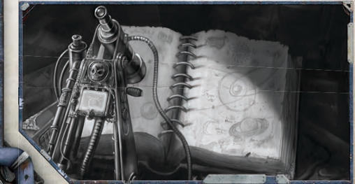

Some skills encompass groups of related skills. For brevity's sake, these skill groups are listed under the same entry, but each must be acquired and used separately. For [Example](rules-tests.md), Pilot (Flyer)  and  Pilot  (Space  Craft)  are  two  different  skills,  and having training in one does not grant training in the other.

*Source:* `Roguetrader Corerulebook, page 77`
