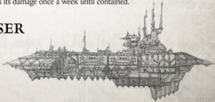

[Hull](starship-anatomy-detailed.md): Cruiser

Class: Slaughter Class

Dimensions: 5 km long, .8 km abeam approx.

Mass: 28.5 Megatonnes approx.

Crew: 80,000 crew approx.

Accel. 2.4 Gravities max acceleration.

Amongst one of the fastest Imperial capital ships ever built, the Slaughter class cruiser utilises a special [Plasma](weapons-general.md) drive design-the Scartix engine coil. This advanced pattern provides considerably more thrust than any other comparably-sized drive. Scartix coils Amongst one of the fastest Imperial capital ships ever built, the Slaughter class cruiser utilises a special plasma drive design-theare rugged and reliable, although complex and time-consuming to repair. The design for the Scartix coil resided in the data-vaults of the Sethelan [Forge World](chargen-stage2-origin-path.md) until 126.M34, when it was destroyed by a [Surprise](combat-surprise-rules.md) [Attack](combat-attack-rules.md) from the Slaughter class cruiser Dutiful (later renamed Soulless ). The Slaughter's speed is not its only advantage; these vessels are also armed with considerable short-ranged firepower, including high-yield lance turrets and turbo-linked destructor-cannon batteries on both broadsides. A Slaughter class cruiser can wreak considerable havoc amongst an Imperial line formation if it is able to move into range and then dart away.

Speed: 9

Manoeuvrability: +5

Detection:

+5

[Void Shields](components-void-shields.md): 2

[Armour](armour.md):

20

Hull Integrity:

68

Morale: 100

Crew Population:

100

Crew Rating: Crack (40)

Turret Rating: 2

Weapon Capacity: Prow 1, Port 2, Starboard 2

## Essential Components

Scartix Engine Coil Drive (grants the Scartix Coil bonus, see below), [Strelov 2 Warp Engine](starship-essential-components.md), Gellar Field, Multiple Void Shield Array, Ship Master's Bridge, Vitae Pattern Life Sustainer, Pressed-crew Quarters, M-100 Augur Array.

## Supplemental Components

Port and Starboard Destructor-cannon Broadsides: (Macrobattery; Strength 6; [Damage](character-injury.md) 1d10+3; Crit Rating 5; Range 5)

Prow Destuctor-cannon Battery: (Macrobattery; Strength 5; Damage 1d10+3; Crit Rating 5; Range 5)

Port and Starboard Lance Broadsides: (Lance, Strength 2; Damage 1d10+4; Crit Rating 3; Range 6)

[Barracks](starship-supplemental-components.md): The bonuses for carrying a ship full of crazed killers are included in the modifiers below.

Teleportarium: The bonuses for this Component are included in the modifiers below.

## Special Rules and Modifier Summary

Scartix Coil: This powerful [Plasma](weapons-general.md) drive technology means that Slaughter-class  [Cruisers](hulls-overview.md)  are  capable  of  startling  bursts  of  speed. When performing the [Adjust Speed](starship-combat-rules.md) or Adjust Speed and Bearing [Manoeuvre](rules-combat-overview.md), the  Slaughter  Class  gains  one  additional  Degree  of Success (or gains 1 additional VU with the [All Ahead Full](combat-actions-and-orders.md) Order). The  following  modifiers apply to the Slaughter, taking [Components](starship-anatomy-detailed.md) into account:

- All  Command  Tests  made  to  defend  against  boarding and hit-and-run actions gain +5. All hit-and-run attacks against opponents gain +20.
- All Piloting and Navigation Tests gain +5.
- All Ballistic Skill Tests to fire shipboard weapons gain +10.

*Source:* `Battle Fleet of the Koronus, pages 108–109`
