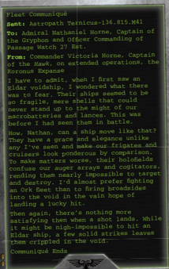

Star Dragons are a threat to large vessels, able to ignore the thickest [Armour](armour.md) with their multiple Pulsar Lance batteries.

[Weapons](weapons-general.md): Three Prow Pulsar [Lances](starship-supplemental-components.md), one Keel [Torpedo Tubes](components-torpedo-tubes.md). Holofield: See page 86 for full rules.

*Source:* `Battle Fleet of the Koronus, page 95`
