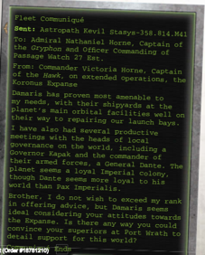

## Cloudmining Facility

The  ship is equipped with specialised tethering grapples and  distillation  holds,  so  that  it  can  process  valuable  comets discovered in their lonely orbits surrounding a star. The resulting waters and minerals can be used to replenish the crew and ship, or more profitably left as frozen chunks and sold to connoisseurs who value the luxury of pure cloud ice.

Gelt  in  the  Clouds :  This  Component  allows  the  ship  to conduct ice mining in a suitable comet field far outside a solar system. Comets must be first located with a Challenging (+0) Scrutiny + Detection Test via the ship's [Augur Arrays](components-augur-arrays.md). Mining then takes 1d10+5 days and once complete the additional fresh water and air restore 1d5 Morale as well as extending deep void operations one additional month. Alternatively , this can grant the Explorers  +50  Achievement  Points  to  an  ongoing  Endeavour (the refined [Plasma](weapons-general.md) can either be used in the Endeavour, or sold to generate funds), or can be used in the construction of a full Endeavour to mine comets at the GM's discretion.

## Hydraphurian Kl-247 Jamming System

This device creates a violent and constantly shifting energy field that interferes with the scanners of nearby ships.

External: This  Component  does  not  require  [Hull](starship-anatomy-detailed.md)  space. Although it is external, it can only be destroyed or damaged by a Critical Hit.

White noise: While this Component is active, this ship may not perform Silent Running, but any Focussed [Augury](psychic-disciplines-list.md) Tests made to scan it suffer a -20 penalty.

## Manufactorum

These small construction facilities are capable of synthesising additional  parts  required  to  perform  Extended  Repairs  for a  damaged  starship.  These  parts  are  synthesised  from  raw materials-generally obtained by mining a nearby asteroid.

Manufacturing: If attempting [Extended Repairs](starship-travel-non-combat.md), each Manufactorum adds a +10 bonus to the weekly Tech-Use Test. If paying for repairs, each Manufactorum adds a +10 bonus to the [Acquisition](economy-acquisition-rules.md) Test to restore [Hull](starship-anatomy-detailed.md) Integrity .

Additional Templates: Manufactorums are equipped with a variety of templates for construction, so each Manufactorum adds  an  additional  10  Achievement  Points  for  any  Trade [Objectives](economy-endeavours.md).  In  addition,  the  Manufactorums  may  be  able  to manufacture small numbers of personal items. The GM is final arbiter of what can and cannot be manufactured, but generally it should not be more than a few dozen of a Common item.

## Medicae Deck

A  life  of  exploration  invariably  leads  to  encounters  with unexpected life. This unexpected life can lead to unexpected injuries as well as novel diseases. Every living quarters includes a basic infirmary, but those are not equipped for every variety of  [Injury](character-injury.md)  or  disease.  Similarly ,  an  infirmary  is  not  equipped to  treat  the  number  of  badly  injured  survivors  from  a  badly damaged ship or planet-wide epidemic. A Medicae Deck offers the facilities and [Staff](weapons-general.md) to address both of these possibilities.

Diagnostics and Treatment: The  Medicae  Deck  adds  a  +20 bonus to all Medicae Skill Tests performed within this Component. The number of patients  that  may  be  treated  without  penalty  is increased to three times the character's Intelligence Bonus.

## Melodium

For the Rogue Trader who desires only the finest in shipboard accoutrements,  a  Melodium  is  ideal.  Most  are  fashioned  as grandiose chambers covered with all manner of gilded pipes, horns, and other instruments which can produce an endless variety of musical tunes. The room itself alters shape via clever brass sidings and panels as it plays, the better to accompany the  melodies  and  vox-repeaters  throughout  the  ship  carry selected tunes into its farthest depths.

A  Melodium  provides  uplifting tones designed to instil feelings of duty and loyalty throughout the vessel, from the lowly [Ratings](crew-ratings.md) and voidmen to the officers. That sometimes this is due to subliminal infra-harmonics lacing the melodies is kept a guarded secret. The hall itself can be configured in a variety of ways to  produce the desired internal music and background effects, greatly aiding in many a difficult negotiation. Songs in the Void :  Increase Morale permanently by +1 and gain +10 to all social Skill Tests.

## Plasma Scoop

These  devices  are  usually  only  found  on  the  specialised mining vessels designed purely for entering the atmospheres of gas giants to collect [Fuel](weapons-ammunition.md) for [Plasma Drives](components-plasma-drives.md). They can be fitted on other craft with suitable [Hull](starship-anatomy-detailed.md) bracing to withstand the additional strain they place on atmospheric entry.

Fuel  Gathering :  A  ship  equipped  with  a  [Plasma](weapons-general.md)  Scoop may conduct attempt mining operations on gas giant planets.  This  requires  a Challenging  (+0)  Pilot  (Space Craft)+Manoeuvrability Test ;  failure  means  the  ship  takes 1d5 hull integrity [Damage](character-injury.md) for every degree of failure, ignoring [Void Shields](components-void-shields.md) (the deadly embrace of gravity does not care about shield barriers!). Success grants the ship a month's operations without needing to refuel, and +5 [Achievement Points](economy-endeavours.md) on any Endeavour Objective that requires the ship to move or transport something (Trade Endeavours or Exploration Endeavours are obvious examples), as the ship saves Thrones on refuelling. Foolhardy  [Manoeuvre](rules-combat-overview.md): This  Component  may  not  be equipped on ships of Grand Cruiser [Size](character-traits.md) or larger.

## Pilot Chambers

There  is  a  special  kind  of  esprit  de  corps  for  those  that  fly the  myriad  [Attack](combat-attack-rules.md)  craft  on  a  starship.  From  hotshot  Fury interceptors  to  steadfast  Starhawk  bomber  crews  to  Shark attack boat daredevils, their skills and readiness can mean life or death for the entire ship. [Launch Bays](launch-bays-overview.md) equipped with [Ready](rules-combat-overview.md) rooms allow them to maintain constant readiness for the next mission.  Training  sensoria  systems  allow  them  to  constantly hone their skills and Ministorum chapels allow them to ready their souls, all making them into relentless and deadly [Weapons](weapons-general.md). Combat Ready :  Pilot  Chambers grant a +2 bonus to the Attack Craft Rating of all [Squadrons](squadrons-overview.md) aboard a starship.

## Salvage Systems

Many Rogue Traders encounter the crippled remnants of starships as they travel through uncharted systems, mighty vessels that once strode across the void but are now only ruined [Shells](weapons-ammunition.md) of their former glory (and oftentimes, of course, the trader's vessel itself is the cause of the devastation). Ships fitted with massive [Salvage](starship-salvage-rules.md) Clamps can anchor to the wreckage and strip away useful [Hull](starship-anatomy-detailed.md) sections or other Components using colossal mechanical arms, mega melta-beams, and other devices. Those salvaged Components can then be sold for profit or even added to the ship, where they can better enhance to the fame of trader and crew .

Salvage Operations : This Component allows a ship to attach itself to vessel which has been reduced to space hulk status. The clamps can strip apart the wreck; for every week spent in salvage the crew may make a Difficult (-10) T ech-Use T est to attempt to safely remove a named Component from the hulk (a [Focused Augury](starship-combat-rules.md) Extended Action to scan the wreck is needed to determine Components). If successful, a single working Component can be removed and stored on the host vessel if there is Space for it (or  externally  secured  to  hull  for  towing);  if  it  fails  then  that Component is  lost.  Successfully  salvaged  Components  can  be sold as part of a constructed Trade Endeavour or even refitted to the ship at a stardock as if it had been acquired normally . Salvage Clamps are gigantic and [Unwieldy](weapons-general.md) affairs, however, and a vessel equipped with them suffers -5 Manoeuvrability .

## Small Craft Repair Deck

Every launch bay has the capability to perform routine maintenance and basic repairs upon the vessels for which it is used. However, [Combat](rules-combat-overview.md) vessels are regularly subjected to [Damage](character-injury.md) that far exceeds the scope of basic repairs and routine maintenance.

Spare  Parts: After  any  starship  combat  in  which  fighters, assault boats, or bombers are lost, a character may immediately make a Difficult (-10) Tech Use Test . For every degree of success on the test, two of these craft are recovered.

## Spacedock Piers

Larger vessels are often expected to act as mobile fleet headquarters as  a  Rogue  Trader's  [Squadrons](squadrons-overview.md)  move  into  regions  unknown. Specialised fittings and gigantic deployable piers are even added to some, allowing it to act much like a regular space station and allow smaller vessels to dock. These support vessels can refurbish and resupply the other vessels in the fleet, allowing them to venture further and longer in pursuit of profit. Each also acts as a visible symbol of the Rogue Trader's power and control over a sector.

Mobile Spaceport : When not moving, the huge attachments covering the ship allow up to four smaller vessels to dock. The stationary  ship  acts  as  a  space  station  for  purposes  of making full repairs or replenishing Morale, and grants a +10 to the [Acquisition](economy-acquisition-rules.md) Test when making full repairs. Due to their [Size](character-traits.md), station fittings prevent any [Weapons](weapons-general.md) with the Broadside rule from being installed (although smaller weapons may still be  installed  in  Port  and  Starboard  weapon  capacity  slots). When working towards a Trade objective, the Explorers earn an additional +100 [Achievement Points](economy-endeavours.md) towards completing that objective.

*Source:* `Battle Fleet of the Koronus, pages 40–41`
