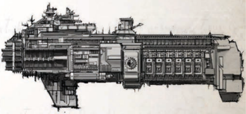

Dimensions: 4.3 km long, .5 km abeam at fins

Mass: 24 megatonnes

Crew: 50000 crew, approx.

Accel: 3.9 gravities max. sustainable acceleration

The Secutor class vessels are a modification of the Lathe class unique to the Calixis Sector. The first Secutor monitor-cruiser was  adapted  from  the  existing  design  when  the  forge  world learned that the existing light cruiser was insufficiently armed for heavy starship combat. Rather than spend the considerable resources to construct true cruisers, they developed the Secutor.

Secutors are significantly better armed than their cousins, and have higher defensive capabilities as well. In exchange they are less manoeuvrable, and with so much of their frame devoted to weapons and defences, they are useful only for war. Of course, in that field they excel.

Outfitted for war: The Secutor is designed solely for combat, and in anticipation of this her masters have equipped her with the heavy power couplings and projection arrays required to maintain multiple void shields. The Secutor can use 'cruiser only' Void Shield Components.

Speed:

5

Manoeuvrability: +12

Detection:

+15

Hull Integrity:

65

Armour:

20

Turret Rating: 2

Space:

58

SP: 58

Weapon Capacity:

Dorsal 1, Prow 1, Port 1, Starboard 1

The  Firestorm  is  a  relatively  recent  innovation  in  Battlefleet Obscuras, an attempt to merge the manoeuvrability of escort class  ships  with  the  ship-killing  power  of  a  lance  weapon. The Firestorm is  essentially  a  redesigned  Sword,  with  many of the weapon batteries removed to make space for a prowmounted lance that runs most of the length of the ship. In fleet engagements, Firestorms often hunt other escorts, their lances letting them out-range and outgun most frigates and raiders.

Firestorms are not commonly used by Rogue Traders, as the lance takes up room that could be used for cargo or supplies. However, more militant individuals have been known to utilise them, as lance-armed frigates are relatively uncommon.

Speed: 7

Manoeuvrability: +20

Detection: +15

Hull Integrity:

38

Armour:

18

Turret Rating: 1

Space:

40

SP: 41

Weapon Capacity: Dorsal 1, Prow 1

## Subpages
- [Thulian Explorator Vessel](thulian-explorator-vessel.md)
- [Reaver of the Unbeholden Reaches](reaver-of-the-unbeholden-reaches.md)
- [Veteran of the Angevin Crusade](veteran-of-the-angevin-crusade.md)
- [Vessel of the Fleet](vessel-of-the-fleet.md)
- [Planet-bound for Millennia](planet-bound-for-millennia.md)

*Source:* `Into the Storm, page 153`
