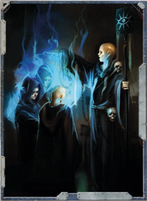

Opening himself up to the Immaterium, an Astropath is able to generate a type of 'white-noise' that serves to block out all astropathic communications. Should an enemy vessel have an Astropath (or similar type psyker) on board, this action serves to impede their ability to send or receive messages via telepathy.  To  do  this,  the  Astropath  makes  a Challenging (+0) Psyniscience Focus Power Test . For every degree of success, the Astropath generates interference in a radius of 1 Void Unit (VU). Should any psyker wish to send or receive astro-telepathic signals, they will need to make an Opposed Willpower Test against the jamming Astropath.

## Tactical Positioning

Astropaths who are schooled in the Divination Discipline have a  number of powers at their disposal. An Astropath who has the Divination Discipline can tap into that power to study the portents and skeins of future events. By making a Hard (-20) Psyniscience Focus Power Test , the Astropath can add 1d5 degrees of success to the next Manoeuvre Action the ship makes. The character  making  the  Manoeuvre  Action  must  be  within sight of the Astropath-and in the same area or room-in order to take advantage of the bonus. This action can only be made once per combat.

## Tactical Retreat

By utilising their powers of foresight, an Astropath can see into the near future. He can check the positioning of enemy ships  and  use  that  information  to  his  advantage.  Once  per combat,  an  Astropath  with  the  Divination  Discipline  can use this glimpse to his advantage by making a Very Hard (-30)  Psyniscience  Focus  Power  Test .  For  every  degree of success he gets on this Test, he may grant a +10 bonus to any Shooting Action during Starship combat. The character making the Test  must  be  in  contact  (verbal  or  vox)  of  the Astropath in order to take advantage of the bonus.

## Relentless Pursuit

Astropaths who possess the power Inspire can use this power and their natural abilities to assist with boarding actions. To do this, the Astropath must be with the boarding characters prior to their Hit and Run action. He does not need to accompany the raid, just be present prior to its initiation. The Astropath makes  a Challenging  (+0)  Psyniscience  Focus  Power Test .  If  he  succeeds,  then  he  may  impart  a  +10  Bonus  per degree of success for either the Pilot (Space Craft) Test or the Command Test portion of the Hit and Run Extended Action (see page 218 of ROGUE TRADER for details). R for details). R

*Source:* `Battle Fleet of the Koronus, pages 201–202`
