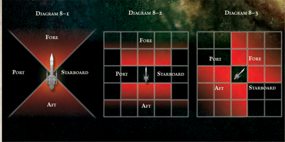
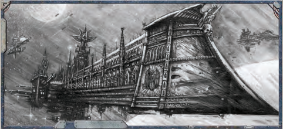

## Rounds, Turns, and Time-in Space

Space [Combat](rules-combat-overview.md) in Rogue Trader is handled in a similar manner to  normal  [Combat](rules-combat-overview.md).  Space  travel  is  normally  handled  in Narrative Time. Other situations, such as dodging a hurtling asteroid at the last moment, are best broken up by the GM into the standard Turns and Rounds. However, certain situationsparticularly ship-to-ship combat-require a slight adjustment to the Structured Time approach (see page 234).

Space warfare is very different from the close-in, personal fighting of hand-to-hand combat and short ranged firefights. Great warships can spend days chasing down their opponents and hours manoeuvring into position for single devastating volleys  from  their  broadsides.  Therefore,  the  GM  should break up space combat into Strategic Rounds and Strategic Turns. While these function mechanically in the same fashion as the Rounds and Turns of Structured Time, the interval of time they represent is longer.

A Strategic Round lasts for roughly thirty minutes, during which, each ship involved in the scene takes a Strategic Turn. Each  Strategic  Turn  overlaps,  so  the  actions  of  each  ship occur almost simultaneously. However, in game terms, each ship acts in a sequence determined by the combat's Initiative Order (see below).

A Strategic Round is completed when every participant in the combat has completed their Strategic Turn.

## Space Combat Overview

When a Round of space [Combat](rules-combat-overview.md) begins, the GM and players follow certain steps to determine what happens. These steps are  similar  to  those  followed  when  regular  [Combat](rules-combat-overview.md)  begins, and the differences are specified below.

## Surprise

It  is  certainly  possible  for  one  ship  to  [Surprise](combat-surprise-rules.md)  another  in  [Combat](rules-combat-overview.md). Since Strategic [Rounds](rules-combat-overview.md) last a half hour, it is highly unlikely that even a surprised crew will be completely unable to react. However, the attacker  may  be  able  to  land  a  few  crippling blows as the defender's crew struggles to prepare their ship for combat. See the sidebar for the effects of surprise.

## Initiative

At the beginning of the [Combat](rules-combat-overview.md), the [Captain](rank-captain.md) of each ship rolls 1d10 and adds his ship's Detection bonus (the tens digit in its Detection characteristic). Bonuses that apply to a character's Initiative in [Structured Time](rules-combat-overview.md) (regular combat) do not apply, otherwise Initiative in space combat works the same as regular combat (see page 236).

## Taking Turns

Starting with the ship with the highest Initiative roll, each ship  takes  a  Strategic  Turn,  during  which  it  will  make  a Movement and Shooting Action. Players may take Extended Actions as well.

## The End of the Round

Once every ship has taken its Strategic Turn, the Strategic Round ends. Continue to play successive  [Rounds](rules-combat-overview.md)  until  the GM determines the [Combat](rules-combat-overview.md) is over.

## Actions

During each Strategic Round, each ship receives one Strategic Turn.  Like  regular  [Combat](rules-combat-overview.md),  each  ship  can  perform  Actions during  this  turn.  The  Actions  a  ship  performs  fall  into  two categories:  [Manoeuvre](rules-combat-overview.md)  Actions  and  Shooting  Actions.  Each ship  must  make  one  Manoeuvre  Action  and  may  make  one Shooting Action during their turn. Each of these Actions must be performed by a separate Explorer. Any Explorers who did not perform either Action may perform an Extended Action (see page 215) instead.

Individual characters will take their turns during their ship's Strategic Turn. They do not roll for initiative separately . At the beginning of each ship's turn, the players (or the GM, if it an NPC's  ship)  determine  which  Shooting  Action,  Manoeuvre Action, and Extended Actions the players will perform, and in which order. All Actions (and the order they are performed in) must be determined at the beginning of the starship's Turn.

Players may perform Actions in any order they choose, so an Extended Action may be performed before a Shooting or Manoeuvre Action in order to provide it with a bonus, or a ship may move before or after shooting.

Note: Actions often require a Combined Skill Test, such as a Pilot (Space Craft)+ Manoeuvrability Test . After all, even an ace pilot must rely to an extent on his equipment. To make these tests, add the ship's ability , such as Manoeuvrability, to the character's Skill, such as Pilot (Space Craft). Then perform the test using the combined value.## Representing Combat Concretely or Abstractly

Space Combat in Rogue Trader is an abstract representation of warfare between spaceships. This was done to keep the game relatively simple-after all, this is not a game exclusively of ship-to-ship combat.

The rules are written so that players may use a standard 'grid' roleplaying tactical map while playing ship combats. This makes it easier for the players and GM to instantly understand the relative positions of all the combatants. Many blank tactical maps can even be written on in wet-erase pens, so that the GM can sketch out astroid belts, planets, or other [Celestial Phenomena](rules-celestial-phenomena.md). The simplest way to use a tactical map is to say that each square represents on Void Unit of distance. Tokens, or playing pieces, can be used to represent ships-simply indicate which edge of the token is the 'front,' and go from there.

Alternatively, players can do away with the tactical map and simply use a flat playing surface and a tape measure. One inch on the tape measure equals one Void Unit.

If the GM prefers, he can opt for a looser, 'narrative' system of combat. In this system, information like range is less important, as are the precise positions of the starships involved. For [Example](rules-tests.md), the GM might announce that there is a ship coming around a nearby moon to [Attack](combat-attack-rules.md) the Explorers' ship. The Explorers ask how far away the ship is, and GM replies that they are out of range, but if they make a Challenging (+0) Pilot (Space Craft)+Manoeuvrability Test with enough successes, they can close the range enough to fire on their opponent. The players make the test, and the GM determines that they are close enough to fire on their foe without penalty.

## Surprise

[Surprise](combat-surprise-rules.md) affects the first Strategic Round in space [Combat](rules-combat-overview.md). As in regular [Combat](rules-combat-overview.md), the GM must ultimately determine which vessels are Surprised, based on the actions of the players and NPCs and the environment their ships are operating in. Here are some guidelines to take into account.

- Hidden vessels: · The fury of a running [Plasma](weapons-general.md) drive is almost impossible to hide in open space. However, a canny [Captain](rank-captain.md) may use a convenient [Asteroid Field](starship-travel-non-combat.md), nebula, or even planet to mask his engine signatures. Alternatively, ships can go on Silent Running to lurk in the cold [Darkness](combat-special-circumstances.md) of space while his opponents fly right to them. A proper Scrutiny+Detection Test with the ship's detection equipment may warn of the danger.
- Ambush and treachery: · In  some  situations,  a  friend  may  turn  to  foe  in  an  instant.  Such  situations  are  highly dangerous if the ambusher is in close formation with his target. He may not even have to manoeuvre to place his target squarely within his sights. Although it is up to the GM, a skilled scanner operator may detect the last-minute powering up of the [Weapons](weapons-general.md) with a Challenging (+0) Scrutiny+Detection Test .
- Extenuating  circumstances: · Ships'  scanners  and  detection  equipment  are  fickle  devices,  and  easily  fooled  by powerful  celestial  phenomena  such  as  solar  flares,  magnetic  storms,  and  unpredictable  gravity  fluctuations.  The interference may be powerful enough to mask the approach of attackers.

Using these guidelines (and any others he deems necessary), the GM determines at the beginning of combat if anyone is Surprised. Any attackers firing on Surprised ships gain a +20 bonus to [Attack](combat-attack-rules.md) rolls against them during the first Round of combat.

## Manoeuvre Actions

During space [Combat](rules-combat-overview.md), opposing ships can be less than a hundred metres  apart,  or  have  many  thousands  of  kilometres  between them. The latter is far more likely-it is rare that a gunner on a ship can see his target with an unaided eye.

In  space  [Combat](rules-combat-overview.md),  the  distance  from  one  ship  to  another, or  how  far  a  ship  moves  in  a  Strategic  Turn,  is  measured  in void  units  (VUs).  The  distance  represented  by  a  single  VU  is deliberately abstract and left open to some interpretation due to space's vast [Size](character-traits.md). However, a good guideline is a single VU equals roughly 10,000 kilometres. Since even a single VU represents a vast distance, it is possible for two ships to be within one VU of each other. At that range, space combat becomes truly brutal, with ramming attempts and even boarding actions.

Basic space combat begins with all ships involved at a distance from each other determined by the scenario and the GM. There may be other phenomena in the combat as well, a nearby planet, perhaps, or even a vast [Asteroid Field](starship-travel-non-combat.md) (see page 226).

When  beginning  combat,  the  GM  and  players  should determine the direction each starship is facing. A starship's facing is the direction it will travel when moving directly forward.

When a starship takes its Manoeuvre Action, it chooses to move directly forward a number of VUs equal to its Speed value or half its Speed value. This is the default action of a starshipsince starships are huge vessels with immense momentum, players do not have the option of simply not moving their ship. Once the starship has moved forward by its Speed value or half its Speed value, it may turn. [Transports](hulls-overview.md), [Raiders](ships-raiders-overview.md), [Frigates](hulls-overview.md), and other ships of equivalent [Size](character-traits.md) (i.e., [Hull](starship-anatomy-detailed.md) Integrity and Available Space) can turn up to 90 degrees to the left or right (or port and starboard). Unless otherwise stated, all other ships may turn up to 45 degrees instead.

Either version of this Manoeuvre (moving at half or full Speed value) is considered the starship's default Manoeuvre, and does not require any### Npc Actions

It  is  entirely  possible  that  the  players  will  want to  perform  more  actions  than  there  are  players  in  a group. In this case, the GM should remember that the players' characters command a ship with thousands of crewmembers. If the players want to have a crewmember perform any of the following Actions, they can. If they do so, the GM will roll to see if the Action is successful, counting the crewmember's appropriate characteristic (see Table 8-9 below).

However, the GM should be careful not to let the players  delegate  too  many  tasks  to  their  NPCs.  In general, the GM should only allow the NPCs aboard a vessel to perform three Actions per Strategic Round. Alternatively,  the  GM  can  allow  the  NPCs  aboard  a vessel  to  perform  a  number  of  Actions  per  Strategic Round equal to the tens  column  of  the  NPC  crew's Skill rating. So, for [Example](rules-tests.md), a Competent crew could perform  three  Actions,  while  a  Veteran  crew  could perform five. Either option is valid, and the GM should select one to use when setting up his game.

Players  should  keep  in  mind  their  NPC  crewmembers are rarely as skilled as they are. Also, GMs should use common sense when dealing with the delegation  of tasks  to  NPCs,  and  are  encouraged  to  require  the Explorers to perform certain, more important, actions personally. The idea is to keep the players involved in a combat, and not have it come down to a series of NPC activities and dice roles.

Table 8-9 can also be used to generate statistics for the  crews  of  enemy  or  NPC  vessels.  Enemy  vessels can perform a number of Extended Actions (or other actions  such  as  firefighting)  equal  to  the  number  of Actions other [Npc Vessels](ships-npc-vessels.md) can perform.

Skill  Tests  to  perform.  However,  a  skilled  pilot  can  use  more advanced Manoeuvre Actions to modify this Manoeuvre. Each Manoeuvre modifies (but does not replace) the basic Manoeuvre action  mentioned  above,  and  only  one  Manoeuvre  may  be selected per Turn. Unless specified otherwise, a starship's turn may never be more than 90 degrees.

If a starship ever fails its Test while performing a Manoeuvre, it simply makes either version of its default Manoeuvre (it moves forward either half its Speed value or its full Speed value, then may turn).

### Adjust Bearing

This is used to decrease the distance a starship must move before it can turn. First, the ship decides if it is moving half its Speed value or its full Speed value. Then, the helmsman

### Makes a Challenging (+0) Pilot (space Craft)+

Manoeuvrability Test . On a success, the starship may turn after moving one VU less than its Speed value. For every degree of success, it may turn after moving one less VU. A starship must move at least one VU before turning. Once the starship has turned, it must move the remaining distance so its complete movement is equal to its half or full Speed value.

### Adjust Speed

This is used to adjust the distance a starship is required to move. First,  the  ship  decides  if  it  is  moving  half  its  Speed value or its  full  Speed  value.  Then,  the  helmsman  makes  a Challenging (+0) Pilot (Space Craft)+ Manoeuvrability Test . On a success, he may increase or decrease the number of VUs his ship moves by one. For every degree of success, he  may  increase  or  decrease  that  number  by  an  additional one.  The  starship  may  not  move  less  than  0  VUs  forward (the starship may come to a stop using its retro-thrusters, but cannot move in reverse). The starship may not move double or  more  its  Speed  value  using  this  [Manoeuvre](rules-combat-overview.md)  (only  Flank Speed allows that).

### Adjust Speed and Bearing

This  is  used  when  a  starship  wants  to  turn  earlier  while moving more slowly or quickly. First, the ship decides if it is moving half its Speed value or its full Speed value. Then, the  helmsman  makes  a Hard (-20)  Pilot  (Space  Craft)+ Manoeuvrability  Test. On  a  success,  he  may  increase  or decrease the number of VUs his ship moves by 1, and may turn after moving one VU less than its Speed Value (as above). Likewise, every degree of success awards the benefits of Adjust Speed and Adjust Bearing. However, the limitations of both Manoeuvre Actions apply.

### Come to New Heading

This is used to make radical course changes. The helmsman makes a Difficult  (-10)  Pilot  (Space  Craft)+ Manoeuvrability Test . Success means the starship may turn when it has moved half its Speed value, then turn again when it has moved its full Speed value. The ship suffers -20 to any Ballistic Skill Tests to fire its [Weapons](weapons-general.md) during this turn.

### Disengage

This gives the starship a chance to flee the battle by making a radical course change and shutting off its systems, attempting to  hide  amongst  the  vastness  of  the  void.  This  [Manoeuvre](rules-combat-overview.md) may  not  be  performed  if  the  starship  is  within  8  VUs  of any  enemy.  The  helmsman  makes  a Challenging  (+0) Pilot  (Space  Craft)+  Manoeuvrability  Test against  an

| Table 8-9: NPC Crew   | [Ratings](crew-ratings.md)                    |
|-----------------------|----------------------------|
| Crew Rating           | Skills and [Characteristics](starship-anatomy-detailed.md) |
| Incompetent           | 20                         |
| Competent             | 30                         |
| Crack                 | 40                         |
| Veteran               | 50                         |
| Elite                 | 60                         |### Ramming and Boarding Actions

There are desperate times in the fury of space [Combat](rules-combat-overview.md) when a [Captain](rank-captain.md)'s only course of action is to use his own starship as a weapon. If a starship ends its Manoeuvre Action within one VU of an enemy vessel and its [Bow](weapons-general.md) is facing said vessel, the starship may give up its Shooting Action this turn and ram the ship instead. The helmsman must make a Hard (-20) Pilot (Space Craft)+ Manoeuvrability Test . If he succeeds, the ship crashes into its target, doing [Damage](character-injury.md) based on its [Hull](starship-anatomy-detailed.md) [Size](character-traits.md)-1d5 for [Transports](hulls-overview.md) and [Raiders](ships-raiders-overview.md), 1d10 for [Frigates](hulls-overview.md), 2d5 for [Light Cruisers](ships-light-cruisers-overview.md), and 2d10 for cruisers. The ship adds the die roll to its prow [Armour](armour.md) value for total [Damage](character-injury.md) inflicted. This damage ignores [Void Shields](starship-essential-components.md). The ramming ship then takes damage equal to the defending ship's [Armour](armour.md) plus 1d5 to their prow armour, also ignoring [Void Shields](components-void-shields.md).

However, sometimes, the best course of action is to crash into the enemy, send across parties of armsmen and ratings, and take their ship by storm. This is called a boarding action.

If a starship ends its Manoeuvre Action within 1 VU of its target, it may give up its shooting action to Board the target. The helmsman must make a Hard (-20) Pilot (Space Craft)+ Manoeuvrability Test . If he succeeds, the two ships crash together and the boarding action begins. While two ships are involved in a boarding action, neither of them can take Manoeuvre or Shooting Actions (meaning the two ships remain stationary), although individual characters may still take Extended Actions. The ships are locked together, and the only way a ship can break free is by making a Hard (-20) Pilot (Space Craft)+ Manoeuvrability Test at the beginning of its turn. If a ship attempts to break free and fails, however, it will suffer a -20 to the subsequent opposed Command Test (see below).

The two ships take their Strategic Turns simultaneously, dropping to last in the initiative order. During their turns, two characters, one from each ship (whoever is leading the ship's warriors), make an opposed Command Test. The ship with the larger Crew Population value will receive a +10 bonus to its character's Command Test for every full 10 points difference in Crew Population between the two ships. The ship with the higher remaining Hull Integrity provides a +10 bonus to its character's Command Test for every full 10 points difference in Crew Population between the two ships. Each ship's turret rating also provides a bonus (see page 220).

For each degree the winner wins by, he may choose to inflict one of the following options on his opponent. The loser may either suffer 1d5 Crew Population and 1d5 Morale damage (representing the crew cutting through the enemy), or 1 point of Hull Integrity damage (representing the crew setting charges and doing as much damage as possible). Damage to Hull Integrity will also result in damage to [Crew Population and Morale](starship-crew-population-morale.md) as normal (see page 221).

The ship that has lost the opposed Command Test must then roll a d100 and compare it to their current Morale. If they roll an equal or lower number than their Morale, their crew continues to fight. During the next Strategic Turn, both ships will make opposed Command Tests again. If, however, the losing ship rolls higher than their current Morale, their crew routes and surrenders to their captors. If the ship is an NPC vessel, it surrenders. If it is the Explorers' vessel, the characters face a grim choice-surrender to their foes, or try and flee as best they can...

opposed Challenging (+0) Detection+Scrutiny Test from opponents within 20 VUs. Provided their number of successes is  greater  than  the  successes  of  each  enemy  ship,  the  ship leaves combat, and may not renter it. Whether it succeeds or fails, the ship may not fire any [Weapons](weapons-general.md) this turn.

Once a starship has successfully disengaged from combat, it may not reengage its opponents unless the GM specifically allows  otherwise.  Additionally,  the  Disengage  Manoeuvre cannot be used to initiate a Stern Chase. This is because the disengaging ship is shutting down all non-essential systems, including its engines, scanners, and weapons, and doing its best to pretend it isn't there. It will remain that way for several hours or even days, before restarting its systems (hoping that everyone else has already left the area).

### Evasive Manoeuvres

This is used to help avoid enemy fire. The helmsman makes a Difficult (-10) Pilot (Space Craft)+ Manoeuvrability Test .  Success (and every subsequent degree of success) imposes a  -10  penalty  to  all  shooting  directed  against  the  starship until the beginning of its next Turn. The starship suffers the same penalty to its own shooting during this time.

## Shooting Actions

After completing its [Manoeuvre](rules-combat-overview.md) Action, a ship has the option of firing its [Weapons](weapons-general.md). Each Weapon Component may be fired once per Strategic Turn, and all Weapon [Components](starship-anatomy-detailed.md) must be fired at once, although they may be fired at different targets. A Weapon Component may only be fired at a target within its firing arc.

Firing [Weapons](weapons-general.md) and resolving [Damage](character-injury.md) is covered later in this chapter (see page 218).

## Extended Actions

Extended Actions are only available to characters who have not taken part in [Manoeuvre](rules-combat-overview.md) or Shooting Actions this turn. They  represent  characters  doing  other  activities  to  aid  the ship,  such  as  making  repairs,  caring  for  the  wounded,  and even raiding enemy vessels.

Note: The modifiers listed for Skill Tests may be modified at  the  GM's  discretion.  Although  each  player  may  only perform one Extended Action per Strategic Turn, it may or may not take the entire 30 minutes, depending on the action.### Stern Chase

In some situations, a starship may prefer to flee from opponents, rather than stand and fight. Perhaps a smuggler wishes to [Run](rules-combat-overview.md) a naval blockade, or a privateer is chasing a valuable prize. Perhaps a ship simply wishes to flee combat, and her [Captain](rank-captain.md) is doubtful of his chances of successfully disengaging under the enemy's guns. In such situations, players have the options of using the rules for a stern chase-a flight and pursuit between two ships that might last hours, or even days.

Stern chases may begin in combat, or outside it. If two ships are not in combat and one ship flees, the other ship may elect to pursue it, beginning a stern chase. If the ships are in combat, a ship may flee the combat if it ends its turn out of range of the guns of any enemy ships. If it does so, it must make a Routine (+10) Pilot (Space Craft)+Manoeuvrability Test (if it fails, it must remain in the combat and forfeit its next Strategic Turn). Then, all other participants in the combat have the options of pursuing the fleeing vessel. If they chose to do so, they leave the combat on their next Strategic Turn and the stern chase begins.

If the Explorers are the pursuers, the stern chase is treated in a similar manner to an Exploration Challenge (see page 263), where the various Explorers will use certain Skill Tests to accumulate a number of successes that must equal a predetermined total for the chase to succeed. The total required for success is based largely off the type of ship the Explorers are pursuing.

-  Transport, [Cruiser](starship-anatomy-detailed.md): 3 Degrees of Success
-  [Light Cruiser](starship-anatomy-detailed.md), Frigate: 5 Degrees of Success
-  Raider: 7 Degrees of Success
-  If the pursued ship's Speed is greater than the pursuer ship's Speed: +2 Degrees of Success
-  If the pursuer ship's Speed is greater than the pursued ship's Speed: -2 Degrees of Success
-  If the pursuit takes place in asteroids, nebula, or other obscuring stellar environments: +1 Degree of Success

To obtain these, the Explorers may test the following Skills as if they were participating in an Exploration Challenge: TechUse, Pilot (Space Craft), Command, and Scrutiny (at the Game Master's discretion other Skills may apply, and the required successes may vary). As with [Exploration Challenges](rules-exploration.md), each Explorer may test each of these Skills once, with the default difficulty being Challenging. Success on a Skill Test will reduce the difficulty of subsequent Tests by one step. Degrees of success add an equal number of degrees of success towards successfully completing the stern chase. Conversely, failing a Skill Test makes subsequent Tests one degree more difficult, and each degree of failure removes one degree of success from the total.

If the Explorers manage to accumulate enough degrees of success to accomplish the stern chase, they bring their quarry to heel. The fleeing ship may surrender, or combat begins as the ship desperately tries to fight its pursuer (follow the rules for space combat). If they fail, their quarry escapes into the vastness of the void.

It is possible, of course, that the Explorers are the ones being pursued. In that case, the same rules are used (the Explorers must still accumulate a certain amount of successes to successfully [Escape](combat-escape-action.md) from their pursuers), with several minor changes. The pursuing ship is now what sets the base number of successes, meaning the Explorers are still the ones attempting the Skill Tests. Also, if the Explorers (the ones being pursued) have a faster ship, they make the Challenge easier, and if they have a slower ship, they make the Challenge more difficult (reverse the penalties and benefits listed above). In addition, if the Explorers use [Celestial Phenomena](rules-celestial-phenomena.md) to their advantage, by fleeing through asteroids or nebulas, they make the Challenge one degree less difficult. If the Explorers succeed, they are the ones who escape into the vastness of space, and if they fail, they are the ones who must make the difficult choice to fight or surrender.

In either version of the stern chase, the time it takes to accomplish a stern chase roughly equals two hours per degree of success required to successfully accomplish it. This time will be spent whether or not the chase is successful.

Remember, a while a Stern Chase takes place, both ships are visible to each other, but out of range of each other's [Weapons](weapons-general.md).

### Active Augury

The  character  makes  a Challenging  (+0)  Scrutiny+Detection Test to  scan  the  area  surrounding  the  ship.  If  the  scan  is successful,  the  GM  should  reveal  basic  (and  important) information  about  celestial  bodies,  phenomena,  and  ships within  20  VUs  of  the  vessel.  If  there  is  a  vessel  on  Silent Running within scan range, it is immediately detected.

For  every  degree  of  success,  the  character  can  extend  the range of his scan by five VUs.

### Aid the Machine Spirit

The  character  must  make  a Challenging  (+0) Tech-Use  Test to  commune  with  the  craft's machine  spirit  and  aid  it  in  its  calculations. On a success,  the  character  may  add  +5

to the ship's Manoeuvrability or Detection for the remainder of the turn. For every two additional degrees of success, the character may add an additional +5 to the same system.

### Disinformation

The character makes a Difficult (-10) Deceive or Blather Test. If he succeeds, he can increase the crew's Morale by 1d5 for every degree of success for the duration of the [Combat](rules-combat-overview.md).

### Emergency Repairs

The  character  makes  a Difficult  (-10)  Tech-Use  Test to direct  and  aid  repair  crews.  If  he  succeeds,  he  repairs  one unpowered, damaged, or depressurized Component. Repairs normally  take  1d5  [Turns](rules-combat-overview.md),  however,  this  can  be  reduced  by| Table 8-10: Manoeuvre Actions Action   | Test                                                          | Benefit                                                            |
|----------------------------------------|---------------------------------------------------------------|--------------------------------------------------------------------|
| Adjust Bearing                         | Challenging (+0) Pilot (Space Craft)+ Manoeuvrability         | Turn earlier than normal                                           |
| Adjust Speed                           | Challenging (+0) Pilot (Space Craft)+ Manoeuvrability         | Move faster or slower than normal                                  |
| Adjust Speed & Bearing                 | Hard (-20) Pilot (Space Craft)+ Manoeuvrability               | Turn earlier than normal while moving faster or slower than normal |
| Come to New Heading                    | Difficult (-10) Pilot (Space Craft)+ Manoeuvrability          | Make two [Turns](rules-combat-overview.md) in one Round                                        |
| Disengage                              | Opposed Challenging (+0) Pilot (Space Craft)+ Manoeuvrability | [Escape](combat-escape-action.md) combat                                                      |
| Evasive Manoeuvres                     | Difficult (-10) Pilot (Space Craft)+ Manoeuvrability          | Inflicts penalties on enemy fire                                   |

one turn per degree of success, to a minimum of one turn. Emergency Repairs cannot fix destroyed [Components](starship-anatomy-detailed.md).

### Flank Speed

The  character  must  make  a Challenging  (+0)  Tech-Use Test to  nurse  the  ship's  engines  and  push  them  to  their limits.  Success means the ship may move an additional VU this  turn.  Every  degree  of  success  allows  an  additional  VU of movement. Failure by 2 or more degrees means the ship immediately  suffers  an  Engines  Crippled  critical  hit  as  the engines are strained too hard.

### Focused Augury

The character makes a Challenging (+0) Scrutiny+Detection Test to scan a particular ship within extreme  range  of  his  vessel.  A  successful  scan  reveals  a number of [Components](starship-anatomy-detailed.md) aboard the enemy ship.

- Basic Success: All [Essential Components](ships-npc-vessels.md) except Auger ·

| Table 8-11: Extended Action   | Actions Test                 | Benefit                                                  |
|-------------------------------|------------------------------|----------------------------------------------------------|
| Active Augury                 | Scrutiny + Detection         | Scans the area                                           |
| Aid the Machine Spirit        | Tech-Use                     | Bonus to Detection or Manoeuvrability                    |
| Disinformation                | Deceive or Blather           | Raises Morale                                            |
| Emergency Repairs             | Tech-Use                     | Repair damaged, depressurised, or unpowered [Components](starship-anatomy-detailed.md)   |
| Flank Speed                   | Tech-Use                     | Gain additional movement                                 |
| Focused Augury                | Scrutiny + Detection         | Detailed scan of one target                              |
| Hail the Enemy                | [Interaction](rules-interaction.md) Skill            | Communicates with another ship                           |
| Hit and Run                   | Pilot (Space Craft), Command | Board enemy ship, cause [Damage](character-injury.md), and return               |
| Hold Fast!                    | Willpower                    | Reduces Morale [Damage](character-injury.md)                                    |
| Jam Communications            | Tech-Use                     | Stops target from sending vox signals                    |
| Lock on Target                | Scrutiny + Detection         | Bonus to Ballistic Skill Tests with one weapon component |
| Prepare to Repel Boarders!    | Command                      | Bonus to Command Test vs. enemy boarding actions         |
| Put Your Backs Into It!       | Intimidate or [Charm](equipment-gear.md)          | Bonus to various actions                                 |
| Triage                        | Medicae                      | Reduces Crew Population Damage                           |

Arrays and [Void Shields](starship-essential-components.md)

- One Degree of Success: All Weapon Components ·
- Two  Degrees  of  Success:  Auger  Arrays,  Void  Shields, · and any [Combat](rules-combat-overview.md) related Components
- Three Degrees of Success: All Components aboard the · target ship

### Hail the Enemy

This  action  is  unique  as  it  can  be  performed  by  characters who  have  participated  in  [Manoeuvre](rules-combat-overview.md)  Actions  or  Shooting Actions during the turn. The character contacts one enemy ship  using  his  ship's  vox  systems.  He  may  use  [Interaction Skills](skills-descriptors.md)  to  accomplish  certain  goals,  such  as  the  Intimidation Skill to convince an opponent to surrender. The exact details of  how this works is left up to the GM (see page 293 for details on the use of [Interaction Skills](skills-descriptors.md)).### Silent Running

A  ship  may  be  attempt  to  avoid  notice  by  going  on silent running, shutting down non-essential systems and attempting to drift, unnoticed, past its opposition. When on silent running, a ship makes Manoeuvre Actions as normal, except the starship's Speed value is halved, and the difficulty of all related Skill Tests increases by one step. The default [Manoeuvre](rules-combat-overview.md) Action requires a Ordinary (+10) Pilot (Space Craft)+Manoeuvrability Test . If the helmsman fails these tests, his ship performs the Manoeuvre as normal, but some power surge or engine flare betrays their presence, and any ships within sensor range become aware of them.

Enemy ships may detect a ship on silent running by using the Active Augury Extended Action (see below). Needless  to  say,  if  the  ship  fires  any  [Weapons](weapons-general.md),  it  is immediately detected as well.

### Hit and Run

This allows a character to raid an enemy ship, sabotage it, then retreat. The character makes a Challenging (+0) Pilot (Space  Craft)  Test ,  attempting  to  reach  one  enemy  ship within  5  VUs  in  a  boarding  craft,  accompanied  by  a  team of  [Raiders](hulls-overview.md).  This  test  can  be  modified  by  the  target  vessel's Turret Rating (see page 220). If he fails the test, he is forced to return to his ship. If he fails by four or more degrees, his craft is [Shot](weapons-ammunition.md) down. The character either survives stranded in a crippled craft or is killed at the GM's discretion.

If he succeeds, he must make an opposed Ordinary (+10) Command Test against the [Commander](rank-commander.md) of troops aboard the enemy ship. If he succeeds, roll 1d5 on the Critical Hit chart twice and select one result to apply to the enemy ship, plus 1 point of [Damage](character-injury.md) to [Hull](starship-anatomy-detailed.md) Integrity for every degree of success. If he fails, his force is forced to retreat back to his boarding craft, unsuccessful in causing mayhem.

### Hold Fast!

The character must have [Air of Authority](talents-descriptions.md) (or a similar Talent at  the  GM's  discretion)  and  make  a Challenging  (+0) Willpower  Test .  If  he  succeeds,  he  inspires  the  crew  and reduces any [Damage](character-injury.md) to Morale by 1, plus 1 for every degree of success to a minimum of 1. Hold Fast! may only cancel out Morale [Damage](character-injury.md) suffered during the previous turn.

### Jam Communications

The  character  makes  a Difficult  (-10)  Tech-Use  Test , targeting  a  ship  within  long  range  of  his  vessel.  If  he succeeds, that ship is unable to use vox-transmitters or other technologies  to  communicate  with  other  ships.  Psychic communicators-such as an astropath-are unaffected.

### Lock on Target

The  character  makes  a Challenging  (+0) Scrutiny+Detection Test to use the ship's augers and calculate exact firing solutions on an enemy vessel. If successful, he adds a +5 bonus to the Ballistic Skill Test to fire one Weapon Component during this turn. Every two additional degrees of success ad an additional +5 to the same Test.

### Prepare to Repel Borders!

This character must make a Challenging (+0) Command Test in order to organise and arm a portion of the crew. If he succeeds, he may add +10 to any opposed Command Test he performs against enemy borders during subsequent [Turns](rules-combat-overview.md) of [Combat](rules-combat-overview.md), plus an additional +5 for every degree of success. Although  the  character  is  not  required  to  make  additional tests  on  subsequent  turns,  he  will  be  occupied  rallying  the defenders for as long as he wants to maintain the bonus.

### Put Your Backs Into It!

The  character makes  a Challenging  (+0)  Intimidate or [Charm](equipment-gear.md) Test .  If  he  succeeds,  he  can  choose  to  add  +5 to  a  Ballistic  Skill  Test  to  fire  a  Weapon  Component,  an Emergency Repairs Action, or an attempt to put out a fire made during this turn. He may aid an additional Ballistic Skill Test, Emergency Repairs Action, or firefighting attempt for every three degrees of success.

### Triage

The character makes a Difficult (-10) Medicae Test . If he succeeds, he reduces any [Damage](character-injury.md) to Crew Population by 1, plus 1 for every degree of success to a minimum of 1. Triage may only cancel Crew Population [Damage](character-injury.md) suffered during the previous Turn.

## Weapons and Shooting

Starship [Weapons](weapons-general.md) in the 41st millennium are as varied as the ships that  carry  them.  Lasers,  [Plasma](weapons-general.md)  projectors,  macrocannons, rocket launchers, terra-watt beam weapons, and more esoteric weaponry  such  as  grav-culverins  and  gamma  emitters,  all can  be  found  in  a  starship's  broadside.  In  game  terms,  the weapons  found  in  Rogue  Trader  can  be  divided  into  two distinct classes; [Macrobatteries](starship-supplemental-components.md) and [Lances](starship-supplemental-components.md).

Macrobatteries  form  the  main  armament  of  most  ships, filling  the  broadsides  of  vessels  with  rank  upon  rank  of gigantic  weapons.  Each  requires  a  crew  of  dozens,  if  not hundreds, to operate. Whether they fling kilo-tonne [Warheads](weapons-warheads.md) across  the  void  or  roast  their  targets  with  high-intensity energy, macrobatteries fire in volley. Their salvos are designed to blanket the space around a target, hopefully catching it in a maelstrom of destruction and overwhelm their defences by the sheer number of shots.

Lances  are  rare  and  potent  weapons  that  fire  incredibly high-powered beams of energy capable of burning through the [Hull](starship-anatomy-detailed.md) of a warship, or cutting a smaller vessel in half. Unlike macrobatteries, lances are often mounted on gigantic turrets where  multiple  energy  projectors  focus  to  create  a  single, titanic beam.

In Rogue TRadeR , the weapons on starships are [Supplemental Components](wraithship.md#supplemental-components). Each Weapon Component does not necessarily consist of one weapon-a single macrobattery, for  [Example](rules-tests.md),  can  have  dozens  of  individual  macrocannons arrayed in broadside. Instead of these weapons being treated separately, they are grouped together into a single Weapon Component and treated  as  a  single  weapon  that  can  score multiple hits when fired. Although most Weapon [Components](starship-anatomy-detailed.md) are classified as macrobatteries or lances, this simply means they  follow  the  same  general  rules.  Specific  weapons  may have different rules and unique abilities.

In Rogue  TRadeR ,  each  Weapon  Component  has  the following statistics:

- Strength: · This  is  the  maximum  number  of  hits  a macrobattery can land on an enemy ship.
- [Damage](character-injury.md): · This is the [Damage](character-injury.md) each hit deals.
- Crit Rating: · This is the number of successes the [Shot](weapons-ammunition.md) must have to score a critical hit on the target.
- Firing Arc: · This determines which direction a starship weapon may be fired in.
- Range: · This  is  the  range  of  the  weapon.  Starship weapons may be fired  at  targets  no  farther  away  than twice the weapon's range.

When firing a Weapon Component, the character directing the fire makes a Ballistic Skill Test, adding in any appropriate modifiers.  Characters  may direct the fire  of  more  than  one Weapon Component (either macro-batteries or lances). This means that one character may direct all of a ship's weapons fire, although different Weapon Components may be fired by

### What About Torpedoes?

There  are  many  other  types  of  [Weapons](weapons-general.md)  in  the  41st millennium, [Torpedoes](weapons-torpedoes.md), fighter craft,  heavy  bombers, and strange and terrible xenos weaponry. Listing these myriad [Weapons](weapons-general.md) is far beyond the scope of this bookthough many will appear in later supplements.

different characters if the party chooses. A ship's weapons may be directed against multiple targets. The gunner (or gunners) may select targets for their [Macrobatteries](starship-supplemental-components.md) in turn, unless they are combining the fire of several [Macrobatteries](starship-supplemental-components.md) into a single salvo (see page 220).

Whether or not a Weapon Component may be fired at a target  is  determined  by  its  firing  arc:  front  (fore),  port  (left), starboard (right), and rear (aft). Firing arcs extend in a 90 degree arc from the centre of the vessel. For a visual representation of firing  arcs,  see Diagram 8-1 ,  above.  If  the  [Combat](rules-combat-overview.md)  is  being fought  on  a  grid-map,  you  can  use Diagram  8-2 and 8-3 instead (depending on which way the ship is facing). If there is any question between whether a target is in a ship's fore or aft arcs or in its side arcs (such as if you use the [Example](rules-tests.md) from Diagram 8-1 on a grid-map), the target is considered to be in the side arc. What arcs a weapon my fire in are determined by the location the Weapon Component occupies on a starship: Dorsal, Prow, Port, Starboard, or Keel.

Dorsal Weapon [Components](starship-anatomy-detailed.md) are mounted on the starship's spine or up most decks. They have a wide firing arc, but less weapons can be installed in the relatively limited space. Dorsal weapons may fire to the fore, port, and starboard.

Prow Weapon [Components](starship-anatomy-detailed.md) are packed into the starship's forward  spaces,  and  are  often  weapons  that  must  [Run](rules-combat-overview.md)  along much of the length of the hull. Prow weapons on [Transports](hulls-overview.md), [Raiders](ships-raiders-overview.md), and [Frigates](hulls-overview.md) may fire to the fore. Prow weapons on [Light Cruisers](ships-light-cruisers-overview.md), cruisers, or larger vessels may fire to the fore, port, and starboard.

Port  and  Starboard  Weapon  Components  are  installed in  broadsides  along  the  left  and  right  sides  of  the  starship, respectively .  Port  weapons  can  fire  to  the  port  firing  arc, Starboard weapons to the starboard firing arc.

Keel  Weapon  Components are often  on  long  masts  or fins below the starship's belly, and are rare on Imperial vessels. Keel weapons may fire in any direction.

The range of the [Shot](weapons-ammunition.md) can affect its accuracy. When firing at a target further away than the range of the weapon (up to the maximum of### Turrets

The hull of a starship is often covered with short-range, rapid-firing weapons. These could be rapid-cycling multi-lasers, quad-barrelled auto-cannon, or even vulcan megabolters. All are collectively referred to as turrets and are designed to shoot down torpedoes and assault craft, as well as help defend the ship in the event of a boarding action.

If a starship has defence turrets, it has a turret rating. The turret rating does not correspond to the actual number of turrets-a starship with scores of defence turrets might only have a turret rating of 1. For each point of a starship's turret rating, the ship imposes a -10 penalty on the piloting tests of any Hit and Run Attacks directed against it. Additionally, each point of a starship's turret rating adds +10 to its side's Command Test during a boarding action.

## Destroying Ships

Most of the Critical Hit results will not destroy a ship outright. Rather, they will instead [Damage](character-injury.md) it in some way. This is indicative of the nature of space [Combat](rules-combat-overview.md) in Rogue Trader-ships are rarely completely destroyed, and often even badly damaged hulks can be dragged back to port for [Salvage](starship-salvage-rules.md) and refit.

However, a GM should never feel constrained by the Critical Hit chart when dealing with an NPC vessel. If he prefers a simpler space [Combat](rules-combat-overview.md), he can modify the Critical Hit Chart in the following manner. When the starship is reduced to zero [Hull](starship-anatomy-detailed.md) Integrity, the Critical Hit Chart changes so the 1-9 results are the enemy vessel drifting away as a shattered, completely worthless hulk, and the 10-12 results are the ship violently exploding. If a 10-12 critical result is rolled, treat the ship as if it suffered a Catastrophic Overload. This means an NPC vessel will suffer the effects of Critical Hits as normal while its [Hull](starship-anatomy-detailed.md) Integrity is above zero. Once it hits zero, any Critical Hit-whether from doing [Damage](character-injury.md) past Hull Integrity or from a Weapon Component's Crit Rating-will destroy the vessel. Of course, this modification means the players will have no enemy ship to board and explore...

twice the range), the [Shot](weapons-ammunition.md) suffers a -10 penalty to the Ballistic Skill Test. However, when firing at a target at half the range, the [Shot](weapons-ammunition.md) gains a +10 bonus to the Ballistic Skill Test.

When firing a macrobattery, a successful roll scores one hit, plus an additional hit for each degree of success, to a maximum of the macrobattery's strength. Essentially , a more [Accurate](weapons-general.md) hit means the character was able to land more shots on the enemy ship. After the ship calculates the amount of hits it has scored, apply  the  effects  of  the  defender's  void  shields  (see  'Damage and Defences' below). Once the final number of hits has been determined, roll the weapon's indicated Damage once for each hit, adding the totals together. The final total is the amount of damage dealt to the target.

If a ship fires multiple [Macrobatteries](starship-supplemental-components.md) at a single target, before rolling  to  hit  and  the  determining  the  damage  total  for  each macrobattery, the character directing the firing has the option of adding the totals together and applying the new, larger total to the target ship once, rather than applying each damage result separately . This represents a ship combining its weapon fire into a single, devastating salvo. If he chooses to do this, however, he can only inflict a maximum of one Critical Hit (see below).

[Lances](starship-supplemental-components.md) operate in a similar fashion, but with several distinct differences. When firing a lance, a character makes a Ballistic Skill Test with any appropriate modifiers. A successful roll scores one hit, plus one additional hit for every three degrees of success.

Unlike  macrobatteries,  the  damage  from  each  lance  hit  is never  combined.  Each  damage  total  is  resolved  against  the target's defences separately . However, when resolving a lance hit against the target, ignore the target's [Armour](armour.md) (see 'Damage and

Defences,' below), but not [Void Shields](starship-essential-components.md). Lances deal damage directly to Hull Integrity .

When firing a  weapon,  if  the  character  rolls  a  number of successes equal to the weapon's Crit Rating, the shot has caused a Critical Hit. If the shot does not do any damage to Hull Integrity, inflict

1 automatic point of damage. Then roll 1d5 on the Critical Hit chart and apply the result to the target.

If the damage of two or more macrobatteries is combined into a single salvo, those macrobatteries can only inflict a maximum of one Critical Hit. Even if all of the macrobatteries cause Critical Hits on their Ballistic Skill Tests, only one Critical Hit is applied to the target vessel.

Unless multiple macrobatteries are being combined in a salvo, each Weapon Component should be resolved against the target separately ,  not  simultaneously .  (This  is  important  due  to  the manner in which [Void Shields](components-void-shields.md) work.)

Righteous Fury does not apply to shipboard [Weapons](weapons-general.md).

### Damage and Defences

There  are  two  principle  defences  for  starships  in  the  41st millennium, [Void Shields](starship-essential-components.md) and [Armour](armour.md).

Void  Shields  create  an  invisible  energy  barrier  around  a starship.  Miracles  of  lost  technology ,  these  barriers  serve  two purposes. First, they brush aside swaths of dust and detritus adrift in the void that would otherwise scar, befoul, and even destroy a starship (though they offer little protection against especially large objects like asteroids). Their second purpose is to absorb the terrific energies of incoming fire. If it absorbs too much energy too quickly, however, the void shield collapses, and must bleed off the accumulated energy before it can be raised again.

[Armour](armour.md) can take many forms, but is often layers of adamantine and ceramite many metres thick, covering the outer [Hull](starship-anatomy-detailed.md) of the vessel.

[Void Shields](components-void-shields.md) function by absorbing incoming hits before they can be resolved against their target. Whenever a ship chooses to fire on another ship during its turn, the target ship's void shields (assuming it  has  any!)  will  cancel  a  number  of  incoming  hits equal to the strength of the shields. In other words, if a ship has one void shield, after an attacker determines the total number ofhits going against the ship, that number of hits is reduced by one. It does not matter if the hits are from [Lances](starship-supplemental-components.md) or [Macrobatteries](starship-supplemental-components.md).

However, void shields can be overloaded. Once they have reduced their strength in hits, they overload and shut down. Any remaining hits in that salvo will hit the target, and any further shots fired against the target by the attacking ship will also hit the target unimpeded by void shields.

If  the  attacker  combines  the  [Damage](character-injury.md) of multiple macrobatteries against the defending ship, the attacker chooses which hits are discarded by the void shields. This represents the attacker timing his  salvos  to  overwhelm  the  enemy's  shields  with  his  lighter weaponry.

It is important to note that void shields reduce hits from all ships firing on them. If one attacker fires on a ship, the ship's void shields reduce the hits as usual. Even if they overload and another attacker fires on the ship in the same Strategic Round, the void shields will be restored in time to protect against that attacker's fire as well.

Once  void  shields  have  been  taken  into  account,  and  the [Damage](character-injury.md) for the remaining hits is rolled and added together, it is compared to the target's Armour. The Armour value is subtracted from the damage total. If the result is zero or less, the target's Armour has successfully protected the vessel. If the result is more than zero, the target loses that many points of [Hull](starship-anatomy-detailed.md) Integrity .

Hull Integrity can be considered similar to a ship's W ounds. It is a measure of how tough the vessel is, and how much damage it  can take before being blown open. For every point of Hull Integrity a ship loses, it loses 1 Crew Population and 1 Morale as well.

### Example

The [Sabre](rogue-trader-vessel-example.md) has closed in on an enemy raider, and is preparing to fire. The [Sabre](rogue-trader-vessel-example.md)'s gunner directs the fire of the ship's macrobattery and lance against the raider.

The gunner's  Ballistic  Skill  is  48,  and  the  ship  is  at  Close  Range, giving a further +10. He fires the Sabre's macrobattery first, and rolls a 29. He has hit successfully with two degrees of success, meaning a total of three hits. The raider's [Void Shields](starship-essential-components.md) absorb the first hit, but the other two strike home. The gunner rolls 2d10, and gets a 16, beating the raider's [Armour](armour.md) value of 15 by one. The raider then takes one point of [Damage](character-injury.md) to its [Hull](starship-anatomy-detailed.md) Integrity.

The gunner then fires the lance, making a Ballistic Skill test against the total of 58. He rolls an 11. Not only is this a hit, but it also four degrees of success, enough to meet the lance's Crit Rating. A mighty blow! The unfortunate raider's [Void Shields](components-void-shields.md) are already down from the macrobattery, and the lance strikes home unimpeded. The gunner rolls 1d10+4 (the lance's [Damage](character-injury.md)) and gets a 9. Because the raider's [Armour](armour.md)  is  ignored  due  to  the  nature  of  lance  [Weapons](weapons-general.md),  the  raider will take 9 points of damage to its [Hull](starship-anatomy-detailed.md) Integrity. If that wasn't bad enough, the gunner rolls 1d5 for the Critical Hit and gets a 5, [Lighting](combat-movement.md) the poor raider on fire!

### Crippled Ships

When a ship reaches 0 [Hull](starship-anatomy-detailed.md) Integrity, it becomes Crippled . Apply a -10 penalty to its Manoeuvrability and Detection, and reduce its Speed to half. In addition, reduce the strength of all weapon [Components](starship-anatomy-detailed.md) by half (round up). A ship will

### A Question of Scale

Players may notice that the shipboard [Weapons](weapons-general.md) roll similar amounts of [Damage](character-injury.md) dice as their handheld [Weapons](weapons-general.md), and may be tempted to lean out their ship's airlock with their trusty lasgun.

Obviously,  ship-to-ship  [Combat](rules-combat-overview.md)  is  measured  on  a completely different scale than any other form of fighting even  if  the  dice  are  the  same.  Handheld  or  vehiclemounted weapons are unable to harm a starship, and the trusty lasgun wouldn't even scratch the paint of an enemy vessel.

Conversely, if a player or vehicle were ever hit by a starship's main weapons, the results would be as horrifying as  they  would  be  fatal.  Most  starship  weapons  are  not precise enough to target something as small as a person, but if it happens, that unfortunate is instantly destroyed.

remain Crippled (and continue to suffer these effects) until it has regained at least 1 [Hull](starship-anatomy-detailed.md) Integrity.

When a Crippled ship takes  [Damage](character-injury.md)  past  its  [Armour](armour.md),  it takes a Critical Hit. Compare the value of the damage that exceeded  the  [Armour](armour.md)  to  the  Critical  Hit  chart.  The  ship suffers this Critical Hit result.

## Critical Hits

Oftentimes, an especially lucky or well placed blow will do more than boil off [Armour](armour.md) or consign some unlucky pressmen to the void. [Shells](weapons-ammunition.md) and beams may tear deep into a starship's gut, ripping out her insides, crippling her systems, and leaving her bleeding air.

The following is the Critical Hit chart for ships, and should be used when a weapon's [Attack](combat-attack-rules.md) roll has met its Crit Rating, or  when  a  crippled  ship  takes  [Damage](character-injury.md).  Some  Critical  Hits require an attacker to know about [Components](starship-anatomy-detailed.md) on the target ship. The attacker can know what [Components](starship-anatomy-detailed.md) their target has  in  one  of  two  ways.  The  first  is  through  using  Active Augury to scan the enemy vessel. The second is that if the enemy vessel uses a Component to attack or otherwise effect the attacker, the attacker obviously knows of its existence and can target it with a Critical Hit.

## Fire, Depressurisation, and Other Hazards

'The flames licked across the bulkhead, moving like skin-dancers in the null-gee. Emperor save me, it was the most beautiful thing I ever saw. Then they reached us, and the screaming began...'

-Pressman Tizak, survivor of the Gilded Lady

Quite  a  number  of  things  can  go  wrong  on  a starship.  Crippling blows from enemy guns can depressurize compartments, failing generators can  plunge  cabins  into  [Darkness](combat-special-circumstances.md),  and  a| Table                  | 8-12: Critical Hits                                                                                                                                                                                                                                                                                                                                                                                                                                                                                                                                                                                                                                                                                                                                                                                                                   |
|------------------------|---------------------------------------------------------------------------------------------------------------------------------------------------------------------------------------------------------------------------------------------------------------------------------------------------------------------------------------------------------------------------------------------------------------------------------------------------------------------------------------------------------------------------------------------------------------------------------------------------------------------------------------------------------------------------------------------------------------------------------------------------------------------------------------------------------------------------------------|
| Roll                   | Result                                                                                                                                                                                                                                                                                                                                                                                                                                                                                                                                                                                                                                                                                                                                                                                                                                |
| 1                      | Holed: A lucky hit has wrenched open the ship's [Hull](starship-anatomy-detailed.md), exposing it to space. The attacker selects one Component (only choosing ones he knows of ) that is not the [Bridge](starship-anatomy-detailed.md) or [Plasma](weapons-general.md)/warp drives. Emergency bulkheads slam into place to seal off the compartments, but this Component is depressurized.                                                                                                                                                                                                                                                                                                                                                                                                                                                                                                                                 |
| 2                      | Internal [Damage](character-injury.md): The force of the hit ruptures bulkheads and smashes machinery. The attacker selects one Component (only choosing ones he knows of ) that is not the bridge or [Plasma](weapons-general.md)/warp drives. This Component is damaged.                                                                                                                                                                                                                                                                                                                                                                                                                                                                                                                                                                                                         |
| 3                      | Sensors damaged: The ship's auspex arrays have been knocked out, leaving the vessel blind. Until the [Damage](character-injury.md) is repaired, all shooting tests suffer a -30 to hit, and all sensory tests to detect anything beyond the ship's immediate engagement range automatically fail. Additionally, as the arrays are located outside the hull, any repairs must be attempted in the void.                                                                                                                                                                                                                                                                                                                                                                                                                                                       |
| 4                      | Thrusters damaged: The ship's manoeuvring thrusters are smashed, venting randomly and leaking [Fuel](weapons-ammunition.md). Roll 1d10. On a 1-7, the ship can still [Manoeuvre](rules-combat-overview.md), albeit slowly. Reduce the ship's Manoeuvrability bonus by -20. On an 8-10, the thrusters are completely damaged. The ship cannot turn. This damage can be repaired.                                                                                                                                                                                                                                                                                                                                                                                                                                                                                                            |
| 5                      | Fire!: Alarms scream through the hull as hungry flames roar though passageways and compartments. The blaze must be contained before it devours the entire ship! The attacker selects one Component (only choosing ones he knows of ) that is not the bridge or plasma/[Warp Drive](warp-drive-rules.md)-this Component is now on fire. The fire follows all the rules for shipboard fires.                                                                                                                                                                                                                                                                                                                                                                                                                                                                   |
| 6                      | Engines Crippled: Something pierces the immense drive tubes in the ship's stern, bleeding plasma into the void and leaving the vessel drifting in space. Roll 1d10. on a 1-7, the [Plasma Drives](starship-essential-components.md) are still usable, though [Heavily Damaged](character-healing.md). Reduce the ship's Speed by half. On an 8-10, the [Drives](components-drives.md) are completely wrecked. Reduce the ship's Speed to 1. This damage can be repaired.                                                                                                                                                                                                                                                                                                                                                                                                                                                  |
| 7                      | Surly Techsprites: Something has jarred and shocked the ship's machine spirits, awakening their anger. Massive electrical surges knock out systems across the ship. Roll 1d10 for every Component. On a 4 or higher, the Component now counts as unpowered. Each Component must be repaired individually before it can receive power again. Morale takes 1d5 damage from the spooky atmosphere.                                                                                                                                                                                                                                                                                                                                                                                                                                       |
| 8                      | Decapitation: A lucky hit strikes the [Ship's Bridge](starship-bridge.md), sending shrapnel scything across the compartment and opening it to space! All crewmembers on the bridge must make a [Dodge](rules-combat-overview.md) reaction or be hit by shrapnel doing 2d10 Explosive damage. If the damage result is 12 or higher, the bridge Component is also depressurized. If the damage result is 16 or higher, the Component is damaged.                                                                                                                                                                                                                                                                                                                                                                                                                                          |
| 9-10                   | Hull Breach: The hull of the ship is ripped asunder by tremendous force, opening compartments to the void and doing massive structural damage. The attacker selects 1d5 Components (only choosing ones he knows of, and not including the bridge). Roll a d10 for each; on a 1-7 the Component is damaged and depressurized. On an 8-10 the Component is destroyed, and all crew inside are killed. Instead of rolling for [Crew Population and Morale](starship-crew-population-morale.md) damage separately, the ship reduces both of its current values by half.                                                                                                                                                                                                                                                                                                         |
| 11                     | Catastrophic Damage: A succession of powerful blows and explosions rip through the ship, causing horrendous damage. Roll 1d10. On a 1-7, the ship is hulked. On a 8-9, the ship's plasma drive explodes. On a 10, the ship's warp drive explodes instead (if the ship does not have a warp drive, it suffers a plasma drive explosion).                                                                                                                                                                                                                                                                                                                                                                                                                                                                                               |
| Space Hulk             | Catastrophic damage leaves the ship a drifting, smouldering wreck. Uncontrolled fires burn in some compartments, others are open to space, and the rest are choked with the dead and dying. Roll 1d10 for each Component. On a 1-2, it is miraculously untouched, but is unpowered. On a 3-7, it is depressurized and damaged. On a 9-10, it is completely destroyed, and all crew inside are killed. Reduce Crew Population to 1d10.                                                                                                                                                                                                                                                                                                                                                                                                 |
| Plasma Drive Explosion | The starship's plasma drive explodes in a single, cataclysmic explosion. All starships within 1d10 VUs of the stricken craft must make a Hard (-20) Pilot (Space Craft)+Manoeuvrability Test or be struck by the flaming debris of the destroyed vessel. Treat this as 1d5 macrobattery hits doing 1d10+4 damage each, that [Void Shields](components-void-shields.md) and [Armour](armour.md) will protect against normally.                                                                                                                                                                                                                                                                                                                                                                                                                                                    |
| Warp Drive Explosion   | The starship's warp drive overloads and explodes, rending a seething hole in space, a maelstrom into the realm of chaos. Any starship within 2d10 VUs of the stricken craft must make a Hard (-20) Pilot (Space Craft)+Manoeuvrability Test or be struck by the chaos-storm, taking the equivalent of one lance strike doing 1d10 damage that void shields will not protect against. Additionally, every starship within 1d5 VUs of the stricken vessel must make a second Challenging (+0) Pilot (Space Craft)+Manoeuvrability Test , or be sucked into the rift. What happens next is up to the GM, but should be suitably horrible. Mass possessions and manifesting daemons are the norm, while the crew frantically tries to activate the [Geller Field](starship-essential-components.md). The survival of those onboard the ship should by no means be guaranteed. |

careless  galley-steward  can  light  entire  decks  ablaze. These problems have an adverse effect on the ship as well as unfortunate characters caught in them. A ship's Component is either intact, unpowered, damaged, or destroyed. Intact Components  are fully functional,  damaged  Component are non-functional  but can be repaired,  and  destroyed Components are nightmare mazes of twisted metal, raging infernos, and the bodies of the crew that once occupied them. Needless to say, a damaged Component cannot be used and

will not provide any bonuses to the ship until it is repaired. A destroyed Component cannot be repaired, only replaced at a [Forge World](chargen-stage2-origin-path.md) or stardock.

Unpowered Components have no gravity, no lights (besides emergency stablights), and any powered hatches and the like will not operate. A damaged Component is unpowered, but also contains other hazards, such as shorting electrical lines, ruptured  bulkheads,  and  leaking  pipes  and  air-lines.  These can  also  create  noxious  vapors  and,  combined  with  failing air-purifiers, mean that character in the Component without a breathing aid such as a gas mask will suffer from suffocation (see  page 261). Other environmental effects may exist in a damaged Component as well.

Destroyed  Components  are  extremely  hazardous,  with nothing more than twisted, jagged metal shards, live electrical lines, no air, or raging fires. In game terms, the Component is considered to no longer exist, though the GM is free to invent a  suitably  nightmarish  environment  for  any  character  who must enter the space the Component used to occupy.

Components may also have hazards present on them that may be mildly inconvenient, or are a danger to any characters exposed to them and possibly the entire ship.

### Depressurisation

If  a  Component  is  depressurised,  the  air  violently  vents over a number of [Rounds](rules-combat-overview.md) (the GM should determine a time depending  on  how  big  the  hole-was  it  a  micro-meteor or  a  lance  strike?).  Any  characters  attempting  to  exit  the Component treat it as Difficult  Terrain  as  they  battle  high winds within the compartment. Once all air has vented, all characters inside the Component suffer the effects of [Vacuum](character-injury.md) (see  page  261).  It  is  assumed  airtight  hatches  will  keep depressurisation confined to a single Component.

Depressurisation deals 1d10 [Damage](character-injury.md) to Crew Population, and  1d5  damage  to  Crew  Morale,  but  does  not  make  the Component Damaged (although a depressurised Component may  be  damaged  for  other  reasons,  and  vice-versa).  The Component may even be used, provided the crewmembers wear void-suits.

Depressurisation  may  be  repaired  by  patching  the  [Hull](starship-anatomy-detailed.md), although  the  effects  of  vacuum  on  little  details  like  the plumbing may linger for quite a while.

### Fire

If a Component catches fire, it immediately deals 1d5 [Damage](character-injury.md) to Crew Population and 1d10 [Damage](character-injury.md) to Crew Morale (few things are as horrifying as a shipboard fire) and spreads through the entire  Component (the GM should determine how long this takes, but it should be within 30 minutes or one Strategic Turn).  Anyone occupying the Component is exposed to fire and suffers all of the appropriate adverse effects (see page 260). If the fire is not brought under control in one Strategic Turn, it consumes the Component (it now counts as damaged), and moves on. The GM selects a new Component, and treats it as  catching  fire  (including  the  Crew  Population  and  Morale damage). The GM should randomly select the new Component from among what he determines are a set of logical options-it is more likely a fire would spread from the [Plasma Drives](starship-essential-components.md) to [The Warp](warp-imperial-space-travel.md) engines than to the prow weaponry.

To put out a fire, a character must organise a firefighting team of crew and make a Difficult (-10) Command Test . This counts as an Extended Action and therefore may only be attempted once per Strategic Turn. However, multiple characters may organise firefighting teams and attempt to put the fire out, and only one needs succeed. Alternatively, the ship's [Captain](rank-captain.md) can choose to vent the burning compartments into the void. If he does so, the fire is immediately extinguished. However, the burning Component now counts as depressurised. Instead of the normal damage to [Crew Population and Morale](starship-crew-population-morale.md), the ship suffers only 1d5 Crew Population damage (most of the Crew already fled the Component) but 2d10 Morale damage (nobody likes seeing their comrades vented into the void deliberately).

Needless to say, if every Component is consumed by fire, the ship is reduced to a burned-out hulk and counts as destroyed.| Table 8-13: Crew Population   | Table 8-13: Crew Population                                                                                                                                                                                                                          |
|-------------------------------|------------------------------------------------------------------------------------------------------------------------------------------------------------------------------------------------------------------------------------------------------|
| Crew Population               | Threshold/Effect                                                                                                                                                                                                                                     |
| 80                            | The ship increases all travel times by 1d5 days.                                                                                                                                                                                                     |
| 60                            | All Tests involving Boarding Actions, repulsing Hit and Run attacks, fighting fires, and making Emergency Repairs suffer a -5 penalty.                                                                                                               |
| 50                            | The ship suffers a -10 penalty to its Manoeuvrability.                                                                                                                                                                                               |
| 40                            | The ship loses any bonus to Acheivement Points it would normally receive for its [Components](starship-anatomy-detailed.md).                                                                                                                                                         |
| 20                            | In [Combat](rules-combat-overview.md), the ship counts as Crippled. If the ship actually becomes Crippled, it may only take a Strategic Turn on every other Strategic Round.                                                                                                     |
| 10                            | The ship may not perform Boarding Actions or Hit and Run attacks. Anyone attempting to repulse a Boarding Action or Hit and Run [Attack](combat-attack-rules.md), fight fires, or make Emergency Repairs suffers a -20 to his Test.                                            |
| 0                             | The ship becomes an empty tomb, populated only by the dead. If any still live within its bowels, their only hope is to [Escape](combat-escape-action.md) the vessel before they slowly suffocate or freeze. The ship cannot operate again without at least some crew to [Run](rules-combat-overview.md) it. |

### Zero Gravity

Few  forces  are  more  essential  to  the  everyday  lives  of humanity,  yet  gravity  is  something  most  take  for  granted. Those aboard starships  do  not  have  that  luxury.  Humanity developed  the  grav-plate  during  the  mystical  Dark  Age  of Technology, allowing them to simulate [The Effects of Gravity](combat-movement.md) in the chambers and passageways of their starships. However, these systems are fickle. Poor maintenance or battle [Damage](character-injury.md) can shut grav-plates off at inopportune times, leaving crewmembers stranded and drifting in mid-air. Additionally, if someone is forced to exit a ship and step into the blackness of the void, he will leave the effects of the grav-plates behind. It is imperative that every able-bodied void-man knows how to handle himself in such situations.

Zero gravity is considered [Difficult Terrain](combat-special-circumstances.md), meaning that the movement of characters is halved while in it, and if they attempt to [Charge](rules-combat-overview.md) or [Run](rules-combat-overview.md), they must succeed with a Hard (-20) Agility Test or  drift  out  of  control (treat as [Falling](character-injury.md) [Prone](combat-special-circumstances.md)). Certain  factors  may  mitigate  this-a  Void  Born  character, for [Example](rules-tests.md), does not treat zero gravity as Difficult Terrain and  therefore  ignores  the  above  penalties.  Additionally,  a character beginning a movement action in zero gravity must be adjacent to a floor, wall, ceiling, or other secure object, so he has something to push off from.

*Source:* `Roguetrader Corerulebook, pages 213–225`

# Space Combat

The  pilot  endeavours  to  keep  his  opponent  locked  in  his gunsight, even if it makes himself an easier target. The pilot makes an opposed Challenging (+0) Pilot Test ,  with  one opposing flyer. If he succeeds, and is able to end his movement so that his flyer is able to target that opponent, all shooting from his flyer against the opponent that round gains a +20 bonus. All shooting directed at the pilot's flyer from anyone gains a +10 bonus until the beginning of the pilot's next round.

*Source:* `Into the Storm, page 176`
