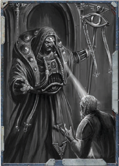

This  is  a  vile  power  that  is  generally  only  seen  by  those from either the Shrouded or Renegade Houses. With it, the Navigator  is  able  to  channel  the  corrupting  power  of  the warp and bathe a target with it. Needless to say this causes excruciating pain, but can also lead to spontaneous mutation and  even  death.  Using  such  power  is  not  without  cost however, and those who make use of this power regularly will generally go insane and slowly lose their grip on reality.

Novice: The Navigator makes an Opposed Willpower Test against  a  single  target.  Should  he  achieve  more  degrees  of success,  he  inflicts  1d5  Corruption  Points  upon  the  target. Because  this  power  is  warp-based,  any  sort  of  protection against  warp-based  attacks,  such  as  warded  armour,  will protect against this power as well. Should the Navigator fail the Opposed Willpower Test, he gains one point of Insanity. This  is  a  Navigator  Gaze  power  (see  page  180  in ROGUE TRADER ) for rules on how to avoid a Navigator's Gaze.

Adept: As  per  Novice,  except  that  the  target  suffers  1d10 Corruption Points.  Failing  the  Opposed  Willpower  Test  to use this power inflicts 1d5 Insanity Points on the Navigator.

Master: As  per  Novice,  except  that  instead  of  inflicting Corruption Points upon the Target, the Navigator causes the Target to make an immediate Malignancy Test instead. When using this power at this level, failing the Opposed Willpower Test causes the Navigator to suffer 1d10 Insanity Points.

*Source:* `Into the Storm, page 190`
