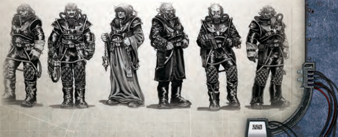

'Regulation 284.7: Mutiny. Any and all crew and officers found to be involved in the plotting of treason, sedition, or wilful disobedience of their superiors shall be jettisoned from the ship's airlock.'

-Imperial Navy Code of Conduct: Calixis Sector edition

The health and well-being of a starship's  crew  is  measured  in  two ways-its Crew Population and its Morale. Crew Population measures how many people are aboard a starship, indicated by a percentage of 100. Therefore, if a Crew Population was 98, that means 98 percent of the ship's original crew complement is still alive. All ships' Crew Populations begin at 100, though they may be modified by situations or the ship's [Components](starship-anatomy-detailed.md).

Morale is also measured on a 1 to 100 scale, starting at 100 and dropping as the starship encounters situations that test its crew's loyalty and commitment. With both Morale and Crew Population, higher values are better.

As both values drop, they affect their starship adversely, as depicted  in  the  following  charts.  The  charts  list  a  threshold number  and  the  effect  when  the  value  drops  below  that

| Table 8-14: Morale   | Table 8-14: Morale                                                                                                                                                                                                                                                                       |
|----------------------|------------------------------------------------------------------------------------------------------------------------------------------------------------------------------------------------------------------------------------------------------------------------------------------|
| Morale Number        | Effect                                                                                                                                                                                                                                                                                   |
| 100                  | Normal operations.                                                                                                                                                                                                                                                                       |
| 80                   | All Command Tests involving the ship or its crew suffer a -5.                                                                                                                                                                                                                            |
| 60                   | All Ballistic Skill Tests made to fire the ship's [Weapons](weapons-general.md) suffer a -5.                                                                                                                                                                                                                   |
| 50                   | All Command Tests involving the ship or its crew suffer an additional -10 (-15 total).                                                                                                                                                                                                   |
| 40                   | The ship suffers a -10 penalty to Manoeuvrability. All Ballistic Skill Tests made to fire the ship's [Weapons](weapons-general.md) suffer an additional -5 (-10 total).                                                                                                                                        |
| 20                   | The ship may no longer perform Boarding Actions or [Hit and Run](starship-combat-rules.md) attacks (too few of the crew can be trusted to follow [Orders](combat-orders.md) or wield weapons). The ship may still attempt to resist Boarding Actions as normal. Whenever the ship reaches a port, lose 1d5 Crew Population to deserters. |
| 10                   | All Command Tests involving the ship or its crew suffer an additional -15 (-30 total). The ship also suffers an additional -10 penalty to Speed, Manoeuvrability, and Detection.                                                                                                         |
| 0                    | The ship's crew rises up like a single, enraged organism, killing anybody in authority they can catch. Unless every single crewmember is put to the sword, they will take control of the ship and elect new officers from amongst their ranks.                                           |number.

The  effects  of  Crew  Population  loss  and  Morale  are unavoidable, but the effects are reversible if the Crew Population or  Morale  are  later  brought  above  the  threshold.  All  effects are cumulative, even Crew Population and Morale effects. The effects of Crew Population loss represent the ship becoming harder to operate as there are fewer hands to crew it, while the effects of Morale loss represent the crew actively malingering or doing other activities to hamper the ship's operations.

In  addition,  whenever  Morale  drops  below  70,  40,  and 10,  the  [Captain](rank-captain.md)  must  make  a  Command  Test.  If  he  fails, some portion of his crew rebels against his rule and a mutiny begins.

Note: If the ship is in [Combat](rules-combat-overview.md) when Morale drops below a threshold, wait until after the [Combat](rules-combat-overview.md) ends to test for a mutiny . If it drops below multiple thresholds during a single combat, only test once.

To represent the mutiny, the GM should choose one NPC crewmember to  lead  the  mutiny  (or  invent  basic  stats  for  a general crewmember). The mutiny can be fought or suppressed through  opposed  Command,  [Charm](equipment-gear.md),  or  Intimidation  Tests, chosen by the players. One character (who does not have to be the captain) should be chosen to suppress the mutiny and make the selected opposed Skill Test.

- If the characters chose to use Command, they are leading · armsmen to suppress riots, posting guards at critical spaces, and generally [Waging War](mass-combat-waging-war.md) against the mutineers directly . If the characters win the opposed Skill Test, the ship suffers 1d5 Crew Population [Damage](character-injury.md) and 1d5 Morale [Damage](character-injury.md), but the mutiny ends.
- If  the  characters  use  [Charm](equipment-gear.md),  they  are  meeting  with  the · mutiny's ringleaders, addressing their demands, and trying to placate them. If the characters win the opposed Skill Test, the ship suffers 1d10 Morale damage (the characters are viewed by the crew as weak), but the mutiny ends.
- If  the  characters  use  Intimidate,  they  are  threatening  to · open  crew  quarters  into  space,  shooting  ringleaders, holding  hostages,  and  generally  showing  the  crew  the dire consequences of their actions. If the characters win the opposed Skill Test, the ship suffers 1 Crew Population damage  and  1d10  Morale  damage  (the  crew  fears  and mistrusts  their  ruthless  commanders),  but  the  mutiny ends.

## Adventuring Aboard Ship a

Most of the rules provided in this chapter treat the actions performed aboard a ship in abstract terms. For [Example](rules-tests.md), a boarding action or [Hit and Run](starship-combat-rules.md) [Attack](combat-attack-rules.md) is  resolved  with  a  few  Command Tests, as are mutinies. Repairing a damaged Component requires a single Tech-Use Test. This is done because the characters are leading whole cohorts of their crew to accomplish actions, and because to break it down into individual actions would greatly slow down the game. Most of the rules provided in this chapter treat the actions performed aboard a ship in abstract

If  the  GM  wants  to,  however,  he  can  expand  on these, turning them into adventures in their own right. Perhaps the players have encountered a heavy [Cruiser](starship-anatomy-detailed.md), and have no conceivable way of destroying it. Instead of  throwing  themselves  at  the  mercy  of  their  foes, they hatch a daring plan to board the opposing ship in a shuttle, haul an ordinatus shell from one of their macrocannons to the ship's [Warp Engines](starship-essential-components.md), and attempt to destroy it from the inside.

If  the  GM chooses to do this, however, he should have a clear-cut goal defined, and the characters should understand how to accomplish it. It is also be a good idea to refrain from trying to have the characters fight large-scale  battles,  or  have  the  players  slog  through the  entire  crew  of  an  enemy  ship  (which,  remember, numbers in the thousands). To suppress a mutiny, for [Example](rules-tests.md),  the  players  could  sneak  through  the  ship's lower bilge decks and assassinate the mutineer leader, or fight their way to the life sustainer controls and vent the rebelling compartments into space. Perhaps they could even  establish  communications  with  the  mutineers and strike a deal with them, though such capitulation should stick in the craw of any true [Captain](rank-captain.md)...

If  the  mutineers  win  any  of  these  tests,  another  opposed Skill Test is performed. If the mutineers win again, the cycle continues. If, however, the mutineers ever win one of these tests by three or more degrees of success, the mutiny succeeds. The characters lose control of their ship, and will likely be forced to flee quickly lest they be killed by their former crew .

## Example

The Measured Response has just come through a hard fight, losing a substantial amount of crew-and even more Morale. After the fight ends, the ship's Morale is at 65. Since Morale has dropped below 80, all characters aboard will suffer -5 to any Command Tests.  Additionally,  the  [Captain](rank-captain.md)  must  make  a  Command  Test  to check for mutiny. He rolls against his Command Skill of 60 (taking into account the -5 penalty for his low Morale) and gets an 87. A mutiny has broken out aboard the ship! In the subsequent struggle to regain control, the captain will suffer -5 on any opposed Command Tests.

## Replenishing Morale and Crew Population

Restoring a ship's Morale is often surprisingly simple. The lowdecks dregs that make up the majority of a starship crew are an easily satisfied lot, often content with life's simple pleasures-or the promise of Thrones in their pocket.

If the starship is currently involved in attempting to complete an Endeavour, the [Captain](rank-captain.md) can bribe the crew with gelt (or the promise of gelt). At any point during a shipboard journey, the ship's  captain-or  another  authority  figure-can  attempt  to restore  Morale  by  losing  50  Achievement  Points  (from  those going towards his current Endeavour) and making a Routine (+20) [Charm](equipment-gear.md) Test .  Success means he has quieted the crew's concerns (or distracted  them  with  their  greed).  [Frigates](hulls-overview.md),  [Transports](ships-transports-overview.md), and [Raiders](ships-raiders-overview.md) regain 1d10 Morale, while [Light Cruisers](ships-light-cruisers-overview.md) and [Cruisers](hulls-overview.md) (being larger) regain 1d5. The captain may do this as many times as he wishes, however the difficulty of the test should increase by one degree each time he does. After all, Thrones are only so good when you have no place to spend them.

A captain or another authority figure can also make a Difficult (-10) [Charm](equipment-gear.md) or Intimidate Test to rally the crew , regaining 2 Morale for every degree of success. This will only work once per game session, however.

Of course, the best way to restore a crew's Morale is to put into port. If a starship reaches a habitable planet with no traces of civilisation, the ship can spend three weeks at orbital anchor, replenishing  supplies  and  allowing  the  crew  to  travel  to  the surface. This will restore a ship's  Morale to maximum. If the planet (or asteroid Settlement) is inhabited by a human civilisation, this process  will  only  take  two  weeks.  If  the  captain  is  willing  to spend some gelt, (making a Routine (+20) [Acquisition](economy-acquisition-rules.md) Test to represent money distributed and reimbursements for [Damage](character-injury.md) caused  to  local  drinking  dens  and  brothels),  he  can  restore his ship's Morale in a single week, and completely restock his supplies as well.

Restoring  Crew  Population  can  only  occur  at  a  planet inhabited by humans. The captain can make an [Acquisition](economy-acquisition-rules.md) Test to  restore  his  Crew  Population  to  maximum,  hiring  on  new crew members from among the locals. The [Availability](economy-availability-rules.md) of the crew should be considered Common (+20), though this can depend on the world. A [Hive World](chargen-stage2-origin-path.md) may have a large enough population that crew are considered Abundant (+50), while an isolated outpost may put a premium on manpower (Scarce or even Rare). The GM can choose to add bonuses or penalties due to the scale and quality (craftsmanship) of the crew being hired as well. Failure, of course, means the Explorers must look elsewhere for their crew . See page 271 for more information.

However, if he prefers, he can send teams of press-gangs into the planet's less savoury locales (be they slave camps, slums, or the underhive) to 'recruit' new crew members. If he does this, a character who is skilled in subterfuge and has contacts with the [Criminal](chargen-stage2-origin-path.md) underworld must make arrangements if the press-gangs are to be successful. The details are up to the GM, but at the very least a Common Lore (Underworld) Test will be required to find the right contacts, and a Barter Test must be made to secure the deal. Failure could mean that other criminal elements take violent exception  to  the  rogue  trader's  plans,  the  local  magistratum might step in to arrest all of the characters, or the planet's general population might violently rise up against the Rogue Trader and his party . The benefits, of course, are paying a few press-gang crews will not cut into a Rogue Trader's finances.

A third option is to strike a deal with planetary authorities that will allow the rogue trader to empty their prisons to serve as  his  crew .  If  he  does  this,  he  restores  his  Crew  Population without cost. However, he immediately loses 1d10+10 points of Morale-which cannot be restored while he remains at this planet.

No  attempts  to  restore  a  starship's  Crew  Population  or Morale can increase these values above the starship's maximum Crew Population or Morale values. Any Acquisition Tests made to  restore  Crew  Population  or  Morale  do  not  count  against the number of Acquisitions an Explorer may make in a game session.

*Source:* `Roguetrader Corerulebook, pages 225–227`

# Crew Population and Morale

The matter of tracking Crew Population and Morale adds a layer of bookkeeping to [Starship Combat](starship-combat-rules.md) that may prove to be a needless complication for a GM, particularly as many of the effects of a starship losing crew or morale are long-term issues unlikely to be a worthwhile consideration with regards to an NPC vessel.

However, the matter is not so inconsequential that it can be completely ignored. The hindrance of depleted crew and failing  morale  are  still  significant  factors  in  space  [Combat](rules-combat-overview.md). Consequently, a faster method of resolving [Damage](character-injury.md) to crew and morale is presented here.

NPC  starships  are  able  to  sustain  an  amount  of  Crew Population  or  Morale  damage  equal  to  their  ship's  [Hull](starship-anatomy-detailed.md) Integrity plus Crew  Rating. Therefore, a ship with a Competent (30) Crew and 40 Hull Integrity could sustain a Crew Population loss of 43. This value cannot exceed the ship's maximum Crew Population or Morale value.

[Npc Starships](ships-npc-starships.md) do not suffer the regular effects for Crew Population or Morale loss as indicated on page 224 of the Rogue TRadeR core  rulebook.  Instead,  when  they  exceed the  described  threshold,  they  have  either  lost  enough  men or morale that they no longer have the resources or stomach to fight, and attempt to disengage from combat during each subsequent turn. If they are brought to 0 Crew Population or Morale, the ship becomes a empty, inoperative tomb with no crew, or the crew rises up in rebellion, killing all the senior [Staff](weapons-general.md).  With  the  latter  result,  they  may  still  attempt  to  flee, fight, or negotiate with their enemies at the GM's discretion.

This method is an extremely simplified means of tracking Crew  Population  and  Morale  loss,  and  allows  Explorers  a means  to  drive  off  enemy  ships  without  destroying  them. Again, this  should  only  be  used  with  enemy  starships  that are minor and unimportant to the plot, not major adversaries.

*Source:* `Battle Fleet of the Koronus, page 116`
