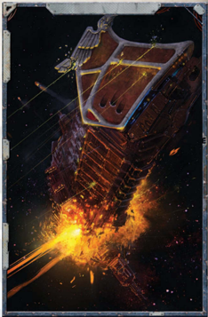

The end of warship can come in many ways. It can come quickly; a lucky weapon strike in the midst of roiling [Combat](rules-combat-overview.md) can turn the product of centuries of industry into an expanding ball of [Plasma](weapons-general.md) in the blink of an eye. Many ships end this way as the furious energies they contain consume them in a brief orgy of destruction. Worse still is the thankfully-rare [Warp Drive](warp-drive-rules.md) implosion that drags the shattered vessel and screaming crew into [The Warp](warp-imperial-space-travel.md), never to be seen again.

Fire can also bring a quick death. Within the tight confines of a ship, a blaze in a single compartment can soon spread to  become  a  roaring  conflagration.  The  high  temperatures reached  can  make  metal  run  like  wax  and  render  ordinary fire-fighting  techniques  worthless.  In  these  circumstances, usually the only option is to find a way to cut the oxygen supplies to the fire, something that [Damage](character-injury.md) to the ship often renders  impossible.  If  this  can't  be  done  it  is  often  only  a matter of time before a spreading fire triggers a magazine or reaches the engines. Once that occurs the ship's fate is sealed.

Capture  by  boarding  has  a  particular  horror  for  most [Captains](imperial-starship-types.md), and in truth humans are often out matched one-onone by xenos and servants of the Ruinous Powers. It's not unknown for captains to order the destruction of their own ship to avoid it falling into enemy hands. However, Imperial Navy ships carry very large crew compliments in comparison to  most  of  their  adversaries,  and  arm  most  to  fight  off boarding attempts. On occasion, the crews of boarded ships have swarmed across and taken the vessel of their attacker. Such desperate courage is usually fuelled by a need to [Escape](combat-escape-action.md) their own dying craft before it expires completely.

For most ships, their death is a lingering affair spent adrift with holed compartments slowly leaking air into the void. Sometimes a truly heroic crew can bring a ship back from the brink before hard vacuum takes their lives by jury-rigging repairs or signalling for help.  Distress calls can be a two-edged sword, however; there are plenty of scavengers lurking in the depths that happily take over a wreck and enslave or murder any crew they find.

These  deaths  are  ones  to  be  found  in  combat,  more  or less  honourable  for  a  warship  for  all  their  violence.  However, relatively few ships meet their end in combat. More common by far are losses due to accidents, starvation and disease. These last two fates, in particular, are ancient spectres that await any vessel that becomes trapped for too long by the tides of the warp.

Disease can be a terrible peril for a ship weeks or months away from civilisation. Backwater worlds can carry diseases or viruses a ship's crew has no immunity to. If the ship's chirurgeon cannot halt the spread of an epidemic the crew wastes away until not enough are left to keep the vessel functioning. Even if a friendly port can be reached in time it may try to turn away plague-ridden ships for [Fear](character-fear-and-damnation.md) of contamination.

Starvation  is  a  terror  that  can  turn  men  into  redfanged  beasts  all  too  quickly.  Nightmarish  tales of cannibalism and horror awaiting  wouldbe rescuers aboard drifting hulks are uncomfortably common in shipman'staverns.  Ration  shortages  test  the  discipline  of  a  crew  like nothing else, and it takes a powerful and charismatic [Captain](rank-captain.md) indeed to prevent a breakdown into complete anarchy.

On vessels with such a vast array of interlinked systems, the failure of any one of which can imperil the crew, accidents can easily have fatal consequences. An overlooked coupling, a botched maintenance rite, unseen wear or corrosion-these are simple mistakes that can trigger a cascade of events that doom the  ship.  Ironically,  however,  ships  are  frequently  at more risk from accidents when in port than out in the void. Dangerous tasks like loading magazines and torpedo stores or  substantial  maintenance  to  plasma  [Drives](components-drives.md),  are  exacting processes at the best of times and a hurried or slipshod crew can kill the ship with the very weapons meant to defend it.

Other 'accidents' may be outright sabotage. The enemies of Mankind go to great lengths to cripple or destroy Imperial ships when they are at their most vulnerable. The collateral damage  to  port  facilities  and  other  ships  from  a  plasma overload  or  magazine  explosion  can  also  be  devastating. Because of this most captains prefer to keep their ship's time in port short and well guarded.

For every ship whose doom is known a dozen more can only be listed as 'lost.' Uncounted ships set out on journeys and simply never arrive because they are swept to oblivion by the tides of the Empyrean.

## Subpages
- [Escape](combat-escape-action.md)

*Source:* `Battle Fleet of the Koronus, page 54`
