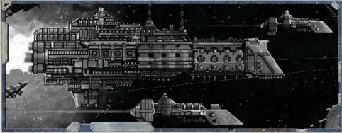

## Plasma Drives

A [Plasma](weapons-general.md) drive does more than move a ship. It also provides power to all of a ship's other systems-the vessel's fiery heart.

### Jovian Pattern Class 1 Drive

The STC standard drive for [Transports](hulls-overview.md), [Compact](weapons-upgrades.md) but underpowered.

### Lathe Pattern Class 1 Drive

The STC standard drive for [Transports](hulls-overview.md) has been extended to provide additional power in exchange for less available space.

### Jovian Pattern Class 2 Drive

The STC standard drive for escort-grade warships.

### Jovian Pattern Class 3 Drive

The STC standard drive for smaller capital-grade warships.

### Jovian Pattern Class 4 Drive

The STC standard drive for [Cruiser](starship-anatomy-detailed.md)-grade warships.

## Warp Engines

The  warp  drive  rips  a  vessel  from  the  material  world  and hurls it into [The Warp](warp-imperial-space-travel.md), allowing it to cross vast distances in a heartbeat, but exposing it to the dangers of the immaterium.

### Strelov 1 Warp Engine

Allows the vessel to enter and remain in the immaterium.

### Strelov 2 Warp Engine

Allows the vessel to enter and remain in the immaterium.

## Geller Fields

A starship's  Geller  Field  creates  a  bubble  of  reality  around the vessel when it traverses [The Warp](warp-imperial-space-travel.md), protecting it from the dangers that lurk there.

### Geller Field

Protects the vessel from the myriad dangers of the Immaterium.

### Warpsbane Hull

The  entire  [Hull](starship-anatomy-detailed.md)  of  the  vessel  is  covered  with  silver,  handinscribed  hexagramic  wards.  These  reinforce  a  Geller  Field projected from a 50 metre statue of an Imperial Saint, located just fore of the [Bridge](starship-anatomy-detailed.md).

Shield  of  Faith: Any  Navigation  Tests  to  pilot  the  ship through [The Warp](warp-imperial-space-travel.md) gain a +10 bonus. When rolling on Table 7-4:  Warp  Travel  Encounters (see  page  186),  the  GM rolls  twice  and  allows  the  Navigator  to  chose  which  result is applied.

## Void Shields

Void  shields  create  barriers  of  energy  around  a  starship  to protect it from stellar debris and incoming fire.

### Single Void Shield Array

A single double-layered void shield. Provides 1 Void Shield.

### Multiple Void Shield Array

Twin, multiple-layered [Void Shields](components-void-shields.md). Provides 2 Void Shields.

## Ship's Bridge

The [Bridge](starship-anatomy-detailed.md) is the starship's brain, where the [Captain](rank-captain.md) commands the vessel and directs its every action.

### Combat Bridge

A holdover from the ship's Navy days, this [Bridge](starship-anatomy-detailed.md) was laid out and equipped with [Combat](rules-combat-overview.md) in mind.

[Damage](character-injury.md) Control Station: As  long  as  the  [Bridge](starship-anatomy-detailed.md)  remains undamaged, all Tech-Use Tests to repair the ship gain +10.

### Command Bridge

This  [Bridge](starship-anatomy-detailed.md)  has  been  modified  to  give  the  ship's  master greater control over his vessel.

Enhanced Cogitator Relays: As long as the [Bridge](starship-anatomy-detailed.md) remains undamaged, all Command Tests made by the [Captain](rank-captain.md) gain +5 and all  Ballistic  Skill  Tests  to  fire  shipboard  [Weapons](weapons-general.md)  gain +5. If this Component ever suffers a Critical Hit, it becomes unpowered on a 1d10 roll of 3 or higher.

### Commerce Bridge

This [Bridge](starship-anatomy-detailed.md) has a station equipped with cogitator-[Servitors](crew-servitors.md) and a hololithic projector, given over to quickly loading and unloading cargo.

Organised: When working towards a Trade objective, the Explorers earn an additional 50 [Achievement Points](economy-endeavours.md) towards completing that objective.

### Armoured Bridge

The bridges of warships are often reinforced with additional [Armour Plating](starship-supplemental-components.md), to ensure the survival of their occupants.

Reinforced  [Armour](armour.md): If  this  Component  takes  a Critical  Hit  or  becomes  damaged  or  unpowered, roll 1d10. On a 4 or higher, the component is unharmed.

### Ship Master's Bridge

The [Bridge](starship-anatomy-detailed.md) of a ship of the line is designed with one goal in mind-winning battles.

Master Plotting Table: All Piloting and Navigation tests by crew on the [Bridge](starship-anatomy-detailed.md) gain +5.

Improved  Fire  Direction: All  Ballistic  Skill  Tests  to  fire shipboard [Weapons](weapons-general.md) gain +10.

## Life Sustainers

[Life Sustainers](components-life-sustainers.md) fill a vital role, providing a ship with clean air and water.

### Mark 1.r Life Sustainer

The life-support system was designed for reliability and does little to remove the stink of oil and warp engine discharge. Stale Air: Increase all Morale loss by 1.

### Vitae Pattern Life Sustainer

This life sustainer is of STC origins, and is in common use in The Calixis Sector.

## Crew Quarters

Even the lowliest crew require bunks and mess-halls to live in.

### Pressed-crew Quarters

The  masters  of  this  vessel  have  done  little  to  improve  the quarters left from this ship's Navy days.

Cramped:

Decrease Morale permanently by 2.

### Voidsmen Quarters

Standard living quarters for the [Voidsmen](crew-voidsmen.md) of a long-distance trader.

## Auger Arrays

The starship's eyes, allowing it to 'see' space far beyond the range of normal eyesight.| Table 8-3: [Essential Components](ships-npc-vessels.md)   | Table 8-3: [Essential Components](wraithship.md#essential-components)   |              |       |    |
|-----------------------------------|-----------------------------------|--------------|-------|----|
| Essential Components              | Appropriate [Hull](starship-anatomy-detailed.md) Types            | Power        | Space | SP |
| [Plasma Drives](components-plasma-drives.md)                     |                                   |              |       |    |
| Jovian Pattern Class 1 Drive      | [Transports](hulls-overview.md)                        | 35 Generated | 8     | -  |
| Lathe Pattern Class 1 Drive       | [Transports](ships-transports-overview.md)                        | 40 Generated | 12    | +1 |
| Jovian Pattern Class 2 Drive      | [Raiders](ships-raiders-overview.md), [Frigates](hulls-overview.md)                 | 45 Generated | 10    | -  |
| Jovian Pattern Class 3 Drive      | [Light Cruisers](ships-light-cruisers-overview.md)                    | 60 Generated | 12    | -  |
| Jovian Pattern Class 4 Drive      | Cruisers                          | 75 Generated | 14    | -  |
| [Warp Engines](warp-engines-components.md)                      |                                   |              |       |    |
| Strelov 1 Warp Engine             | Transports, Raiders, Frigates     | 10           | 10    | -  |
| Strelov 2 Warp Engine             | Light Cruisers, Cruisers          | 12           | 12    | -  |
| [Gellar Fields](warp-gellar-fields.md)                     |                                   |              |       |    |
| Geller Field                      | All Ships                         | 1            | 0     | -  |
| Warpsbane Hull                    | All Ships                         | 1            | 0     | +2 |
| [Void Shields](components-void-shields.md)                      |                                   |              |       |    |
| Single Void Shield Array          | All Ships                         | 5            | 1     | -  |
| Multiple Void Shield Array        | Cruisers                          | 7            | 2     | -  |
| [Ship's Bridge](starship-bridge.md)                     |                                   |              |       |    |
| Combat Bridge                     | Transports, Raiders, Frigates     | 1            | 1     | -  |
|                                   | Light Cruisers, Cruisers          | 2            | 2     | -  |
| Command Bridge                    | Raiders, Frigates                 | 2            | 1     | +1 |
|                                   | Light Cruisers, Cruisers          | 3            | 2     | +1 |
| Commerce Bridge                   | Transports                        | 1            | 1     | -  |
| Armoured Command Bridge           | Raiders, Frigates                 | 2            | 2     | -  |
|                                   | Light Cruisers, Cruisers          | 3            | 2     | -  |
| Ship Master's Bridge              | Cruisers                          | 4            | 3     | -  |
| [Life Sustainers](components-life-sustainers.md)                   |                                   |              |       |    |
| M-1.r Life Sustainer              | Transports, Raiders, Frigates     | 3            | 1     | -  |
| M-1.r Life Sustainer              | Light Cruisers, Cruisers          | 4            | 2     | -  |
| Vitae Pattern Life Sustainer      | Transports, Raiders, Frigates     | 4            | 2     | -  |
| Vitae Pattern Life Sustainer      | Light Cruisers, Cruisers          | 5            | 3     | -  |
| Crew Quarters                     |                                   |              |       |    |
| Pressed-crew Quarters             | Transports, Raiders, Frigates     | 1            | 2     | -  |
| Pressed-crew Quarters             | Light Cruisers, Cruisers          | 2            | 3     | -  |
| Voidsmen Quarters                 | Transports, Raiders, Frigates     | 1            | 3     | -  |
| Voidsmen Quarters                 | Light Cruisers, Cruisers          | 2            | 4     | -  |
| [Augur Arrays](components-augur-arrays.md)                      |                                   |              |       |    |
| M-100 Auger Array                 | All Ships                         | 3            | 0     | -  |
| M-201.b Auger Array               | All Ships                         | 5            | 0     | -  |
| R-50 Auspex Multi-band            | All Ships                         | 4            | 0     | -  |
| Deep Void Auger Array             | All Ships                         | 7            | 0     | +1 |

### Mark-100 Auger Array

The Imperial Navy's standard sensor array.

External: This  Component  does  not  require  [Hull](starship-anatomy-detailed.md)  space. Although it is external, it can only be destroyed or damaged by a Critical Hit.

### Mark-201.b Auger Array

A modified version of The Imperial Navy's standard sensor array, with boosted wideband gain.

External: This Component does not require [Hull](starship-anatomy-detailed.md) space. Although it is external, it can only be destroyed or damaged by a Critical Hit.

Sensitive: Increased  power  draw  provides  a +5 bonus to the ship's Detection.### R-50 Auspex Multi-band

The [Sensors](starship-anatomy-detailed.md) of this ship have been optimised for navigation, at the expense of the sensor's other uses.

External: This  Component  does  not  require  hull  space. Although it is external, it can only be destroyed or damaged by a Critical Hit.

Stellar Detection: Mapping protocols provide a +5 bonus to [Manoeuvre](rules-combat-overview.md) Tests to avoid [Celestial Phenomena](rules-celestial-phenomena.md), but subtracts -2 from the ship's Detection.

Long Distance Scan: When working toward an Exploration objective,  the  players  earn  an  additional  50  [Achievement Points](economy-endeavours.md) toward completing that objective.

### Deep Void Auger Array

These, quite simply, are the some of the best [Sensors](starship-anatomy-detailed.md) created by The Adeptus Mechanicus, and are reserved for their own ships and Imperial Naval scout vessels.

External: This  Component  does  not  require  [Hull](starship-anatomy-detailed.md)  space. Although it is external, it can only be destroyed or damaged by a Critical Hit.

Eye of the Omnissiah: The exceptional sensitivity of the array grants +10 to the ship's Detection.

*Source:* `Roguetrader Corerulebook, pages 200–203`

# Essential Components

[Xenos Warp Engine](components-xenos-warp-engine.md), [Phase-reality Field](components-phase-reality-field.md), Scavenged Lathe-pattern Class 1 Drive, [Ghost-field Array](components-ghost-field-array.md), Scavenged Commerce Bridge, [Stryxis Environmental Architect](faction-stryxis-environmental-architect.md), Pressed-crew quarters, Ghost-eye scanner

*Source:* `Battle Fleet of the Koronus, page 97`
