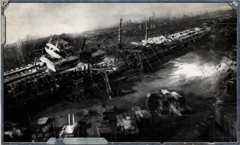
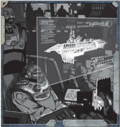

## Plasma Drives

A [Plasma](weapons-general.md) drive does more than move a ship. It also provides power to all of a ship's other systems-the vessel's fiery heart.

### Jovian Pattern Class 1 Drive

The STC standard drive for [Transports](hulls-overview.md), [Compact](weapons-upgrades.md) but underpowered.

### Lathe Pattern Class 1 Drive

The STC standard drive for [Transports](hulls-overview.md) has been extended to provide additional power in exchange for less available space.

### Jovian Pattern Class 2 Drive

The STC standard drive for escort-grade warships.

### Jovian Pattern Class 3 Drive

The STC standard drive for smaller capital-grade warships.

### Jovian Pattern Class 4 Drive

The STC standard drive for [Cruiser](starship-anatomy-detailed.md)-grade warships.

## Warp Engines

The  warp  drive  rips  a  vessel  from  the  material  world  and hurls it into [The Warp](warp-imperial-space-travel.md), allowing it to cross vast distances in a heartbeat, but exposing it to the dangers of the immaterium.

### Strelov 1 Warp Engine

Allows the vessel to enter and remain in the immaterium.

### Strelov 2 Warp Engine

Allows the vessel to enter and remain in the immaterium.

## Geller Fields

A starship's  Geller  Field  creates  a  bubble  of  reality  around the vessel when it traverses [The Warp](warp-imperial-space-travel.md), protecting it from the dangers that lurk there.

### Geller Field

Protects the vessel from the myriad dangers of the Immaterium.

### Warpsbane Hull

The  entire  [Hull](starship-anatomy-detailed.md)  of  the  vessel  is  covered  with  silver,  handinscribed  hexagramic  wards.  These  reinforce  a  Geller  Field projected from a 50 metre statue of an Imperial Saint, located just fore of the [Bridge](starship-anatomy-detailed.md).

Shield  of  Faith: Any  Navigation  Tests  to  pilot  the  ship through [The Warp](warp-imperial-space-travel.md) gain a +10 bonus. When rolling on Table 7-4:  Warp  Travel  Encounters (see  page  186),  the  GM rolls  twice  and  allows  the  Navigator  to  chose  which  result is applied.

## Void Shields

Void  shields  create  barriers  of  energy  around  a  starship  to protect it from stellar debris and incoming fire.

### Single Void Shield Array

A single double-layered void shield. Provides 1 Void Shield.

### Multiple Void Shield Array

Twin, multiple-layered [Void Shields](components-void-shields.md). Provides 2 Void Shields.

## Ship's Bridge

The [Bridge](starship-anatomy-detailed.md) is the starship's brain, where the [Captain](rank-captain.md) commands the vessel and directs its every action.

### Combat Bridge

A holdover from the ship's Navy days, this [Bridge](starship-anatomy-detailed.md) was laid out and equipped with [Combat](rules-combat-overview.md) in mind.

[Damage](character-injury.md) Control Station: As  long  as  the  [Bridge](starship-anatomy-detailed.md)  remains undamaged, all Tech-Use Tests to repair the ship gain +10.

### Command Bridge

This  [Bridge](starship-anatomy-detailed.md)  has  been  modified  to  give  the  ship's  master greater control over his vessel.

Enhanced Cogitator Relays: As long as the [Bridge](starship-anatomy-detailed.md) remains undamaged, all Command Tests made by the [Captain](rank-captain.md) gain +5 and all  Ballistic  Skill  Tests  to  fire  shipboard  [Weapons](weapons-general.md)  gain +5. If this Component ever suffers a Critical Hit, it becomes unpowered on a 1d10 roll of 3 or higher.

### Commerce Bridge

This [Bridge](starship-anatomy-detailed.md) has a station equipped with cogitator-[Servitors](crew-servitors.md) and a hololithic projector, given over to quickly loading and unloading cargo.

Organised: When working towards a Trade objective, the Explorers earn an additional 50 [Achievement Points](economy-endeavours.md) towards completing that objective.

### Armoured Bridge

The bridges of warships are often reinforced with additional [Armour Plating](starship-supplemental-components.md), to ensure the survival of their occupants.

Reinforced  [Armour](armour.md): If  this  Component  takes  a Critical  Hit  or  becomes  damaged  or  unpowered, roll 1d10. On a 4 or higher, the component is unharmed.

### Ship Master's Bridge

The [Bridge](starship-anatomy-detailed.md) of a ship of the line is designed with one goal in mind-winning battles.

Master Plotting Table: All Piloting and Navigation tests by crew on the [Bridge](starship-anatomy-detailed.md) gain +5.

Improved  Fire  Direction: All  Ballistic  Skill  Tests  to  fire shipboard [Weapons](weapons-general.md) gain +10.

## Life Sustainers

[Life Sustainers](components-life-sustainers.md) fill a vital role, providing a ship with clean air and water.

### Mark 1.r Life Sustainer

The life-support system was designed for reliability and does little to remove the stink of oil and warp engine discharge. Stale Air: Increase all Morale loss by 1.

### Vitae Pattern Life Sustainer

This life sustainer is of STC origins, and is in common use in The Calixis Sector.

## Crew Quarters

Even the lowliest crew require bunks and mess-halls to live in.

### Pressed-crew Quarters

The  masters  of  this  vessel  have  done  little  to  improve  the quarters left from this ship's Navy days.

Cramped:

Decrease Morale permanently by 2.

### Voidsmen Quarters

Standard living quarters for the [Voidsmen](crew-voidsmen.md) of a long-distance trader.

## Auger Arrays

The starship's eyes, allowing it to 'see' space far beyond the range of normal eyesight.| Table 8-3: [Essential Components](ships-npc-vessels.md)   | Table 8-3: [Essential Components](wraithship.md#essential-components)   |              |       |    |
|-----------------------------------|-----------------------------------|--------------|-------|----|
| Essential Components              | Appropriate [Hull](starship-anatomy-detailed.md) Types            | Power        | Space | SP |
| [Plasma Drives](components-plasma-drives.md)                     |                                   |              |       |    |
| Jovian Pattern Class 1 Drive      | [Transports](hulls-overview.md)                        | 35 Generated | 8     | -  |
| Lathe Pattern Class 1 Drive       | [Transports](ships-transports-overview.md)                        | 40 Generated | 12    | +1 |
| Jovian Pattern Class 2 Drive      | [Raiders](ships-raiders-overview.md), [Frigates](hulls-overview.md)                 | 45 Generated | 10    | -  |
| Jovian Pattern Class 3 Drive      | [Light Cruisers](ships-light-cruisers-overview.md)                    | 60 Generated | 12    | -  |
| Jovian Pattern Class 4 Drive      | Cruisers                          | 75 Generated | 14    | -  |
| [Warp Engines](warp-engines-components.md)                      |                                   |              |       |    |
| Strelov 1 Warp Engine             | Transports, Raiders, Frigates     | 10           | 10    | -  |
| Strelov 2 Warp Engine             | Light Cruisers, Cruisers          | 12           | 12    | -  |
| [Gellar Fields](warp-gellar-fields.md)                     |                                   |              |       |    |
| Geller Field                      | All Ships                         | 1            | 0     | -  |
| Warpsbane Hull                    | All Ships                         | 1            | 0     | +2 |
| [Void Shields](components-void-shields.md)                      |                                   |              |       |    |
| Single Void Shield Array          | All Ships                         | 5            | 1     | -  |
| Multiple Void Shield Array        | Cruisers                          | 7            | 2     | -  |
| [Ship's Bridge](starship-bridge.md)                     |                                   |              |       |    |
| Combat Bridge                     | Transports, Raiders, Frigates     | 1            | 1     | -  |
|                                   | Light Cruisers, Cruisers          | 2            | 2     | -  |
| Command Bridge                    | Raiders, Frigates                 | 2            | 1     | +1 |
|                                   | Light Cruisers, Cruisers          | 3            | 2     | +1 |
| Commerce Bridge                   | Transports                        | 1            | 1     | -  |
| Armoured Command Bridge           | Raiders, Frigates                 | 2            | 2     | -  |
|                                   | Light Cruisers, Cruisers          | 3            | 2     | -  |
| Ship Master's Bridge              | Cruisers                          | 4            | 3     | -  |
| [Life Sustainers](components-life-sustainers.md)                   |                                   |              |       |    |
| M-1.r Life Sustainer              | Transports, Raiders, Frigates     | 3            | 1     | -  |
| M-1.r Life Sustainer              | Light Cruisers, Cruisers          | 4            | 2     | -  |
| Vitae Pattern Life Sustainer      | Transports, Raiders, Frigates     | 4            | 2     | -  |
| Vitae Pattern Life Sustainer      | Light Cruisers, Cruisers          | 5            | 3     | -  |
| Crew Quarters                     |                                   |              |       |    |
| Pressed-crew Quarters             | Transports, Raiders, Frigates     | 1            | 2     | -  |
| Pressed-crew Quarters             | Light Cruisers, Cruisers          | 2            | 3     | -  |
| Voidsmen Quarters                 | Transports, Raiders, Frigates     | 1            | 3     | -  |
| Voidsmen Quarters                 | Light Cruisers, Cruisers          | 2            | 4     | -  |
| [Augur Arrays](components-augur-arrays.md)                      |                                   |              |       |    |
| M-100 Auger Array                 | All Ships                         | 3            | 0     | -  |
| M-201.b Auger Array               | All Ships                         | 5            | 0     | -  |
| R-50 Auspex Multi-band            | All Ships                         | 4            | 0     | -  |
| Deep Void Auger Array             | All Ships                         | 7            | 0     | +1 |

### Mark-100 Auger Array

The Imperial Navy's standard sensor array.

External: This  Component  does  not  require  [Hull](starship-anatomy-detailed.md)  space. Although it is external, it can only be destroyed or damaged by a Critical Hit.

### Mark-201.b Auger Array

A modified version of The Imperial Navy's standard sensor array, with boosted wideband gain.

External: This Component does not require [Hull](starship-anatomy-detailed.md) space. Although it is external, it can only be destroyed or damaged by a Critical Hit.

Sensitive: Increased  power  draw  provides  a +5 bonus to the ship's Detection.### R-50 Auspex Multi-band

The [Sensors](starship-anatomy-detailed.md) of this ship have been optimised for navigation, at the expense of the sensor's other uses.

External: This  Component  does  not  require  hull  space. Although it is external, it can only be destroyed or damaged by a Critical Hit.

Stellar Detection: Mapping protocols provide a +5 bonus to [Manoeuvre](rules-combat-overview.md) Tests to avoid [Celestial Phenomena](rules-celestial-phenomena.md), but subtracts -2 from the ship's Detection.

Long Distance Scan: When working toward an Exploration objective,  the  players  earn  an  additional  50  [Achievement Points](economy-endeavours.md) toward completing that objective.

### Deep Void Auger Array

These, quite simply, are the some of the best [Sensors](starship-anatomy-detailed.md) created by The Adeptus Mechanicus, and are reserved for their own ships and Imperial Naval scout vessels.

External: This  Component  does  not  require  [Hull](starship-anatomy-detailed.md)  space. Although it is external, it can only be destroyed or damaged by a Critical Hit.

Eye of the Omnissiah: The exceptional sensitivity of the array grants +10 to the ship's Detection.

*Source:* `Roguetrader Corerulebook, pages 200–203`

# Essential Components

[Xenos Warp Engine](components-xenos-warp-engine.md), [Phase-reality Field](components-phase-reality-field.md), Scavenged Lathe-pattern Class 1 Drive, [Ghost-field Array](components-ghost-field-array.md), Scavenged Commerce Bridge, [Stryxis Environmental Architect](faction-stryxis-environmental-architect.md), Pressed-crew quarters, Ghost-eye scanner

*Source:* `Battle Fleet of the Koronus, page 97`

# Essential Components

## Table of Contents
  - [Plasma Drive](#plasma-drive)
    - [Jovian-pattern Class 4.5 'Warcruiser' Drive](#jovian-pattern-class-45-warcruiser-drive)
    - [Lathe-pattern Class 2a 'Sprint Trader' Drive](#lathe-pattern-class-2a-sprint-trader-drive)
    - [Lathe-pattern Class 2b 'Escort' Drive](#lathe-pattern-class-2b-escort-drive)
  - [Warp Engines](#warp-engines)
    - [Markov 1 Warp Engine](#markov-1-warp-engine)
    - [Markov 2 Warp Engine](#markov-2-warp-engine)
  - [Gellar Fields](#gellar-fields)
    - [Emergency Field](#emergency-field)
  - [Void Shields](#void-shields)
    - [Repulsor Shield](#repulsor-shield)
    - [Repulsor Shield Array](#repulsor-shield-array)
  - [Ship's Bridge](#ships-bridge)
    - [Exploration Bridge](#exploration-bridge)
  - [Crew Quarters](#crew-quarters)
    - [Clan-kin Quarters](#clan-kin-quarters)
    - [Cold Quarters](#cold-quarters)

The Crusade to conquer the Calixis Sector took hundreds of years, and thousands of vessels. Ships of the line, cruisers, and escorts of all stripes formed the ranks of the crusade fleet. In addition, the fleet was supported by an even vaster fleet of transports, each a veteran of the Crusade as well.

As the Crusade drew to a close, the vessels accumulated for its prosecution dispersed. Many of the Naval warships returned to  their  original  battlefleets,  or  formed  the  nucleus  of  the new Battlefleet Calixis. The Rogue Traders left to explore the new frontiers. The transports were divided into trade fleets or auctioned to chartist captains, the beginnings of the trade-lanes that would establish the sector. And so, the great Crusade fleet broke apart, scattered to all corners of the Sector and beyond.

A millennia later, vessels that served in the Crusade are scarce. Many have scattered across the Sector or Segmentum. Still more ships  have  been  lost  to  the  Imperium's  continued  wars,  or  the inevitable  perils  of  interstellar  travel.  The  great  warp  storms  abutting the Halo Margins, the Hazeroth Abyss, the Margin Crusade, all take their toll. As a result, few veteran vessels remain intact.

Such ships are prized for their rich history, nonetheless. A ship of the Angevin Crusade is infused with martial vigour, and displays an almost living desire to continue persecuting Drusus's war beyond the Calixis Sector, and into the Expanse beyond.

Cost: 3 Ship Points. All ships may take this.

Emperor's Crusader: The ships of the Angevin Crusade are built for-and tempered by-centuries of warfare. All Ballistic Skill Tests made to fire the ship's weapons gain a +10 bonus.

Righteous  Arrogance: A  Crusade  ship  is  not  known  for such low tactics as sneaking and skulduggery. This ship makes all Silent Running attempts at a -40 penalty.

Glorious  Deeds: One  of  the  traditions  said  to  have  been established  by  Angevin  and  carried  on  by  his  lieutenants  is the inscribing of a vessel's deeds on the outer hall, shielded by powerful localised stasis fields to preserve them against the ravages of time and war. All crew from this ship gain a +10 to  Charm and Intimidate Tests,  provided  their  targets  know which ship they come from (and are in a position to understand the inscribing-many xenos cultures may not understand or care about the glorious deeds of a human vessel).

## Plasma Drive

Many of the vessels under a Rogue Trader's command could be considered warships, but few can truly compare to a true military vessel. Any Naval officer in the sector feels a ship is not a 'warship' until it has spent a decade amongst the ranks of the Battlefleet. A proper Battlefleet warship is measured by far more than the strength of its guns. Though accuracy is appreciated in the Imperial Navy, obedience, discipline, and honour are watchwords prized above all else. The Imperial Navy perseveres and triumphs over its enemies through its adherence to duty and tradition, and this ethos is said to be absorbed by the very fibre of the ships they serve aboard.

It  is  extremely  difficult  for  a  Rogue  Trader  to  obtain  a warship  from  the  Fleet.  Should  a  Rogue  Trader  be  foolish enough  steal  from  the  Imperial  Navy,  he  soon  finds  that same adherence to honour and duty creates a relentless and

implacable foe. However, it is not unknown for a Rogue Trader dynasty to be gifted a warship for exceptional duties rendered to the Emperor's Holy Fleet. Even if those who performed for the  deeds  are  long  dead,  the  Navy  treats  the  captain  of  the warship as if they themselves were responsible.

Cost: Variable. All ships except transports may take this. Steadfast Ally or Implacable Foe: When this background package is selected,  the  players  can  pay  1  Ship  Point  or  2 Ship Points. If they pay 1 Ship Point, all crew-members gain Enemy (Imperial Navy). If they pay 2 Ship Points, all crewmembers gain Good Reputation (Imperial Navy).

His Word Obeyed: Any crew-member who makes Command Tests aboard this ship gains a +10 bonus.

Duty Unto Death: When this ship is  crippled,  the  ship's Captain may make a Challenging (+0) Command Test . If the Test is successful, the ship does not suffer the effects of being crippled during its subsequent turn.

### Jovian-pattern Class 4.5 'Warcruiser' Drive

It  is  common  for  the  Imperium's  starships  to  be  extremely ancient. In fact, since much of the technology used to create the ships of yesteryear has since been lost, individuals and organisations often go to great length to recover and restore ancient void ships to use. All-too often, these ancient vessels are  simply  better  in  almost  every  way  than  their  modern counterparts. Therefore, those in the Imperium of Mankind often gos to extraordinary lengths to recover them.

Space hulks are a common source for ancient vessels, and salvage operations can make space hulks as profitable as they are dangerous. Other ancient starships may be recovered as derelicts  in  orbit  around  a  forgotten  planet,  or  some  may even have been in continuous use for the ten millennia of the Imperium. Far less common, though by no means unheard of, are starships that have been buried on a planet's surface.

The  starship  may  have  ended  up  on  the  planet  in  any number of ways. Most often, a starship suffers some catastrophic mechanical failure in orbit around a world. Unless it wants to suffer a fiery descent to the world below, it may be forced to attempt a more controlled descent. Making such a landing is extremely difficult. Imperial starships are not designed to enter an atmosphere, and it will take every bit of skill from the ship's captain and tech-priest to ensure such a large vessel does not succumb to gravity's embrace. A small few are able to reach the surface, however, and there they stay . Over the centuries, they often become covered with soil, plant life, and even forests, so that only small parts of the ship are visible. Sometimes they even become the nucleus of towns or cities-the population could even be the descendants of the ship's original crew .

For most of these ships, the flight to the surface proves to be their last. Crippling gravity crushes their spines and vital systems, and they remain planet-bound forever. Some, however, remain largely intact, and sleep away the millennia beneath their earthy cocoon. Eventually, an enterprising captain may find one of these forgotten treasures, and with grav-lifts and bulk tenders, pry it from its prison to sail the stars once more.

Cost: 3 Ship Points. All ships may take this.

Gravity's harsh embrace: Decrease Hull Integrity by 1d5-1 for  frigates,  transports  and  raiders,  and  1d5  for  light  cruisers, cruisers, and larger vessels.

Lost relics of the past: This ship begins play with a Modified Drive (see page 206 of Rogue Trader) for no extra cost in Ship  Points.  This  ship  also  gains  access  to  one  additional archeotech component of the players' choice.

Dreams  of  distant  worlds: Superstition  claims  a  planetbound  ship  maintains  a  particular  affinity  for  planetary bodies, after having remained on one for so long. This ship gains +10 Manoeuvrability while within 5 VUs of a planet.### Lathe-pattern Class 2a 'Sprint Trader' Drive

T he following is a list of starship Components designed to supplement the Component lists found on pages 199208 of ROGUE TRADER .  The  following  Components may be used to construct the Explorers'-or an NPC-starship as normal, following all the restrictions found in the core rules.

### Lathe-pattern Class 2b 'Escort' Drive

Although  all  Imperial  starships  require  roughly  the  same set of Essential Components  to  function, millennia of shipbuilding  has  resulted  in  countless  variants  on  broad themes.  Each  starship  requires  exactly  one  of  each  type  of Essential Component, no more, no less.

## Warp Engines

The plasma drive is the fiery beating heart of a starship, providing power to all systems as well as propelling it through the void.

### Markov 1 Warp Engine

The  Jovian  shipyards  produce  this  STC  drive  sparingly, reserving it for warships that need to meet the extreme power draw of extensive lance armaments.

### Markov 2 Warp Engine

The Lathes have long advocated increasing the size and power of  a  drive  in  exchange  for  space.  The  mis-named  'Sprint Trader' Drive (it can be equipped on most smaller vessels), takes that philosophy to an extreme.

Oversized Engines: Increase the starship's Manoeuvrability by +3, and Speed by +1.

## Gellar Fields

The success of the 'Sprint Trader' Drive has resulted in similar modifications to the drives of military vessels.

Oversized Engines: Increase the starship's Manoeuvrability by +3, and Speed by +1.

### Emergency Field

Warp drives are essential for any vessel that wants to travel beyond the bounds of a single star system.

## Void Shields

The Markov series  of  warp  engines  is  designed  to  propel  smaller courier vessels more quickly through the Immaterium.

Overcharged: Reduce  the  base  travel  time  for  a  journey through  the  Immaterium  by  1d5  weeks.  It  may  be  further modified by the results of the Navigation (Warp) Test.

156

### Repulsor Shield

The Markov 2 was adapted to decrease the travel times of light cruisers. However, certain problems with up-scaling the design

led to decreased effectiveness compared to the Markov 1.

Overcharged: Reduce  the  base  travel  time  for  a  journey through  the  Immaterium  by  1d10  days.  It  may  be  further modified by the results of the Navigation (Warp) Test.

### Repulsor Shield Array

The  ship's  Gellar  Field  is  its  foremost  (and  only)  line  of defence  against  the  predications  of  warp  predators  when travelling through the Immaterium.

## Ship's Bridge

Some captains  equip  their  Gellar  field  generators  with  emergency cogitation  circuits  that  activate  the  field  automatically  upon detecting the warp. Though many scorn the idea because of the extra power draw, and others are distrustful of automated circuitry, such devices have saved ships in the past.

Auto-engagement  routines: If the ship unexpectedly enters the warp, roll 1d10. On a 3 or higher, the Gellar Field activates  automatically,  protecting  the  ship  from  any  warp intrusion that may have taken place.

### Exploration Bridge

Void shields protect starships equally against enemy fire and drifting space debris.

## Crew Quarters

These  standard  void  shields  have  had  their  frequencies adjusted to better brush aside stellar debris and detritus. Void Shield: This Component counts as a ship's Void Shield, giving the ship one void shield.| Table 4-1: Essential Components   | Table 4-1: Essential Components   | Table 4-1: Essential Components   | Table 4-1: Essential Components   | Table 4-1: Essential Components   |
|-----------------------------------|-----------------------------------|-----------------------------------|-----------------------------------|-----------------------------------|
| Essential Components              | Appropriate Hull Types            | Power                             | Space                             | SP                                |
| Plasma Drive                      |                                   |                                   |                                   |                                   |
| -ovian-pattern 'Warcruiser' Drive | /ight Cruisers                    | 65 generated                      | 14                                | 2                                 |
|                                   | Cruisers                          | 85 generated                      | 17                                | 2                                 |
| /athe-pattern 2a Drive            | Transports                        | 40 generated                      | 14                                | 2                                 |
|                                   | Raiders, Frigates                 | 47 generated                      | 14                                | 2                                 |
| Warp Engines                      |                                   |                                   |                                   |                                   |
| Markov 1 Warp Engine              | Transports, Raiders, Frigates     | 12                                | 12                                | 1                                 |
| Markov 2 Warp Engine              | /ight Cruisers                    | 13                                | 13                                | 1                                 |
| Gellar Fields                     |                                   |                                   |                                   |                                   |
| Emergency Field                   | All Ships                         | 2                                 | 0                                 | ²                                 |
| Void Shields                      |                                   |                                   |                                   |                                   |
| Repulsor Shield                   | All Ships                         | 6                                 | 1                                 | ²                                 |
| Repulsor Shield Array             | Cruisers                          | 8                                 | 1                                 | ²                                 |
| Ship's Bridge                     |                                   |                                   |                                   |                                   |
| Exploration Bridge                | Transports, Raiders, Frigates     | 4                                 | 1                                 | 1                                 |
|                                   | /ight Cruisers, Cruisers          | 4                                 | 2                                 | 1                                 |
| Crew Quarters                     |                                   |                                   |                                   |                                   |
| Clan-kin 4uarters                 | Transports, Raiders, Frigates     | 1                                 | 4                                 | 1                                 |
| Clan-kin 4uarters                 | /ight Cruisers, Cruisers          | 2                                 | 5                                 | 1                                 |
| Cold 4uarters                     | Transports, Raiders, Frigates     | 3                                 | 4                                 | +1                                |
| Cold 4uarters                     | Light Cruisers, Cruisers          | 4                                 | 5                                 | +1                                |

Charged particle repulsion effect: The ship does not suffer penalties  to  Manoeuvre  Actions  when  travelling  through nebulas, ice rings, plasma clouds or other celestial phenomena consisting primarily of small particles.

### Clan-kin Quarters

These standard void shield arrays have had their frequencies adjusted to better brush aside stellar debris and detritus.

Void Shield: This Component counts as a ship's Void Shield, giving the ship two void shields.

Charged particle repulsion effect: The ship does not suffer penalties  to  Manoeuvre  Actions  when  travelling  through nebulas, ice rings, plasma clouds or other celestial phenomena consisting primarily of small particles.

### Cold Quarters

The starship's bridge is the brain to the plasma drive's heart, commanding and directing the vessel.

*Source:* `Into the Storm, pages 155–158`
