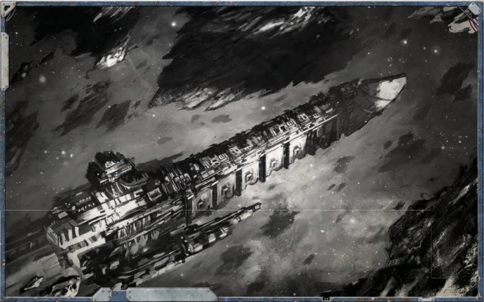

'By the God-Emperor, she's a beaut, isn't she? Five kilometres long if a metre, clad in adamantium 10 metres thick, and a statue of Celestine herself on the prow. She'll cut a swath through the Expanse, she will.'

-Yard-master Hale, launching the first Ambition [Cruiser](starship-anatomy-detailed.md)

T his section provides options for a number of new [Hulls](hulls-overview.md) used when building the Explorers' ships. This includes two new hull types, the grand cruiser and battlecruiser.

*Source:* `Battle Fleet of the Koronus, page 21`

# New Starship Hulls

'Every man shall work his fingers to the bone to accomplish the task at hand. If that proves insufficient, he shall work them to the marrow!'

-First standing order of Captain Krassus, Battlefleet Gothic

A Rogue Trader is master of his vessel, and his trusted retainers  direct  its  workings  with  only  slightly  less authority.  However,  no  matter  how  absolute  their word, the Rogue Trader and his fellow Explorers are only the tip of the iceberg. They stand at the top of a vast pyramid of men and women ranging from the educated and highly trained  command  staff  aboard  a  starship's  bridge,  to  the specialist crew-members who know something of the vessel's arcane inner workings, to the armsmen who enforce discipline with the truncheon and protect the vessel with shotcannon and sabre. At the very bottom of the pyramid are the ratings, the dregs of society drafted aboard the ship. Only rarely do ratings  prove  their  worth  and  are  subsequently  elevated  to serve amongst the upper ranks of a starship's crew. Usually, their  lives  are  comprised  of  brute  labour,  and  all  too  often are cut tragically short. There are no shortages of accidents waiting to happen aboard a starship, and that's discounting the myriad dangers lurking outside the hull. are cut tragically short. There are no shortages of accidents waiting to happen aboard a starship, and that's discounting

This is one of the reasons that many Imperial vessels sail with exceptionally large crews. Of course, an Imperial ship is a gigantic vessel, often multiple kilometres in length. Often, the understanding of the marvellously complex technologies woven into a certain ship's design have been lost to both its creators  and  its  crew.  Although  a  ship's  systems  may  have once performed certain vital tasks simply and effectively, none remain  who  can  operate  them-or  the  systems  themselves have degraded to the point of uselessness. Raw manpower is a crude but effective substitute, whether employed in the sweating  chain  gangs  who  haul  a  ship's  macrocannon  into firing position, or the groaning, foot-powered tread wheels that open and close the louvres shielding a starship's mighty attitude jets.

That  being  said,  it  is  possible  for  many  Imperial  ships to  operate  with  smaller  crews  than  their  optimal  crew compliment. Some do just that, especially the smaller systemships  that  operate  within  civilised  and  defended  Imperial systems,  and  never  leave  the  protective  embrace  of  local Navy patrols. Beyond those systems, amongst the vast gulf of interstellar space, it is a far different story .

Few trade routes within the Imperium can be considered truly  safe.  Even  the  most  populous  sectors  abound  with  a thousand  threats-pirates,  mutant  renegades,  pocket  xenos empires, and even the dread minions of the Dark Gods. In addition,  a  single  ship  is  extremely  valuable-representing decades  (if  not  centuries)  of  construction,  and  centuries  or millennia  of  service.  There  are  planets  worth  less  to  the Adeptus Terra than a single transport. Therefore, it is common practice for even the most unassuming tramp freighter or mass conveyor  to  be  outfitted  for  war.  Adamantium  armour  and void shields for defence, a few batteries of macroweapons to hopefully drive away a foe. And, of course, a crew population beyond the minimum needed for day-to-day operations-a surplus to absorb the inevitable casualties from fires, explosions, decompressions, and desperate boarding actions.

## Subpages
- [Transports](transports.md)
- [Raiders](raiders.md)
- [Frigates](frigates.md)
- [Light Cruisers](light-cruisers.md)
- [Cruisers](cruisers.md)

*Source:* `Into the Storm, page 149`
