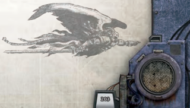
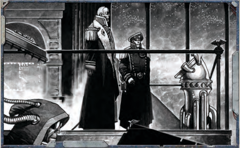

## Macrobatteries

Macrobatteries are ranks of massive cannons or other [Weapons](weapons-general.md), fired in volley to overwhelm an enemy in a barrage of destruction.

### Thunderstrike Macrocannons

An older version of the Mars Pattern, these macrocannons lack range and power. They are most often found on [Transports](hulls-overview.md).

### Mars Pattern Macrocannons

The  most  common  macrobattery,  these  are  [Reliable](weapons-general.md),  hardhitting [Weapons](weapons-general.md) firing kilo-tonne ordinance, mounted along the vessel's dorsal ridge or in broadside.

### Mars Pattern Macrocannon Broadside

The  most  common  macrobattery,  these  are  [Reliable](weapons-general.md),  hardhitting  [Weapons](weapons-general.md)  firing  kilo-tonne  ordinance,  mounted  in  a warship's extended broadside.

Broadside: These weapons must occupy a Port or Starboard Weapon Capacity slot.

### Sunsear Laser Battery

These laser batteries are common on Naval [Frigates](hulls-overview.md), providing a balance between power used and [Damage](character-injury.md) inflicted.### Ryza Pattern [Plasma](weapons-general.md) Battery

These [Weapons](weapons-general.md) are rare and expensive examples of the ancient art of plasma-craft. Their power draw is considerable, but so is their effectiveness.

Vapourisation: When this Weapon Component rolls a 1 or 2 on the Critical Hit Chart, it effects two [Components](starship-anatomy-detailed.md) instead of one.

## Lances

Lances  are  the  rapier  to  the  macrobatteries'  hammer.  They send a single beam of energy burning through their enemy's [Armour](armour.md) and deep into its vitals.

### Starbreaker Lance Weapon

The  Starbreaker  is  a  recent  attempt  by  lesser  forge  worlds to  copy  the  STC  Titanforge.  Unfortunately,  they  are  less powerful than the [Weapons](weapons-general.md) they emulate.

### Titanforge Lance Weapon

The Titanforge Lances are an STC standard for lance weaponry, found on naval warships throughout The Calixis Sector.

### Titanforge Lance Battery

The  Titanforge  Lances  are  an  STC  standard  for  lance weaponry, found on naval warships throughout The Calixis Sector. On larger vessels, multiple lances may be mounted in a set of gargantuan turrets (not to be confused with the smaller defence turrets).

## Cargo and Passenger Compartments

Areas in the ship designed for cargo or passenger transport, presenting a [Captain](rank-captain.md) with more ways to earn Thrones.

### Cargo Hold and Lighter Bay

Warships can be converted to haul cargo, but this can often have an adverse effect on their [Combat](rules-combat-overview.md) performance.

Hidden Spaces: When working toward a Trade or [Criminal](chargen-stage2-origin-path.md) objective,  the  players  earn  an  additional  50  [Achievement Points](economy-endeavours.md) toward completing that objective.

[Unbalanced](weapons-general.md): Starships  are  precisely  [Balanced](weapons-general.md),  something this modification effects, meaning they suffer -3 to Manoeuvrability.

### Compartmentalised Cargo Hold

Cargo holds have been installed across the ship, spread out to minimise their effect on the vessel's handling.

Storage Area: When working toward a Trade objective, the players  earn  an  additional  100  Achievement  Points  toward completing that objective.

### Main Cargo Hold

This hold was designed for moving bulk cargo.

Stowed  and  Secured: When  working  towards  a  Trade objective,  the  players  earn  an  additional  125  [Achievement Points](economy-endeavours.md) towards completing that objective.

### Luxury Passenger Quarters

Comfortable  quarters  for  passengers  earn  Thrones-and make for jealous crew.

Paying Customers: When  working toward a Trade, [Criminal](chargen-stage2-origin-path.md), or Creed objective, the players earn an additional 100 [Achievement Points](economy-endeavours.md) towards completing that objective. Class Division: Decrease Morale permanently by 3.

### Barracks

For a truly enterprising Rogue Trader, a war is just another business  venture.  These  barracks  allow  him  to  attempt  just that-by filling his ship with thousands of troops.

Soldiers: When  working  toward  a  Military  objective,  the players earn an additional 100 Acheivement Points towards completing that objective.

Reinforcements: If the ship is transporting troops, it gains +20 to all Command Tests involving boarding actions and [Hit and Run](starship-combat-rules.md) Actions.

## Augments and Enhancements

Devices  and  systems  that  will  boost  a  starship's  [Combat](rules-combat-overview.md) performance.

### Augmented Retro-thrusters

Multiple  manoeuvring  thrusters  draw  immense  power,  but offer impressive performance nonetheless.

Agile: These thrusters add +5 to the ship's Manoeuvrability. External: This  Component  does  not  require  [Hull](starship-anatomy-detailed.md)  space. Although it is external, it can only be destroyed or damaged by a Critical Hit.

### Reinforced Interior Bulkheads

Additional adamantine plates in key locations make this vessel hard to destroy.

Hard to Breach: Add +3 to [Hull](starship-anatomy-detailed.md) Integrity

| Supplemental Components                                         | Appropriate Hull Types                                          | Power                                  | Space                                  | SP                                     |
|-----------------------------------------------------------------|-----------------------------------------------------------------|----------------------------------------|----------------------------------------|----------------------------------------|
| Macrobatteries                                                  | Macrobatteries                                                  | Macrobatteries                         | Macrobatteries                         | Macrobatteries                         |
| Thunderstrike Macrocannons                                      | All Ships                                                       | 2                                      | 2                                      | 1                                      |
| Mars Pattern Macrocannons                                       | All Ships                                                       | 4                                      | 2                                      | 1                                      |
| Mars Pattern Macrocannon Broadside                              | Light [Cruisers](hulls-overview.md), [Cruisers](hulls-overview.md)                                        | 4                                      | 5                                      | 1                                      |
| Sunsear Laser Battery                                           | All Ships                                                       | 6                                      | 4                                      | 1                                      |
| Ryza Pattern [Plasma](weapons-general.md) Battery                                     | All Ships                                                       | 8                                      | 4                                      | 2                                      |
| Lances                                                          | Lances                                                          | Lances                                 | Lances                                 | Lances                                 |
| Starbreaker Lance Weapon                                        | All Ships                                                       | 6                                      | 4                                      | 2                                      |
| Titanforge Lance Weapon                                         | All Ships                                                       | 9                                      | 4                                      | 2                                      |
| Titanforge Lance Battery                                        | All Ships                                                       | 13                                     | 6                                      | 2                                      |
| Cargo Holds and Passenger Compartments                          | Cargo Holds and Passenger Compartments                          | Cargo Holds and Passenger Compartments | Cargo Holds and Passenger Compartments | Cargo Holds and Passenger Compartments |
| Cargo Hold and Lighter Bay                                      | [Raiders](ships-raiders-overview.md), Frigates, [Light Cruisers](ships-light-cruisers-overview.md), Cruisers                     | 1                                      | 2                                      | 1                                      |
| Compartmentalized Cargo Hold                                    | Raiders, Frigates, Light Cruisers, Cruisers                     | 2                                      | 5                                      | 1                                      |
| Main Cargo Hold                                                 | [Transports](ships-transports-overview.md)                                                      | 2                                      | 4                                      | 1                                      |
| Luxury Passenger Quarters                                       | All Ships                                                       | 2                                      | 1                                      | 1                                      |
| Barracks                                                        | All Ships                                                       | 2                                      | 4                                      | 2                                      |
| Augments and Enhancements                                       | Augments and Enhancements                                       | Augments and Enhancements              | Augments and Enhancements              | Augments and Enhancements              |
| Augmented Retro-thrusters                                       | Raiders, Frigates                                               | 3                                      | 0                                      | 2                                      |
| Augmented Retro-thrusters                                       | Transports, Light Cruisers                                      | 4                                      | 0                                      | 2                                      |
| Augmented Retro-thrusters                                       | Cruisers                                                        | 5                                      | 0                                      | 2                                      |
| Reinforced Interior Bulkheads                                   | Transports, Raiders, Frigates                                   | 0                                      | 2                                      | 2                                      |
| Reinforced Interior Bulkheads                                   | Light Cruisers, Cruisers                                        | 0                                      | 3                                      | 2                                      |
| Armour Plating †                                                | Transports, Raiders, Frigates                                   | 0                                      | 1                                      | 2                                      |
| Armour Plating †                                                | Light Cruisers, Cruisers                                        | 0                                      | 2                                      | 2                                      |
| Armoured Prow †                                                 | Cruisers                                                        | 0                                      | 4                                      | 2                                      |
| Tenebro-Maze †                                                  | Transports, Raiders, Frigates                                   | 1                                      | 2                                      | 2                                      |
| Tenebro-Maze †                                                  | Light Cruisers, Cruisers                                        | 2                                      | 3                                      | 2                                      |
| Additional Facilities                                           | Additional Facilities                                           | Additional Facilities                  | Additional Facilities                  | Additional Facilities                  |
| Extended Supply Vaults                                          | All Ships                                                       | 1                                      | 4                                      | 2                                      |
| Crew Reclamation Facility                                       | All Ships                                                       | 1                                      | 1                                      | 1                                      |
| Munitorium                                                      | Transports, Raiders, Frigates                                   | 2                                      | 3                                      | 2                                      |
| Munitorium                                                      | Light Cruisers, Cruisers                                        | 3                                      | 4                                      | 2                                      |
| Temple-shrine to the God Emperor                                | All Ships                                                       | 1                                      | 1                                      | 1                                      |
| Librarium Vault                                                 | All Ships                                                       | 1                                      | 1                                      | 1                                      |
| Trophy Room                                                     | All Ships                                                       | 1                                      | 1                                      | 1                                      |
| Observation Dome                                                | All Ships                                                       | 0                                      | 1                                      | 1                                      |
| Murder-Servitors                                                | All Ships                                                       | 1                                      | 1                                      | 2                                      |
| † This component may not be selected more than once per vessel. | † This component may not be selected more than once per vessel. |                                        |                                        |                                        |

### Armour Plating

Additional adamantine plates protect this vessel from harm. [Armour](armour.md): Increase this vessel's [Armour](armour.md) by 1.

Dead Weight: Decrease this vessel's Manoeuvrability by -2.

### Armoured Prow

The  trademark  of  [Cruisers](hulls-overview.md)  and  [Battleships](ships-battleships-overview.md)  of  the  Imperial Navy, heavy sheets of adamantine 20 metres thick [Cover](combat-special-circumstances.md) the [Bow](weapons-general.md) of this vessel.

Imposing: A ship with this Component may not have Prow macrobatteries or lances. This ship gains +4 [Armour](armour.md) only in its fore arc. This ship also does 1d10 additional [Damage](character-injury.md) when ramming.

### Tenebro-maze

The  interior  of  the  ship  is  a  maze  of  passageways,  [Blind](weapons-general.md) compartments,  and  triple-sealed  pressure-hatches.  Enemy boarding parties become quickly lost and separated, while the defenders spring cunning ambushes from behind hololithic bulkheads.

Hidden sally-ports: This ship gains +10 to all Command Tests when defending against boarding actions and [Hit and Run](starship-combat-rules.md) Actions.

Incomprehensible  Layout: When  a  Component  on  this ship is selected to be affected from a critical hit, it is chosen by the ship's controller, not the attacker.

## Additional Facilities

A  wide  variety  of  [Components](starship-anatomy-detailed.md)  that  serve  many  different purposes.  Any  of  the  following  [Components](starship-anatomy-detailed.md)  may  only  be added to a starship once.

### Crew Reclamation Facility

The Mechanicus has no qualms about converting the grievously wounded into [Servitors](crew-servitors.md)...but the rest of the crew may differ in opinion.

Recycling: Reduce all losses of Crew Population by 3, to a minimum of 1. Increase all losses to Morale by 1.

### Extended Supply Vaults

Extensive supply stowage allows the vessel to make longer journeys and better repair [Damage](character-injury.md).

Extensive Stores: Double the time a ship may remain at void without  suffering  Crew  Population  or  Morale  loss.  When making [Extended Repairs](starship-travel-non-combat.md), repair 1 additional [Hull](starship-anatomy-detailed.md) Integrity. Plenty for All: Increase Morale permanently by 1.

### Munitorium

Although all ships have a well-armoured room to store their munitions, this facility contains massive stockpiles of [Weapons](weapons-general.md), from small arms to macro-cannon [Warheads](weapons-warheads.md).

Well  Armed: When  working  toward  a  Military  objective, the players earn an additional 25 [Achievement Points](economy-endeavours.md) toward completing that objective.

Ordinatus Extremus: All macrobatteries on this ship gain +1 to their listed [Damage](character-injury.md).

Volatile: If  this  Component  is  damaged,  it  explodes.  The ship takes 2d5 [Damage](character-injury.md) to [Hull](starship-anatomy-detailed.md) Integrity, and a Component of the GM's choice is set on fire.

### Temple-shrine to the God Emperor

A section of this ship has been set aside to offer prayer and praises to the Master of Mankind.

Inspiration: Increase Morale permanently by 3.

Awe of the God Emperor: When working toward a Creed objective,  the  players  earn  an  additional  100  [Achievement Points](economy-endeavours.md) toward completing that objective.

### Librarium Vault

An ancient collection of writings and manuscripts has been collected aboard this vessel.

Accumulated Data: Any  Investigation  Skill  Tests made aboard this ship gains +10.| Table 8-6: Archeotech Components      | Table 8-6: Archeotech Components   | Table 8-6: Archeotech Components   | Table 8-6: Archeotech Components   | Table 8-6: Archeotech Components   |
|---------------------------------------|------------------------------------|------------------------------------|------------------------------------|------------------------------------|
| Archeotech Components                 | Appropriate [Hull](starship-anatomy-detailed.md) Types             | Power                              | Space                              | SP                                 |
| Ancient Life Sustainer                | [Transports](hulls-overview.md), [Raiders](ships-raiders-overview.md), [Frigates](hulls-overview.md)      | 2                                  | 1                                  | 2                                  |
| Ancient Life Sustainer                | [Light Cruisers](ships-light-cruisers-overview.md), cruisers           | 2                                  | 2                                  | 2                                  |
| Modified [Jovian Pattern Class 1 Drive](starship-essential-components.md) | [Transports](ships-transports-overview.md)                         | 35 Generated                       | 4                                  | 3                                  |
| Modified [Lathe Pattern Class 1 Drive](starship-essential-components.md)  | Transports                         | 40 Generated                       | 8                                  | 3                                  |
| Modified Jovian Pattern Class 2 Drive | Raiders, frigates                  | 45 Generated                       | 6                                  | 3                                  |
| Modified Jovian Pattern Class 3 Drive | Light cruisers                     | 60 Generated                       | 8                                  | 3                                  |
| Modified Jovian Pattern Class 4 Drive | Cruisers                           | 75 Generated                       | 10                                 | 3                                  |
| Bridge of Antiquity                   | Transports, raiders, frigates      | 1                                  | 1                                  | 2                                  |
| Bridge of Antiquity                   | Light cruisers, cruisers           | 2                                  | 1                                  | 2                                  |
| Auto-stabilised Logis-targeter        | All ships                          | 5                                  | 0                                  | 2                                  |
| Teleportarium                         | All ships                          | 1                                  | 1                                  | 1                                  |

| Table 8-7: Xeno-tech Components   | Table 8-7: Xeno-tech Components   | Table 8-7: Xeno-tech Components   | Table 8-7: Xeno-tech Components   | Table 8-7: Xeno-tech Components   |
|-----------------------------------|-----------------------------------|-----------------------------------|-----------------------------------|-----------------------------------|
| Xeno-tech Components              | Appropriate [Hull](starship-anatomy-detailed.md) Types            | Power                             | Space                             | SP                                |
| Ghost Field                       | All ships                         | 8                                 | 4                                 | 3                                 |
| Shard Cannon Battery              | All ships                         | 0                                 | 3                                 | 2                                 |
| Runecaster                        | All ships                         | 0                                 | 1                                 | 2                                 |
| Micro Laser Defence Grid          | All ships                         | 2                                 | 0                                 | 2                                 |
| Gravity Sails                     | Transports, raiders, frigates     | 3                                 | 0                                 | 3                                 |
| Gravity Sails                     | Light cruisers, cruisers          | 5                                 | 0                                 | 3                                 |

### Trophy Room

Few Rogue Traders can resist cataloguing their accomplishments. This is more than hubris-such trophies can awe competitors, or may hold secrets long lost.

Past  Experiences: When working toward an Exploration, Trade, or [Criminal](chargen-stage2-origin-path.md) objective, the players earn an additional 50 [Achievement Points](economy-endeavours.md) toward completing that objective.

### Observation Dome

A  gigantic  observation  dome  made  of  diamond  panes and  armoured  glass  adorns  this  vessel's  spine,  allowing  an unrestricted view of the surrounding void.

Engraved Star-charts: When working towards an Exploration  objective,  the  players  earn  an  additional  50 [Achievement Points](economy-endeavours.md) towards completing that objective.

Cure for Claustrophobia: Increase Morale permanently by 1.

### Murder-servitors

The  ship  possesses  a  stock  of  ancient,  skull-faced  killing machines.  Sealed  in  cyro-stasis  until  absolutely  required,  a mere dozen can be successfully sent on [Hit and Run](starship-combat-rules.md) [Raids](mass-combat-raids.md) to maim and kill on enemy vessels.

Death-dealers: When  used  to  conduct  a  Hit  and  [Run](rules-combat-overview.md) Action, this enhancement provides a +20 bonus to the opposed Command Test.

Precise: When  determining  the  Critical  Hit inflicted by  a  Hit  and  [Run](rules-combat-overview.md)  Action  they participated  in,  the  character  conducting the raid may select any result between 1 and 6, rather than rolling.

## Archeotech Components

Archeotech is technology long-lost from the Imperium as a whole. Extremely valuable and efficient, these [Components](starship-anatomy-detailed.md) should only be available if the ship has the Reliquary of Mars Complication, the players earn them through their Warrant of Trade, or if the GM makes them available through the course of the game.

### Ancient Life Sustainer

This life sustainer uses extensive conduits and purifiers to do a thorough job of cleaning the air and water through methods lost to the Mechanicus.

The Air is Sweet: Increase Morale permanently by 2, reduce all losses to Crew Population due to non-[Combat](rules-combat-overview.md) sources by 1. This can be used as a ship's Life Sustainer.

### Modified Drive

The STC standard drive for this vessel is much older than anything ever seen before. Mechanicus sources believe it is unknown archaeotech. †

Overcharged: The strange and [Exotic](weapons-ammunition.md) nature of the materials used  in  the  drive's  containment  domes  allows  for  a  hotter [Plasma](weapons-general.md) 'burn,' while taking up less space. This adds +1 to the ship's Speed, decreases the space the drive takes up by 4, andis of extreme interest to agents of the Mechanicus. † Rather than listing the different versions of each [Plasma](weapons-general.md) drive with the Archeotech's benefits, it is described once. If this Archeotech is installed on a ship, apply its benefits to a standard plasma drive.

### Bridge of Antiquity

This [Bridge](starship-anatomy-detailed.md) is interlaced with ancient cogitator circuitry and hololithic technology, granting the [Captain](rank-captain.md) and [Bridge](starship-anatomy-detailed.md) crew unparalleled control over their vessel. †

Eyes Everywhere: Add +10 to all Command Tests or social Skill Tests any character makes while on the bridge.

Hololithic  Display  Tank: Increase  the  ship's  Manoeuvrability by +5.

† This can be used as a [Ship's Bridge](starship-essential-components.md).

### Auto-stabilised Logis-targeter

More than simply an auger array, the Logis-Targeter uses nearheretical cogitator circuitry from the Dark Age of Technology to ensure extremely [Accurate](weapons-general.md) weaponry. †

External: This  Component  does  not  require  [Hull](starship-anatomy-detailed.md)  space. Although it is external, it can only be destroyed or damaged by a Critical Hit.

Image of the Void: Increase the ship's Detection by +5.

Targeting Matrix: All Ballistic Skill Tests to fire the ship's [Weapons](weapons-general.md) gain +5.

† This can be used as a ship's Auger Array.

### Teleportarium

These  relics  from  the  Dark  Age  of  Technology  are  highly sought after, able to send individuals instantaneously through the immaterium to appear on a ship or planet many thousands of kilometres away.

[Surprise](starship-combat-rules.md) Strike: Characters may make [Hit and Run](starship-combat-rules.md) Attacks without a piloting test, as they travel directly to the heart of the enemy vessel. When using the teleportarium to perform such an [Attack](combat-attack-rules.md), the attacker receives +20 to his Command Test. (The teleportarium may be used in any number of other ways, such as guaranteeing [Escape](combat-escape-action.md) from sticky situations on a nearby planet, at the GM's discretion.)

## Xeno-tech Components

Alien technology is considered forbidden in the Imperium, but some Rogue Traders choose to flaunt their special status by acquiring and using xeno-tech.  These  [Components](starship-anatomy-detailed.md)

### Ship Points and Component Costs

When [Constructing a Starship](starship-construction.md), the players are limited by one other factor-the amount of Ship Points generated by rolling on Table 1-5: [Starting Profit Factor](chargen-stage5-profit-and-ship-points.md) and Ship Points on page 33 .

Basically,  the  more  Ship  Points  a  charter  provides, the bigger and better equipped a player's ship can be. When first constructing their ship before beginning a game, players can only build as powerful a ship as their total Ship Points allow. [Hulls](hulls-overview.md) and certain [Components](starship-anatomy-detailed.md) have a Ship Point value listed, and once the players have completed  their  vessel,  the  combined  ship  point  total cannot exceed the Ship Point total generated by rolling on Table 1-5.

Essential  [Components](starship-anatomy-detailed.md)  are  for  the  most  part  an exception to the ship point rule, and can be taken freely. Since each ship needs them, their cost has already been included in the hull cost. Certain specialised [Essential Components](ships-npc-vessels.md)  do  have  ship  point  costs-to  represent their value and rarity.

Any Ship Points left over after creating the starship are added to the group's [Starting Profit Factor](chargen-stage5-profit-and-ship-points.md).

However, the Ship Point limit only applies at ship creation. Afterwards, players are only limited in which Components  they  can  put  in  their  ship  by  the  ship's Space and Power, and their available [Profit Factor](economy-wealth-and-acquisitions.md).

Ship  Points  have  one  other  role  to  play-they determine how rare (and thus how expensive) Components  are  in  Rogue  Trader.  The  chart  below lists the Components' [Availability](economy-availability-rules.md) based on how many Ship  Points  they  cost.  However,  when  determining the [Acquisition](economy-acquisition-rules.md) Threshold required to acquire starship Components, the GM should never give the players a bonus based on Scale-the Threshold should only be determined by [Availability](economy-availability-rules.md) (and perhaps [Craftsmanship](components-craftsmanship.md)).

should  only  be  available  if  the  ship  has  the  Xenophilous Complication,  or  if  the  GM  makes  them  available  through the course of the game.

### Ghost Field

A wondrous and terrible mechanism used on the ships of the enigmatic Eldar. To possess it is to invite damnation, but even crudely  and  imperfectly  installed  aboard  a  ship,  the  ghost

| Table 8-8: Component Costs and [Availability](economy-availability-rules.md)                              | Table 8-8: Component Costs and [Availability](economy-availability-rules.md)   |
|--------------------------------------------------------------------------|-----------------------------------------------|
| [Components](starship-anatomy-detailed.md)                                                               | Availability                                  |
| [Supplemental Components](wraithship.md#supplemental-components) costing 1 SP, [Essential Components](ships-npc-vessels.md)               | Scarce                                        |
| Supplemental Components costing 2 SP, Essential Components costing +1 SP | Rare                                          |
| Supplemental Components costing 3 SP, Essential Components costing +2 SP | Very Rare                                     |
| Archeotech Components                                                    | Extremely Rare                                |
| Xenotech [Components](starship-anatomy-detailed.md)                                                      | Near Unique                                   |### Upgrading and Installing New Components in Starships

An important aspect of owning a starship is improving and modifying it to suit the needs of its crew. This is done by retrofitting the vessel, a long, labour intensive, and time consuming process that often requires a full spacedock  or  forge  world  star-yard.  It  is  also  likely to be expensive, but can all pay off when marauding space-pirates feel the wrath of a freighter's concealed macro-cannons.

When  installing  or  upgrading  Components  in a  starship,  the  two  Characteristics  to  keep  in  mind are  Space  and  Power.  Each  Component  requires  a certain amount of both, and if a ship is unable to meet those [Requirements](economy-endeavours.md), the new Component will end up unpowered or exposed.

The two exceptions to this are a ship's [Plasma Drives](starship-essential-components.md) and hull. [Plasma Drives](components-plasma-drives.md) are not only the engines that move a ship through the void, they also generate power for the entire ship. Therefore, plasma drives don't have a power requirement. Instead, they provide the ship's power rating-how much power is available for the rest of the ship's Components.

[Hulls](hulls-overview.md) are treated the same way in regards to space. [Hulls](hulls-overview.md) define the class of vessel, and, of course, have a finite amount of space inside them. Therefore, hulls provide the amount of available space a ship has.

The cost of new Components is discussed on page 274. The time it takes to install new Components on a starship varies depending on the facilities available. Usually,  a  human  world  with  at  least  interplanetary space  travel  is  required  to  install  new  Components. Such  a  world  could  install  a  new  Component  on  a starship in roughly three weeks. However, a populous Imperial [Hive World](chargen-stage2-origin-path.md) with competent stardock could do the same task in half the time.

field's powers create phantoms of its ship to confound enemy [Auger Arrays](starship-essential-components.md).

Ghostly Echoes: All ships firing at a ship with a functioning Ghost Field suffer -20 to their Ballistic Skill Tests. If the ship is firing a lance weapon, it suffers a -30 instead. Any piloting tests to perform [Hit and Run](starship-combat-rules.md) attacks suffer a -30.

Energetic  Interference: A  ship  with  a  Ghost  Field  must choose whether it is using its [Void Shields](components-void-shields.md) or Ghost Field at the beginning of [Combat](rules-combat-overview.md).

### Shard Cannon Battery

The  xenos  race  that  created  these  [Weapons](weapons-general.md)  has  long  since vanished from the galaxy. Many examples of their technology remain, however. Designated 'shard' weaponry by xenotech  scholars,  their  shipboard  cannons  do  not  seem to  require  power  or  even  [Ammunition](economy-wealth-and-acquisitions.md).  Theories abound  as  to  how  they  operate  but  none  has been proven, as every attempt to disassemble one has resulted in catastrophic failure.

Unknown  energy  source: This  Component  may  not become  unpowered  for  any  reason.  If  it  is  ever  destroyed, its ship takes 2d5 additional [Hull](starship-anatomy-detailed.md) Integrity [Damage](character-injury.md), with no reduction from [Armour](armour.md) or Shields.

Macrobattery: Strength 4. [Damage](character-injury.md) 1d10+2. Crit Rating 3. Range - 6.

### Runecaster

Another [Example](rules-tests.md) of Eldar technology, runecasters are often housed  in  large,  vaulted  chambers.  In  the  centre  of  the chamber,  clusters  or  rune-stones  float  suspended  above  a wide crystal lens. Xeno-tech researchers have re-appropriated the devices from their previous, unknown purposes. Through some incomprehensible means, the device is almost prescient-aiding [Navigators](psychic-psyker-types.md) in avoiding the worst storms of the Immaterium.

Eye  of  the  Warp: [Navigators](psychic-psyker-types.md)  using  this  Component  to pilot a ship through the empyrean gain a +20 bonus to all Navigation Tests. Additionally, any journeys made using this Component take half their normal time.

Fuelled by Fate: This Component never becomes unpowered for any reason.

### Micro Laser Defence Grid

A vastly  larger  version  of  the  digital  energy  [Weapons](weapons-general.md)  used by  nobles  and  worthies  of  the  Imperium,  the  grid  is  an interlinked  network  of  hundreds  of  miniature  laser  turrets scattered across a vessel's [Hull](starship-anatomy-detailed.md). The lasers, while not powerful individually, act in concert to shoot down incoming ordinance and [Small Craft](attack-craft-small-craft.md).

Wall of Light: Increase the ship's turret rating by 2. This  Component  does  not  require  [Hull](starship-anatomy-detailed.md)  space. Although it is external, it can only be destroyed or damaged

External: by a Critical Hit.

### Gravity Sails

Not  'sails'  in  the  traditional  sense,  these  devices  are  long, blade-like fins extending from the prow of a ship. Some xenoarcheologists believe they are relics of The Yu'vath or another long-dead race. Imperial vessels are too bulky to rely on them for propulsion, but they can aid in manoeuvring, somehow 'tapping into' gravitational fields and pulling starships along them.

The Currents of Space: A  starship  with  this  Component gains +1 Speed and +5 Manoeuvrability.

External: This  Component  does  not  require  [Hull](starship-anatomy-detailed.md)  space. Although it is external, it can only be destroyed or damaged by a Critical Hit.

<!-- image -->

*Source:* `Roguetrader Corerulebook, pages 203–209`

# Supplemental Components

Multiple  Cargo  Holds: The  Stryxis  make  use  of  the  holds  on  all their scavenged [Hulls](hulls-overview.md). Although unlikely, should this ship be involved in  working  towards  a  Trade  objective,  it  earns  an  additional  100 [Achievement Points](economy-endeavours.md) towards completing that objective. If this ship is attacked  and  looted  while  this  Component  is  undamaged,  it  grants an  additional  1d10x10  Achievement  Points  towards  any  one  of  the Explorers' current Objectives.

Dorsal and Keel Ghost-light Macroweapon: (Macrobattery: Strength 4, [Damage](character-injury.md) 1d10+2, Crit 6, Range 5)

Port and Starboard Ghost-light Macroweapon Batteries: (Macrobattery: Strength 6, Damage 1d10+2, Crit 6, Range 5)

Augmented Retro-thrusters: The bonuses for this Component have already been factored into this ship's profile.

Slave  and  Brute  Barracks: Although  unlikely,  should  this  ship  be involved  in  working  towards  a  Military  or  Trade  objective,  it  earns  an additional 50 Achievement Points towards completing that objective.

[Stowage Bays](ships-npc-vessels.md): Stryxis  ships  often  have  massive  holds,  though the  chances  they  are  full  of  junk  is  quite  likely .  If  this  ship is  captured  with  this  Component  intact,  the  captors  gain 1d100 Achievement Points towards any Objective they may be working on.

*Source:* `Battle Fleet of the Koronus, page 97`
