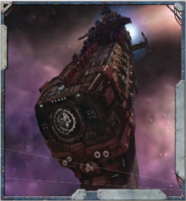

## Asteroid Field

The  shattered  remains  of  planets  or  the  leftover  debris from  stellar  nurseries,  asteroid  fields  are  vast  expanses  of drifting  rock.  A  successful Routine  (+10)  Pilot  (Space Craft)+Manoeuvrability  Test is  required  to  navigate  anasteroid  field.  Success  means  the  ship  passes  through  the asteroid field unharmed, but for every degree of failure errant chunks of space rock strike the ship, doing 1d5+1 [Damage](character-injury.md). The [Damage](character-injury.md) is cumulative, so if there are four degrees of failure, the ship will take 4d5+4 damage, ignoring [Void Shields](starship-essential-components.md). Any Tests using a ship's [Auger Arrays](starship-essential-components.md) within an asteroid field are made one step more difficult.

## Gravity Tides

Though planet-dwellers consider gravity a universal constant, experienced [Voidsmen](crew-voidsmen.md) know that it can be a harsh and fickle force. In systems with multiple stars or large gas giants, gravity can behave strangely-sometimes in seeming defiance to the laws  of  physics.  The  most  feared  phenomena  are  the  gravitational rip-tides found near gas giants during the conjunction of their larger moons, or at the midpoints of binary star-systems. Most avoid them, but a skilled-or insane-helmsman may try and use the flux to his advantage.

It takes a Hard  (-20)  Scrutiny+Detection  Test to spot a gravitational rip-tide on the ship's [Auger Arrays](starship-essential-components.md), and a Challenging  (+0)  Pilot  (Space  Craft)+Manoeuvrability Test to  avoid  one.  If  a  helmsman  chooses,  however,  he  can pilot his ship into the tide's gravity well while making a Hard (-20) Pilot (Space Craft)+Manoeuvrability Test .  Success means the helmsman has built up enough speed for his vessel to 'shoot the rapids'-using the speed generated by the tide's pull  to  shoot  out  the  other  side  at  tremendous  velocity .  For every degree of success, the GM should subtract a day from the travel time to the starship's destination. If the helmsman fails the test-or the starship fails to spot and avoid the tide-the ship takes 1d5 [Damage](character-injury.md) to its [Hull](starship-anatomy-detailed.md) Integrity ignoring [Armour](armour.md) or [Void Shields](components-void-shields.md), and must make a Hard (-20) Pilot (Space Craft)+Manoeuvrability  Test to  break  free.  If  it  fails  it takes another 1d5 [Damage](character-injury.md) and must make another test. This continues until the ship escapes or is destroyed.

## Ice Rings

The rings of gas giants are especially dangerous for ships, as they combine the aspects of an asteroid field and a nebula. To navigate them, a ship must make a Challenging (+0) Pilot (Space Craft)+Manoeuvrability Test and a Challenging (+0) Navigation (Stellar)+Detection Test . Failing the first test  by two or more degrees means the ship has blundered upon a particularly large chunk of ice-it takes 3d10 [Damage](character-injury.md) ignoring [Void Shields](starship-essential-components.md). Failing the second test means the ship is  delayed  by  a  day .  Any  Tests  using  a  ship's  auger  arrays within an ice ring are made two steps more difficult.

## Nebulae

A  nebula  is  a  vast,  dense  cloud  of  gas  and  dust  drifting in space. A successful Difficult (-10) Navigation (Stellar)+Detection  Test is  required  to  pass  through  a nebula on a proper course. Success means the ship makes its way through the nebula quickly, but failure means the ship is delayed. For every degree of failure, the ship must spend an extra day getting to its destination. In addition, the maximum weapon range for ships in a nebula is limited by the nebula's density (roll 3d10 at the start of battle, this is the furthest that all ship's [Sensors](starship-anatomy-detailed.md) and [Weapons](weapons-general.md) will operate). A ship making a Silent Running [Manoeuvre](rules-combat-overview.md) gains +30 to its [Manoeuvre](rules-combat-overview.md) Tests. Any Tests using a ship's [Auger Arrays](starship-essential-components.md) within nebula are made three steps more difficult.

## The Deep Void Run

'We set out from Footfall the day after the Sanguinala, well stored and stocked for a long [Run](rules-combat-overview.md) spinward to Lucien's Breath. Then [The Warp](warp-imperial-space-travel.md)-storms blew up and left us lost, [Blind](weapons-general.md), and adrift in an unnamed nebula. We ate our stores, the cargo, and were down to boot leather when ol' Three-Eye spotted the Astronomicon's glow. Good thing too, 'cause my mate Grax was starting to look mighty tasty!'

-Gunner's Mate Paytor Zoln of the trader-transport Reliant

Though The Imperium of Man claims that vast swaths of the galaxy are subservient to the Golden Throne of Terra, it would be  more  [Accurate](weapons-general.md)  to  describe  mankind's  dominion  as  tiny islands adrift in an enormous ocean. The space between stars is so huge that any claim of control is laughable, and so the majority  of  the  Imperium  remains  safe,  huddled  around  the fires of their stars.

However, it is  through  these  uncharted  depths  that  mankind's ships must travel. Even with the help of [Warp Drives](starship-anatomy-detailed.md)-and the immaterium is a fickle ally at best-travel between star systems can take as long as months, or even years. Beyond the bounds of the Imperium, where the fires of civilisation are even farther apart, the journeys could even take decades.

Generally,  a  starship  stocks  at  least  six  month's  food  and supplies  in  its  lockers-although  some  vessels  may  cram  an extra  month's  supplies  on  board  if  they  anticipate  a  long journey. These stores can be stretched to last longer, although at  a  cost  to  the  crew .  As  rations  dwindle,  fresh  water  grows scarce, and even the very air becomes thick and stale, sickness spreads easily and the tempers of the crew flare.

The consequences of long journeys are varying, and the GM is encouraged to invent hardships appropriate to the situation. Generally, for each month spent beyond the six month limit, the ship loses 2 Morale, and should suffer a misfortune such as the ones listed below:

Shipboard Sickness: The stale air and water ensure the easy spread of disease. A successful Medicae Test (difficulty at the GM's discretion) can contain sickness; otherwise the ship will suffer 1d5 [Damage](character-injury.md) to [Crew Population and Morale](starship-crew-population-morale.md) as it runs its course.

Scurvy: Scarce food makes for poor nutrition. Little can be done about the lack of proper nutrients, and the loss of  some  of  the  weaker  and  sicker  members  of  the crew will do 1d5 [Damage](character-injury.md) to Crew Population.

Weary  Machine  Spirit: Long  voyages strain the systems of a starship, sometimesto the breaking point. Without a full shipyard, repairs are often temporary.  The  GM  should  select  a  Component.  For  every month the ship spends at space without visiting a shipyard or civilised planet for proper repairs, a character must make a Tech-Use Test or the Component becomes damaged. These tests should become progressively harder.

Starvation: Few things are as worrying as a starship's food stores running low, both because of the threat of starvation and because it is likely to make the crew desperate and rebellious. Starvation is not something that should happen unless a ship has been at space for longer than a year or had its food stores drastically reduced for some reason. Once it begins, however, the ship will suffer 1 damage to Crew Population and 2 to Morale every day it does not find a habitable planet or other means to refill its food stores.

Of course, the threat of mutiny is also present when crews are confined within iron bulkheads without the warm sun or fresh air for months or years on end. This is represented by the Morale loss a ship suffers, but the GM should feel free to expand on this, inventing mutinous low-decks plots or even treacherous  mid-rank  officers  scheming  to  take  the  starship away from the characters.

## Extended Repairs

To survive amongst the deep void, starships must be largely self-sufficient. Nowhere is this more apparent than in the case of repairs and maintenance. Any true void-faring vessel has bunkers full of [Fuel](weapons-ammunition.md) and storage holds with additional supplies and  ship  [Components](starship-anatomy-detailed.md),  from  delicate  cogitator  circuitry  to massive adamantine plates to weld over [Hull](starship-anatomy-detailed.md) breaches. Though the  supplies  are  seldom  enough  to  completely  repair  a starship (especially if it has just come through a truly nasty engagement), they are enough to let the crew patch up the worst of their ship's injuries.

To  perform  extended  repairs,  a  starship  should  locate  a suitable anchorage, perhaps high orbit around a gas giant in a  deserted  star  system  or  nestled  against  a  large  asteroid  to avoid detection.  It's  crew  will  then  spend  several  weeks  on the repairs, determined beforehand by the ship's [Captain](rank-captain.md). For each week at repairs, the member of the crew directing them must make a Tech-Use Test, tallying the degrees of failure and success.  If  the  degrees  of  failure  outnumber  the  degrees  of success  at  the  end  of  the  specified  time  period,  the  repairs have failed. If the reverse is true, however, the repairs succeed, and the ship regains 1d5 points of Hull Integrity. This cannot take the ship's Hull Integrity above its maximum. In addition, a successful repair attempt restores all damaged, depressurised, and unpowered Components to full working order. Destroyed Components must be repurchased and replaced.

For a more thorough repair job, the starship will need to find an inhabited planet or space station -preferably a world with  a  reasonably  advanced  level  of  civilisation  (cavemen or  feudal  peasants  will  not  be  much  help  in  repairing  a starship). Once a suitable world has been located, the crew  can  pay  to  have  their  starship  repaired.  If any  Hull  Integrity  is  repaired,  any  damaged, depressurised,  and  unpowered  Components are restored to working order a well.

## Stellar Phenomena in Combat

Although a GM can simply use the rules as presented above  to  represent  stellar  phenomena  in  [Combat](rules-combat-overview.md),  a simpler way to do it is to simply increase the difficulty of all [Manoeuvre](rules-combat-overview.md) Tests by one step (and making the helmsman  perform  a Routine  (+10)  Pilot  (Space Craft)+Manoeuvrability Test whenever his starship makes the default Manoeuvre Action). Failure imposes the penalties already listed  for  each  phenomena, meaning that  a  simple  ship  duel  in  an  asteroid  field can suddenly become even more dangerous for those involved.

For  every  full  five  points  of  [Hull](starship-anatomy-detailed.md)  Integrity  restored,  the Explorers  must  make  an  [Acquisition](economy-acquisition-rules.md)  Test  at  a  -10  penalty (this  takes  into  account  the  rarity  and  quantity  of  materials and supplies). These tests are made sequentially - once one is failed, the the Explorers have temporarily exhausted their available  funds  and  must  either  wait  1d5  weeks  until  more money is available or seek repairs elsewhere (preferably where there is a better deal). Any [Acquisition Tests](economy-acquisition-rules.md) made to repair [Hull](starship-anatomy-detailed.md) Integrity do not count against the number of Acquisitions an Explorer may make in a game session.

For every point in Hull Integrity restored, the ship must spend  one  day  being  repaired.  New  Components  (whether to upgrade existing Components or replace destroyed Components)  are  purchased  as  normal,  and  require  1d5 additional days to install per Component.

*Source:* `Roguetrader Corerulebook, pages 227–229`
