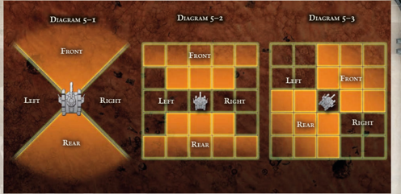

Space combat for small craft, fighters, and shuttles can easily use the same ruleset as aerial combat. Although these rules do not create scenarios that adhere to the laws of physics, they do make for cinematic and exciting dogfights and duels in the void.

There is one change, however, that represent the different environmental conditions of space. First, when turning, the 45 degree turn can be increased to a 90 degree turn by increasing the difficulty of the Piloting Test made that turn by one degree (or by making a Challenging (+0) Piloting Test if none would normally be required). The turn can be increased to 180 degrees by increasing the difficulty of the Piloting Test made that turn by two degrees (or by making a Hard (-20) Piloting Test if none would normally be required). Note that this makes the Immelmann Turn Manoeuvre superfluous, which it would be in space combat.

If a pilot in space combat fails his piloting test by less than three degrees, he makes his basic move as normal. If he fails by more than three degrees, he drifts out of control in a random direction, and must make a Challenging (+0) Piloting Test to recover. If he does not, he continues drifting in that direction (moving half his speed), until he passes a Challenging (+0) Piloting Test -which he may attempt once a turn.

Also, although space combat for fighters and shuttles uses AUs for weapon range and vehicle movement distances, this does not mean that an AU has to equal 200 metres in this situation. For those players and GMs who want their void dogfights to place at longer ranges, simply increase the range of a single AU to 1 kilometre, or 10 kilometres. This is one of the reasons for employing an abstract measurement system. (Of course, this may conflict with the ranges of some of the vehicle's weapons, but remember that weapons are able to fire further in a vacuum.)

## Roll Result

Before or after a flyer has moved, it may fire any or all of its weapons. Shooting in aerial combat obeys the following restrictions:

- Each pilot or gunner may only fire one weapon system on a flyer.  However,  pilots  may  make  manoeuvres  and still make shooting attacks.
- All shooting from a flyer or spacecraft suffers an additional  -20  to  Ballistic  Skill  Tests. The  only Attack  Actions  flyers  can  take  are  Attack,  Semi-Auto Burst,  and  Full-Auto  Burst  (see  page  237  in ROGUE TRADER ). These Actions provide their standard bonuses to shooting, which can mitigate the innate penalty (rapidfiring automatic guns have long been the best weapons in dogfights).
- Due to the distances and speeds involved in aerial combat, any shooting at a moving flyer does not gain any bonuses that normally would be awarded for the flyer's size.
- The firing arc of a weapon determines whether it may be used. This is determined in the same way as vehicle shooting (see below).
- Flyer and Spacecraft weapons have their range given in AUs and metres, as they can be used in aerial combat and  against  ground  targets.  Note  that  sometimes  the two ranges do not match up. This is done for both game purposes,  and  to  represent  that  it  is  easier  to  line  up longer shots in the open atmosphere (or open void).
- All the rules for firing ground weapons at range apply to  firing  aerial  vehicle  weapons,  including  bonuses  for firing  at  Short  Range,  and  penalties  for  firing  at  Long Range.  A  vehicle-mounted  weapon  cannot  be  fired  at more than four times the weapon's range.

SPACE COMBAT

*Source:* `Into the Storm, page 177`
