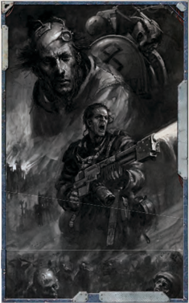
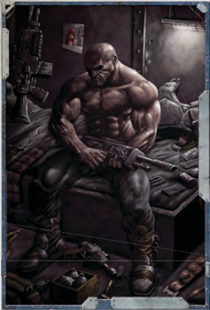
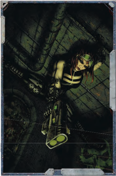
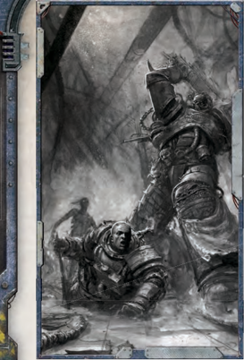
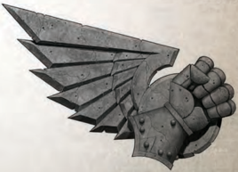

## Air of Authority

Prerequisites: Fellowship 30

The  Explorer  was  born  to  command,  either  motivating  or terrifying those under his [Charge](rules-combat-overview.md). On a successful Command Test,  the  Explorer  may  affect  a  number  of  targets  equal  to 1d10 plus his Fellowship Bonus. This talent has no effect on hostile targets, and only affects NPCs.

## Ambidextrous

### Prerequisites: Agility 30

This Talent does not represent true ambidexterity so much as sufficient  training  with  both  hands to make the distinction moot. The Explorer can use either hand equally well for any task, and does not suffer the -20 penalty for actions using his off hand.

Special: When  combined  with  a  Two-Weapon  Wielder Talent, the penalty for making attacks with both [Weapons](weapons-general.md) in the same Turn drops to -10.

## Armour of Contempt

### Prerequisites: Willpower 40

The  Explorer's  hatred  of  all  the  impure  armours  his  soul against malign  [Influence](economy-influence-rules.md). Whenever  the  Explorer  gains [Corruption Points](character-corruption.md), reduce the total by 1, to a minimum of 0. With a successful Willpower Test, taken as a Free Action, he may ignore the effects of accumulated [Corruption Points](character-corruption.md) for 1 Round.

## Assassin Strike

### Prerequisites: Agility 40, Acrobatics

The Explorer's natural agility and graceful martial forms turn him into a dervish of death on the battlefield. After making a melee [Attack](combat-attack-rules.md), a successful Acrobatics Test allows him to move at half rate as a Free Action. The Explorer's opponent does not receive a free attack resulting from this move. He may only take this additional move once per Round.

## Autosanguine

The  ancient  and  blessed  technology  of  the  Mechanicus  or some corrupt xeno tech flows through the Explorer's blood. These  miniscule  machines  repair  minor  injuries  and  speed [Healing](character-healing.md).  When  applying  [Healing](character-healing.md),  he  is  always  considered Lightly Wounded, and heals at an increased rate, removing 2 points of [Damage](character-injury.md) per day.

## Basic Weapon Training

[Talent Groups](talents-groups.md): Bolt, Las, Launcher, [Primitive](weapons-general.md), SP , Universal The Explorer has received Basic Weapon Training in a group of [Weapons](weapons-general.md), and can use them without penalty. The Universal group includes the Bolt, Las, Launcher, Melta, Plasma, and SP groups. When a character attempts to use a weapon he does not have the correct Weapon Training Talent for, he suffers a -20 penalty to any relevant Weapon Skill or Ballistic Skill Test.

## Bastion of Iron Will

Prerequisites: Psy Rating, Strong Minded, Will Power 40 The  Explorer's  sheer  willpower  and  psychic  focus  have become one and the same over years of practice and training, such that  their  combined  use  is  second  nature.  He  doubles his [Defensive](weapons-general.md) Psy Rating on any Opposed Test involving the Psyniscience Skill or [Psychic Techniques](psychic-techniques-list.md).

## Battle Rage

### Prerequisites: Frenzy Talent

Long  experience  and  indomitable  will  have  allowed  the Explorer to master the beast within, directing its rage while keeping a level head. He can [Parry](rules-combat-overview.md) while Frenzied.

## Berserk Charge

The  Explorer  has  learned  to  put  the  whole  force  of  his momentum behind his weapon blows. When he charges into [Combat](rules-combat-overview.md), few can stand before him. If he uses the [Charge](rules-combat-overview.md) Action, he gains a +20 bonus to Weapon Skill instead of +10.

## Binary Chatter

The  Explorer  has  optimised  his  use  of  Techna-Lingua  for controlling [Servitors](crew-servitors.md). He receives a +10 bonus to any attempt to communicate with [Servitors](crew-servitors.md), and any vessel upon which he serves receives a +1 bonus to Crew Morale due to increased [Servitor](equipment-tools.md) efficiency.

## Blademaster

Prerequisites: Weapon Skill 30, Melee Weapon Training The Explorer's mastery of bladed [Weapons](weapons-general.md) and their martial disciplines  has  no  peer.  When  attacking  with  any  bladed weapon,  including  chain  [Weapons](weapons-general.md),  power  axes,  and  power swords, he may re-roll one missed [Attack](combat-attack-rules.md) per Round.## Blessed Radiance

Prerequisites: Purge the Unclean, Divine Ministration, the Emperor Protects, or Wrath of the Righteous

The  Explorer's  holiness  shines  out,  allowing  all  to  see  the truth of their own souls. Where he treads, those who follow need have no [Fear](character-fear-and-damnation.md) of the [Darkness](combat-special-circumstances.md), nor suffer the predations of the blasphemous.

When spending a Fate Point to activate the Pure Faith Talent, the Explorer extends the immunity to [Daemonic](character-traits.md) presence to a number of targets equal to twice his Willpower Bonus.

As a free action, he may bestow a single Fate Point to an ally. If the Fate Point is unspent, it returns at the end of the encounter.

Upon burning a Fate Point, the Explorer and a number of allies equal to twice his Willpower Bonus become immune to the effects of [Daemonic](character-traits.md) presence, [Fear](character-fear-and-damnation.md) Tests, and [Corruption Points](character-corruption.md).  In  addition,  all  affected  targets  gain  a  +10  bonus on Tests made to resist psychic attack or any other form of psychic manipulation. In addition, affected targets take only half [Damage](character-injury.md) from psychic and warp sources. These benefits last for the duration of the encounter.

## Blind Fighting

### Prerequisites: Perception 30

Years  of  practice  and  development  of  the  Explorer's  other senses allows him to fight in close [Combat](rules-combat-overview.md) without the benefit of sight. This Talent reduces all penalties for obscured vision by half, permitting the character to fight in fog, [Smoke](weapons-general.md), or [Darkness](combat-special-circumstances.md).

## Bloodtracker

The Explorer is an experienced and cunning bounty hunter who commands the highest price for bringing in a quarry in dead or alive. When turning in a fugitive for bounty, the character's  group  gains  a  bonus  of  +100  Objective  Points towards Military or [Criminal](chargen-stage2-origin-path.md) [Objectives](economy-endeavours.md).

## Bulging Biceps

### Prerequisites: Strength 45

Whereas  a  weaker  man  would  be  sent  [Flying](combat-movement.md)  when  using powerful [Weapons](weapons-general.md), the Explorer's strong physique allows him to remain standing. He can fire heavy [Weapons](weapons-general.md) using SemiAuto Burst or [Full Auto Burst](rules-combat-overview.md) without bracing, and he does not suffer the -30 penalty for failing to brace.

## Catfall

### Prerequisites: Agility 30

Gymnastic ability and natural balance enables the Explorer to fall far greater distances without harm than the common man.  Whenever  he  falls,  he  may  take  an  Agility  Test  as  a Free Action. Success, and each additional Degree of Success, reduces the distance fallen by a number of metres equal to the character's Agility Bonus for the purposes of determining the [Damage](character-injury.md) from the fall.

## Chem Geld

Either  chemical  and  surgical  treatments  or  sheer  will  has rendered the Explorer immune to most mundane temptations. Seduction attempts against him automatically fail, and [Charm](equipment-gear.md) Tests increase their Difficulty by one level. Taking this Talent causes one Insanity Point.

## Cleanse and Purify

Prerequisites: [Flame Weapons](weapons-general.md) Training (Universal) Talent The  Explorer  can  control  the  flow  of  molten  promethium like no other, manipulating [Flame](weapons-general.md) like an old accomplice. The targets of his flamer attacks take a -20 penalty their Agility Tests to [Escape](combat-escape-action.md) its effects.

## Combat Formation

### Prerequisites: Intelligence 40

The Explorer has directed his comrades to Be Prepared for danger, planning out their actions for many contingencies if attacked. Before rolling [Initiative](starship-combat-rules.md), all other members of the group may choose to use the character's Intelligence Bonus for  all  [Initiative](starship-combat-rules.md)  rolls  rather  than  individual  Agility Bonuses.## [Combat](rules-combat-overview.md) Master

### Prerequisites: Weapon Skill 30

The  Explorer's  weapon  seems  to  be  everywhere  at  once, keeping  many  more  opponents  at  bay  in  close  [Combat](rules-combat-overview.md) than  even  skilled  fighters.  Opponents  gain  no  bonuses  for outnumbering the character in hand-to-hand [Combat](rules-combat-overview.md).

## Combat Sense

### Prerequisites: Perception 40

The  Explorer  has  the  ability  to  consciously  recognise  the proddings of his subconscious as it reacts to his preternaturally sharp senses, giving the character an edge that mere speed cannot match. He can use his Perception Bonus in place of his Agility Bonus when rolling [Initiative](starship-combat-rules.md).

## Concealed Cavity

The  character's  flesh  or  augmetics  conceals  a  small  compartment. This  might  be  a  pouch  hidden  under  a  flap  of  flesh,  or  a chamber fitted into a cybernetic enhancement. The Explorer may conceal one small item, no larger than a closed fist, within this cavity . Discovering this compartment requires success on a Difficult (-10) Search Test . If using a medicae scanner or auspex, the Difficulty is reduced to Ordinary (+10).

## Counter Attack

### Prerequisites: Weapon Skill 40

The  Explorer's  lightning  ripostes  are  things  of  beauty-if they were slow enough to be seen. After successfully Parrying an  opponent's  [Attack](combat-attack-rules.md),  he  may  immediately  make  an  attack against  that  opponent  using  the  [Parry](rules-combat-overview.md)  weapon  as  a  Free Action. This attack suffers a -20 penalty.

## Crack Shot

Prerequisites: Ballistic Skill 40

The Explorer can place his shots where they will inflict more harm: at creases, gaps, or joints in [Armour](armour.md). When his ranged [Attack](combat-attack-rules.md) causes [Critical Damage](character-injury.md), add +2 to the [Damage](character-injury.md).

## Crippling Strike

### Prerequisites: Weapon Skill 50

The Explorer can land blows precisely where they will inflict the  most  harm,  cutting  into  seams  or  hammering  at  weak points.  When  the  character's  melee  [Attack](combat-attack-rules.md)  causes  [Critical Damage](character-injury.md), add +4 [Damage](character-injury.md).

## Crushing Blow

Prerequisites: Strength 40

The Explorer has the ability to focus his entire body into  close  [Combat](rules-combat-overview.md)  attacks.,  adding  +2  to  [Damage](character-injury.md) inflicted in melee.

## Dark Soul

Prolonged exposure to [Darkness](combat-special-circumstances.md) has acted as an inoculation against all that is foul, granting the Explorer resilience against [Corruption](character-corruption.md). Whenever he makes a Malignancy Test, he takes half the normal penalty. See Chapter X: the Game Master for details on [Corruption](character-corruption.md).

## Deadeye Shot

### Prerequisites: Ballistic Skill 30

The  Explorer's  rock-steady  hand  and  hawk-like  eyesight make him a dreaded marksman. No target, however precise, can  [Escape](combat-escape-action.md)  his  crosshairs.  When  making  a  called  [Shot](weapons-ammunition.md),  the character takes a -10 penalty instead of -20.

## Decadence

### Prerequisites: Toughness 30

Through conditioning or long years of abuse, the Explorer has built up a tolerance to many inebriants, drugs, and chemicals. When drinking alcohol or similar beverages, he does not pass out until he has failed a number of Toughness Tests equal to twice his Toughness Bonus. The character also gains a +10 bonus to resist the effects of addiction.

## Die Hard

### Prerequisites: Willpower 40

Through either willpower or sheer stubbornness, the Explorer refuses to cross into shadow. When he suffers from [Blood Loss](character-injury.md), the character may roll twice to avoid death.

## Disarm

Prerequisites: Agility 30

The Explorer can wrest [Weapons](weapons-general.md) from an opponent's hands through practiced technique or brute force. If in close [Combat](rules-combat-overview.md), he  may  use  a  Full  Action  to  disarm  his  foe  by  making  an Opposed Weapon Skill Test. If he wins the Test, the opponent drops his weapon at his feet. If the character scores three or more Degrees of Success, he takes his opponent's weapon.

## Disturbing Voice

The  Explorer's  voice  has  particularly  baleful  or  menacing qualities,  causing  others  to  quail  before  it.  He  gains  +10 bonus  to  all  Intimidate  or  Interrogation  Tests  when  he employs this Talent, but suffers a -10 penalty to Fellowship Tests when dealing with others in a non-threatening manner, such as animals, children, or the easily startled.

## Divine Ministration

### Prerequisites: Pure Faith

The Explorer is  a  vessel  for  the  Emperor's  mercy  and  beneficence, his faith in his divinity can heal where no mere skill can.

When testing Medicae, the Explorer may spend a Fate Point to restore an amount of [Damage](character-injury.md) equal to his Willpower Bonusinstead of the normal amount. This amount is then added to and multiplied in the normal way depending on the type of care (see the Medicae [Description](career-path-format-guide.md) on page 83). In the case of first aid to a Lightly Wounded character, the Explorer restores an amount of [Damage](character-injury.md) equal to his Willpower Bonus plus his Intelligence Bonus.

The Explorer may spend a Fate Point to remove all Fatigue from a number of people equal to twice his Willpower Bonus.

The Explorer may burn a Fate Point to allow a character who has just died to have become Critically Wounded instead. This  power  has  its  limits  though,  (bullet  in  the  chest-yes, decapitation-no) and it's subject to the GM's approval. If a use of the Divine Ministration fails to work in this way, the Fate Point is not lost.

## Double Team

The  Explorer  has  the  experience  from  many  mass  combats and swirling melees under his belt. When [Ganging up](combat-special-circumstances.md) on an opponent, he gains an additional +10 bonus to Weapon Skill Tests. If both characters have this Talent, both gain an additional +10 bonus, for a total of +20. This bonus is in addition to the normal bonus gained from outnumbering opponents.

## Dual Shot

Prerequisites: Agility 40, Two-Weapon Wielder (Ballistic) The  Explorer's  skill  with  guns  is  such  that  he  can  target two shots on exactly the same point. When armed with two pistols, he can fire both simultaneously as a Full Action. Make a single Ballistic Skill Test, and if successful he hits his target with  both  shots.  As  the  character  is  firing  both  guns  as  a single [Attack](combat-attack-rules.md), he may take an [Aim](rules-combat-overview.md) Action before firing to get a +10 or +20 bonus to the BS Test, and a [Red-dot Laser Sight](weapons-upgrades.md) mounted on any one of the [Weapons](weapons-general.md) will provide its +10 bonus.  The  Explorer  does  not  suffer  from  the  normal  -20 BS penalty for wielding two [Weapons](weapons-general.md). If he hits, the target's [Armour](armour.md) gets applied as normal to both hits individually, but Toughness only counts once against the combined [Damage](character-injury.md) rolls  of  both  hits.  A  single  successful  [Dodge](rules-combat-overview.md)  Test  from  the target will avoid both shots.

## Dual Strike

Prerequisites: Agility 40, Two-Weapon Wielder (Melee) The Explorer's skill with [Melee Weapons](weapons-general.md) can place two blows together to maximise [Damage](character-injury.md). When armed with two [Melee Weapons](weapons-general.md), he can [Attack](combat-attack-rules.md) with both simultaneously as a Full Action. Make a single Weapon Skill Test, and if successful, he hits the target with both weapons. As he is swinging both weapons as a single attack, the character may take an [Aim](rules-combat-overview.md) Action before attacking to get a +10 or +20 bonus to the WS Test. He does not suffer from the normal -20 WS penalty for wielding two weapons. If he hits, the target's [Armour](armour.md) gets applied as normal to both hits individually, but Toughness only counts once against the combined [Damage](character-injury.md) rolls of both hits. A single successful [Dodge](rules-combat-overview.md) or Parry Test from the target will avoid both blows.

## Duty Unto Death

### Prerequisites: Will Power 45

The Explorer's will or faith can sustain him when his flesh is weak. He ignores the effects of [Injury](character-injury.md), [Fatigue](character-injury.md), and Stunning during [Combat](rules-combat-overview.md). This Talent does not prevent the Damage, but allows the character to temporarily ignore its effects for the duration of the [Combat](rules-combat-overview.md). Death still affects him normally.

## Electrical Succour

### Prerequisites: Mechanicus Implants

The Explorer can channel the sacred flow of energy from his [Potentia Coil](character-traits.md) or other energy source to replenish his flesh. Whilst in contact with a functioning, powered machine, or fully charged battery or power cell, the character may make an Ordinary  (+10)  Toughness  Test .  Success  removes one level of [Fatigue](character-injury.md) plus one additional level of [Fatigue](character-injury.md) for each additional Degree of Success. This takes one minute of meditation and ritual incantation.

## Electro Graft Use

### Prerequisites: Mechanicus Implants

The Explorer may use his Electro Graft to access data ports and commune with machine spirits. This grants a +10 bonus to Common Lore, Inquiry, or Tech-Use Tests whilst connected to a data port.

## Enemy

[Talent Groups](talents-groups.md): Academics, Adepta Sororitas, Adeptus Arbites, Adeptus Mechanicus, Administratum, [Astropaths](psychic-psyker-types.md), Ecclesiarchy, Government,  Imperial Guard, Imperial Navy, Inquisition, Military,  [Navigators](psychic-psyker-types.md),  Nobility,  Rogue  Trader,  Underworld, Workers

The opposite of Good Reputation on page 99, the Explorer is particularly despised by a specific social group or organisation. He suffers an additional -10 penalty to Fellowship Tests when dealing  with  this  group.  This  Talent  is  cumulative  with  the Rival Talent, for a total -20 penalty .

The GM and player may agree to award this Talent when appropriate to the adventure or [Campaign](rules-campaign.md). This Talent can be removed with an Elite [Advance](combat-advance-action.md) and the approval of the GM if the Acolyte has redeemed herself with the group in question.

## Energy Cache

### Prerequisites: Mechanicus Implants

The Explorer has learned to focus the power stored within his [Potentia Coil](character-traits.md) with greater efficiency. He no longer gains [Fatigue](character-injury.md)  from  using  Luminen  [Charge](rules-combat-overview.md),  Luminen  Shock,  and Luminen Blast.

## Enhanced Bionic Frame

Prerequisites: Machinator Array

The  Explorer's  already  impressive  bionic  body  structure  is steadied by a gyro-array guided by a targeting system linked to the machine-spirit. The Explorer gains the Auto-stablilised Trait (see page 364).

## Exotic Weapon Training

[Talent Groups](talents-groups.md): All [Exotic Weapons](weapons-general.md)

The Explorer has received Exotic Weapon Training in a single [Exotic](weapons-ammunition.md) Weapon, and can use it without penalty.

## Favoured by the Warp

Prerequisite: Willpower 35

Whenever a [Focus Power](psychic-techniques-list.md) Test results in [Psychic Phenomena](psychic-phenomena-table.md), the Explorer may roll twice on that table and take the more favourable result.

## Fearless

Through hard experience with horrifying situations, [Fear](character-fear-and-damnation.md) no longer commands the Explorer's actions. He is immune to the effects of [Fear](character-fear-and-damnation.md) and [Pinning](combat-special-circumstances.md), but disengaging from [Combat](rules-combat-overview.md)  or  [Backing](economy-backing.md)  down  from  a  fight  requires  a successful Willpower Test.

## Feedback Screech

Prerequisites: Mechanicus Implants

The  Explorer  can  haywire  his  vox  synthesisers,  causing  a hideous  blast  of  noise  that  shocks  and  distracts  others.  All unprotected creatures within a 30-metre radius who have the ability  to  hear  must  make  a  Willpower  Test  or  lose  a  Half Action on their next Turn as they involuntarily react to the cacophonous shriek.

## Ferric Lure

Prerequisites: Mechanicus Implants

The Explorer can cause an unsecured metal object within his field of vision to fly into his hand. The object may mass up to 1 kilogram per point of the character's Willpower Bonus, and must lie within a 20 metres. Using this Talent requires a Full Action and a successful a Willpower Test

## Ferric Summons

Prerequisites: Mechanicus Implants, Ferric Lure The Explorer can call an unsecured metal object to his hand as with Ferric Lure. But he may summon objects of up to 2 kilograms per point of his Willpower Bonus. The object may be up to 40 metres distant. The character must spend a Full Action and succeed on a Willpower Test to enact this rite.

## Flame Weapon Training

Talent Groups: Universal

The sight of flaming streams of promethium brings joy to the Explorer's heart and dread to his foes. He has mastered the art of a wide variety of flamer [Weapons](weapons-general.md). The Universal Talent group encompasses all non-[Exotic Weapons](weapons-general.md) with the Flame special quality.

## Foresight

Prerequisites: Intelligence 30

Logic  and  analysis  do  for  the  Explorer  what  Tarot  and  the bones  claim  to  do  for  the  superstitious  masses.  By  careful consideration of all the possible consequences, and examination of all evidence and information, he can identify the best path for success. By spending ten minutes studying or analysing a problem, he gains a +10 bonus to his next Intelligence Test.

## Frenzy

The Explorer's temper and passion boil just below the surface of his psyche, mostly held in check by his rational mind, but easily released when needed. If the character spends one full Round fuelling his anger - by flagellation, drugs, or other means-on  the  next  Round  he  goes  into  an  uncontrolled rage,  gaining  a  +10  bonus  to  Weapon  Skill,  Strength, Toughness,  and  Willpower,  but  suffering  a  -20  penalty  to Ballistic  Skill  and  Intelligence.  The  Explorer  must  [Attack](combat-attack-rules.md) the nearest enemy in melee [Combat](rules-combat-overview.md) if possible. If he is not engaged with the nearest enemy, he must move towards thatenemy and engage it if possible. The character will not take obviously suicidal actions such as leaping off a building in order  to  engage  someone  on  the  ground,  but  he  will  take any actions that have a reasonable opportunity to engage in melee with the nearest enemy. While Frenzied, he is immune to [Fear](character-fear-and-damnation.md), [Pinning](combat-special-circumstances.md), stunning effects, the effects of [Fatigue](character-injury.md), and he may not [Parry](rules-combat-overview.md), retreat, or flee. The Explorer must use the All-Out Attack Manoeuvre in melee combat if possible. He remains Frenzied for the duration of the combat. Unless the character has a Talent that allows him to do so, he may not use  Psychic  Techniques  whilst  in  Frenzy.  Some  beings  are either permanently Frenzied or can Frenzy at will.

## Furious Assault

### Prerequisites: Weapon Skill 35

The  Explorer's  speed  and  martial  prowess  allow  him  to land several blows where lesser combatants land one. If he successfully hits his target using the [All Out Attack](rules-combat-overview.md) Action, he may spend his Reaction to make an additional [Attack](combat-attack-rules.md) using the same bonuses or penalties as the original attack.

## Good Reputation

### Prerequisites: Fellowship 50, Peer

[Talent Groups](talents-groups.md): Academics, Adeptus Arbites, Adeptus Mechanicus,  Administratum,  [Astropaths](psychic-psyker-types.md),  Ecclesiarchy,  Feral Worlders, Government, Hivers, Imperial Guard, Imperial Navy, Inquisition, Middle Classes, Nobility, the Insane, Underworld, Void Born, Workers, Underworld

The  Explorer's  reputation  precedes  him  in  interactions  with a  specific  group  or  organisation,  opening  doors  that  might otherwise remain closed. The Explorer gains an additional +10 bonus to Fellowship Tests when dealing with this group. This Talent is cumulative with Peer, for a total bonus of +20.

## Guardian

### Prerequisites: Agility 40

Years  of  serving  as  a  bodyguard  allow  the  Explorer  to  put himself in the line of fire, or to take a murderous [Attack](combat-attack-rules.md) that was intended for another. He may sacrifice all of his Actions for the next Round to switch places with an ally within 2 metres (as long as there is no obstruction in the way). This may be done at  any  time,  even  interrupting  another  action.  The  character become the target of any attacks previously targeting the ally . This Talent may not be used more than once per [Combat](rules-combat-overview.md).

## Gun Blessing

Prerequisites: Mechanicus Implants

Using  the  Explorer's  sacred  ability  to  subtly  affect  ferrous materials,  he  can  un-jam  a  number  of  [Weapons](weapons-general.md)  equal  to  his Intelligence  Bonus,  so  long  as  they  are  within  a  10-metre radius. A successful Intelligence Test indicates the character has appeased the spirits of the [Weapons](weapons-general.md). This blessing requires a Full Action.

## Gunslinger

Prerequisites: Ballistic Skill 40, Two-Weapon Wielder The Explorer has trained with pistols for so long that they are like extensions of his own body, barely requiring conscious thought to [Aim](rules-combat-overview.md) and fire. When armed with two pistols, he reduces  the  penalty  for  Two-Weapon  Fighting  by  -10.  If he  also  possesses  the  Ambidextrous  Talent,  the  penalty  is reduced to 0.

## Hard Bargain

The Explorer's shrewd negotiations and bartering skills are without peer, and he has a knack for seeing opportunities for profit  where  others  see  nothing.  Whenever  Profit  Factor  is awarded for completing an Endeavour, you gain a bonus of +1 [Profit Factor](economy-wealth-and-acquisitions.md) to the group's total.

## Hard Target

### Prerequisites: Agility 40

Light  on  his  feet,  the  Explorer  dodges  and  weaves  as  he moves, skills learned from long years in the line of fire. When he selects the [Charge](rules-combat-overview.md) or [Run](rules-combat-overview.md) Actions, opponents suffer a -20 penalty to Ballistic Skill Tests made to hit the character with a ranged weapon. This penalty continues until the start of the Explorer's next Turn.

## Hardy

Prerequisites: Toughness 40

The Explorer's constitution rebounds quickly from shock or [Injury](character-injury.md). When undergoing medical treatment or [Healing](character-healing.md) from injures, he recovers [Damage](character-injury.md) as if Lightly Wounded.

## Hatred

[Talent Groups](talents-groups.md): Criminals, Rogue Trader (specific), Pirates, Xeno (specific), Psykers, Mutants

A group, organisation or race has wronged the Explorer in the past, fuelling this animosity. When fighting opponents of that group in close [Combat](rules-combat-overview.md), he gains a +10 bonus to all Weapon Skill Tests made against them.

## Heavy Weapon Training

[Talent Groups](talents-groups.md): Bolt, [Flame](weapons-general.md), Las, Launcher, Melta, [Plasma](weapons-general.md), Primitive, and SP

The  Explorer  can  employ  some  of  the  most  devastating weapons of the battlefield, able to vaporise single foes and strike  [Fear](character-fear-and-damnation.md)  into  the  machine  spirits  of  vehicles  everywhere. He can use weapons of the groups for which this Talent has been selected, choosing one new group each time. When a character attempts to use a weapon and he does not have the  correct  Weapon  Training  Talent  for,  he  suffers  a -20 penalty to any relevant Weapon Skill or Ballistic Skill Test.## Heightened Senses

[Talent Groups](talents-groups.md): Sight, Sound, Smell, Taste, Touch Either genetics or augmetics have made one of the Explorer's senses superior to others. When he gains this Talent, select one of the five senses. The character gains a +10 bonus to any Tests specifically involving this sense. Thus, Heightened Senses  (Sight)  would  apply  to  an  Awareness  Test  to  see  a distant flock of shale crows, but not to something as general as a Ballistic Skill Test with any ranged weapon or a Weapon Skill Test simply because the character is using his eyes.

## Hip Shooting

### Prerequisites: Ballistic Skill 40, Agility 40

The Explorer's prowess with ranged [Weapons](weapons-general.md) is such that he can  still  fire  accurately  without  using  the  sights.  As  a  Full Action, the character may both move up to his Full Move rate and make a single [Attack](combat-attack-rules.md) with a ranged weapon. This attack can only be a single [Shot](weapons-ammunition.md)-no automatic fire.

## Hotshot Pilot

### Prerequisites: Any Pilot Skill, Agility 40

The  Explorer  can  pilot  vehicles  as  if  they  were  extensions of  his  own  body.  He  may  only  select  this  Talent  if  he  has obtained one Pilot Skill as an Advanced Skill. The character treats all other Pilot skills as [Basic Skills](skills-basic-and-advanced.md), and receives a +10 bonus to the Pilot Skills he already possesses.

## Infused Knowledge

### Prerequisites: Intelligence 40

The Explorer has been infused with a great wealth of lore and knowledge, either through punishing noetic techniques or by arcane methods kept secret by the guardians of technology and knowledge. The Explorer treats all Common and Scholastic Lore Skills as untrained [Basic Skills](skills-basic-and-advanced.md). This Talent also provides a +10 bonus to any Tests involving Common or Scholastic Lore for which he already possesses the Skill.

## Improved Warp Sense

### Prerequisites: Warp Sense

The Explorer can now see [The Warp](warp-imperial-space-travel.md) and physical universe side by side, no longer taking any concentration on his part. After gaining this Talent, the character may use the Psyniscience Skill as a Free Action.

## Independent Targeting

### Prerequisites: Ballistic Skill 40

The Explorer has developed his peripheral vision and situational awareness to a point where he can fire in two directions within a split second. When firing two [Weapons](weapons-general.md) as part of a single action, the targets need not be less than 10 metres apart.

## Into the Jaws of Hell

### Prerequisites: Iron Discipline

The Explorer inspires loyalty and devotion in his followers such  that  they  would  follow  him  into  the  warp  or  on  a boarding  action  against  xeno  corsairs.  In  personal  [Combat](rules-combat-overview.md), while visible to them, they are immune to [Fear](character-fear-and-damnation.md) and [Pinning](combat-special-circumstances.md). While the character is known to be on board a ship in which he serves, the ship has a +5 bonus to its Morale.

## Inspire Wrath

### Prerequisites: Fellowship 30

The  Explorer  knows  just  the  turn  of  phrase  that  incites individuals or groups to rage against others. His rhetoric grants +20 to [Interaction](rules-interaction.md) Tests when inspiring hatred or anger, and double the number of individuals affected. This Talent can be combined with Master Orator to further increase the number of listeners affected.

## Iron Discipline

### Prerequisites: Willpower 30, Command

Iron sharpens iron. The Explorer does not coddle his crew, nor  motivate  them  through  kindness.  His  stalwart  [Example](rules-tests.md) and stern leadership exhorts them with steel instead of spoils. If the character is visible to his followers, either in person or via vox- or pict-caster, they may re-roll failed Willpower Tests made to resist [Fear](character-fear-and-damnation.md) and [Pinning](combat-special-circumstances.md). Iron Discipline can affect a number of targets equal to the character's Willpower Bonus, who must be under his command. PCs can benefit from Iron Discipline if the character with this Talent is the official group leader. If the Explorer is leading a boarding action (see page 215), he gains a +10 bonus to his Command Tests.

## Iron Jaw

### Prerequisites: Toughness 40

The  Explorer  has  taken  blows  from  Orks  and  given  back as  good  as  he  got.  He  can  bounce  back  from  most  strikes without ill  effects.  If  ever  [Stunned](character-injury.md),  a  successful  Toughness Test allows him to ignore the effects.

## Jaded

### Prerequisites: Willpower 30

The Explorer's wide travels have shown both wonders and horrors beyond the ken of most. The galaxy has thrown its worst at him and he has yet to flinch. Outrageous events, from death's horrific visage to xenos abominations, will not cause Insanity Points or [Fear](character-fear-and-damnation.md) Tests. Terrors of [The Warp](warp-imperial-space-travel.md) still affect the character normally.

## Leap up

### Prerequisites: Agility 30

A combination of athletic ability and speed allow the Explorer to spring to his feet in virtually any circumstance. He may stand up as a Free Action.## Last Man Standing

### Prerequisites: Nerves of Steel

The  Explorer  has  developed  a  sixth  sense  about  hails  of gunfire, allowing him to sense gaps and pauses in the lethal Rain. He is immune to [Pinning](combat-special-circumstances.md) by Pistols and Basic [Weapons](weapons-general.md), and adds +1 AP to the value of any [Cover](combat-special-circumstances.md) protecting him from ranged attacks.

## Light Sleeper

### Prerequisites: Perception 30

The slightest change in conditions or disturbance brings the Explorer from sleep to full awareness, remaining alert even in slumber. He is  always  assumed  to  be  awake,  even  when  asleep,  for the purposes of Awareness Tests or [Surprise](starship-combat-rules.md). Unfortunately, the character's sleep is not deep and can be frequently interrupted, resulting in a less-than-cheery disposition when awake.

## Lightning Attack

### Prerequisites: Swift Attack

The Explorer's speed with [Weapons](weapons-general.md) is legendary, allowing him to launch flurries of attacks. As a Full Action, the character may make three melee attacks on his Turn. The effects of this Talent replace  those  of  Swift  [Attack](combat-attack-rules.md)  rather  than  adding  to  them. The use of Lightning Attack may not be combined with Dual Strike.  If  the  Explorer  has  the  Two-Weapon  Wielder  Talent and is wielding two [Melee Weapons](weapons-general.md), he gets the advantage of Lightning Attack with only one of the weapons, and a single attack  with  the  other.  If  he  has  the  Two-Weapon  Wielder Talent and is wielding a melee weapon in one hand and a gun in the other, he gets the advantage of Lightning Attack with the melee weapon and a single attack with the gun.

## Lightning Reflexes

The  Explorer  always  expects  trouble, even  in  the  most innocuous situations, allowing him to act quickly when needed. The character adds twice his Agility Bonus when rolling for [Initiative](starship-combat-rules.md). If he has Unnatural Agility, add +1 to the multiplier before factoring the bonus into the [Initiative](starship-combat-rules.md) roll.

## Litany of Hate

### Prerequisites: Hatred (any)

The Explorer's belief in the [Righteousness](character-fear-and-damnation.md) of his hatred is so ingrained that he can rouse others to join his crusade. As a Full Action, the character may make a [Charm](equipment-gear.md) Test to extend the effects of his Hatred Talent to any allies in the immediate vicinity. Success on the Test confers a +10 bonus to Weapon Skill when fighting hated foes to one target per point of the Explorer's Fellowship Bonus. The effects last for the duration of the encounter.

## Logis Implant

The Explorer may use analytical circuits to calculate trajectory and  [Reactions](rules-combat-overview.md)  to  a  preternatural  extent.  His  ability  to  read possible  outcomes  lets  him  anticipate  the  movement  of  his opponents. By using his Reaction for the Round, the character may make a Tech-Use Test to make use of this Talent. He gains a +10 bonus to all Weapon Skill and Ballistic Skill Tests until the end of his next Turn. The Explorer must pass a Toughness Test when he uses this ability or gain a level of [Fatigue](character-injury.md).

## Luminen Blast

### Prerequisites: Mechanicus Implants

The  Omnissiah  has  blessed  the  Explorer  with  augmetic conduits that parallel the bones of his arms. By reciting the proper litany, he can channel the energy stored in his [Potentia Coil](character-traits.md) down these channels and direct it at his enemies. Success on a Ballistic Skill Test allows him direct this energy against a single target within 10 meters. The target takes 1d10 plus the  Explorer's  Willpower  Bonus  in  Energy  [Damage](character-injury.md).  The character must pass a Toughness Test when using this ability or gain a level of [Fatigue](character-injury.md).

Talent Use: Half Action [Attack](combat-attack-rules.md)

## Luminen Charge

### Prerequisites: Mechanicus Implants

The  Explorer  has  mastered  the  union  between  his  holy mechanical  elements  and  his  mortal  flesh,  allowing  the former  to  power  the  latter.  With  a  successful  Toughness Test  the  character  may  [Recharge](weapons-general.md)  or  power  machinery  with his internal coils. This requires one minute of meditation and ritual incantation. The difficulty of the Toughness Test varies depending on the nature of the powered system:

| Difficulty       | [Example](rules-tests.md)                                                   |
|------------------|-----------------------------------------------------------|
| Ordinary (+10)   | Simple Power Cell, Illuminator                            |
| Challenging (+0) | Weapon [Charge Pack](weapons-ammunition.md), Data Slate, [Bridge](starship-anatomy-detailed.md) Terminal           |
| Difficult (-10)  | Hotshot [Charge Pack](weapons-ammunition.md), Shuttle Electronics, Servo-Skull     |
| Hard (-20)       | Lascannon Charge Pack, [Servitor](equipment-tools.md), [Bridge](starship-anatomy-detailed.md) Hololith          |
| Very Hard (-30)  | Ship's Cogitator Core, Reactor Machine Spirit, Xenos Tech |

The  Explorer  must  pass  a  Toughness  Test  when  he  uses this ability or gain a level of [Fatigue](character-injury.md). No matter the power bestowed by the Omnissiah, some systems are either too large or too alien for this Talent-the GM will be the final judge.

## Luminen Shock

### Prerequisites: Mechanicus Implants

The power of the Explorer's [Potentia Coil](character-traits.md) flows through a network of inductors within his flesh, allowing him to channel this energy into his blows. In close [Combat](rules-combat-overview.md), a successful Weapon Skill Test or [Grapple](rules-combat-overview.md) delivers the shock. The Luminen Shock inflicts 1d10+3 points of Energy [Damage](character-injury.md) with the ShockingQuality (see page 116). The Explorer must pass a Toughness Test when using this ability or gain a level of [Fatigue](character-injury.md). Talent Use: Half Action [Attack](combat-attack-rules.md)

## Machinator Array

Prerequisites: Mechanicus Implants

The Explorer has returned to the crèches of the Mechanicus so they can bring him closer to the most holy of forms, adding an extensive machinator array to his existing augmetics. The Explorer's Strength and Toughness [Characteristics](starship-anatomy-detailed.md) are increased by +10, and his Agility and Fellowship are reduced by -5. His mass increases to three times that of a normal person, and he may no longer stay afloat or swim in water or similar liquids. The character may mount a single pistol type or close [Combat](rules-combat-overview.md) weapon on any Ballistic Mechadendrites he posseses. He must still have the proper Talent to use the mounted weapon.

## Maglev Grace

### Prerequisites: Mechanicus Implants

The Explorer stitches augmetic coils throughout the systems or flesh of his legs, granting him the ability to float a short distance above the ground. Using a Half Action, the character may hover 20 to 30 centimetres off the ground for a number of  minutes  equal  to  1d10  plus  his  Toughness  Bonus.  The Explorer must employ a Half Action each round to maintaining the rite, and may use the other actions to move normally. He may activate this rite to slow his rate of descent when [Falling](character-injury.md), reducing all [Falling](character-injury.md) Damage to 1d10+3 Impact. Each use of Maglev Grace exhausts the power stored in the [Potentia Coil](character-traits.md), and cannot be reused until the Coil has been recharged.

## Maglev Transcendence

Prerequisites: Mechanicus Implants, Maglev Grace The Explorer has proven his devotion to the Machine God by lacing augmetic coils through every portion of his body. Using a Half Action, he may hover 20-30 centimetres off the ground for  a  number  of  minutes  equal  to  2d10  plus  his  Toughness Bonus. The Explorer must employ a Half Action each round to concentrate on maintaining this rite, but any Move Action allows him to move up to his running speed. He can slow his rate of descent when [Falling](character-injury.md) so long as this rite is active when he reaches the ground, taking no [Falling](character-injury.md) damage. Each time he enacts this rite, it drains 50% of his [Potentia Coil](character-traits.md).

## Marksman

Prerequisites: Ballistic Skill 35

The  Explorer's  steady  hand  and  eagle  eye  allows  him  to keep  crosshairs  steady  on  any  target,  regardless  of  range. Distance is no protection against his fire. The Explorer suffers

no penalties for Ballistic Skill Tests at long or extended range.

## Master and Commander

Prerequisites: Intelligence 35, Fellowship 35

There  can  be  only  one  [Commander](rank-commander.md)  of  a  vessel,  and  the Explorer's guiding hand, stern judgment, and sage leadership have  captained  his  crew  through  countless  conflicts.  By spending a Half Action in [Combat](rules-combat-overview.md) to direct the efforts of his allies, none of them suffer the penalties for [Ganging up](combat-special-circumstances.md) until his next Turn. If defending against a boarding action, a Half Action directs  the  efforts  of  his  armsmen,  granting  them  a +10 bonus in [Combat](rules-combat-overview.md) (see page 215).

## Master Chirurgeon

### Prerequisites: Medicae +10

The Explorer's advanced medical skills enable him knit flesh with  deft  mastery.  His  exceptional  education  in  use  of  the Narthecium,  Med-Slate,  and  supplemental  drugs  gives  his patients an enormous advantage. The Explorer gains a +10 bonus on all Medicae Tests. If treating a Heavily or Critically Wounded patient, a successful Test heals 2 points of [Damage](character-injury.md) instead of 1. If the patient is in danger of losing a limb from a  Critical  Hit  (see Chapter  IX:  Playing  the  Game ),  the Explorer provides him with a +20 bonus to the Toughness Test to prevent limb loss.

## Master Enginseer

Prerequisites: Tech-Use  +20,  Mechanicus  or  [Explorator](career-explorator.md) Implants

The  Explorer's  knowledge  of  starships  and  their  machine spirits surpasses all his planet-bound brethren. The character can almost feel the [Plasma](weapons-general.md) pulsing through the ship's conduits as if it were his own veins. He may spend a Fate Point for automatic success on a Tech-Use Test for enhancement, repair, or upgrade of starship systems, taking the minimum amount of time possible on the task.

## Master Orator

### Prerequisites: Fellowship 30

The Explorer has learned the techniques required to [Influence](economy-influence-rules.md) large audiences. His Fellowship Tests and Fellowship-based Skill Tests affect 10 times the normal number of targets.

## Mechadendrite Use

Prerequisites: Explorator [Talent Groups](talents-groups.md): Weapon, Utility

Though there are many different types of Mechadendrite, this Talent divides them into two broad categories:

Weapon: Mechadendrites of this type end in either ranged or close [Combat](rules-combat-overview.md) [Weapons](weapons-general.md), and have the supplemental support and strength necessary for [Combat](rules-combat-overview.md).

Utility: Including such varied types as Machine Spirit Interface, Manipulator,  Medicae,  Utility,  Optical,  and  countless  others, these Mechadendrites generally require less hardy mountings, but all interface with the Cyber Mantle in a similar manner.## Meditation

The  Explorer  has  mastered  his  body  and  its  reactions  by prayer to the Emperor, shutting down unnecessary functions to refresh his body and mind. Success on a Willpower Test and 10 minutes without interruptions removes one level of [Fatigue](character-injury.md).

## Melee Weapon Training

### Talent Groups: Primitive, Universal

The  Explorer  has  trained  extensively  with  hand-to-hand weaponry,  becoming  proficient  in  the  use  of  virtually  all hand-held close [Combat](rules-combat-overview.md) arms. The universal group includes the Chain, Shock, and Power groups, and allows proficient use off all those weapon types. When a character attempts to use a weapon he does not have the correct Weapon Training Talent for, he suffers a -20 penalty to any relevant Weapon Skill or Ballistic Skill Test.

## Mighty Shot

Prerequisites: Ballistic Skill 40

The Explorer knows the weak points in every [Armour](armour.md) and material, and has the skill to place shots exactly where they will  do  the  most  [Damage](character-injury.md).  He  adds  +2  to  [Damage](character-injury.md)  with  a ranged weapon.

## Mimic

Vox synthesisers, training or innate abilities allow the Explorer to accurately mimic the voice of another. He must study the voice patterns of his target for at least one hour for proper imitation, and speak the same Language. He cannot accurately copy the voice of a xeno due to the difference in physiology and the subtle complexities of most alien languages. Listeners must succeed on a Difficult (-10) Scrutiny Test to penetrate the deception. If the character studies used vox recordings, or comm-link conversations rather than in-person observation, the Difficulty of the Scrutiny Test is reduced to Challenging (+0).  His  deception  automatically  fails  if  the  listener  can clearly see he is not the imitated individual.

## Navigator

The Explorer was born with [The Navigator Gene](navigator-gene-rules.md), either of the Navis Nobilite or in the shadowed ranks of the unlicensed. [The Warp Eye](navigator-warp-eye.md) stares balefully from his forehead, allowing him to perceive the ebbs and flows of the empyrean. For more details, see Chapter 7: [Navigator Powers](navigator-powers-list.md) .

## Navigator Power

### Prerequisites: Navigator

The  Explorer's  trainers  or  natural  ability  allows  use  of  an additional  Navigator  Power.  This  Talent  may  be  chosen multiple times, each selection granting a new Power.

## Nerves of Steel

Long years on the battlefield enable the Explorer to remain calm as fire impacts all around. He may re-roll failed Willpower Tests to avoid or recover from [Pinning](combat-special-circumstances.md).

## Orthoproxy

A liturgical circuit has been implanted within the Explorer's skull,  allowing  him  to  focus  on  the  prayers  recited  by  the proxy unit when his mental fortitude is in peril. He receives a +20 bonus to Willpower Tests made to resist mind control or interrogation.

## Paranoia

The Explorer knows that danger lurks behind every corner and  knows  the  galaxy  will  hit  him  as  soon  as  he  lets  his guard down. The character gains a +2 bonus on [Initiative](starship-combat-rules.md) rolls, and the GM may secretly Test his Perception to notice hidden threats. The price of his eternal vigilance is a twitchy disposition and the inability to relax.

## Peer

Prerequisites: Fellowship 30 Talent  Groups: Academics,  Adeptus  Arbites, Adeptus Mechanicus, Administratum, [Astropaths](psychic-psyker-types.md),  Ecclesiarchy,  Feral  Worlders,Government,  Hivers,  Inquisition,  Middle  Classes,  Military, Nobility, the Insane, Underworld, Void Born, Workers.

The Explorer is [Adept](rules-allies-enemies-rivals.md) at dealing with a particular social group or organisation. He gains a +10 bonus to all Fellowship Tests when interacting with the chosen group.

## Pistol Weapon Training

Talent Groups: Primitive, Universal

The Explorer has practiced with nearly every single-handed ranged  weapon  within  the  confines  of  the  Imperium,  and no  small  number  without.  The  Universal  group  confers proficiency with most pistol [Weapons](weapons-general.md), including the Bolt, Las, Launcher, Melta, [Plasma](weapons-general.md), and SP groups. When a character attempts to use a weapon he does not have the correct Weapon Training Talent for, he suffers a -20% penalty to any relevant Weapon Skill or Ballistic Skill Test.

## Polyglot

Prerequisites: Intelligence 40, Fel 30

The Explorer has an innate ability to derive meaning from unknown languages and make himself understood using this intuitive grasp. He treats all languages as [Basic Skills](skills-basic-and-advanced.md). This is not the same as true knowledge of the Language, and tests using this Talent suffer a -10 penalty due to the simplistic nature of translation.

## Precise Blow

Prerequisites: Weapon Skill 40, Sure Strike

The Explorer's eye, hand, and weapon act seamlessly together, placing  blows  exactly  where  the  attacker  intends.  When making a [Called Shot](rules-combat-overview.md) with a melee weapon, the Explorer does not incur the -20 penalty.

## Prosanguine

Prerequisites: Autosanguine

Through the Explorer's iron will or via appeals to the  Omnissiah,  he  is  able  to  speed  the  function  of  his Autosanguinators. By spending 10 minutes in meditation and ritual incantation, the character may make a Tech-Use Test, and if successful, remove 1d5 points of [Damage](character-injury.md). If he rolls a 96-100, he overstrains his implants, losing the ability to use them for one week. During that week, the Explorer may use neither the Autosanguine nor Prosanguine Talents.

## Psy Rating

The  Explorer  is  a  psyker,  and  his  power  in  game  terms is  rated  on  a  scale  of  1  to  10,  where  Psy  Rating  1  is  the lowest  to  warrant  the  attentions  of  the  Scholastia  Psykana and the Black Ships,  and  a  rating  of  10  represents  one of  the  most  powerful  of  the  entire  human  sphere. An  Astropath  Transcendent  begins  play  with  Psy Rating 2. See Chapter Vi: Psychic Powers for detailed rules on the game mechanics of this ability . Increasing a character's Psy Rating represents  that  character  unlocking  more  of  his  psychic potential and becoming more and more powerful. Note that Psy [Ratings](crew-ratings.md) in Rogue TRadeR do  not  automatically  grant additional  Psychic  Powers.  A  higher  Psy  Rating  indicates a  more  powerful  psyker.  An  Explorer  can  take  this  Talent multiple times; each time it is taken, his current Psy Rating increases by 1.

## Psychic Discipline

[Talent Groups](talents-groups.md): Psy Rating

The Explorer gains access to a new Psychic Discipline, and may  select  techniques  from  this  new  field  of  study  as  his abilities  increase.  Psykers  may  access  a  maximum  of  three separate  Disciplines.  For  further  details,  see Chapter  VI: Psychic Powers .

## Psychic Technique

[Talent Groups](talents-groups.md): See [Psychic Techniques](psychic-techniques-list.md)

Either through training or natural development, the Explorer has learned an additional Psychic Technique. Once this Talent has been selected, the Explorer may select one new Psychic Technique  in  any  Discipline  he  possesses  with  an xp cost equal to or lower than the Talent's xp cost. Note that when a Psychic Technique is selected, the Explorer does not have to spend more xp -he spent the required xp when he purchased the Talent. This Talent may be chosen multiple times, each selection granting an additional Technique.

## Pure Faith

The  Explorer's  faith  in  the  God  Emperor  of  Mankind,  his divine power and Grace, is total and complete. This faith wraps around him and suffuses his soul, armouring him against the foul influences and [Weapons](weapons-general.md) of the heretic. Pure Faith provides all of the following benefits:

The Explorer is always immune to the effects of [Daemonic](character-traits.md) Presence including the negative modifiers to his Willpower.

The Explorer may spend a Fate Point to not take [Fear](character-fear-and-damnation.md) Tests, not acquire Insanity Points, and not gain any [Corruption Points](character-corruption.md). These safeguards remain for the duration of the encounter.

The Explorer may burn a Fate Point to resist the effects of any single [Daemonic](character-traits.md) or psychic [Attack](combat-attack-rules.md), effectively allowing him to emerge unscathed as if by a miracle.

## Purge the Unclean

Prerequisites: Pure Faith

The Explorer can focus his faith through words, gestures, and force of will such that a daemon may be cowed or cast out by the power of the Emperor.

As a half action, the Explorer may spend a Fate Point to intone holy words to repel a warp entity. Make an opposed Willpower Test against [The Warp](warp-imperial-space-travel.md) entity. If the Test succeeds, [The Warp](warp-imperial-space-travel.md) creature is repelled a distance of metres away equal to twice the character's Willpower Bonus. It cannot approach closer than this distance for 2d5 [Rounds](rules-combat-overview.md).

As a full action, the Explorer may spend a Fate Point tospeak the rites of exorcism and force out a possessing warp entity from its host. Make an opposed Willpower Test against the warp entity. If the Test succeeds, the warp entity is driven out of the thing it was possessing and manifests in an adjacent space to its former host. The warp entity may not possess the host again for a number of hours equal to twice character's Willpower Bonus.

As a full  action,  the  Explorer  may  burn  a  Fate  Point  to chant the litanies of detestation to purge a warp entity from reality . He must be actually confronting the thing and not just thinking about it. Test the character's Willpower; if successful, he  deals  [Damage](character-injury.md)  equal  to  his  Willpower  Bonus,  plus  his Willpower  Bonus  for  each  Degree  of  Success.  On  a  failed Test, the warp creature takes [Damage](character-injury.md) equal to the character's Willpower  Bonus.  Damage  inflicted  by  this  method  is  not reduced by the creature's Toughness or [Armour](armour.md).

## Quick Draw

The Explorer has practised so frequently with his [Weapons](weapons-general.md) that they practically leap into his hands, [Ready](rules-combat-overview.md) for action. He can [Ready](rules-combat-overview.md) as a Free Action when armed with a Pistol or Basic class ranged weapon, or a melee weapon that can be wielded in one hand.

## Rapid Reaction

### Prerequisites: Agility 40

The  Explorer  has  honed  his  [Reactions](rules-combat-overview.md)  to  a  razor's  edge, allowing him to act while most stand dumbfounded. When surprised or ambushed, a successful Agility Test allows him to act normally.

## Rapid Reload

The  practice  bays  aboard  the  Explorer's  vessel  are  like  a second  home,  and  he  has  reloaded  countless  magazines  or power cells for his [Weapons](weapons-general.md) until he can replace them with his eyes closed. The Explorer halves all [Reload](rules-combat-overview.md) times, rounding down. Thus, Half Action [Reload](rules-combat-overview.md) become a Free Action, a Full Action reload becomes a Half Action, and so on.

## Renowned Warrant

The  Explorer's  Warrant  of  Trade  is  ancient  and  hallowed, signed  before  the  Imperium  knew  of  the  Expanse,  and garners  the  respect  of  Merchants  and  officials  alike.  The character gains a +10 bonus to [Interaction](rules-interaction.md) Skill Tests with those who understand the importance of the warrant, such as other traders and Imperial officials.

## Resistance

[Talent Groups](talents-groups.md): Cold, [Fear](character-fear-and-damnation.md), Heat, Poisons, [Psychic Techniques](psychic-techniques-list.md)

The  Explorer's  background,  experience,  training,  exposure, or plain stubbornness has inured him to a particular type of hardship. Each time the Explorer selects this Talent, choose one group. He gains a +10 bonus when making Tests to resist the effects of this group. The GM may wish to approve certain choices or have them justified by the character's past.

## Rite of Awe

### Prerequisites: Explorator

The Omnissiah has augmetically blessed the Explorer's voice box, allowing him to recite infrasonic liturgies that trigger awe and [Fear](character-fear-and-damnation.md). All humans, regardless of their ability to hear, within a 50-metre radius feel a sense of dread and take a -10 penalty to  their  next  Skill  Test.  Characters  may  ignore  these  effects with a successful Willpower Test. Whilst incanting the rite, the character may not talk or communicate with others. The rite requires two minutes of litanies, and it is considered very bad form to break off the recitation before completion. Humans without auditory implants cannot hear infrasonic sound, and though still affected, will not know the Explorer is speaking.

## Rite of Fear

### Prerequisites: Explorator

The Explorer's infrasonic dirges cause terror in the weak. All humans, regardless of their ability to hear, within a 50-metre radius  treat  the  character  as  if  he  has  a  [Fear](character-fear-and-damnation.md)  Rating  of  1. While incanting the dirge, he may not communicate in any other  way.  The  rite  requires  two  minutes  of  chanting,  and most  would  not  consider  halting  the  incantations  prior  to their  completion.  Humans  without  auditory  augmentation cannot hear infrasonic sound, and though still affected, will not know the Explorer is speaking.

## Rite of Pure Thought

### Prerequisites: Explorator

The Explorer has replaced the creative half of his brain with sacred [Cranial Circuitry](character-traits.md). He can no longer feel emotion, and instead  embraces  the  crystal  purity  of  logic,  making  him immune  to  [Fear](character-fear-and-damnation.md),  [Pinning](combat-special-circumstances.md)  and  any  effects  that  stem  from emotional  disturbance.  The  GM  will  remove  any  Mental Disorders that  no  longer  apply,  and  grant  appropriate  new ones of equal severity. The character's fellow Explorers may find  him  somewhat  cold,  though  other  followers  of  the Omnissiah will rejoice in his newfound freedom.

## Rite of Sanctioning

### Prerequisites: Psy Rating, Special

The Explorer has been brought before the Emperor and has received a miniscule fraction of His awesome strength, making the character far more resistant to the predations of [The Warp](warp-imperial-space-travel.md). Choose one result on the [Psychic Phenomena](psychic-phenomena-table.md) chart on page 160 (other than Perils of [The Warp](warp-imperial-space-travel.md)). When rolling for [Psychic Phenomena](psychic-phenomena-table.md), the Explorer may substitute his trademark result for the effect rolled on the table, so long as he does not roll Perils of the Warp.

## Rival

Talent  Groups: Academics, Adepta Sororitas, Adeptus Arbites,  Adeptus  Mechanicus,  Administratum,  [Astropaths](psychic-psyker-types.md), Ecclesiarchy,  Government,  Imperial  Guard,  Imperial  Navy, Inquisition, Middle  Class,  Military, [Navigators](psychic-psyker-types.md),  Nobility, Rogue Traders, Underworld, Workers

Essentially the opposite of Peer on page 103, this Talent represents aggressive competition and some animosity with a particular social group or organisation. The Explorer suffers a -10 penalty to all Fellowship Tests when interacting with the group in question.

The GM and player may agree to award this Talent when appropriate to the storyline. This Talent may be removed with an Elite [Advance](combat-advance-action.md) and the approval of the GM if the player has taken suitable actions to earn the trust of the group.

## Sharpshooter

Prerequisites: Ballistic Skill 40, Deadeye Shot

The Explorer's steady hand and eagle eye allow him to place shots exactly where he wants. When making a [Called Shot](rules-combat-overview.md), he does not incur the normal -20 penalty. This Talent replaces the effects of Deadeye Shot.

## Sound Constitution

The Explorer gains an additional Wound. He may purchase this  Talent  multiple  times  in  accordance  with  his  [Career](chargen-stage2-origin-path.md) Advances.  In  this  case  note  the  number  of  times  it's  been taken after the Talent, such as Sound Constitution 3.

## Sprint

The  Explorer's  fleet  feet  can  propel  him  faster  than  his comrades. When taking the Full Move Action, the character can  move  an  extra  number  of  metres  equal  to  his  Agility Bonus.  When  taking  the  [Run](rules-combat-overview.md)  Action,  he  may  double  his movement for one Round. The Explorer gains one level of [Fatigue](character-injury.md) if he uses this Talent two [Turns](rules-combat-overview.md) in a row.

## Step Aside

### Prerequisites: Agility 40, Dodge

The  Explorer  can  sway  his  body  out  of  the  path  of  an [Attack](combat-attack-rules.md), causing it to pass through thin air. He may make an additional [Dodge](rules-combat-overview.md) once per Round. In effect this gives him a second Reaction that may only be used to [Dodge](rules-combat-overview.md), allowing two Dodges in a Turn. However, he may still only attempt a single Dodge against one attack.

## Strong Minded

Prerequisites: Willpower 30, Resistance (Psychic Techniques) The Explorer's mind acts as a fortress against psychic attacks. He  may  re-roll  failed  Willpower  Tests  to  resist  any  [Psychic Techniques](psychic-techniques-list.md) that affect his mind. [Psychic Techniques](psychic-techniques-list.md) that have a  physical  effect,  such  as  Telekinesis,  are  unaffected  by  this Talent.

## Sure Strike

### Prerequisites: Weapon Skill 30

The Explorer can direct his blows far better than most, giving him some control over where they land. When determining hit  location  for  a  melee  [Attack](combat-attack-rules.md),  he  may  use  the  dice  as  he rolled them or reverse them, choosing the location he prefers. For [Example](rules-tests.md), if Vidor rolls a 37 to hit an [Eldar Corsair](faction-xenos-overview.md), this would ordinarily strike the Right Leg (73). However, since he has the Sure Strike Talent, he could choose to hit the corsair in the Body (37).

## Swift Attack

### Prerequisites: Weapon Skill 35

The Explorer's speed and martial ability allow him to land flurries of blows. As a Full Action, he may make two melee attacks on his Turn. If he has the Two-Weapon Wielder Talent and is wielding two [Melee Weapons](weapons-general.md), he gets the advantage of Swift Attack with only one of the [Weapons](weapons-general.md), and a single [Attack](combat-attack-rules.md)  with  the  other.  If  he  has  the  Two-Weapon  Wielder Talent and is wielding a melee weapon in one hand and a gun in the other, he gets the advantage of Swift Attack with the melee weapon and a single attack with the gun.## Takedown

As a Half Action the Explorer may declare that he is attempting a takedown before testing Weapon Skill. If he hits and would have done at least 1 point of [Damage](character-injury.md), then ignore the [Damage](character-injury.md) and the opponent must make a Toughness Test or be stunned for 1 Round. When performing a Stun Action, the character does not suffer a -20 penalty to his Weapon Skill.

## Talented

[Talent Groups](talents-groups.md): Any skill

The Explorer has a natural affinity for a particular Skill. He chooses any one Skill and gains +10 bonus to Tests made using that Skill.

## Technical Knock

Prerequisites: Intelligence 30

Either through the ease of long practice, or the proper ritual to appease a weapon's machine spirit, the Explorer can clear stoppages  in  [Weapons](weapons-general.md).  He  may  un-jam  any  gun  as  a  Half Action, but may only perform this rite on one weapon per Round. He must touch the weapon to enact this rite.

## The Emperor Protects

Prerequisites: Pure Faith

The  power  of  the  Emperor  flows  through  the  Explorer, protecting the faithful and emboldening them to heroism in the face of terrible things.

By spending a Fate Point, the character grants himself and a number of allies equal to his Willpower Bonus immunity to the effects of [Fear](character-fear-and-damnation.md) and [Pinning](combat-special-circumstances.md). Additionally all ranged or close [Combat](rules-combat-overview.md) acts made against the character and the specified allies are at a -10 modifier. These benefits last for the duration of the encounter.

By burning a Fate point, the character may allow an ally (never  himself )  to  resist  the  effects  of  any  single  [Attack](combat-attack-rules.md), effectively allowing the ally to emerge unscathed as if by a miracle. The Fate point must be burnt once [The Attack](rules-combat-overview.md) has hit but before [Damage](character-injury.md) has been rolled.

## The Flesh Is Weak

Prerequisites: Mechanicus Implants

The Explorer's body has undergone significant bionic replacement to the point where he is far more machine than man.

This  Talent  grants  the  Explorer  the  Machine  Trait  (see page 365) with [Armour](armour.md) Points equal to the number of times this Talent has been taken. The Explorer may purchase this Talent multiple times in accordance with his [Career](chargen-stage2-origin-path.md) Advances. In this case, note the number of times this Talent has been taken, such as The Flesh is Weak 3.

## Thrown Weapon Training

### Talent Groups: Universal

The Explorer's mastery of the balance, spin, and weight of thrown [Weapons](weapons-general.md) makes him a formidable foe at any distance, even if only armed with a [Knife](weapons-general.md). The Universal group includes all  thrown weapons from the Primitive, Chain, Shock, and Power groups. When a character attempts to use a weapon he does not have the correct Weapon Training Talent for, he suffers a -20 penalty to any relevant Weapon Skill or Ballistic Skill Test.

## Total Recall

Prerequisites: Intelligence 30

Mental  conditioning  or  augmetics  enable  the  Explorer  to record  and  recall  great  amounts  of  information,  effectively granting him  a perfect memory.  He  can  automatically remember  trivial  facts  or  pieces  of  information  that  might feasibly have picked up in the past. When dealing with more detailed,  complex,  or  obscure  facts,  such  as  the  deck  plans of a space hulk or a complex xeno pictograph, the GM may require an Intelligence Test.

## True Grit

Prerequisites: Toughness 40

The  Explorer  is  able  to  shrug  off  [Wounds](character-injury.md)  that  would  fell lesser men. Whenever he suffers [Critical Damage](character-injury.md), halve the result (rounding up).

## Two-weapon Wielder

[Talent Groups](talents-groups.md): Ballistic, Melee

Prerequisites: Ballistic Skill 35 or W eapon Skill 35, Agility 35 Years  of  training  allow  the  Explorer  to  use  a  weapon  in each hand when needed. When armed with two [Weapons](weapons-general.md) of the  same  type,  he  may  spend  a  Full  Action  to  [Attack](combat-attack-rules.md)  with both. Both tests made to attack with the [Weapons](weapons-general.md) suffer a -20 penalty (see Chapter Ix: Playing the Game for more details on fighting with two weapons). He must possess TwoWeapon Wielder (Melee) and Two-Weapon Wielder (Ballistic) if he wishes to use a gun and hand weapon with this Talent.

## Unarmed Master

Prerequisites: Weapon Skill 45, Agility 40, Unarmed Warrior

The Explorer has developed unequalled mastery of [Unarmed Combat](rules-combat-overview.md) techniques. His [Unarmed Combat](rules-combat-overview.md) attacks do 1d10+SB (I) [Damage](character-injury.md)  and  his  attacks  no  longer  have  the  [Primitive](weapons-general.md) quality .

## Unarmed Warrior

Prerequisites: [Weapons](weapons-general.md) Skill 35, Agility 35 Due to extensive training in [Unarmed Combat](rules-combat-overview.md), the Explorer's  [Unarmed Combat](rules-combat-overview.md) attacks do 1d103 (+SB) [Damage](character-injury.md) instead of 1d5-3. Becauseof  his  advanced  training  against  both  armed  and  unarmed foes, he does not count as Unarmed, as defined on page 245, when making attacks against armed opponents. The character's attacks still count as having the [Primitive](weapons-general.md) quality .

## Unremarkable

The Explorer has mastered the art of blending into any crowd by adopting its mannerisms. Attempts to notice the character when amongst other people, or attempts to describe him or recall details incur a -20 penalty.

## Unshakable Faith

The Explorer's  confidence  in  the  Emperor  and  his  abilities is so strong that he can face any danger. He may re-roll any failed Willpower Tests to avoid the effects of [Fear](character-fear-and-damnation.md).

## Void Tactician

Prerequisites: Intelligence 35

The  Explorer's  ability  to  conceptualise  three-dimensional space  gives  him  an  advantage  in  starship  [Combat](rules-combat-overview.md),  granting a +10 bonus to Ballistic Skill Tests made to fire a starship's guns in [Combat](rules-combat-overview.md).

## Wall of Steel

Prerequisites: Agility 35

The Explorer's skill with blades is so profound that the merest hint of [Attack](combat-attack-rules.md) allows him to assume a [Defensive](weapons-general.md) position. He may make one additional [Parry](rules-combat-overview.md) per Round, in effect granting a second Reaction that may only be used to [Parry](rules-combat-overview.md). He may only attempt a single Parry against any one attack.

## Warp Affinity

### Prerequisites: Psy Rating

The Explorer has a special connection to [The Warp](warp-imperial-space-travel.md), allowing him to occasionally sense and avoid its less desirable effects as he channels its power. The character may not select this Talent if  he  has  undergone  the  Rite  of  Sanctioning.  When rolling  for  Psychic  Phenomenon, the Explorer may discard the die roll, suffer 1d5 [Corruption Points](character-corruption.md), and then re-roll with no modifiers.

## Warp Conduit

Prerequisites: Psy Rating, Strong Minded, Willpower 50 The sheer power of the Explorer's mind allows him to channel much more warp energy than his peers. When pushing, he may add a +1 bonus to his Psy Rating and subtract -10 on any resultant Psychic Phenomenon rolls.

## Warp Sense

Prerequisites: Navigator or Psy Rating, Psyniscience Skill, Perception 30

The Explorer's senses have evolved to perceive [The Warp](warp-imperial-space-travel.md) in parallel  with  the  physical  world,  though  it  requires  some concentration to do so. After gaining this Talent, using the Psyniscience  Skill  requires  a  Half  Action  instead  of  a  Full Action.

## Whispers

Prerequisites: Intelligence 45, Fellowship 35

Such is the Explorer's reputation for having ears everywhere aboard  the  ship  and  a  finely  tuned  network  of  invisible informants  that  the  crew  no  longer  even  bothers  to  keep secrets from him. The Explorer receives a +10 bonus to any Skill Test for Investigation or the Interview special use of the Inquiry Skill.

## Wrath of the Righteous

Prerequisites: Pure Faith

The Explorer is a killing angel, and he visits the Emperor's righteous  fury  on  those  who  deny  His  dominion  over  the stars, or who profane that which is sacred.

When making an [Attack](combat-attack-rules.md), the Explorer may spend a Fate Point to deal an additional 1d5 points of [Damage](character-injury.md).

At any time while the Explorer is attacking, he may burn a Fate Point to trigger [Righteous Fury](rules-combat-overview.md) on a single successful attack. [The Attack](rules-combat-overview.md) automatically deals the maximum [Damage](character-injury.md) for the weapon plus 1d10 points of Damage. If the second roll results in 10, further Damage is possible (see Righteous Fury on page 245).

*Source:* `Roguetrader Corerulebook, pages 95–109`
