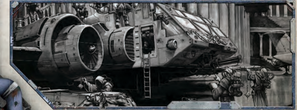

Several Talents require the Explorer to possess a prerequisite before their selection. This represents a certain innate ability level required to employ specific Talents, or a Skill or other Talent necessary to access more advanced capabilities. These prerequisites may take the form of Characteristic scores, Skills, Talents, or even [Special Abilities](mass-combat-special-abilities.md).

| Table 4-1: Talents Talent Name                                          | Prerequisite                                                                     | Benefit                                                                                              |
|-------------------------------------------------------------------------|----------------------------------------------------------------------------------|------------------------------------------------------------------------------------------------------|
| [Air of Authority](talents-descriptions.md)                                                        | Fel 30                                                                           | Affect more targets with Test.                                                                       |
| [Ambidextrous](talents-descriptions.md)                                                            | Ag 30                                                                            | Use either hand equally well.                                                                        |
| Armour of Contempt                                                      | WP 40                                                                            | The Explorer is resistant to [Corruption](character-corruption.md).                                                             |
| Assassin Strike                                                         | Ag 40, Acrobatic                                                                 | On a successful Acrobatics Test after making a melee [Attack](combat-attack-rules.md), the Explorer may move as a Free Action. |
| Autosanguine                                                            | -                                                                                | Heal 2 [Damage](character-injury.md)/day, always Lightly Wounded.                                                           |
| Basic Weapon Training †                                                 | -                                                                                | Use weapon group without penalty.                                                                    |
| Bastion of Iron Will                                                    | Psy Rating, Strong Minded, WP 40                                                 | Double [Defensive](weapons-general.md) Psy Rating for [Opposed Tests](rules-tests.md).                                                       |
| Battle Rage                                                             | Frenzy                                                                           | [Parry](rules-combat-overview.md) while Frenzied.                                                                                |
| Berserk Charge                                                          | -                                                                                | Gain +20 bonus when charging.                                                                        |
| Binary Chatter                                                          | -                                                                                | +10 bonus to control [Servitors](crew-servitors.md).                                                                      |
| Blademaster                                                             | WS 30, Melee Weapon Training (any)                                               | Re-roll missed attack, once per Round.                                                               |
| Blessed Radiance                                                        | Pure Faith, Divine Ministration, The Emperor Protects, or Wrath of the Righteous | Extends Faith Powers to allies.                                                                      |
| Blind Fighting                                                          | Per 30                                                                           | Suffer half the usual penalties when vision is obscured.                                             |
| Bloodtracker                                                            | -                                                                                | Receive benefits for capturing bounties.                                                             |
| Bulging Biceps                                                          | S 45                                                                             | Remove bracing requirement for certain [Weapons](weapons-general.md).                                                      |
| Catfall                                                                 | Ag 30                                                                            | Reduce [Falling](character-injury.md) Damage.                                                                               |
| Chem Geld                                                               | -                                                                                | Immune to seduction, resistant to [Charm](equipment-gear.md).                                                             |
| Cleanse and Purify                                                      | Flame Weapons Training (Universal)                                               | Penalty to avoid being hit by the Explorer's flamer attacks.                                         |
| Combat Formation                                                        | Int 40                                                                           | Use Intelligence Bonus for [Initiative](starship-combat-rules.md).                                                               |
| [Combat](rules-combat-overview.md) Master                                                           | WS 30                                                                            | Opponents get no bonus for outnumbering the Explorer.                                                |
| Combat Sense                                                            | Per 40                                                                           | Use Per Bonus instead of Ag Bonus for [Initiative](starship-combat-rules.md).                                                    |
| Concealed Cavity                                                        | -                                                                                | The Explorer has a secret compartment on his person.                                                 |
| Counter Attack                                                          | WS 40                                                                            | Gain free attack with successful Parry.                                                              |
| Crack Shot                                                              | BS 40                                                                            | Deal +2 Critical Damage with ranged weapon.                                                          |
| Crippling Strike                                                        | WS 50                                                                            | Deal +4 Critical Damage with melee weapon.                                                           |
| Crushing Blow                                                           | S 40                                                                             | Deal +2 Damage with melee weapons.                                                                   |
| Dark Soul                                                               | -                                                                                | Take half the penalty on Malignancy Tests.                                                           |
| Deadeye Shot                                                            | BS 30                                                                            | Called shots are at -10 penalty.                                                                     |
| Die Hard                                                                | WP 40                                                                            | Re-roll death chance incurred by blood loss.                                                         |
| Disarm                                                                  | Ag 30                                                                            | Force opponent to drop weapon.                                                                       |
| Disturbing Voice                                                        | - Pure Faith                                                                     | +10 bonus to Intimidate and Interrogation, -10 penalty to Fel.                                       |
| Divine Ministration                                                     |                                                                                  | Spend a Fate Point to remove Fatigue or heal.                                                        |
| Double Team                                                             | -                                                                                | Gain additional +10 bonus for [Ganging up](combat-special-circumstances.md).                                                            |
| Dual Strike                                                             | Ag 40, Two-Weapon Wielder                                                        | One Ballistic Skill Test hits target twice.                                                          |
| Dual Shot                                                               | Ag 40, Two-Weapon Wielder                                                        | One Weapon Skill Test hits target twice.                                                             |
| Electrical Succour                                                      | Mechanicus Implants                                                              | +10 bonus to T Tests to remove Fatigue.                                                              |
|                                                                         | -                                                                                |                                                                                                      |
| Electro Graft Use                                                       |                                                                                  | +10 bonus to Inquiry, Tech-Use, Common Knowledge.                                                    |
| Enemy †                                                                 | -                                                                                | An organisation or group particularly despises the Explorer.                                         |
| Energy Cache                                                            | Mechanicus Implants                                                              | Luminen Blast, Charge, and Shock Fatigue-free.                                                       |
| Enhanced Bionic Frame                                                   | Machinator Array                                                                 | The Explorer gains the [Auto-stabilised](character-traits.md) Trait.                                                        |
| Exotic Weapon Training †                                                | -                                                                                | Gain proficiency with an [Exotic](weapons-ammunition.md) weapon type.                                                         |
| Favoured by the Warp                                                    | WP 35                                                                            | Roll twice for [Psychic Phenomena](psychic-phenomena-table.md) (see page 160) and take better result.                              |
| Fearless                                                                | -                                                                                | Immune to [Fear](character-fear-and-damnation.md) and [Pinning](combat-special-circumstances.md).                                                                          |
| Feedback Screech                                                        | Mechanicus Implants                                                              | 30m radius, test WP or lose Half Action.                                                             |
| Ferric Lure                                                             | Mechanicus Implants                                                              | WP Test to call 1kg/WP Bonus of metal objects. WP Test to call 2kg/WP Bonus of metal objects.        |
| Ferric Summons †                                                        | Mechanicus Implants, Ferric Lure                                                 |                                                                                                      |
| Flame Weapon Training † Denotes Talent group. † Denotes Talent group. † | -                                                                                | Gain proficiency with a group of flame weapons.                                                      || Talent Name             | Prerequisite                      | Benefit                                                                      |
|-------------------------|-----------------------------------|------------------------------------------------------------------------------|
| Foresight               | Int 30                            | Contemplate to gain +10 bonus on next Test.                                  |
| Frenzy                  | -                                 | Enter psychotic rage to gain combat bonuses.                                 |
| Furious Assault         | WS 35                             | On a successful WS Test, gain a free second attack.                          |
| Good Reputation †       | Fel 50, Peer                      | The Explorer has a good reputation amongst a certain group.                  |
| Guardian                | Agility 40                        | Switch location with an ally.                                                |
| Gun Blessing            | Mechanicus Implants               | Un-jam Int Bonus guns in 10m radius.                                         |
| Gunslinger              | BS 40, Two-Weapon Wielder         | Fighting with two pistols incurs only -10 penalty.                           |
| Hard Bargain            | -                                 | Gain +1 to [Profit Factor](economy-wealth-and-acquisitions.md).                                                    |
| Hard Target             | Ag 40                             | Opponents take -20 to BS Tests when the Explorer charges or runs.            |
| Hardy                   | T 40                              | The Explorer always heals as if Lightly Wounded.                             |
| Hatred †                | -                                 | Gain +10 bonus to attack hated creatures.                                    |
| Heavy Weapon Training   | -                                 | Gain proficiency with a heavy weapon group.                                  |
| Heightened Senses †     | -                                 | Gain +10 bonus to particular sense.                                          |
| Hip Shooting            | BS 40, Ag 40                      | Gain a free attack when the Explorer moves.                                  |
| Hotshot Pilot           | Pilot Skill, Ag 40                | All Pilot Skills are [Basic Skills](skills-basic-and-advanced.md).                                           |
| Improved Warp Sense     | Warp Sense                        | Allows Psyniscience Test as Free Action.                                     |
| Independent Targeting   | BS 40                             | Fire at two or more targets further than 10m apart.                          |
| Infused Knowledge       | Int 40                            | Treat Common and Scholastic Lore as [Basic Skills](skills-basic-and-advanced.md).                            |
| Inspire Wrath           | Fel 30                            | Inspires crowds to anger.                                                    |
| Into the Jaws of Hell   | Iron Discipline                   | Minions gain immunity to pinning and [Fear](character-fear-and-damnation.md) whilst in the Explorer's presence. |
| Iron Discipline         | WP 30, Command                    | Minions can re-roll fear and pinning Tests.                                  |
| Iron Jaw                | T 40                              | Test Toughness to overcome stunning.                                         |
| Jaded                   | WP 30                             | Never gain IP from ordinary horrors.                                         |
| Last Man Standing       | Nerves of Steel                   | Immune to Pinning by Pistols and Basic Weapons. Improves Cover.              |
| Leap Up                 | Ag 30                             | Stand up as a Free Action.                                                   |
| Light Sleeper           | Per 30                            | Counts as awake, even when asleep.                                           |
| Lightning Attack        | Swift Attack                      | Attack three times with a Full Action.                                       |
| Lightning Reflexes      | -                                 | Add twice AB to Initiative rolls.                                            |
| Litany of Hate          | Hatred                            | Extend benefits of Hatred to allies.                                         |
| Logis Implant           | -                                 | +10 bonus on WS and BS on successful Tech-Use Test.                          |
| Luminen Blast           | Mechanicus Implants               | 1d10+WP Bonus Energy Damage Bolt. Causes Fatigue.                            |
| Luminen Charge          | Mechanicus Implants               | T Test to power/charge tech. Causes Fatigue.                                 |
| Luminen Shock           | Mechanicus Implants               | 1d10+3 Energy Damage Shock. Causes Fatigue.                                  |
| Machinator Array        | Mechanicus Implants               | The Explorer has advanced Mechanicus augmetics.                              |
| Maglev Grace            | Mechanicus Implants               | Hover 1d10+TB minutes once per day.                                          |
| Maglev Transcendence    | Mechanicus Implants, Maglev Grace | Hover 2d10+TB minutes twice per day.                                         |
| Marksman                | BS 35                             | No penalties for firing at long or extreme range.                            |
| Master & [Commander](rank-commander.md)      | Int 35, Fel 35                    | The Explorer's commands coordinate others in combat.                         |
| Master Chirurgeon       | Medicae +10                       | Perform advanced medical procedures.                                         |
| Master Enginseer        | Tech-Use +10, Mechanicus Implants | Use a Fate Point for automatic success.                                      |
| Master Orator           | Fel 30                            | Affect 10 times the normal numbers with a Fellowship Test.                   |
| Mechadendrite Use †     | Mechanicus Implants               | The Explorer can use a type of Mechadendrite.                                |
| Meditation              | -                                 | The Explorer may enter a trance to remove Fatigue.                           |
| Melee Weapon Training † | -                                 | Gain proficiency with a group of melee weapons.                              |
| Mighty Shot             | BS 40                             | Deal +2 damage with ranged attacks.                                          |
| Mimic                   | -                                 | The Explorer can copy voices.                                                |
| Navigator               | -                                 | The Explorer possesses [The Navigator Gene](navigator-gene-rules.md).                                   |
| Navigator Power         | Navigator                         | Gain the ability to use a power within one of the Explorer's groups.         |
| Nerves of Steel         | -                                 | Re-roll failed tests to avoid pinning.                                       |
| Orthoproxy              | -                                 | +20 bonus to resist mind control or interrogation.                           |
| Paranoia                | -                                 | The Explorer is alert for danger.                                            |
| † Denotes Talent group. |                                   |                                                                              || Talent Name                                       | Prerequisite                           | Benefit                                                          |
|---------------------------------------------------|----------------------------------------|------------------------------------------------------------------|
| Peer †                                            | Fel 30                                 | Gain +10 bonus on Fel Tests to interact with organisation.       |
| Pistol Weapon Training †                          | -                                      | Gain proficiency with a group of pistol weapons.                 |
| Polyglot                                          | Int 30, Fel 30                         | The Explorer has an innate ability with languages.               |
| Precise Blow                                      | WS 40, Sure Strike                     | No penalty for attacks against specific locations.               |
| Prosanguine                                       | -                                      | Heal 1d5 Damage once per day.                                    |
| Psy Rating                                        | -                                      | Become a more powerful Psyker, rated 1-10.                       |
| Psychic Discipline                                |                                        | Gain access to an additional Psychic Discipline.                 |
| Psychic Technique †                               | -                                      | Gain an extra Psychic Technique.                                 |
| Pure Faith                                        | -                                      | The Explorer is immune to [Daemonic](character-traits.md) Presence.                     |
| Purge the Unclean                                 | Pure Faith                             | Spend a Fate Point to repel daemons.                             |
| Quick Draw                                        | -                                      | Ready as a Free Action.                                          |
| Rapid Reaction                                    | Ag 40                                  | Test Ag to negate [Surprise](combat-surprise-rules.md).                                      |
| Rapid Reload                                      | -                                      | Reduce reload time.                                              |
| Renowned Warrant                                  | -                                      | Provides bonus to [Interaction](rules-interaction.md) Tests.                             |
| Resistance †                                      | -                                      | Gain +10 bonus to Resistance Tests.                              |
| Rite of Awe                                       | Mechanicus Implants                    | 50m radius, -10 to all Tests due to fear.                        |
| Rite of Fear                                      | Mechanicus Implants                    | Fear rating 1 for two minutes in a 50m radius.                   |
| Rite of Pure Thought                              | Mechanicus Implants                    | The Explorer is immune to emotion.                               |
| Rite of Sanctioning                               | Psy Rating, Special                    | Reduces Psychic Phenomenon.                                      |
| Rival †                                           | -                                      | A group or organisation bears the Explorer animosity.            |
| Sharpshooter                                      | BS 40, Deadeye Shot                    | No penalties for called shots.                                   |
| Sound Constitution                                | -                                      | Gain an additional Wound.                                        |
| Sprint                                            | -                                      | Move more quickly in combat.                                     |
| Step Aside                                        | Ag 40, Dodge                           | Gain an extra Dodge each Round.                                  |
| Strong Minded                                     | WP 30, Resistance (Psychic Techniques) | Re-roll failed WP Tests made to resist [Psychic Techniques](psychic-techniques-list.md).       |
| Sure Strike                                       | WS 30                                  | Choose location on a successful attack.                          |
| Swift Attack                                      | WS 35                                  | Attack twice with a Full Action.                                 |
| Takedown                                          | -                                      | Make a special attack to stun the Explorer's opponent.           |
| Talented †                                        | -                                      | Gain +10 bonus to corresponding Skill Test.                      |
| Technical Knock                                   | Int 30                                 | Un-jam a gun as Half Action.                                     |
| The Emperor Protects                              | Pure Faith                             | Spend a Fate Point to [Inspire](psychic-disciplines-list.md) fearlessness and heroism.          |
| The Flesh is Weak                                 | Mechanicus Implants                    | The Explorer gains the Machine Trait.                            |
| Thrown Weapon Training                            | -                                      | Gain proficiency with a group of thrown weapons.                 |
| Total Recall                                      | Int 30                                 | The Explorer can remember trivial facts and minor details.       |
| True Grit                                         | T 40                                   | Reduce Critical Damage the Explorer takes.                       |
| Two-Weapon Wielder †                              | WS 35 or BS35, Ag 35                   | Attack twice when wielding two weapons.                          |
| Unarmed Master                                    | WS 45, Ag 40, Unarmed Warrior 35       | Attacks do 1d10+SB damage and lack the Primitive trait. attacks. |
| Unarmed Warrior                                   | WS 35, Ag                              | Deal 1d10-3+SB with unarmed                                      |
| Unshakeable                                       |                                        | The Explorer may re-roll failed Fear Tests.                      |
| Faith                                             | -                                      |                                                                  |
| Wall of Steel                                     | Ag                                     |                                                                  |
|                                                   | 35                                     | Gain extra Parry each round.                                     |
| Warp Conduit                                      | Psy Rating, Strong Minded, WP 50       | +1 to Psy Rating when pushing.                                   |
|                                                   | Navigator or Psy Rating, Psyniscience  |                                                                  |
| Warp Sense                                        | Skill, Per 30+                         | Allows Psyniscience Test as Half Action.                         |
| Whispers                                          | Int 40, Fel 30                         | Provides bonuses to Investigations.                              |
| Wrath of the Righteous                            | Pure Faith                             | Spend a Fate Point to deal extra Damage.                         |
| † Denotes Talent group. † Denotes Talent group. † |                                        |                                                                  |

*Source:* `Roguetrader Corerulebook, page 91`
