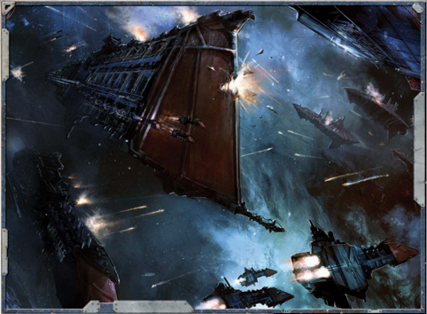

A  small  band  of  Infidels  working  together in  the  Unbeholden  Reaches, Talon  Squadron have  raided  settlements  and  ships  in  this region for the last five decades. Most recently, Talon Squadron inflicted severe [Damage](character-injury.md) to the ship  of  Rogue  Trader  Jeremiah  Blitz,  and the impetuous young gambler has sworn his intention  to  turn  every  last  Infidel  he  meets henceforth into scrap.[Squadrons](squadrons-overview.md)

[Mustering the Fleet](starship-mustering-the-fleet.md)

· [Npc Starships](ships-npc-starships.md) ·

· [Waging War](mass-combat-waging-war.md) ·

· [Large-scale Warfare](mass-combat-rules.md)

[Ground Wars](ground-war-rules.md)

· [Warfare Endeavours](mass-combat-endeavours.md)

· [Appendix of Vehicles](appendix-vehicles.md)

111

IV: Rules of War

*Source:* `Battle Fleet of the Koronus, page 111`
