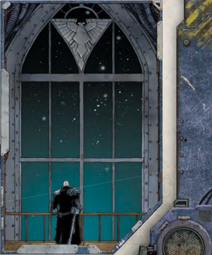

## Using Fate Points

Fate  Points  allow  an  explorer  to  manipulate  situations  by mitigating bad results or turning a mishap into [Fortune](chargen-stage2-origin-path.md). Among other  things,  this  allows  players  to  take  more  risks,  which makes the game faster and far more exciting. An explorer has a limited pool of Fate Points, and when a Fate Point is spent, that pool is reduced by one. Spent Fate Points are restored at the beginning of the next gaming session, or possibly under special circumstances in the middle of a game session that the GM deems appropriate. A Fate Point can be used at any time, either on the character's own turn or in reaction to the action of another character. Spending a Fate Point is a Free Action.

Spending one Fate Point allows for one of the following:

- Re-roll  a  failed  test  once.  The  results  of  the  re-roll  are · final.
- Gain a +10 bonus to a test. This must be chosen before · dice are rolled.
- Add an extra degree of success to a test. This may chosen · after dice are rolled.
- Count as having rolled a 10 for [Initiative](starship-combat-rules.md). ·
- Instantly remove 1d5 [Damage](character-injury.md) (this cannot affect Critical · [Damage](character-injury.md)).
- Instantly recover from being Stunned. ·

## Burning Fate

Sometimes a re-roll or an extra degree of success is not going to be enough to save an explorer's life. In these instances, the explorer may choose to burn a Fate Point and permanently reduce his Fate Points by one. The result is that the character survives whatever it was that would have killed him, but only just. For [Example](rules-tests.md), if the explorer was [Shot](weapons-ammunition.md) with a lascannon and suffered a Critical Hit that would have killed him, instead he is  only  hideously  burnt  and  rendered  unconscious  with zero [Wounds](character-injury.md). In more extreme circumstances, such as being trapped  on  a  space  ship  during  a  warp  drive  implosion,  it is  up  to  the  player  and  the  GM  to  work  out  just  how  the explorer makes his [Escape](combat-escape-action.md).

A Fate Point may be burnt even if it has already been used for that gaming session.

## Starships and Burning Fate

One  of  the  hazards  of  battles  in  deep  space  is  that the losing side is in a very precarious position. Many times the battle ends with at least one ship a burning wreck or merely scattered debris where once a proud vessel existed. In the case of a starship's destruction, Explorers  who  are  on  board  the  ship  can  choose  to burn a Fate Point permanently in order to avoid certain death. However, the Explorers who burn Fate Points in this manner do so collectively-this means that each and every character on the ship must burn a Fate Point at the same time! The manner of the starship's survival is up to the GM. Typically, the ship is fortunate enough to  [Disengage](starship-combat-rules.md)  from  the  [Combat](rules-combat-overview.md)  and  limp  away  for repairs, but the GM may work out another method at his discretion.

## Gaining Additional Fate Points

Explorers are awarded additional Fate Points (or allowed to replenish those that have been burnt) at the GM's discretion. Such [Rewards](economy-rewards.md) can be given out as the main adventure reaches certain milestones, or for particular acts of heroism, cunning, or good roleplaying.

*Source:* `Roguetrader Corerulebook, page 234`
