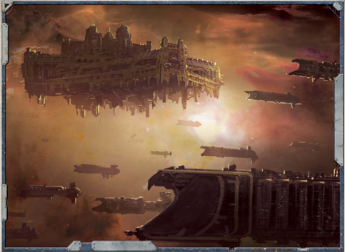

Interplanetary  craft  are  ones  that  can  move  between  planets inside a star system, travelling from  Terra to Mars  for [Example](rules-tests.md), or boosting materials into orbit and landing them. Interplanetary  craft  make  up  the  bulk  of  space-borne  traffic around  Imperial  worlds.  A  reasonably  advanced  star  system will have surprisingly large numbers of craft in attendanceeverything from one-man couriers and haulers, cargo luggers and  asteroid  miners  to  passenger  liners  and  pleasure  craft. Interplanetary craft can't leave a star system under their own power because they cannot enter [The Warp](warp-imperial-space-travel.md), and interplanetary warships are commonly referred to as system ships.

Some star systems feature highly specialised vessels to farm, mine  or  otherwise  exploit  whatever  resources  are  available such  as  giant  lenses,  comet  hooks  or  [Plasma](weapons-general.md)  scoops  for example. Interplanetary smuggling and piracy can also become prevalent where trade becomes particularly valuable, often from previously honest merchantmen succumbing to temptation to make faster profits. This is particularly

the case in systems where humanity has spread out to occupy various  asteroids  and  moons,  giving  pirates  lots  of  places  to hide and smugglers plentiful venues for their wares.

Most systems with interplanetary vessels feature orbital stations of some kind too. At a frontier world these could be limited to a few dour administration and hanger facilities. More populous worlds  could  boast  zero-G  factoria,  docks  and  ship  yards, planetary defence satellites, and even cathedrals and hab blocks. The oldest of Mankind's worlds like Mars and Holy Terra have forged entire orbital rings about themselves over the millennia.

*Source:* `Battle Fleet of the Koronus, page 45`
