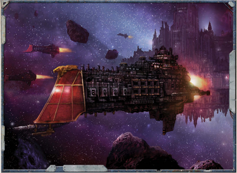

The [Chalice-class Battlecruiser](chalice-class-battlecruiser.md) is a design thought unique to The Calixis Sector, along with all other vessels produced in the Lathes Forge Worlds. Famed ship-wright Hosiana Joz is said to have been gifted a vision of the Chalice class sent by the Omnissiah. He was inspired to set about crafting a warship that could survive the turbulent tides in the Immaterium so often found close to the rim. Some whisper that the resultant ships  possess  some  of  the  interior  structures  and  conduit relays of an old Hades-class heavy [Cruiser](starship-anatomy-detailed.md).

Despite such mutterings the handful of Chalice-class built are acknowledged as fine ships, even if it's said they possess a bit of a glass jaw . The Triumph of Saint Drusus won fame routing the  Emperor's  foes  in  many  engagements,  often  operating independently to take full advantage of its superior Grace and speed. However, an ill star does seem to hang over the history of the class. A disproportionate number have been lost over the centuries in enemy action (or unknown circumstances), while others have fallen and gone over to the Ruinous Powers.

Currently, [Lord-captain](rank-lord-captain.md) Laomyr and the Triumph are  on detached duty, investigating 'disturbances at Sheol VII.'

57

*Source:* `Battle Fleet of the Koronus, page 58`
