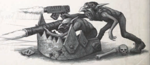

Each vehicle has a listed Availability, and may be Acquired just like any other item. All standard rules for Acquiring a vehicle apply-it is perfectly possible to Acquire a squadron of Fury Interceptors, for example. However, when Acquiring  a  vehicle,  all  Acquisition  Tests  suffer  an additional -10 penalty (on top of any other penalties) due to the sheer cost. Each vehicle has a listed Availability, and may be Acquired

## Weapons

The Aquila Lander is a multi-use lander and atmospheric flyer. Its distinctive eagle-pattern wings make it easily recognisable, and its customisability make it popular throughout the Imperium. An Aquila Lander can be converted into a luxury shuttle, cargo conveyor, or even military transport. customisability make it popular throughout the Imperium. An Aquila Lander can be converted into a luxury shuttle, cargo conveyor, or even

Type: Spacecraft

Tactical Speed:

24 m / 12 AUs

Cruising Speed:

2,200 kph/7 VUs per Strategic Turn in Space

Manoeuvrability:

+10

Structural Integrity:

25

Size:

Enormous

Armour:

Front 21, Side 21, Rear 20

Crew:

Pilot

Carrying Capacity:

10 people or equivalent in cargo.

## Special Rules

1 Pilot-operated Autocannon (Facing Front, Range 300m (3 AUs), Heavy, S/2/5, 4d10+5 I, Pen 4, Clip 60, Reload 2 Full) (Facing Front, Range 300m (3 AUs), Heavy, S/2/5, 4d10+5 I, Pen 4, Clip

*Source:* `Battle Fleet of the Koronus, pages 180–181`
