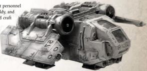
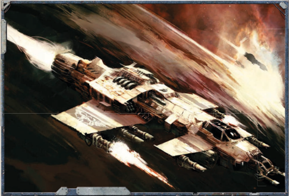

Spacecraft: This vehicle may exit the atmosphere. While in the atmosphere it may operate as a skimmer or flyer at the pilot's choice. It gains all benefits and drawbacks of skimmers and flyers. If operating as a flyer, it must be moving at least half its cruising speed at all times lest it begin a terminal dive to the earth below. In either case, if it becomes completely immobilised due to damage, count the vehicle as destroyed instead as it crashes to the ground (or begins to fall out of the sky in a terminal dive).

Availability: Average

## Weapons

The Fury interceptor is actually a broad classification for a variety of different Imperial starfighters. Many sectors have their own variants on the Fury, but the starfighter remains broadly the same in design and role. The Fury is a space-superiority fighter craft, designed to protect Imperial bombers from enemy interceptors while the bombers deliver their payload, and intercept enemy bombers in turn. Although designed primarily for space combat, many patterns of Furies are also designed so that they can enter a planetary atmosphere. Here their armaments, designed for deep-space combat, are extremely devastating.

Type:

Spacecraft

Tactical Speed:

30m/20 AUs

Cruising Speed:

2,500 kph/10 VUs per Strategic Turn in Space

Manoeuvrability: +5

Structural Integrity:

35

Size:

Massive

Armour:

Front 36, Side 36, Rear 30

Carrying Capacity:

None.

Crew:

Pilot, Co-pilot, Forward Gunner/Crew Chief, Tech-Priest Enginseer

## Special Rules

1 Forward Gunner-operated twin-linked long barrelled lascannon (Facing Front/Left/Right, Range 600m (6 AUs), Heavy, S/-/-, 5d10+10 E, Pen 10, Clip 250, Reload -, Twin-linked)

2 Pilot-operated long-barrelled lascannon banks (Facing Front, Range 600m (6 AUs), Heavy, S/-/5, 5d10+10 E, Pen 10, Clip 250, Reload -, Innacurate). Each of these weapons is actually five lascannons linked for rapid fire.

12 Co-pilot operated Void-capable Missiles (Facing Front, Range 75 km (750 AUs), Heavy, S/-/-, 3d10+20 X, Pen 15, Clip 1, Reload -). The co-pilot may fire two of these missiles per turn, at two separate targets.

*Source:* `Battle Fleet of the Koronus, pages 181–182`
