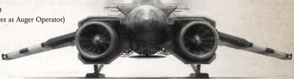

Flyer: This aircraft uses aerodynamic This aircraft uses aerodynamic

principals to stay aloft. When airborne, it must move at least half its cruising speed at all times lest it crash to the ground. If it ever becomes completely immobilised due to damage, count the vehicle as destroyed instead as it crashes to the ground. principals to stay aloft. When airborne, it must move at least half its cruising speed at all times lest it crash to the ground. If it ever becomes completely immobilised due to damage, count the vehicle as destroyed instead as it crashes to the ground.

The Chiropteran Scout may count as a Skimmer (and follow all the rules for a Skimmer) for up to 2 The Chiropteran Scout may count as a Skimmer (and follow all the rules for a Skimmer) for up to 2

Vector Thrust Engines: minutes before it must return to counting as a Flyer. It may do this once every hour. minutes before it must return to counting as a Flyer. It may do this once every hour.

Long Range Auger Array: These sophisticated augers provide a detailed view of the land below, granting the operators a +20 bonus to all Awareness and Scrutiny Tests, and allowing scans in the same manner as an Auspex up to 50 kilometres away. Availability: Very Rare

## Weapons

Used by the Imperium's elite Space Marines, drop pods are one-way planetary assault vehicles. Launched from orbiting starships, they scream through the planet's atmosphere with oversized rocket thrusters boosting them far past terminal velocity. They use an on-board cogitator to guide themselves on a collision course to their targets. Even the most advanced air defence systems have difficulty locking on to a drop pod travelling at up to 15,000 kilometres per hour straight down. At the last moment, powerful retro-rockets around the base fire, 'slowing' the pod to a crushing, but survivable, landing. Drop Pods are rarely used by anyone other than the Space Marines, however some Rogue Traders in the Koronus Expanse have acquired modified Drop Pods for use with non Space Marines.

Type:

Spacecraft

Tactical Speed:

100 AUs

Cruising Speed:

2500 kph

Manoeuvrability:

+0

Structural Integrity: 30

Size:

Enormous

Armour:

All 24

Crew:

None

Carrying Capacity: 10 individuals in power armour (which works to cushion the impact), or 10 individuals with specialist drop cocoons (which also help absorb the impact, in the absence of power armour).

## Special Rules

Storm bolter (Facing All, Range 90m, Basic, -/-/6, 1d10+5 X, Pen 4, Clip 120, Reload Full, Storm, Tearing) This weapon may only be used after the Drop Pod has landed, and is controlled by the drop pod's machine spirit (BS 40).

*Source:* `Into the Storm, page 183`
