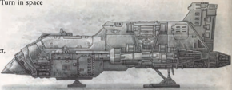

Spacecraft: This vehicle may exit the atmosphere. While in the atmosphere it may operate as a skimmer or flyer at the pilot's choice. It gains all benefits and drawbacks of skimmers and flyers. If operating as a flyer, it must be moving at least half its cruising speed at all times lest it begin a terminal dive to the earth below . In either case, if it becomes completely immobilised due to damage, count the vehicle as destroyed instead as it crashes to the ground (or begins to fall out of the sky in a terminal dive).

Availability:

Scarce

## Weapons

Lumbering across barren alien moons, trampling the wilderness regions of fledgling colonies, and flattening the mighty crags of countless worlds beneath its heavy mechanical tracks, the Hephaestus is an ambulatory mineralogical survey vehicle and ore extraction platform. Having fallen out of favour in more established sectors of the Imperium, decommissioned and abandoned Ore Seekers have been repaired and put back into service across the Expanse. Under the direction of Rogue Traders, Explorators, and prospecting guilds, functioning Hephaestus earn quick fortunes for their masters. A Hephaestus Ore Seeker is a gigantic boxy crawler, more than 35 metres tall and propelled by numerous treads. Enormous drills, rippers, and rotary grinders tear away at rock and soil, leaving deep trenches, sunken pits, and mounds of scree in the Seeker's wake. Thick smoke bellows from countless chimneys bristling from the vehicle's back, a sure sign that the smelters within are working at full capacity. countless chimneys bristling from the vehicle's back, a sure sign that the smelters within are working at full capacity.

Type:

Ground Vehicle

Tactical Speed: 5

Cruising Speed:

40 kph

Manoeuvrability:

-30

Structural Integrity: 65

Size:

Massive

Armour:

Front 40, Side 50, Rear 45

Crew:

3 Drivers, Foreman, 6 Enginseers, and 20 Miners

Carrying Capacity: 20 additional crew , 750 tonnes of processed ore, 1 hanger 20 additional crew , 750 tonnes of processed ore, 1 hanger

capable of holding 1 Massive vehicle or 2 Hulking vehicles

## Special Rules

Heavy Mining Drill (Facing Front, Melee, 5d10 R, Pen 15, Tearing, Unwieldy). Mining Laser (Fading, Front, 100m, Heavy, S/-/-, 4d10+5 E, Pen 10, Inaccurate, Overheats, Recharge). (Fading, Front, 100m, Heavy, S/-/-, 4d10+5 E, Pen 10,

Digging Arms (Facing Front, Melee, 2d10+10, Pen 4, Unwieldy).

*Source:* `Battle Fleet of the Koronus, pages 184–185`
