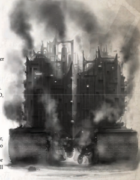

Ground Vehicle: This vehicle follows all rules for ground vehicles. A fully outfitted Hephaestus Ore Seeker contains enough air, fuel, water, and provisions for a full complement of crew and passengers to A fully outfitted Hephaestus Ore Seeker contains enough air, fuel, water, and provisions for a full complement of crew and passengers to

Life Support: survive in relative comfort for a month in hostile environments.

Improvised  Weapons: When  used  against  a  Average  sized  targets  or smaller,  all  of  the  Hephaestus  weapons  suffer  a  -30  penalty  to  hit.  All weapons may be used by any crew. When  used  against  a  Average  sized  targets  or smaller,  all  of  the  Hephaestus  weapons  suffer  a  -30  penalty  to  hit.  All

Availability: Near Unique

Reinforced Hull: When a vehicle with a Reinforced Hull receives a Critical Hit, halve the result, rounding up. This quality does not affect rolls on the Critical Hit chart generated by Righteous Fury. When a vehicle with a Reinforced Hull receives a Critical Hit, halve the result, rounding up. This quality does not affect rolls on the Critical Hit chart generated by Righteous Fury.

## Weapons

Counter-grav technology is rare and valuable, making Land Speeders a plaything of the rich. The advantages of these vehicles, however, are obvious, as they cover great distances at speed and ignore even the roughest terrain. Due to their rarity , the vast majority of Land Speeders are used by the elite Space Marines, and the few speeders available to Imperial nobility and Rogue Traders are from the same STC.

Type:

Skimmer

Tactical Speed:

30 m

Cruising Speed:

275 kph

Manoeuvrability: +10

Structural Integrity:

18

Size:

Hulking

Armour:

Front 15, Side 15, Rear 15

Crew:

Pilot, Co-Pilot

Carrying Capacity:

certain varieties of Land Speeders can carry up to 5 passengers or equivalent cargo

## Special Rules

None (may be modified to carry one heavy weapon such as a heavy stubber or heavy bolter, manned by the co-pilot. In general, no weapon heavier than 40 kilograms may be mounted on this vehicle)

*Source:* `Into the Storm, page 185`
