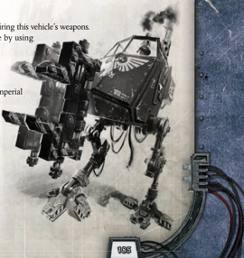

Ground Vehicle: This vehicle follows all rules for ground vehicles.

Targeter Array:

The driver of this vehicle gains the Auto-stabilized Trait for firing this vehicle's weapons. The driver of this vehicle gains the Auto-stabilized Trait for firing this vehicle's weapons.

Open-topped:

Enemies may target the crew and passengers of the vehicle by using Enemies may target the crew and passengers of the vehicle by using

a Called Shot Attack Action.

Availability:

Very Rare

## Weapons

The Sentinel walker is a bipedal walker used as a scout vehicle by the Imperial Guard. It can be equipped with a wide variety of weapons or loading claws, is easy to pilot, and can even be dropped into combat zones via over-sized grav-chutes, making it a valuable support vehicle to guardsmen in the field. The Sentinel walker is a bipedal walker used as a scout vehicle by the Imperial

Type:

Walker

Tactical Speed: 8 m

Cruising Speed: 45 kph

Manoeuvrability:

+10

Structural Integrity: 16

Size:

Hulking

Armour: Front 20, Side 20, Rear 20

Crew:

Driver

Carrying Capacity:

None/ roughly 1 metric tonne with powerlifter

## Special Rules

Select one-all driver-operated.

Multi-laser (Facing Front, Range 250m, Heavy, -/-/10, 3d10+3 E, Pen 4, Clip 100, Reload 3Full)

Autocannon (Facing Front, Range 300m, Heavy, S/2/5, 4d10+5 I, Pen 4, Clip 60, Reload 2 Full)

Powerlifter (Facing Front, Melee, 2d10+10, Pen 2, Unwieldy)

*Source:* `Battle Fleet of the Koronus, pages 186–187`
