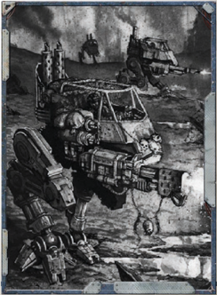

The driver sees a threat and dodges, hopefully throwing his vehicle out of the line of fire. This action may only be taken if the vehicle has moved at least its tactical speed during its  previous  turn.  The  driver  makes  a  Drive  or  Pilot  Test, with a penalty equal to the vehicle's size modifier (someone attempting to dodge with an Enormous truck, which grants opponents +20 to hit due to size, would suffer a -20 to his Drive  Test).  For  every  success,  he  avoids  one  shot  from  a single source, as with a Dodge Reaction.

If the driver fails the Drive T est by five or more degrees, he loses control of the vehicle and crashes. See Crashing on page 179.

*Source:* `Into the Storm, page 173`
