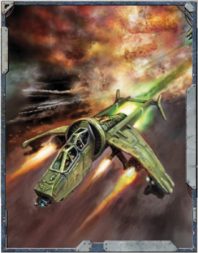

Aerial combat is handled in Structured Time, just as regular combat, with one round equalling approximately five seconds. The other rules for regular combat should be followed as well, except when contradicted by the following rules. Initiative for a flyer (even one with multiple crewmembers) is always rolled by the pilot, and everyone in a vehicle must take their turns at the same time (as stated in the vehicle rules).

To better represent air combat, each flyer's turn is broken down into one move action, and one shoot action. The move action  is  performed  first,  then  the  shoot  action.  Therefore, during a turn, a flyer will move, and then the pilot and any gunners may each shoot one weapon.

In  a  combat  situation,  the  distance  a  flyer  moves  is  represented by Air Units (which are equivalent to roughly 100 meters). The reason for this is one of simplicity-vehicles move fast enough that if combat distances were measure in metres, the numbers would be very large, very quickly. Note that the Air Units a flyer may move in a single round is often far less than the flyer's cruising  speed  in  kilometres  would  suggest.  This  is  because when  forced  to  manoeuvre  in  a  combat  environment,  most pilots  are  forced  to  move  somewhat  slower  than  their  'full' speed, so they can react to an opponent and line up shots.

Due to flight principles, flyers are somewhat limited in how they can manoeuvre. A flyer must always move its Tactical Speed every turn (unless performing a specific manoeuvre to adjust it). In addition, a flyer's turning is limited by how far it moves. For every four AUs a flyer moves, it may turn up to 45 degrees . There are no other limits as to how many times a flyer can turn.

This, like in space combat, is a flyer's basic move.  A  pilot  with  the  Piloting  Skill  does not  need  to  test  to  perform  this  move, unless there are extenuating circumstances such as a storm (see page 176).

The  basic  move  can  be  modified  by  various  manoeuvres available to the pilot. These are similar to a starship's manoeuvres -by adding difficulty to any Piloting Skill Tests, the pilot can perform  more  complicated  manoeuvres.  Typically,  only  one manoeuvre can only be performed each turn. However, the pilot can choose to perform multiple manoeuvres in a single movement action (unless the manoeuvre specifically states otherwise). When a pilot combines manoeuvres, he should determine the highest penalty to the required Piloting Test amongst all the manoeuvres he wants to perform. Then, he should make that Piloting Test one degree more difficult for each additional manoeuvre he adds. Then he makes the Piloting Test, and if the Test is successful, he gains the benefits of all the manoeuvres he performed.

*Source:* `Into the Storm, page 175`
