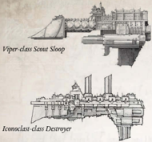

Dimensions: 0.95 km long,0.25 km abeam at fins approx.

Mass: 4.9 megatonnes approx.

Crew: 7,500  crew, approx.

Accel: 6 gravities max sustainable acceleration.

The  Viper  is the smallest warp-capable  vessel used  in Battlefleet  Calixis.  The  Viper  is  a  fast  scout  ship,  with immensely powerful realspace engines. It is used for shortterm  spy  missions  aimed  at  specific  hostile  regions:  unlike, for  [Example](rules-tests.md),  a  Dauntless  light  [Cruiser](starship-anatomy-detailed.md),  which  will  conduct broad [Patrols](patrols.md) over a wide area, the Viper charges into hostile territory  at  high  speed.  There  it  uses  powerful  auspex  and augur  scanners  to  collate  as  much  information  as  possible, before  retreating  to  a  safe  warp  jump  point  while  usually pursued by enemy ships.

Given  its  specialist  role,  the  Viper  is  unsurprisingly  limited in  many  ways.  It  is  a  tiny  ship,  with  very  restricted  space  for additional  Components.  Furthermore,  it  is  not  heavily  armed, as extensive weapon batteries would draw vital power from the sensor  arrays  and  engines.  They  are  rare  vessels  in  the  sector and are not ideal vessels for Rogue Traders, given their highly specialised  nature.  However,  more  enterprising  and  wealthy dynasties  will  often  employ  a  Viper  as  part  of  a  larger  fleet, leapfrogging  ahead  of  the  main  force  to  rapidly  establish  the nature of each planetary system encountered.

Speed:

11

Manoeuvrability: +30

Detection:

+25

Hull Integrity:

25

[Armour](armour.md):

14

Turret Rating: 1

Space:

29

SP: 27

Weapon Capacity: Dorsal 1

*Source:* `Battle Fleet of the Koronus, page 29`
