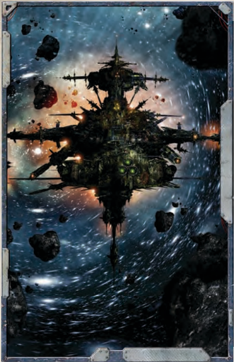
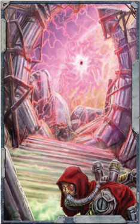

## The Warp

'For the warp is a strange and terrible place. You might as well throw a traveller into a sea of sharks and tell him to swim home as send him through the warp unprotected. Better it is not to let common man travel through the stars. Better still, let him not know such a thing is feasible.'

-Fra Safrane, 5th aide to Navigator Da'el. Comment made prior to the departure of the second mission to search for the [Missing](combat-special-circumstances.md) freighter [Pride](chargen-stage2-origin-path.md) of Angelis .

I nterstellar  travel  is  entirely  dependent  on  the  warp.  The material universe is just one aspect of reality.

There  is  a  quite  separate  and  co-existing  immaterial universe. This is commonly known as the warp, warpspace, the immaterium, the empyrean, or the sea of souls. The study and exploitation of the warp is the preserve of warp technology, the most important achievement of which is warp travel.

Warpspace  may  be  explained  in  terms  of  an  endlessly broad  and  infinitely  deep  sea  of  raw  energy.  This  energy carries within it the random thoughts, unfettered emotions, memory fragments, and unshakable beliefs of those who live in the material universe.

## Warp Travel

A  spacecraft  drops  into  the  warp  by  activating  its  [Warp Engines](starship-essential-components.md).  As  a  ship  leaves  the  material  universe  it  enters  a corresponding point in warpspace. The ship is then carried along by the tides and currents of the warp.

After  travelling  in  this  fashion  for  an  appropriate  time, the ship uses its [Warp Engines](warp-engines-components.md) to drop back into real space. Because the material universe and the warp move relative to one another, the ship reappears in a new position several light years from the starting point. This process is called a jump or a hop, and the process of entering or leaving is known as a drop, shift, or translation.

Journeys are undertaken in short jumps of up to four or five light  years.  Longer jumps are unpredictable and dangerous. The  tides  of  warpspace  move  in  complex  and  inconsistent patterns,  and  ships  attempting  longer  hops  often  end  up widely [Off Course](warp-travel-navigation.md).

Were  this  limitation  to  apply  to  all  warp  travel,  then Humanity would not have spread throughout the galaxy as it has. It is possible to make long jumps of many light years by  steering  a  ship  in  the  warp  itself-sensing,  responding to, and exploiting its currents and thereby directing the craft towards a corresponding point in the material universe. Only the strain of human mutants known as [Navigators](psychic-psyker-types.md) can pilot a craft through the warp in this way.

Some  individuals  are  sensitive  to  the  movements  of warpspace.  They  can,  for  [Example](rules-tests.md),  sometimes  tell  that  a spacecraft  is  approaching  even  before  it  drops  back  into the material universe. Human sensitivity to the warp is not generally well developed. However, in a minority of people this  sensitivity  is  far  more  finely  tuned.  These  people  are known as psykers, and they are able to consciously control

and use the energy of the warp to affect the material universe. [Navigators](psychic-psyker-types.md)  possess  gifts  of  a  specialised  kind  who  can  use their powers to steer spacecraft in the warp.

## The Astronomican and the Warp

[The Astronomican](warp-travel-navigation.md) is a psychic  homing signal  centred  upon Terra. It is  powered by the continuous mental concentration of a thousand psykers. [The Astronomican](warp-travel-navigation.md) cannot be detected in the real universe-only in the warp. It is by means of this signal that the [Navigators](psychic-psyker-types.md) can steer their spaceships over long distances.

The  Astronomican's  signal  is  strongest  close  to  Terra and gets increasingly weaker further away. It extends over a spherical area with a diameter of about 50,000 light years. The Astronomican does not extend to the extreme fringes of the galaxy, and because Terra is situated in the galactic west, its signal does not reach a massive swathe of the eastern part of the galaxy at all. Nor is the extent or strength of the signal constant-it  can  at  times  be  blocked  by  localised  activity within the warp itself. Such activity may be compared to the hurricanes  or  storms  of  a  terrestrial  weather  system  and  is known as a warpstorm. Warpstorms may be so bad, and so long-lasting, that entire star systems are isolated for hundreds of years at a time.

A warpstorm not only obscures the signal of the Astronomican,  it  is  also  dangerous  for  spacecraft  travelling nearby.  No  spacecraft  can  venture  within  a  warpstorm  and expect to survive, although there are tales of miraculous escapes and of ships being thrown tens of thousands of light years off course. Warpstorms are not the only dangers within the warp. There are sentient energies and other immaterial life-forms that inhabit it, creatures formed from, and part of, the shifting stuff of the warp. Few are friendly and many are hostile. They are known to Mankind as daemons.

## Time Displacement

The time differences between real space and warp space are quite drastic. Not only does time pass at different rates in both kinds of space, but it also passes at very variable rates. Until a ship finishes its jump, it is impossible for a ship's crew to know exactly how long their journey has taken. Time passing in real space is referred to as real time. Time passing on board a spacecraft is referred to as warp time.

## Warp Navigation

Once a spacecraft activates its [Warp Drives](starship-anatomy-detailed.md), it is plunged into a  dimension very different from the material universe. It is convenient to imagine warp space as consisting of a relatively dense, almost liquid, energy, devoid of stars, light and life as it is commonly known.

Once within warp space a ship may move by means of its main  [Drives](components-drives.md),  following  powerful  eddies  and  currents  in  the warp, eventually reaching a point in the warp corresponding to a destination in real space. The most difficult aspect of warp travel  is  that  it  is  impossible  to  detect  the  spatial  movement of warp space once a ship is in the warp. The ship can only blindly carry on, its crew trusting that it is going in the right direction. The longer a ship remains in warp space, the greater the chances of encountering some unexpected current that can turn it unknowingly off-course.

Navigation of warp space can be achieved in two ways: the calculated jump and the piloted jump.

All warp-drives incorporate navigational mechanisms. When the ship is in real space, these monitor the ever-shifting movements  of  that  part  of  the  warp  corresponding  to  the ship's  current  position.  It  is  a  'window'  into  warp  space.  By means of observing these movements in the warp it is possible to calculate a course, corrective manoeuvres, and approximate journey time to a proposed destination. Calculation relies on the assumption that the warp-currents observed from real space don't change significantly during flight. This method is known as a 'calculated jump'. It is not safe to make a calculated jump of more than four light years at one go. The longer the jump, the greater the chances of a significant change in warp current movement.

The second,  and  more  efficient,  form  of  warp-navigation is the piloted jump. This method relies upon two factors: the [Navigators](psychic-psyker-types.md) and the psychic beacon of [The Astronomican](warp-travel-navigation.md). [The Astronomican](warp-travel-navigation.md) is centred on Earth and is not only controlled by, but is directed by, the psychic power of the Emperor. The Astronomican is a psychic beacon that penetrates into  warp  space.  A  Navigator  onboard  a  ship  in the warp is able to pick up these signals and can steer  a  spacecraft  through  warp  space,compensating for current changes as he does so. A piloted jump can [Cover](combat-special-circumstances.md) a far longer distance than a calculated jump. Most piloted jumps are no more than 5,000 light years at a time, but longer jumps have been made.

A typical interstellar voyage might begin with a cargo ship lying in orbit around an Imperial world. Tiny shuttlecraft busily transfer precious minerals, foodstuffs, crew, and manufactured items from the world below. The loading procedure may take days or weeks, as the shuttles return time and time again to the huge ship. Once loading is complete, the colossal craft slowly accelerates out of orbit under the power of its main drives.

The  ship  heads  outwards  towards  the  rim  of  the  solar system,  carefully  increasing  speed  by  tiny  increments  as  it does so. Although the vessel's engines are capable of terrific acceleration, the risk of collision with inter-planetary debris is high if the ship accelerates too quickly or too much. As the sun shrinks in the ship's wake, the density of debris lessens and the ship's speed reaches approximately one percent of light speed.

After  several  weeks  of  travel,  the  ship  arrives  at  its  first destination.  This  is  the  'jump-point'  lying  around  the  star system like the circumference of a circle. This delineates the point  at  which  inter-planetary  debris  falls  below  maximum warp density.  Once this  invisible  line  has  been  crossed,  it  is safe  to  activate  warp  engines.  A  crew  careless  or  foolhardy enough to prematurely activate warp-drives would be lucky to find their ship hurled thousands of light years off course. More likely, the ship would be torn apart and destroyed, never to be heard of again.

With the safe activation of its warp-drives, the ship is plucked out of the real universe and enters the dimension of warp space. Its true interstellar journey has begun. Ships travelling in warpspace do so by means of jumps varying in length up to 5,000 light years. Only a long journey would involve more than a single  jump.  Even  so,  almost  two  weeks  pass  onboard  ship before the craft is [Ready](rules-combat-overview.md) to end its jump. Meanwhile, because of time shifts in warp space, over a year has passed in the real universe.

The ship re-enters real  space  just  beyond  the  jump-point of its destination solar system. If it is lucky, the ship will come out close to the jump-point, otherwise it may take many extra weeks to reach the inner planets. It is always wise to allow a safe margin when jumping towards a star. The results of reentering space within the jump-point would be the same as prematurely activating [Warp Drives](starship-anatomy-detailed.md) on the outward journey, and would almost certainly end in disaster.

The  ship  is  now  [Ready](rules-combat-overview.md)  for  its  final  haul,  beginning  by broadcasting  to  its  destination  and  establishing  a  new  time coordinate.  Time  in  warp  space  is  so  different  from  time  in normal space that the crew has no idea whether their journey has  taken  a  few  months  or  years.  Initially,  the  ship  travels at  approximately  one  percent  of  light  speed,  decelerating gradually  through  the  denser  inner  regions.  Eventually,  the ship  reaches  its  destination,  where  swarms  of  tiny  shuttles once  more  make  themselves  busy  loading  and  unloading cargo and passengers in preparation for the ship's next

journey.

## Warpspace Channels

In theory it is possible to travel anywhere through warp space. However, the shifting tides of the warp make it easier to travel from some systems to others, and short warp jumps are always more [Accurate](weapons-general.md) than longer ones. This is particularly true when moving a large fleet, which may become spread out across several light years of space over an extended journey. Long established and well-charted warp space channels connect star systems  and  entire  regions,  providing  relatively  predictable conduits through which the majority of shipping passes.

## Warp Gates

A warp gate is a point in real space which is linked to another point  in  real  space  by  a  tunnel  through  warp  space.  The tunnel somehow avoids the normal disturbances of warpspace, allowing a journey to be made within a fixed time and in perfect safety . The existence of warp gates represents something of a mystery, and much debate rages over whether they are natural or  artificial.  If  artificial,  then  none  can  say  who  made  them or for what purpose. Furthermore, some warp gates have been artificially enhanced, their entrances delineated by mechanical constructions  whose  exact  function  can  only  be  guessed  at. Other warp gates are mere black holes in space.

Warp gates occur in the depths of space, at the boundaries of solar systems, within solar systems, and even on planets. The largest are easily big enough to permit the passage of spacecraftand are usually situated at the edge of a solar system or amongst its outer planets. Other gates are only large enough to permit the passage of small vehicles, or perhaps human-sized creatures. These occur mostly on planet surfaces and lead directly to other gates on the surfaces of other planets. All gates are rare, the smaller types extremely so. Planetary gates are often disguised, or respond only to electrical, psychic, or other signals, which would seem to indicate a certain amount of intended secrecy on the part of their builders.

All  space-going  races  are  prepared  to  utilise  warp  gates when they find them, although discovering where they lead can  often  be  hazardous.  Many  gates  appear  to  be  defective, and can dump a ship randomly into warp space. Others can lead to places which may once have been stars or planets, but which are now no more than empty space. The possibility of emerging into a distant, hostile alien star empire also has to be considered. It may be that craft vanishing into warp space have been transported beyond the galaxy itself.  Warp  gates  often become extremely important to whomever controls them, and many  are  of  vital  strategic  value  to  the  Imperium.  Imperial Commanders and other interests vie for control of a warp gate in their sphere of [Influence](economy-influence-rules.md), and these relics are often heavily defended against outside [Attack](combat-attack-rules.md).

## Warp Portals

A  warp  portal  is  a  point  in  space  where  the  warp  and  real space interface, forming a stable entrance into, and exit from, warpspace. It is not necessary to activate a [Warp Drive](warp-drive-rules.md) to enter the warp in this manner, although any vessel not equipped with warp shields would be unlikely to survive for long within the empyrean. It does not lead to a tunnel, and a spacecraft entering a portal is cast to the chance currents of warp space. With careful manoeuvring it may be possible to re-enter normal space using the same portal from the other side. Again, the exact nature of the portals is not understood, and no one knows whether they are mere accidents or have some secret purpose. Some aliens use warp portals to travel between warp space and real space, specifically the creatures known as Enslavers, which live within warp space itself. Like warp gates, portals occur in all places and may appear on a planet's surface.  Some  have  a  definite physical constituent, whilst others are invisible or take the form of a hole in the ground or a dark cave mouth.

Warp  portals  do  have  their  uses,  for  there  are  recorded instances  of  spacecraft  with  damaged  warp  [Drives](components-drives.md),  trapped within the warp and doomed to destruction, suddenly locating a warp portal enabling them to return to real space.

## Warp Creatures

Strange and dangerous creatures inhabit the empyrean. Some of these horrors are wholly confined to the warp, but they still present a significant threat to humanity . As well as contending with the normal hazards of warp travel, ships moving through warp space can come under [Attack](combat-attack-rules.md) from malicious beings intent on feeding upon the life force of the ship's inhabitants.

A vessel's Tech-Priests erect layers of wards, by way of a device  known as a [Geller Field](starship-essential-components.md) generator, to defend against marauding predatory beasts. However, these protective fields are intricate and arcane, and their temperamental nature provides no sure defence against a determined assault. Ships that suffer a  Geller  Field  collapse  find  themselves  in  serious  trouble  as their presence is detected and suddenly a swarm of malignant creatures  converges  on  it.  Such  assaults  can  range  wildly  in ferocity, from incidental [Damage](character-injury.md) to the ship itself, to massive systems failure and attacks upon the crew and passengers.

An unprotected human in the warp may be possessed by alien creatures or driven insane by the phantasmal environment. People disappear without trace, while crazed mobs rampage through  the  decks  living  out  their  nightmares,  leading  to widespread  murder  and  self-destruction.  Sometimes  a  vessel emerges from the warp physically intact but with no trace of its crew. Many such ghost ships drift through the galaxy, and they are considered an ill omen by those who encounter them.

The power of some warp entities extends into the material universe. Some are mindless hunters, seeking the souls of the living  in  an  eternal  quest  to  quench  an  insatiable  thirst  for the  life  essence  of  mortals.  Others  possess  a  greater  level  of sentience  and  hunger  after  the  material  worlds,  desiring  the physical but unable to maintain it for any length of time. These creatures invade the minds of humans and turn them to their bidding,  enslaving  them  to  create  the  circumstance  that  will enable them to cross the [Bridge](starship-anatomy-detailed.md) between realms and enter the material domain. Whole communities, even worlds, can become slaves to the whims of parasitic beings who thrive on supremacy and control. Imperial authorities must constantly seek out these strange creatures, destroying them when possible, weakening their grip on real space where they can.

*Source:* `Roguetrader Corerulebook, pages 311–314`
