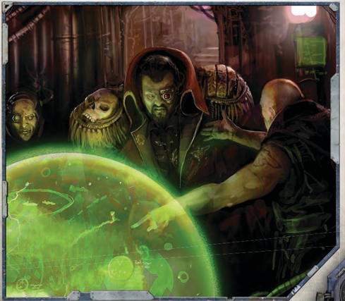

## The Fundamentals of Warp Navigation

Navigating  the  warp  in  game  terms  consists  of  a  number of  stages  at  which  the  Navigator  must  test  to  perceive  the nature of [The Warp](warp-imperial-space-travel.md) and then steer a course through it. These stages are:

- Stage One: · Determining Duration of Passage
- Stage Two: · Locating of the Astronomican
- Stage Three: · Charting the Course
- Stage Four: · Steering the Vessel
- Stage Five: · Leaving [The Warp](warp-imperial-space-travel.md)

Each of these stages and the tests requires are detailed below.

### Stage One: Determining Duration of Passage

The duration of a voyage is measured in subjective time; time as experienced by the Navigator and the crew of the vessel in days and hours of 'untroubled passage.' This calculation assumes that the vessel is following a favourable warp current and  operating  under  good  conditions.  If  all  goes  well  the voyage will pass in this time.

The base time of a voyage through [The Warp](warp-imperial-space-travel.md) is determined by  the  Game  Master  and  then  modified  by  how  well  the Navigator  steers  the  course  of  his  craft  (see Table  7-2: [Example](rules-tests.md) Durations of Passage ).

The figure is selected by the Games Master and kept secret from  the  Navigator  and  other  players,  though  a  Navigator may attempt  to  estimate  the  duration  of  passage  based  on what he knows of the course he must steer (see below); he might  be  right  or  he  may  be  wildly  incorrect  based  upon actual conditions in [The Warp](warp-imperial-space-travel.md) when the passage is attempted.

The duration of passage set by the GM is used as the base value for all of the subsequent stages of travel.

#### The Navigator's Estimate

A  Navigator  preparing  a  passage  he  is  familiar  with,  or  for which he has good navigational information, (such as a chart or navigational cipher), will have a good sense of how long it should take to arrive at his destination. In order to determine this, the Navigator can make a Navigation (Warp) Test (although what modifiers for difficulty apply and whether this is passed or failed should be kept secret by the GM).

If  he  passes,  the  GM should give him a roughly [Accurate](weapons-general.md) estimate  of  how  long  the  voyage  should  take  under  the expected conditions.

If he fails, then his estimate will be inaccurate, although just how much it is off by is up to the GM to determine, based on how badly the test was failed.

#### Going Into the Unknown

It is quite possible that a Navigator must plot a course to a location with which he is not familiar, in which case he may have no real idea of easy it will be to reach or how long it will take. In these circumstances, the GM should not give the Navigator an estimation of how long the journey may take beyond the roughest 'educated guess.'

#### The Passage of Time in Real Space

The subjective time experienced by those travelling through the  warp  is  different  from  that  that  passes  in  the  physical world.  The  amount  by  which  time  experienced  within  [The Warp](warp-imperial-space-travel.md) and real space varies is not fixed, but if it is necessary to calculate how much time has passed in the real world whilst a ship was in [The Warp](warp-imperial-space-travel.md), use a ratio of one day of passage in the

#### The Astronomican

It is only through the blessings of the Emperor and his blazing presence in the Immaterium that [Warp Travel](warp-imperial-space-travel.md) is made possible  across  the  breadth  of  the  Imperium.  Known as the Astronomican, a beacon lit by the Emperor's will projected out from the Golden Throne and fuelled by the psychic choir of martyrdom, this guiding star shines across the galaxy through the churning [Darkness](combat-special-circumstances.md) of [The Warp](warp-imperial-space-travel.md). It provides both a point of reference and a psychic lifeline to [Navigators](psychic-psyker-types.md), allowing them to find their way in the nightmare confusion of the Immaterium.| Table 7-2: Passage      | [Example](rules-tests.md) Durations of                                                                                                   |
|-------------------------|------------------------------------------------------------------------------------------------------------------------|
| Passage Within the Warp | [Example](rules-tests.md) Voyage                                                                                                         |
| 1 day                   | Short passage between two close systems by a well-travelled stable warp route.                                         |
| 5-10 days               | A journey between systems in the same sub-sector using [Accurate](weapons-general.md) navigational information.                              |
| 30-60 days              | Ajourney across the body of a full Imperial sector (such as Calixis) using [Accurate](weapons-general.md) information and known warp routes. |
| 100+ Days               | A perilous journey across a Segmentum at best speed avoiding only the worst known hazards.                             |
| Several Years           | An odyssey across the galaxy.                                                                                          |

'open warp' to 12 days passing in real space on average. The Game Master should, however, feel free to vary this ratio as he sees fit and on the most stable warp routes this should be less (even in 1 to 1 parity in some places), and in turbulent areas potentially  much  worse.  Factual  accounts  of  ships  arriving at  their  destination  centuries  late  are  thankfully  extremely rare, but known (and should never 'randomly' occur during the game). There have even been accounts of ships that have actually arrived at their destination before they have left!

### Stage Two: Location of the Astronomican

When  a  vessel  Translates  into  the  warp,  a  Navigator  must gauge the strength of the Astronomican, to judge just how far  and  in  what  direction  he  is  from  Terra  so  that  he  may then plot a course. To do this, he makes an Ordinary (+10) Awareness Test . For every degree of success achieved, add +10  to  any  Navigation  (Warp)  skill  tests  for  this  voyage, whilst for every degree of failure a -10 modifier is imposed instead. If the test is failed by three or more degrees of failure, the  Astronomican  cannot  be  located-the  Halo  Stars  are notorious for difficulties in finding the beacon's signal.

| Table 7-3:                  | Navigation Chart                                                              |
|-----------------------------|-------------------------------------------------------------------------------|
| Degrees of Success/ Failure | Result                                                                        |
| 3+ Degrees of Success       | Destination reached in a quarter of the duration set by the GM in Step 1      |
| 2 Degrees of Success        | Destination reached in half of the duration set by the GM in Step 1           |
| 1 Degree of Success         | Destination reached in three quarters of the duration set by the GM in Step 1 |
| Success                     | Destination reached in the duration set by the GM in Step 1                   |
| Failure                     | Destination reached in twice the duration set by the GM in Step 1             |
| 1 Degrees of Failure        | Destination reached in three times the duration set by the GM in Step 1       |
| 2+ Degrees of Failure       | Destination reached in four times the duration set by the GM in Step 1        |

In some rare cases, the Astronomican cannot be foundespecially turbulent warp storms and other unnatural phenomena may obscure its signal, or the Navigator's vessel may simply have travelled beyond the Astronomican's reach. If the Navigator cannot locate the beacon of the Astronomican, he must pass a Hellish (-60) Navigation (Warp) Test in order to chart a successful course. Without the Astronomican, the  Navigator  must  rely  upon  his  own  experience,  skill, and ancient charts of real-  and  warpspace  (some  especially [Accurate](weapons-general.md) charts may, at the GM's discretion, grant a bonus to this Test). If he fails the Test, the Navigator may not try again unless at the GM's discretion, or if a transient event (such as a warpstorm) ends.

### Stage Three: Charting the Course

Once the Navigator has a point of reference, he must then use his  extraordinary  perceptions  to  determine  any  turbulence, strange phenomena, or storms laying in wait in the Empyrean that  will  affect  the  passage  of  the  vessel  as  it  travels.  This is another Ordinary (+10) Perception Test , whose results are  kept  secret  by  the  GM.  Success  means  that  if  there  is any  significant  warp  disturbance  along  the  route  then  the Navigator has likely detected it, failure means that he has not. In either case, should the Navigator fail this roll, he will be ignorant of any dangers that lay ahead. The effects of this test will [Influence](economy-influence-rules.md) the chance of avoiding serious warp encounters (see page 185) during the voyage.

### Stage Four: Steering the Vessel

With  the  Astronomican  located  and  the  local  state  of  [The Warp](warp-imperial-space-travel.md) gauged, the Navigator now makes his Navigation roll to  determine  both  the  accuracy  of  his  voyage  and  travel time.  This  is  a  Navigation  (Warp)  Skill  Test  modified  by the  Navigator's  perception  of  the  Astronomican  (see  Stage

#### Gellar Field Failures in Game

How to represent a [Geller Field](starship-essential-components.md) failure is left up to the GM's imagination, but it should an utterly horrifying experience for players. They must quickly restore the [Geller Field](starship-essential-components.md) if they hope to survive, and even if they accomplish this, they will still be faced with a ship full of monstrous entities. The GM should feel free to pit them against all  manner  of  [Daemonic](character-traits.md)  adversaries,  in any monstrous and terrible forms he chooses.

Even if the players triumph, [Damage](character-injury.md) to their ship's Morale  should  be  severe,  and  depending  on  the severity of the failure, there could be severe [Damage](character-injury.md) to Crew Population as well (see page 224). If the battles were particularly ferocious, certain ship [Components](starship-anatomy-detailed.md) could be damaged, depressurized, or even in flames. For the players, killing the daemons may be just the beginning…### For the Gm: Difficulty of Passage

The Game Master should choose a duration of passage based  on  how  difficult  the  voyage  is  and  how  far away the intended destination. Travel through 'open warp''where  no  unusual  phenomena  or  turbulence occur should be a Routine (+20) Navigation test.

If the Navigator is using an established warp route or  corridor,  or  has  detailed  information  such  as  the secret charts found in a [Navis Prima](equipment-tools.md) (see page 146), the test should be considered Easy (+30).

Where passages are attempted Into the Unknown, or where general conditions in [The Warp](warp-imperial-space-travel.md) are known to adverse (prone to storms, etc.), tests should be Difficult (-10) or worse.

Alternatively, if the route is very well established and the Navigator has previously travelled it many times, the GM may decide that the Navigator need not make a roll at all nor test for Warp Travel Encounters (see Encounters in the Warp on page 186 in this section).

Two) and the general difficulty of the passage. Refer to the Navigation Chart to see the results of this test.

#### Off Course

If a Navigator fails his Navigation (Warp) test and rolls a 9 on either dice, he is thrown off course, the vessel will appear in the wrong system or part of space (as determined by the GM).

#### Encounters in the Warp

[Warp Travel](warp-imperial-space-travel.md) is seldom a routine and dull affair, and the Navigator must maintain constant vigilance lest  the  vessel  become  lost or imperilled. This peril increases the longer the vessel spends in [The Warp](warp-imperial-space-travel.md) and the further it travels. To reflect the perils of warp travel, the Navigator should make a roll on Table 7-4: Warp Travel Encounters (see page 185) once for every five full days of travel within the warp. If a journey takes under five days to complete, one roll on the Warp Travel Encounters table is still made. Each of the rolls for warp encounters gains a +20 bonus if the Navigator succeeded in the Perception test whilst Assessing Warp Conditions in Stage Three.

| Table 7-4: Warp Travel Encounters Roll Event   | Table 7-4: Warp Travel Encounters Roll Event                                                                                                                                                                         |
|------------------------------------------------|----------------------------------------------------------------------------------------------------------------------------------------------------------------------------------------------------------------------|
| 01-03                                          | Reality Erosion: The very fabric of the vessel is altered in some way. Walls might melt, statues and picture come to life or gravity itself may become twisted.                                                      |
| 04-09                                          | Plague of Madness: A general madness infects the crew, and without swift action bedlam can ensure. It will target the weakest of will first but can be spread by contact.                                            |
| 10-18                                          | Incursion: A [Daemonic](character-traits.md) entity slips aboard the vessel and sets out to wreak havoc. Particularly insidious warp creatures can hide on a ship for years masking their actions as bad luck and careless accidents.       |
| 19-26                                          | Lost Time: Time contracts and expands during the voyage, and though it may take but a few days, the crew will feel as if months or more has passed, fraying their sanity.                                            |
| 27-33                                          | Ghost Ships: The ship's [Sensors](starship-anatomy-detailed.md) detect phantom ships that appear and vanish randomly. Wise [Captains](imperial-starship-types.md) ignore such things, though if they are real, a vessel lost in the warp can still hold valuable cargo.            |
| 34-39                                          | Shoals and Reefs: The vessel runs afoul of a warp shoal or reef that threatens to break it open on a jagged fragment of false reality . A good helmsman and skilled Navigator are required to pass unscathed.        |
| 40-48                                          | Visitations: One or more of the crew find themselves visited by warp shades of lost friends or family. These lost souls might offer helpful advice and comfort or have darker motives.                               |
| 49-53                                          | Gellar Field Fluctuations: Alarmingly, the Gellar Field that keeps back the baleful energies of the warp begins to fluctuate. Hasty prayers to the Machine God or a return to realspace may be required.             |
| 54-67                                          | Warp Storm: A terrible warp storm strikes the vessel and may cause [Damage](character-injury.md) or throw it off course. Only the skills of the ship's Navigator will decide the outcome.                                                   |
| 68-75                                          | [Whispers](talents-descriptions.md) and Dreams: Everyone on board suffers from strange dreams and even hears hushed [Whispers](talents-descriptions.md) when awake. These might hold hidden truths or portents should the GM wish, or merely be mad ramblings form beyond. |
| 76-100                                         | All's Well: A safe journey that wise [Captains](imperial-starship-types.md) will savour.                                                                                                                                                           |

### Stage Five: Leaving the Warp

Once the Navigator's destination has been reached, he must make a Hard (-20) Perception Test to determine the accuracy of  his  entrance  point  in  real  space,  which  in  general  terms the Navigator can perceive from [The Warp](warp-imperial-space-travel.md) in a shadowy and indistinct fashion. Succeeding at this test means that the vessel exits [The Warp](warp-imperial-space-travel.md) were the Navigator intended. A failure means that the ship exits off target (dangerously close to a planetary body rather than in the outer reaches of a system for [Example](rules-tests.md)), with degrees of failure indicating a more extreme deviation.

## The Peril in the Warp

The officers and senior bosuns of a ship know more of the truth as do any raised among the void born, but take care to keep it to themselves. They know the Sea of Souls is more than just a haunted region of 'beyond'. They know that [The Warp](warp-imperial-space-travel.md) watches them, knows them, and worse, hungers for them. Above all, they know that anyone aboard a ship could become a conduit for some warp-spawned horror that could destroy

## Warp Travel Encounters

[The Warp](warp-imperial-space-travel.md) is a deeply strange and terrifying place filled with things  not  meant  for  the  mind  of  man.  As  Rogue  Traders, the  players  will  spend  a  great  deal  of  time  within  the  warp travelling from one place to another. The above table can be used in conjunction with the rules for navigating the warp, or simply to spice up sojourns in the immaterium and remind the players that there is no such thing as completely safe travel in the void…

Of all the dangers a starship may face, warp intrusion is the one that curdles even a seasoned voidsman's blood. For most aboard a starship, the Sea of Souls is a bizarre and terrible place. Nightmares and strange happenings are the low-berths' lot when a ship dives beneath its surface. There are tales of monsters and leviathans of the deep that hunt the Immaterium's currents, told between fearful [Voidsmen](crew-voidsmen.md) during dogswatch.

them all. Against the predations of the Immaterium, a star ship's only defence is its [Geller Field](starship-essential-components.md). This marvellous relic of the Dark Age of Technology generates a small bubble of reality around a starship [The Warp](warp-imperial-space-travel.md)'s denizens cannot pierce. By this, a starship may sail protected

through the perilous warp. Of course, no technology is infallible, and [Geller Fields](starship-essential-components.md) can fail. If the failure is momentary, the starship will find itself in the gravest danger. The smallest curdle of warp-stuff to sneak aboard can spawn a [Daemonic](character-traits.md) beast of terrible strength and ferocity or create nightmarish and ghostly phenomena that can wreck instruments and drive crewmen mad. If a warp entity that breaks through is weak, it may seek out an equally weak-minded soul to possess. If it is stronger, it may manifest unaided as a daemon and wreak havoc or forcibly twist and mutate victims to its nightmarish whims. In either case, the ship's compliment must respond quickly lest they lose all. Low-decks crew seal themselves in compartments behind barricaded bulkhead doors whilst [Ratings](crew-ratings.md), armsmen, and officers rally at the armoury. Then with [Shot](weapons-ammunition.md)-cannon, saber, and boarding flamer, teams of armsmen scour the vessel from prow to stern of [Daemonic](character-traits.md) taint. If they prove triumphant, the starship may survive to return to real space, if not it is likely to be lost. If a Geller Field's failure is permanent, however, it is very likely that the starship cannot survive.

186

*Source:* `Roguetrader Corerulebook, pages 184–187`
