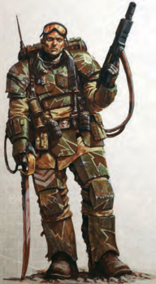

## Arrows/quarrels

Arrows and quarrels come in a variety of shapes, sizes and materials ranging from crude wooden shafts with flint tips to steel darts with razor-sharp points.

Used With: Bows, crossbows and hand bows.

## Shot

Shot is solid lead or stone balls and a powder [Charge](rules-combat-overview.md) used in [Primitive](weapons-general.md) blackpowder [Weapons](weapons-general.md).

Used With: Flintlock pistol and musket.

## Backpack Ammo Pack/power Pack

Many [Weapons](weapons-general.md) require larger [Ammunition](economy-wealth-and-acquisitions.md) sources to function during  large  battles  or  when  the  wearer  is  away  from  an extended supply line. A [Backpack](equipment-gear.md) power pack is worn like a normal [Backpack](equipment-gear.md). For energy [Weapons](weapons-general.md), it is a portable source of power in the form of a massive battery or [Charge](rules-combat-overview.md)-unit. For flame weapons, it is composed of tanks of volatile promethium. Other [Ammunition](economy-wealth-and-acquisitions.md) packs are simply stacks of regular stubber or bolt [Rounds](rules-combat-overview.md) with a feeder line that links into the weapon itself. These items hold 80 rounds of ammunition for Plasma, Melta, and Las weapons, 200 rounds of ammunition for SP or Bolt weapons, and 60 shots for Flame weapons. A weapon connected to a backpack power pack uses the power pack for its ammunition and ignores its normal clip [Size](character-traits.md). Backpack ammo packs or power packs weigh 25 kg.

| Table 5-10: Ammo Name   | [Availability](economy-availability-rules.md)   |
|-------------------------|----------------|
| Arrows/Quarrels         | Common         |
| Backpack Power Pack     | Rare           |
| Shot                    | Common         |
| Bullets                 | Plentiful      |
| Shells                  | Common         |
| Charge Pack (pistol)    | Common         |
| Charge Pack (basic)     | Common         |
| Charge Pack (heavy)     | Rare           |
| Fuel (pistol)           | Scarce         |
| Fuel (basic)            | Scarce         |
| Fuel (heavy)            | Scarce         |
| Bolt Shells             | Rare           |
| Melta Canister (pistol) | Very Rare      |
| Melta Canister (basic)  | Very Rare      |
| Melta Canister (heavy)  | Very Rare      |
| Plasma Flask (pistol)   | Rare           |
| Plasma Flask (basic)    | Rare           |
| Plasma Flask (heavy)    | Very Rare      |
| Exotic                  | Very Rare      |

| Table 5-11: Unusual Ammunition   | Table 5-11: Unusual Ammunition   |
|----------------------------------|----------------------------------|
| Name                             | [Availability](economy-availability-rules.md)                     |
| Amputator Shells                 | Extremely Rare                   |
| Bleeder Rounds                   | Rare                             |
| Dumdum Bullets                   | Scarce                           |
| Expander Rounds                  | Scarce                           |
| Explosive Arrows/Quarrels        | Scarce                           |
| Hot-Shot Charge Pack             | Scarce                           |
| Inferno Shells                   | Rare                             |
| Man-stopper Bullets              | Scarce                           |
| Tempest Bolt Shells              | Near Unique                      |

## Bullets

Hard [Rounds](rules-combat-overview.md) are common for many [Weapons](weapons-general.md) within the Imperium and vary greatly in calibre and design. Bullets from one kind of firearm cannot be used in another unless they are very similar in make. So for [Example](rules-tests.md) you could use bullets bought for a [Stub Revolver](weapons-general.md) in a stub automatic, but not in an autogun.

Used With: Autopistols, stub revolvers, stub automatics, hand cannons, autoguns, hunting rifles and heavy stubbers.

## Shells

Shells contain dozens of tiny balls and are designed to [Scatter](weapons-general.md) over a wide area when fired, making them ideal for close-in work where accuracy is less important.

Used With: Any [Shotgun](weapons-general.md).

## Charge Pack

[Charge](rules-combat-overview.md) packs are powerful batteries used almost exclusively  by  las  [Weapons](weapons-general.md).  The  cost  of  a charge pack varies depending on the classof  the  weapon.  In  all  cases,  it  provides  shots  equal  to  the weapon's full clip value.

Used With: Laspistols, lascarbines, lasguns, [Long-las](weapons-general.md), MP lascannons.

## Fuel

[Flame](weapons-general.md)  [Weapons](weapons-general.md)  use  liquid  fuel,  which  can  vary  greatly  in composition  and  quality  from  purest  promethium  to  crude flammable alcohols. The cost of fuel varies depending on the class of the weapon. In all cases, it provides shots equal to the weapon's full clip value.

Used With: Hand flamers, flamers, and heavy flamers.

## Bolt Shells

The mass-reactive explosive bolt shell is among the deadliest kind of round in the Imperial arsenal. However the difficulty and cost of its manufacture restricts its use to all but the most wealthy or well connected.

Used With: Bolt pistols, bolters, and heavy bolters.

## Melta Canister

Meltaguns use specially refined chemicals injected into highly pressurised  canisters.  The  cost  of  a  melta  canister  varies depending on the class of the weapon. In all cases, it provides shots equal to the weapon's full clip value.

Used With: Inferno pistols, meltaguns, and multi-meltas.

## Plasma Flask

Raw [Plasma](weapons-general.md) weapon fuel consists of highly dangerous and volatile photonic hydrogen, compressed and contained within reinforced flasks. In all cases, it provides shots equal to the weapon's full clip value.

Used  With: [Plasma](weapons-general.md) pistols, plasma guns, and plasma cannons.

## Exotic

There are many kinds of [Weapons](weapons-general.md) in the Imperium that use unusual types of [Ammunition](economy-wealth-and-acquisitions.md), from the viscous gel of a webber to the finely crafted darts of a needle pistol.

Used With: [Needle Pistols](weapons-general.md),  needle  rifles,  and  any  other exotic ranged weapons.

## Unusual Ammo

Not  all  munitions  are  created  equal,  and  there  are  many enhanced or unusual choices beyond the standard fare open to militants-a modest variety are presented here. Each type of  unusual  ammo  can  only  be  used  with  certain  [Weapons](weapons-general.md) as  detailed  in  its  [Description](career-path-format-guide.md),  and  only  one  kind  of [Ammunition](economy-wealth-and-acquisitions.md) can be used at a time (i.e. their effects can't be combined). Ammo weight is not listed; should it be  important  to  know  how  much  [Ammunition](economy-wealth-and-acquisitions.md) weighs, consider a weapon's full clip to weigh 10% of the weight of the weapon itself.

### Amputator Shells

Filled with explosive micro-shrapnel, these bullets are designed to shear flesh and shatter bone, causing limbs to be blown away .

Effects: Amputator Shells add 2 to the weapon's [Damage](character-injury.md).

Used With: Stub revolvers, stub automatics, shotguns (all types), hand cannons, autopistols, and autoguns.

### Bleeder Rounds

This [Ammunition](economy-wealth-and-acquisitions.md) is treated with toxins to prevent coagulation and keep [Wounds](character-injury.md) bleeding freely. These shells are designed to burst on penetration and spread the anti-coagulants quickly.

Effect: Bleeder  [Rounds](rules-combat-overview.md)  add  3  to  the  weapon's  [Damage](character-injury.md) against living 'biological' targets (targets with the [Daemonic](character-traits.md) or Machine [Traits](character-traits.md) do not suffer the additional Damage).

Used With: Stub revolvers, stub automatics, hand cannons, autopistols, and autoguns.

### Dumdum Bullets

These  heavy  blunt  bullets  are  designed  to  cause  maximum tissue [Damage](character-injury.md) and can tear apart soft targets, though they are less effective against [Armour](armour.md).

Effect: Dumdum bullets add 2 to the weapon's [Damage](character-injury.md), however [Armour](armour.md) Points count double against them.

Used  With: Stub  revolvers,  stub  automatics,  and  hand cannons.

### Expander Rounds

Vicious  and  outlawed  on  some  worlds,  these  dense  shells are designed to shred open after impact, creating huge exit [Wounds](character-injury.md).

Effect: Shots  fired  with  these  [Rounds](rules-combat-overview.md)  add  1  to  both [Damage](character-injury.md) and Penetration.

Used With: Stub revolvers, stub automatics, autopistols, and autoguns.

### Explosive Arrows and Quarrels

Explosive arrows and quarrels might be crudely tipped with shells, or treated with one of a variety of [Unstable](weapons-general.md) alchemical compounds.

Effects: Attacks are made with a -10 penalty, the weapon's [Damage](character-injury.md) type becomes Explosive, and the weapon loses the [Primitive](weapons-general.md) quality.

Used With : Bows, crossbows, and hand bows.

### Hot-shot Charge Pack

This  is  a  powerful  [Charge](rules-combat-overview.md)  pack  for  a  las  weapon,  favoured by snipers in some Imperial Guard regiments. Each hot-shot charge pack is good for only a single shot.

Effects: A weapon using a hot-shot [Charge](rules-combat-overview.md) adds 1 to its [Damage](character-injury.md), rolls two dice for its [Damage](character-injury.md) and picks the highest, and gains a Penetration of 4. However the weapon loses its [Reliable](weapons-general.md) special quality, and its clip is reduced to 1.

Used With: Laspistols, lascarbines, lasguns, and [Long-las](weapons-general.md).### Inferno Shells

These shells contain a volatile, clinging gel that ignites on contact with the target.

Effects: A target hit by an inferno shell must make an Agility Test or catch on fire, in addition to suffering damage as normal.

Used With: Shotguns, pump-action shotguns, combat shotguns, and all bolt weapons.

### Man-stopper Bullets

These densely tipped bullets are designed to punch through [Armour](armour.md).

Effects: A weapon using man-stopper [Rounds](rules-combat-overview.md) increases its Penetration to 3.

Used With: Stub revolvers, stub automatics, hand cannons, hunting rifles, autopistols, and autoguns.

### Tempest Bolt Shells

The mass-reactive explosive bolt shell is among the deadliest kind of round in the Imperial arsenal. Tempest bolt shells are perhaps the rarest variety, manufactured only in the temples of Mars. They contain a powerful miniaturised [Plasma](weapons-general.md)-shock generator that releases a pulse of electromagnetic and thermal energy as the shell detonates. They are particularly effective against machine targets, but obtaining them from the Machine Cult is a nigh-impossible task.

Effect: Change the weapon's [Damage](character-injury.md) class to Energy and the  weapon  gains  the  Shock  quality.  The  weapon  adds  3 [Damage](character-injury.md) when used against a target with the Machine Trait.

Used With: Bolt pistols, bolters, and heavy bolters.

*Source:* `Roguetrader Corerulebook, pages 136–138`
