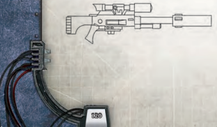
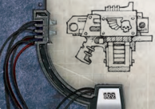
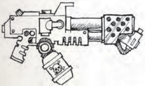
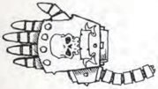

## A Galaxy of Guns

The  Imperium  is  vast,  and  amongst  its  billions  of inhabited  worlds  there  are  countless  forge  worlds, factories, craftsmen, artificers and blacksmiths turning out  weapons  and  [Armour](armour.md).  As  can  be  imagined  this produces  a  practically limitless variety  of  makes, patterns and brands. It would  be impossible to detail  each  and  every  different  make  of  weapon  in the  Imperium  (or  even  a  small  fraction  of  them),  so the  weapons,  [Armour](armour.md)  and  equipment  in  this  chapter represent the most common designs and designations. You can, of course, create the makes and patterns for your weapons as you see fit; after all, having a Gorgonpattern  H-12  Widowmaker  is  far  cooler  than  just  a stub revolver.## Weapon Special Qualities

Some  weapons  possess  special  qualities  to  represent  such things as special [Damage](character-injury.md) or unusual effects. The following is a list of the most widely used weapon qualities:

### Accurate

Some  weapons  are  designed  with  precision  in  mind  and respond superbly in skilled hands. They grant an additional bonus of +10 to the firer's Ballistic Skill when used with an [Aim](rules-combat-overview.md) Action in addition to the bonus granted from Aiming. When firing a single [Shot](weapons-ammunition.md) from a single Basic Weapon with the  Accurate  quality  benefiting  from  the  [Aim](rules-combat-overview.md)  action,  the attack gains an extra d10 of [Damage](character-injury.md) for every two degrees of success to a maximum of two extra d10.

### Balanced

Some weapons, such as swords and knives, are designed so that the weight of the hilt balances the weight of the blade, making the weapon easier to wield. Balanced weapons grant a +10 bonus to Weapon Skill Tests made to [Parry](rules-combat-overview.md).

### Blast (x)

Many missiles, grenades and some guns create an explosion when they hit their target. When working out a hit from a Blast  weapon  anyone  within  the  weapon's  blast  radius  in metres,  indicated  by  the  number  in  parenthesis,  is  also  hit. Roll Hit Location and [Damage](character-injury.md) individually for each person affected by a blast.

### Customised

The user has rebuilt and fined-tuned the weapon so he can operate it to his personal satisfaction. Reloading this weapon takes ½ the listed time, rounding up to the next full action (½ Action is still ½ Action).

### Defensive

A Defensive weapon, such as a shield, is intended to be used to block attacks and is awkward when used to make attacks. Defensive weapons grant a +15 bonus to tests made when used to [Parry](rules-combat-overview.md), but take a -10 penalty when used to make attacks.

### Flame

Flame weapons project a cone of flame out to the range of the weapon. Unlike other weapons, flamers have just one range, and  when  fired,  cast  fiery  death  out  to  this  distance.  The wielder does not need to Test Ballistic Skill; he simply fires the weapon. All creatures in the flame's path, a cone-shaped area extending in a 30 degree arc from the firer out to the weapon's range, must make an Agility Test or be struck by the flames and take [Damage](character-injury.md) normally. If they take [Damage](character-injury.md),

### Weapon Craftsmanship

All the weapons detailed here are  of  Common [Craftsmanship](components-craftsmanship.md). For weapons of better or worse manufacture use the following modifiers:

Poor: These cheaply constructed ranged weapons are  more  [Prone](combat-special-circumstances.md)  to  malfunction.  A  ranged  weapon of  Poor  [Craftsmanship](components-craftsmanship.md)  has  the  Unreliable  quality.  If the weapon already has this quality then it will jam on  any  failed  rolled  to  hit.  Melee  weapons  of  Poor craftsmanship  incur  a  -10  penalty  to  tests  made  to [Attack](combat-attack-rules.md) and [Parry](rules-combat-overview.md).

Good: More  carefully  constructed  and  finished, these weapons are consequently more reliable. Ranged weapons  of  Good  craftsmanship  have  the  Reliable quality. If it already has this quality there is no further effect  beyond  the  obvious  fine  workmanship  of  the weapon. Melee weapons of Good craftsmanship add a +5 bonus to tests made to attack. If a weapon normally has  the  Unreliable  quality,  a  Good  craftsmanship version of that weapon does not become Reliable; the two qualities  cancel  each  other  out  and  the  weapon ends up possessing neither.

Best: A work of art as much as a weapon, these items are created by skilled artisans and are often centuries old.  Ranged  weapons  of  Best  craftsmanship  never suffer  from  jamming  or  overheating.  If  a  roll  would result in either of these occurrences, simply count it as a miss instead. Melee weapons of Best craftsmanship add a +10 bonus to tests made to attack and add 1 to the [Damage](character-injury.md) they inflict.

they  must  succeed  on  a  second  Agility  Test  or  be  set  on fire. [Cover](combat-special-circumstances.md) does not protect characters from attacks made by Flame weapons. Normally when a weapon is fired without the appropriate Weapon Training Talent or a heavy weapon is fired without bracing, the wielder suffers a -20% or -30% penalty respectively to his Ballistic Skill Test. When a weapon with  the  flame  quality  is  fired  by  a  wielder  who  does  not possess the appropriate Weapon Training Talent, anyone in the weapon's area of effect gains a +20% bonus to his Agility Test to avoid [Damage](character-injury.md). This bonus rises to +30% if the flame weapon is heavy and the wielder is not braced.

Because Flame weapons make no roll to hit, they are always considered to hit targets in the body, and will Jam if the firer rolls a 9 on his Damage dice (before adding any bonuses).

### Flexible

Some  weapons,  such  as  whips,  are  made  up  from  lots  of loosely connected segments, such as chains or supple woven hides. These kinds of weapons lash about when used to [Attack](combat-attack-rules.md) and cannot be Parried.### Inaccurate

Weapons with this quality are either badly designed or simply woefully made, and regardless of the care taken when used, offer  little  better  than  a  lucky  chance  to  hit.  No  bonus  is gained from the use of the [Aim](rules-combat-overview.md) Action with such weapons.

### Overheats

Certain  weapons  are  [Prone](combat-special-circumstances.md)  to  overheating,  either  because  of  poor design or because they fire unstable superheated [Ammunition](economy-wealth-and-acquisitions.md). A weapon with the Overheats special quality overheats on an [Attack](combat-attack-rules.md)  roll  of  91  or  higher.  When  a  weapon  overheats,  the wielder suffers energy [Damage](character-injury.md) equal to the weapon's [Damage](character-injury.md) with a penetration of 0 to an arm location (the arm holding the weapon if the weapon was fired one-handed, or a random arm if the weapon was fired with two hands). The wielder may choose to avoid taking the damage by dropping the weapon. Dropping a weapon is a Free Action. A weapon that overheats must spend the round afterwards cooling down and may not be fired again until the second round after overheating. A weapon with this quality does not Jam, and any effect that would cause the weapon to Jam (i.e., certain psychic powers) instead causes the weapon to overheat.

### Power Field

A field of power wreathes weapons with this quality, increasing their  [Damage](character-injury.md)  and  Penetration.  Such  modifiers  are  already included in the weapon's profile. When you successfully use this  weapon  to  [Parry](rules-combat-overview.md)  an  [Attack](combat-attack-rules.md)  made  with  a  weapon  that lacks this quality, you have a 75% chance of destroying your attacker's weapon. Weapons with [The Warp](warp-imperial-space-travel.md) Weapon Quality and [Natural Weapons](character-traits.md) are immune to this effect.

### Primitive

Crude and basic in design, these kinds of weapons, while still deadly, are less effective against modern [Armour](armour.md). All [Armour](armour.md) Points are doubled against hits from Primitive weapons, unless the  armour  also  has  the  Primitive  quality.  Non-Primitive armour doubles its APs before being reduced for penetration.

### Recharge

Because of the volatile nature of the weapon's [Ammunition](economy-wealth-and-acquisitions.md) or due to the way it fires, the weapon needs time between shots to Recharge. The weapon must spend the Round after firing building up a [Charge](rules-combat-overview.md) and cannot be fired-in effect you can only fire the weapon every other Round.

### Reliable

Based  on  tried  and  true  technology,  Reliable  weapons seldom fail. If a Reliable [Weapon Jams](combat-special-circumstances.md), roll 1d10 and only on a roll of 10 has it in fact Jammed, otherwise it just misses as normal.

### Using Weapons Without a Talent

Many of the weapons described in this chapter require a Talent to use them effectively; lacking the necessary ability makes weapons particularly dangerous to employ. Still, there are bound to be circumstances when a character needs to use a weapon for which he does not have the Talent. Doing so imposes a -20 penalty on the relevant Test. If the weapon has the Flame special quality, the target is granted a +20 to his Agility Test to avoid being hit instead. In addition, when a ranged weapon  is  used  untrained,  it  counts  as  having  the Unreliable quality, increasing its chance of jamming.

### Scatter

The standard [Ammunition](economy-wealth-and-acquisitions.md) of these weapons spreads out when fired, hitting more of the target. If fired at a foe within Point Blank  range,  each  two  degrees  of  success  the  firer  scores indicates another hit (use Table 9-5: Multiple Hits on page 239 ). However, at longer ranges this spread of small projectiles reduces its effectiveness. All [Armour](armour.md) Points are doubled against hits from scatter weapons at Long or [Extreme Range](combat-special-circumstances.md).

### Shocking

Shocking weapons can Stun their opponents with a powerful surge of energy. A target that takes at least 1 point of [Damage](character-injury.md) from  a  Shocking  weapon,  after  [Armour](armour.md)  and  Toughness Bonus, must make a Toughness Test, though he receives a +10 bonus for every [Armour](armour.md) point he has on the location hit. If he fails, he is [Stunned](character-injury.md) for a number of [Rounds](rules-combat-overview.md) equal to half the Damage he suffered.

### Smoke

These weapons throw up dense clouds of smoke to create [Cover](combat-special-circumstances.md). When a hit is scored from a weapon with the Smoke quality, it creates a smokescreen 3d10 metres in diameter from the point of impact. This screen lasts for 2d10 [Rounds](rules-combat-overview.md), or less in adverse weather conditions (see the effects of Smoke on page 248).

### Snare

Weapons with this quality are designed to entangle enemies. On a successful hit, the target must make an Agility Test or be immobilised. An immobilised target can attempt no other actions except to try to [Escape](combat-escape-action.md) the bonds. He can attempt to burst the bonds (a Strength Test) or wriggle free (an Agility Test) in his Turn. The target is considered helpless until he escapes.### Storm

A weapon with the Storm Quality doubles the amount of hits inflicted  on  the  target.  For  [Example](rules-tests.md),  when  firing  a  weapon with the Storm Quality in fully automatic mode, each degree of success will yield two additional hits (up to the weapon's firing rate, as normal).

### Tearing

Tearing weapons are vicious devices, often using multitudes of fast-moving jagged teeth to rip into flesh and bone. These weapons roll one extra die for [Damage](character-injury.md), and the lowest result is discarded.

### Toxic

Some weapons rely on toxins and poisons to do their [Damage](character-injury.md). Anyone  that  takes  [Damage](character-injury.md)  from  a  Toxic  weapon,  after reduction  for  [Armour](armour.md)  and  Toughness  Bonus,  must  make  a Toughness Test with a -5 penalty for every point of Damage taken.  Success  indicates  there  is  no  further  effect  from  the weapon. Failure however deals an immediate 1d10 points of Impact Damage to the target with no reduction from [Armour](armour.md) or Toughness Bonus.

### Twin-linked

A  twin-linked weapon  represents two  identical  weapons connected together and linked to fire at the same time, often through one pull of the trigger or push of a button. Twin-linked weapons are built this way in order to increase the chances of scoring a hit through the crude expedience of blasting more shots  at  the  target.  A  weapon  with  the  Twin-linked  Quality gains a +20% bonus to hit when fired and uses twice as much [Ammunition](economy-wealth-and-acquisitions.md). In addition, the weapon may score one additional hit if [The Attack](rules-combat-overview.md) roll succeeds by two or more degrees of success. Lastly, the weapon's [Reload](rules-combat-overview.md) time is doubled.

### Unbalanced

Heavy and difficult to [Ready](rules-combat-overview.md) after an [Attack](combat-attack-rules.md), these kinds of weapons impose a -10% penalty when used to [Parry](rules-combat-overview.md).

### Unreliable

Certain weapons misfire more often than normal because they are badly maintained or constructed. An Unreliable weapon suffers a Jam on a roll of 91 or higher, even if fired on Semior Full Auto.

### Unstable

Weapons with this quality use [Ammunition](economy-wealth-and-acquisitions.md) that is both volatile and  unstable  and  can  react  unpredictably  when  detonated. When an Unstable weapon scores a hit, roll 1d10. On a score of 1 it inflicts only half [Damage](character-injury.md), on a score of 2-9 it deals normal [Damage](character-injury.md), and on a score of 10 it inflicts  twice  the normal Damage.

### Unwieldy

Huge  and  often  top-heavy,  Unwieldy  weapons  are  too awkward to be used defensively. Unwieldy weapons cannot be used to [Parry](rules-combat-overview.md).

## Las Weapons

Produced by the millions on countless forge-worlds, laser or 'las' weapons are by far the most numerous type of weapon in the Imperium as they are the basic tool of the countless soldiers  of  the  Imperial  Guard.  While  somewhat  complex to manufacture, their STC template is well known and their extreme ruggedness and ease of use makes them the perfect weapon for the Hammer of the Emperor. Las weapons can be found on almost any planet even outside the Imperium, and amongst many xeno mercenary tribes.

Las weapons work by emitting short, sharp pulses of laser energy  from  high  capacity  fast-discharge  generators,  with a  flash  of  light  and  a  distinctive  snap  like  the  cracking  of a  whip as the trigger is pulled. Though they are produced in a multitude of different styles and patterns depending on the  home  world  of  manufacture,  most  use  a  very  common Departmento Munitorum sanctioned power pack. The liquid metal  core  of  the  pack  stores  vast  amounts  of  energy,  and can be recharged from standard power sources or even via exposure to intense light or heat in a pinch. In emergencies they can even be recharged by placing them in an open fire, though this diminishes the lifespan of the pack and increases its failure rate.

To use the various classes of las weapons a character must have the Pistol Training (Las), [Basic Weapon Training](talents-descriptions.md) (Las) or [Heavy Weapon Training](talents-descriptions.md) (Las) talents.

### Recharging Power Packs

A reason for the large number of las weapons in the Imperium  is  the  relative  abundance  of  [Ammunition](economy-wealth-and-acquisitions.md). Las  power  packs  can  be  charged  in  the  field  from most power sources. Characters may make a Tech-Use Test to successfully [Charge](rules-combat-overview.md) any power pack if there is a suitable power source available. The time the pack takes to [Charge](rules-combat-overview.md) is determined by the power output of the source and is ultimately up to the GM, but typically takes  several  hours.  Alternatively,  power  packs  may be  charged  by  placing  them  in  an  open  flame.  This however takes at least a day and permanently reduces the clip [Size](character-traits.md) by half (this only occurs the first time it is charged in this way) as well as removing a las weapon's Reliable  special  quality,  or  giving  it  the  Unreliable special quality if it was not Reliable to start with. Each time a pack is recharged in this way there is a 30% chance it will be permanently rendered useless.Table 5-4: Ranged Weapons

| Las Weapons Name         | Class                    | Range                    | RoF                      | [Damage](character-injury.md)                   | Pen                      | Clip                     | Rld                      | Special                         | kg                       | [Availability](economy-availability-rules.md)             |
|--------------------------|--------------------------|--------------------------|--------------------------|--------------------------|--------------------------|--------------------------|--------------------------|---------------------------------|--------------------------|--------------------------|
| Archeotech Laspistol     | Pistol                   | 90m                      | S/3/-                    | 1d10+3 E                 | 2                        | 70                       | Full                     | Accurate, Reliable              | 4                        | Near Unique              |
| Belasco Dueling Pistol   | Pistol                   | 45m                      | S/-/-                    | 1d10+5 E                 | 4                        | 1                        | Full                     | Accurate                        | 1.5                      | Very Rare                |
| Hellpistol (Lucius)      | Pistol                   | 35m                      | S/2/-                    | 1d10+4 E                 | 7                        | 40                       | 2 Full                   |                                 | 4                        | Rare                     |
| Hellgun (Lucius)         | Basic                    | 110m                     | S/3/-                    | 1d10+4 E                 | 7                        | 30                       | 2 Full                   |                                 | 6                        | Rare                     |
| Las Gauntlets            | Pistol                   | 50m                      | S/4/-                    | 1d10+4 E                 | 1                        | 20                       | Full                     | Reliable                        | 3                        | Very Rare                |
| Lascarbine (Locke)       | Basic                    | 60m                      | S/2/-                    | 1d10+3 E                 | 0                        | 40                       | 2 Full                   | Reliable                        | 2.5                      | Scarce                   |
| Lasgun                   | Basic                    | 100m                     | S/3/-                    | 1d10+3 E                 | 0                        | 60                       | Full                     | Reliable                        | 4                        | Common                   |
| Laspistol                | Pistol                   | 30m                      | S/-/-                    | 1d10+2 E                 | 0                        | 30                       | Full                     | Reliable                        | 1.5                      | Common                   |
| Long-las                 | Basic                    | 150m                     | S/-/-                    | 1d10+3 E                 | 1                        | 40                       | Full                     | Accurate, Reliable              | 4.5                      | Scarce                   |
| Man Portable Lascannon   | Heavy                    | 300m                     | S/-/-                    | 5d10+10 E                | 10                       | 5                        | 2 Full                   |                                 | 55                       | Very Rare                |
| Solid Projectile Weapons | Solid Projectile Weapons | Solid Projectile Weapons | Solid Projectile Weapons | Solid Projectile Weapons | Solid Projectile Weapons | Solid Projectile Weapons | Solid Projectile Weapons | Solid Projectile Weapons        | Solid Projectile Weapons | Solid Projectile Weapons |
| Name                     | Class                    | Range                    | RoF                      | Dam                      | Pen                      | Clip                     | Rld                      | Special                         | kg                       | [Availability](economy-availability-rules.md)             |
| Autogun                  | Basic                    | 90m                      | S/3/10                   | 1d10+3 I                 | 0                        | 30                       | 2 Full                   | -                               | 3.5                      | Average                  |
| Autopistol               | Pistol                   | 30m                      | S/-/6                    | 1d10+2 I                 | 0                        | 18                       | Full                     | -                               | 2.5                      | Common                   |
| Hand Cannon              | Pistol                   | 35m                      | S/-/-                    | 1d10+4 I                 | 2                        | 5                        | 2 Full                   | -                               | 3                        | Average                  |
| Heavy Stubber (Orthlack) | Heavy                    | 120m                     | -/-/10                   | 1d10+5 I                 | 3                        | 200                      | 2 Full                   | -                               | 35                       | Average                  |
| Heavy Stubber (Ursid)    | Heavy                    | 120m                     | -/-/10                   | 1d10+5 I                 | 3                        | 40                       | Full                     | -                               | 35                       | Scarce                   |
| Naval Pistol (Mars)      | Pistol                   | 20m                      | S/3/-                    | 1d10+4 I                 | 0                        | 6                        | Full                     | Tearing                         | 3                        | Scarce                   |
| Naval Shotcannon         | Heavy                    | 40m                      | S/3/-                    | 2d10+4 I                 | 0                        | 24                       | 2 Full                   | Scatter, Unreliable             | 7                        | Scarce                   |
| Pump-Action Shotgun      | Basic                    | 30m                      | S/-/-                    | 1d10+4 I                 | 0                        | 8                        | 2 Full                   | Scatter                         | 5                        | Average                  |
| Shotgun                  | Basic                    | 30m                      | S/-/-                    | 1d10+4 I                 | 0                        | 2                        | 2 Full                   | Scatter                         | 5                        | Common                   |
| Shotgun Pistol           | Pistol                   | 10m                      | S/-/-                    | 1d10+4 I                 | 0                        | 1                        | Full                     | Reliable, Scatter               | 1                        | Average                  |
| Stub Automatic           | Pistol                   | 30m                      | S/3/-                    | 1d10+3 I                 | 0                        | 9                        | Full                     | -                               | 1.5                      | Plentiful                |
| Stub Revolver            | Pistol                   | 30m                      | S/-/-                    | 1d10+3 I                 | 0                        | 6                        | 2 Full                   | Reliable                        | 1                        | Plentiful                |
| Bolt Weapons             | Bolt Weapons             | Bolt Weapons             | Bolt Weapons             | Bolt Weapons             | Bolt Weapons             | Bolt Weapons             | Bolt Weapons             | Bolt Weapons                    | Bolt Weapons             | Bolt Weapons             |
| Name                     | Class                    | Range                    | RoF                      | Dam                      | Pen                      | Clip                     | Rld                      | Special                         | kg                       | Availability             |
| Boltgun (Locke)          | Basic                    | 90m                      | S/2/4                    | 1d10+5 X                 | 4                        | 24                       | Full                     | Tearing                         | 7                        | Very Rare                |
| Bolt Pistol (Ceres)      | Pistol                   | 30m                      | S/2/-                    | 1d10+5 X                 | 4                        | 8                        | Full                     | Tearing                         | 3.5                      | Rare                     |
| Storm Bolter (Mars)      | Basic                    | 90m                      | S/2/4                    | 1d10+5 X                 | 4                        | 60                       | Full                     | Storm, Tearing                  | 9                        | Extremely Rare           |
| Heavy Bolter (Solar)     | Heavy                    | 120m                     | -/-/10                   | 2d10+2 X                 | 5                        | 60                       | Full                     | Tearing                         | 40                       | Very Rare                |
| Melta Weapons            | Melta Weapons            | Melta Weapons            | Melta Weapons            | Melta Weapons            | Melta Weapons            | Melta Weapons            | Melta Weapons            | Melta Weapons                   | Melta Weapons            | Melta Weapons            |
| Name                     | Class                    | Range                    | RoF                      | Dam                      | Pen                      | Clip                     | Rld                      | Special                         | kg                       | Availability             |
| Inferno Pistol (Mars)    | Pistol                   | 10m                      | S/-/-                    | 2d10+8 E                 | 13                       | 3                        | Full                     |                                 | 2.5                      | Very Rare                |
| Meltagun (Mars)          | Basic                    | 20m                      | S/-/-                    | 2d10+8 E                 | 13                       | 5                        | 2 Full                   |                                 | 40                       | Rare                     |
| Meltagun (Mezoa)         | Basic                    | 20m                      | S/-/-                    | 2d10+8 E                 | 13                       | 10                       | 3 Full                   |                                 | 46                       | Rare                     |
| Thermal Lance (Mars)     | Heavy                    | 10m                      | S/-/-                    | 2d10+10 E                | 12                       | 2                        | 2 Full                   | Accurate                        | 40                       | Rare                     |
| Multi-Melta (Mars)       | Heavy                    | 60m                      | S/3/-                    | 4d10+5 E                 | 13                       | 10                       | 2 Full                   | Blast (1)                       | 40                       | Very Rare                |
| Plasma Weapons           | Plasma Weapons           | Plasma Weapons           | Plasma Weapons           | Plasma Weapons           | Plasma Weapons           | Plasma Weapons           | Plasma Weapons           | Plasma Weapons                  | Plasma Weapons           | Plasma Weapons           |
| Name                     | Class                    | Range                    | RoF                      | Dam                      | Pen                      | Clip                     | Rld                      | Special                         | kg                       | Availability             |
| Plasma Pistol (Ryza)     | Pistol                   | 30m                      | S/2/-                    | 1d10+6 E                 | 6                        | 10                       | 3 Full                   | Overheat                        | 4                        | Very Rare                |
| Plasma Gun (Mezoa)       | Basic                    | 90m                      | S/2/-                    | 1d10+7 E                 | 6                        | 40                       | 5 Full                   | Overheat                        | 18                       | Very Rare                |
| Plasma Cannon (Ryza)     | Heavy                    | 120m                     | S/-/-                    | 2d10+10 E                | 8                        | 16                       | 5 Full                   | Blast (1), Overheat, Unreliable | 40                       | Very Rare                |
| Flame Weapons            | Flame Weapons            | Flame Weapons            | Flame Weapons            | Flame Weapons            | Flame Weapons            | Flame Weapons            | Flame Weapons            | Flame Weapons                   | Flame Weapons            | Flame Weapons            |
| Name                     | Class                    | Range                    | RoF                      | Dam                      | Pen                      | Clip                     | Rld                      | Special                         | kg                       | Availability             |
| Hand Flamer (Mezoa)      | Pistol                   | 10m                      | S/-/-                    | 1d10+4 E                 | 2                        | 2                        | 2 Full                   | Flame                           | 3.5                      | Rare                     |
| Flamer (Mezoa)           | Basic                    | 20m                      | S/-/-                    | 1d10+4 E                 | 2                        | 6                        | 2 Full                   | Flame                           | 6                        | Scarce                   |
| Heavy Flamer (Locke)     | Heavy                    | 30m                      | S/-/-                    | 2d10+4 E                 | 4                        | 10                       | 2 Full                   | Flame                           | 20                       | Rare                     || Table 5-4: Ranged Weapons (Cont) Primitive Weapons   | Table 5-4: Ranged Weapons (Cont) Primitive Weapons   | Table 5-4: Ranged Weapons (Cont) Primitive Weapons   | Table 5-4: Ranged Weapons (Cont) Primitive Weapons   | Table 5-4: Ranged Weapons (Cont) Primitive Weapons   | Table 5-4: Ranged Weapons (Cont) Primitive Weapons   | Table 5-4: Ranged Weapons (Cont) Primitive Weapons   | Table 5-4: Ranged Weapons (Cont) Primitive Weapons   | Table 5-4: Ranged Weapons (Cont) Primitive Weapons   | Table 5-4: Ranged Weapons (Cont) Primitive Weapons   | Table 5-4: Ranged Weapons (Cont) Primitive Weapons   |
|------------------------------------------------------|------------------------------------------------------|------------------------------------------------------|------------------------------------------------------|------------------------------------------------------|------------------------------------------------------|------------------------------------------------------|------------------------------------------------------|------------------------------------------------------|------------------------------------------------------|------------------------------------------------------|
| Name                                                 | Class                                                | Range                                                | RoF                                                  | [Damage](character-injury.md)                                               | Pen                                                  | Clip                                                 | Rld                                                  | Special                                              | kg                                                   | Availability                                         |
| Bolas                                                | Thrown                                               | 10m                                                  | S/-/-                                                | -                                                    | 0                                                    | 1                                                    | -                                                    | Primitive, Snare, Inaccurate                         | 1.5                                                  | Average                                              |
| Bow                                                  | Basic                                                | 30m                                                  | S/-/-                                                | 1d10 R                                               | 0                                                    | 1                                                    | Half                                                 | Primitive, Reliable                                  | 2                                                    | Common                                               |
| Crossbow                                             | Basic                                                | 30m                                                  | S/-/-                                                | 1d10 R                                               | 0                                                    | 1                                                    | 2 Full                                               | Primitive                                            | 3                                                    | Common                                               |
| Hand Bow                                             | Pistol                                               | 15m                                                  | S/-/-                                                | 1d10 R                                               | 0                                                    | 1                                                    | Full                                                 | Primitive                                            | 1                                                    | Rare                                                 |
| Flintlock Pistol                                     | Pistol                                               | 15m                                                  | S/-/-                                                | 1d10+2 I                                             | 0                                                    | 1                                                    | 3 Full                                               | Primitive, Unreliable, Inaccurate                    | 4                                                    | Common                                               |
| Musket                                               | Basic                                                | 30m                                                  | S/-/-                                                | 1d10+2 I                                             | 0                                                    | 1                                                    | 5 Full                                               | Primitive, Unreliable, Inaccurate                    | 7                                                    | Common                                               |
| Sling                                                | Basic                                                | 15m                                                  | S/-/-                                                | 1d10-2 I                                             | 0                                                    | 1                                                    | Full                                                 | Primitive                                            | 0.5                                                  | Plentiful                                            |
| Launchers                                            | Launchers                                            | Launchers                                            | Launchers                                            | Launchers                                            | Launchers                                            | Launchers                                            | Launchers                                            | Launchers                                            | Launchers                                            | Launchers                                            |
| Name                                                 | Class                                                | Range                                                | RoF                                                  | Damage                                               | Pen                                                  | Clip                                                 | Rld                                                  | Special                                              | kg                                                   | Availability                                         |
| Grenade Launcher (Mezoa)                             | Basic                                                | 80m                                                  | S/-/-                                                | †                                                    | †                                                    | 1                                                    | Half                                                 | †                                                    | 10                                                   | Scarce                                               |
| Grenade Launcher (Voss)                              | Basic                                                | 60m                                                  | S/-/-                                                | †                                                    | †                                                    | 6                                                    | Full                                                 | † , Inaccurate                                       | 12.5                                                 | Scarce                                               |
| Missile Launcher (Locke)                             | Heavy                                                | 250m                                                 | S/-/-                                                | †                                                    | †                                                    | 1                                                    | Full                                                 | †                                                    | 12                                                   | Scarce                                               |
| Missile Launcher (Retobi)                            | Heavy                                                | 200m                                                 | S/-/-                                                | †                                                    | †                                                    | 5                                                    | 2 Full                                               | †                                                    | 35                                                   | Rare                                                 |
| † Varies with [Ammunition](economy-wealth-and-acquisitions.md) † Varies with ammunition †  | † Varies with ammunition † Varies with ammunition †  | † Varies with ammunition † Varies with ammunition †  | † Varies with ammunition † Varies with ammunition †  | † Varies with ammunition † Varies with ammunition †  | † Varies with ammunition † Varies with ammunition †  | † Varies with ammunition † Varies with ammunition †  | † Varies with ammunition † Varies with ammunition †  | † Varies with ammunition † Varies with ammunition †  | † Varies with ammunition † Varies with ammunition †  | † Varies with ammunition † Varies with ammunition †  |

### Belasco Dueling Pistol

While  certainly  lethal,  Belasco  dueling  pistols  more  often serve  as  ostentatious  displays  of  wealth  and  status  than  as field  weapons.  Most  can  only  fire  one  powerful  las-blast before needing a [Reload](rules-combat-overview.md), but they are extremely accurate over longer ranges.

<!-- image -->

### Hellpistol and Hellgun (lucius-pattern)

Sometimes also known as 'hot-[Shot](weapons-ammunition.md)' weapons, hellguns are almost  exclusively  used  by  high  ranking  Imperial  officers and elite  forces  who  favour  the  higher  power  over  regular las weapons. While hellguns are rarely seen outside of elite Storm Trooper units, hellpistols can be seen among many of the officer corps and Inquisitorial agencies where the extra hitting power they provide over a regular laspistol often means the difference between their life and failure to the Emperor. Lucius-pattern weapons use a 10 kg [Backpack](equipment-gear.md) power source rather  than  a  standard  plug-in  pack,  even  for  the  smaller hellpistol.  Larger  power  packs  mean  greater  power  behind each [Shot](weapons-ammunition.md) but make reloading more impractical, which is a trade off most are willing to take. Hellguns can also be linked to larger [Backpack](equipment-gear.md) power sources (see page 135).

<!-- image -->

### Lasgun

Produced in a multitude of different styles and patterns, the lasgun can be found on almost every world of the Imperium, where its robust design and dependability make it a favoured weapon of both the Emperor's faithful and many of their foes.

<!-- image -->

### Laspistol

The laspistol is most commonly used by  lower  ranking  Imperial  officers and  agents.  On  many  worlds  it  is common for almost every member of common for almost every member of

<!-- image -->

society to be armed with one as a matter of course. Almost every forge-world has their own pattern and style, as the basic weapon is so simple that it allows a multitude of variations.### Laspistol (archeotech)

Sometimes  known  as  lasrods  and gelt  guns,  these  ancient  designs pack much greater range and

power.  It  can  be  fired  like  a  pistol,  though  many  also  can mount folding stocks and longer barrels allow the weapon to be braced two handed for a more accurate [Shot](weapons-ammunition.md). It is also more efficient than most las weapons, getting more shots per [Charge](rules-combat-overview.md).  Rare  and  arcane,  few  outside  of  Rogue  Traders  or collectors would ever know of-let alone possess-one, but many regard these weapons as statements of rank and status in the Expanse.

### Lascarbine (locke-pattern)

A lighter, cut down version of the lasgun, the lascarbine has fewer shots and a shorter range but is easier to carry and [Aim](rules-combat-overview.md), often coming with a folding stock. Lascarbines can be fired in one hand with only a -10 penalty rather than the normal -20 for basic weapons.

### Las Gauntlets

It  is  still  debated  whether  these  devices  are  of  xeno  manufacture or an intact pattern from the Dark Age of Technology. Each fits over the forearm with glove controls, and can fire salvos of  long  raking  beams  rather  than  the  short  crisp  blasts  of most las weapons. They are mostly viewed as a plaything for rich  nobles  on  the  hunt  for  [Exotic](weapons-ammunition.md)  prey  of  any  type  (even xenos or humans), but some assassins favour the gauntlets as an affectation designed to frighten.

### Long-las

Favoured by snipers, the long-las is a  specially  modified  version of the lasgun constructed for added range and accuracy. As its name implies, a long-las also has a much longer barrel than a lasgun both to increase range and prevent overheating. This can make a long-las up to twice as long as a standard lasgun, making it unwieldy in close quarters.

### Man Portable Lascannon

Built for war, lascannons use huge power packs that provide enough energy to punch holes in the thickest [Armour](armour.md) even at extreme ranges. Lascannons also require separate power packs, which is why they are often crewed by two or more people.

## Solid Projectile Weapons

Commonly  known  as  slug-throwers, these weapons  are exceedingly plentiful across the Imperium. Most alien races have their own versions as well, for both technology and manufacture are fairly simple. Citizens of all types commonly carry one kind or another for their basic protection or livelihood.

### Autogun

Cheap and easy to produce, autoguns are a common weapon across  the  galaxy  as  even  alien  races  acquire  and  use  them or sometimes make their own equivalents. These rapid-firing automatic weapons use common solid low-calibre [Shells](weapons-ammunition.md) fed via  standardised  clips.  Reliable,  rugged,  and  easily  stocked with [Ammunition](economy-wealth-and-acquisitions.md), they are a mainstay on many a planet.

### Autopistol

Small but effective, autopistols are a favourite amongst many military veterans  as  a  supplement  for  their standard lasgun. They have a faster

rate of fire than most pistols, and can put down most targets in a single burst of [Shells](weapons-ammunition.md).

### Hand Cannon

A  variant  of  the  stub  gun  is  the huge hand cannon, used mostly by enforcers  or  bounty  hunters  who aren't  picky  on  the  state  of  their

quarry. These weapons kick with a strong recoil and, unless used with two hands or a Recoil Glove, impose a -10 penalty on Ballistic Skill Tests.### Heavy Stubber

Heavy stubbers are popular amongst military forces and gangers alike,  as  they  are  one  of  the  more  easily  maintained  heavy weapons available. Though not as powerful as an autocannon, heavy stubbers can lay down a curtain of suppressive fire and cut  swaths  though light infantry and vehicles alike. As with other  stubber  weapons,  [Ammunition](economy-wealth-and-acquisitions.md)  is  cheap  and  plentiful. Lighter than most other heavy weapons, the heavy stubber is commonly used hand-held but a bipod mount can be employed by  those  seeking  to  avoid  the  jarring  recoil.  The  Orthlackpattern, manufactured for planetary defence force armouries in the  Calixis  sector  and  widely  exported,  uses  an  [Ammunition](economy-wealth-and-acquisitions.md) belt  which  allows  for  long  firing  periods,  while  the  locally copied 'Ursid' pattern supposedly originating on the war world of Zayth is more [Compact](weapons-upgrades.md) and uses a smaller ammunition drum which most users find easier to port and [Reload](rules-combat-overview.md).

<!-- image -->

### Naval Pistol (mars-pattern)

The naval officer's standard sidearm is a variant of the basic autopistol that uses fragmenting [Ammunition](economy-wealth-and-acquisitions.md) designed to stop a target dead in its tracks, at the expense of range. Most Imperial ships engrave the vessel's name on the stock, making those from famous naval warships extremely valuable (if  illegal)  to  wealthy  collectors  from  high  society  and  the nobility.  Note  that  without  its  special  [Ammunition](economy-wealth-and-acquisitions.md)  (which cannot be combined with other types) the weapon's attacks lose the Tearing quality.

### Naval Shotcannon

These much larger variants of a regular shotgun fire a huge shell (nearly twice the normal [Size](character-traits.md)) and can lay waste to large hordes of attackers. A close range hit from one can literally explode a man into a burst of shredded [Clothing](equipment-gear.md) and flesh. As imagined they generate tremendous recoil and must be mounted down or fired from a braced position to be effective.

### Shotgun (pump-action)

Common amongst enforcers, mercenaries, and [Raiders](hulls-overview.md), these weapons are robust and practical, holding more [Shells](weapons-ammunition.md) than a regular shotgun. The distinctive sound of a new round being chambered into a pump shotgun has lead to many a scummer fleeing or a [Colonist](rules-allies-enemies-rivals.md)'s surrender before the [Shot](weapons-ammunition.md) can be fired.

<!-- image -->

### Shotgun

Even low-tech manufactories can produce these basic weapons in great quantities, and their ability to hit several targets with a  single  [Shot](weapons-ammunition.md)  make  shotguns  appealing  to  those  with  little actual skill in shooting. Their relatively [Short Range](combat-special-circumstances.md) and low [Shot](weapons-ammunition.md) velocity makes them appealing for shipboard use as well, as they have little risk of causing [Hull](starship-anatomy-detailed.md) breaches.

<!-- image -->

### Shotgun Pistol

Also known as a 'Foehammer,' this weapon is s squat, brutal looking weapon with an extremely short barrel in a pistol configuration resembling a single-[Shot](weapons-ammunition.md) hand cannon. It can fire a standard shotgun shell, and is popular with many naval ship's officers as well as crew chiefs who need an intimidating weapon  close  at  hand.  Due  to  the  recoil,  it  applies  a  -10 penalty to Ballistic Skill Tests unless fired with two hands or a Recoil Glove.

### Stub Automatic

Unlike  the  Stub  revolver,  this  pistol weapon  also  can  fire  in  rapid  semiautomatic mode as well as single shots.

<!-- image -->

Like the autopistol it is easy to produce and maintain, but less accurate at longer ranges.

### Stub Revolver

Perhaps  the  most  ancient  of  pistol designs, the stub revolver carries fewer [Rounds](rules-combat-overview.md) than most pistols but is fewer [Rounds](rules-combat-overview.md) than most pistols but is

<!-- image -->

very reliable  and  easy  to  operate.  As  [Shells](weapons-ammunition.md)  can  be  inserted individually, it is relatively easy to load in specialised rounds when needed.

## Bolt Weapons

The bolter is the premier weapon of the Imperium, and in itself a sign of status and respect. Many are ancient heirlooms passed  through  generations  as  part  of  a  family's  sacred heritage.  While  most  models  are  designed  for  the  superhuman Space Marines, some are specially crafted with smaller grips and lighter construction for normal humans. These are rarely  as  exquisitely  fashioned  as  Astartes  weapons  but  are much easier to operate for the vast majority of the Emperor's subjects. Cheaper models can also be found on black markets and backwater planets, but generally fail quickly due to the specialised nature of their [Ammunition](economy-wealth-and-acquisitions.md). Loud and brutal, they are a terrifying weapon to see in action.

Bolter  weapons  fire  self-propelled  mass-reactive  [Shells](weapons-ammunition.md) called bolts, set to explode just after penetration for maximum lethality.  Overall  they  are  superb  if  temperamental  devices requiring  skilled  maintenance  using  only  the  most  properrituals  and  blessings.  Bolter  [Ammunition](economy-wealth-and-acquisitions.md)  is  expensive  and difficult to manufacture, and only the elite of the Imperium have [Ready](rules-combat-overview.md) access. The standard bolter round is .75 calibre with a super-dense metallic core and diamantine tip; other variant [Shells](weapons-ammunition.md) exist for specialised purposes, such as penetrating [Armour Plating](starship-supplemental-components.md) or conducting silent assassinations. To use the various  classes  of  bolt  weapons  a  character  must  have  the Pistol Training (Bolt), [Basic Weapon Training](talents-descriptions.md) (Bolt) or [Heavy Weapon Training](talents-descriptions.md) (Bolt) talents.

### Bolt Pistol (ceres-pattern)

Bolt  pistols  are  rare  outside  of  elite Imperial  forces,  and  possessing  one  is a  sign  of  status  and  power.  They  are Bolt  pistols  are  rare  outside  of  elite a  sign  of  status  and  power.  They  are

sometimes passed down through the generations, becoming valuable heirlooms for noble families. Adorned with elaborate scrollwork and family crests these devices are more relic than weapon in some dynasties. The Ceres-pattern is one associated with The Imperial Navy and perhaps fittingly enough the one found most often in the arsenals of Rogue traders.

### Boltgun (locke-pattern)

The most common bolter weapon is the boltgun or bolter. Care and maintenance is a matter of supreme importance to an owner of such a weapon, and many have outlasted a long line of bearers. The Locke-pattern weapon is a variant of an old Adeptus Arbites design and the most 'common' of these uncommon weapons found traded in the Koronus Expanse, although  how  it  came  first  to  be  manufactured  remains something of a mystery.

### Storm Bolter (mars-pattern)

Storm Bolters arose from experiments in combining weapons together  to  achieve  greater  rates  of  fire.  Here,  two  linked bolters form a single weapon which can shred most foes in a single burst. Rarely seen outside of the elite Astartes, most Storm  Bolters  are  relic-weapons  covered  with  glyphs  and purity seals that speak of their ancient origin.

### Heavy Bolter (solar-pattern)

Heavy bolters are a common heavy weapon in the armed forces of the Imperium. Used for anti-infantry and support rolls, they can lay down impressive swathes of fire, able to slaughter enemy troopers and destroy light vehicles with their explosive armourpiercing [Rounds](rules-combat-overview.md). Each uses much larger versions of the standard bolt shell with more propellant and greater range. Like all bolter weapons they require careful and regular maintenance, along with ancient litanies to appease the weapon's spirit. Jamming is often a problem due to their high rate of fire, and when used in two-man teams the loader can expect to be clearing [Shells](weapons-ammunition.md) as well as loading new [Ammunition](economy-wealth-and-acquisitions.md) packs or feed belts.

## Melta Weapons

Melta weapons emit devastatingly intense but short-ranged blasts of heat which can melt through almost any material. Also known as cookers or melters, most types of melta induce highly pressurised gases from an [Ammunition](economy-wealth-and-acquisitions.md) canister into an unstable sub-molecular state and direct the resulting energies down the barrel. Melta usage is accompanied by a distinctive hissing sound as the beam boils away the water in the air, then a roaring blast as the beam reduces the target to charred scraps  or  molten  slag.  Meltas  are  the  premier  anti-[Armour](armour.md) weapons, and few if any vehicles can withstand their power. To use the various classes of melta weapons a character must have  the  Pistol  Training  (Melta),  Basic  Weapon  Training (Melta), or [Heavy Weapon Training](talents-descriptions.md) (Melta) talents.

### Inferno Pistol (mars-pattern)

The  inferno pistol represents very specialised  and  ancient  technology,  almost  impossible  to recreate.  Mere  handfuls  might  exist  in  any  sector,  each jealously guarded. The  inferno pistol represents very

### Meltagun (mars- and Mezoa-pattern)

Meltaguns are the most common form of melta weapon and are found in many Imperial forces. As they are less [Prone](combat-special-circumstances.md) to failure than plasma guns and work best at shorter ranges, they are also prized by [Raiders](hulls-overview.md) and corsairs where close-in fighting and boarding actions are often the norm. It is an ideal weapon for cutting through bulkheads or [Armour](armour.md). Most use a builtin [Fuel](weapons-ammunition.md) canister like the Mars-pattern, but the Mezoa forgeworld version using a [Backpack](equipment-gear.md) is also common.<!-- image -->

### Multi-melta (mars-pattern)

The largest type of melta weapon is the multi-melta, usually only  employed  by  the  Adeptus  Astartes  or  mounted  upon Imperial vehicles. This huge weapon carries more [Fuel](weapons-ammunition.md), fires at much longer ranges, and creates a larger blast area, cooking several square metres at a time. It also generates much more heat  than  its  smaller  cousins,  and  most  users  must  insulate themselves with protective [Clothing](equipment-gear.md) or [Armour](armour.md).

### Thermal Lance (mars-pattern)

The  thermal  lance  is  a  rare  weapon,  nearly  as  large  as  a standard  multi-melta.  It  fires  a  more  accurate  and  directed heat beam using a much longer barrel with added directional containment beams to reduce dispersal, at the cost of lowered [Damage](character-injury.md) to the target.

## Plasma Weapons

Plasma weapons represent an almost-lost art for the Imperium, their secrets known to but a handful of the inner circle of The Adeptus Mechanicus and their tech-[Adept](rules-allies-enemies-rivals.md) artisans. Existing weapons  must  be  carefully  maintained  and  passed  down generation to generation with each operator carefully ensuring all proper blessings of the Machine God are bestowed before use.

Plasma weapons work using hydrogen [Fuel](weapons-ammunition.md) suspended in a photonic state in either [Fuel](weapons-ammunition.md) flasks or [Backpack](equipment-gear.md) containers. As the fuel is fed into the miniature fusion core inside the weapon the hydrogen energises into a plasma state, held in the  core  by  powerful  magnetic  confinement  fields.  When fired,  the  fields  dilate  open  and  the  plasma  is  ejected  via  a linear  magnetic  accelerator  in  a  bolt  of  superheated  matter akin to a solar flare in appearance and temperature. For this reason plasma weapons are also known as 'sun guns.' To use the various classes of plasma weapons a character must have the Pistol Training (Plasma), [Basic Weapon Training](talents-descriptions.md) (Plasma) or [Heavy Weapon Training](talents-descriptions.md) (Plasma) talents.

### Firing Plasma Weapons

Plasma  weapons  can  be  used  in  two  firing  modes-single [Shot](weapons-ammunition.md)  (the  normal  and  safest  method),  or  a  higher  powered blast  with  a  longer  range  and  higher  temperature.  The latter though requires a short recharge time to replenish the plasma and bring it to firing levels; this time will vary with the level of precision technology used in construction. Like most Imperial devices the older it is the better it is; the more ancient  [Craftsmanship](components-craftsmanship.md)  almost  always  indicates  the  superior design. Imperial plasma weapons can fire in Maximal mode, gaining an extra 10 metres to range, 1d10 to [Damage](character-injury.md) and +2 Pen, but use 3 [Rounds](rules-combat-overview.md) of [Ammunition](economy-wealth-and-acquisitions.md). When fired on the Maximal setting, plasma weapons gain the Recharge Quality. Additionally, plasma weapons with the Blast Quality firing in Maximal add +2 to the Blast (so a Ryza-pattern plasma cannon would fire a Blast (3) on Maximal setting).

### Plasma Pistol (ryzapattern)

Few  pistols  are  deadlier  than  the plasma pistol, and those willing to take the risk of using one possess a weapon capable of taking down almost any foe at close range. Plasma pistols are a favourite weapon of Imperial officers, who view it as a status symbol to be entrusted with such a valuable and venerated weapon. It can only hold smaller hydrogen flasks (or sometimes only a single flask) and thus can only fire a handful of shots. They are dangerous to use on board a vessel, as a single [Shot](weapons-ammunition.md) can penetrate several bulkheads. Few  pistols  are  deadlier  than  the

<!-- image -->

### Plasma Gun (mezoa-pattern)

This is a squad-support weapon intended for use by battlefleet armsmen, which has subsequently found extensive use in the private  cadres  of  many  Rogue  Traders  and  with  renegades and pirates wealthy or fortunate enough to acquire them.

<!-- image -->

### Plasma Cannon (ryza-pattern)

The  largest  portable  plasma  weapon  is  the  plasma  cannon or heavy plasma gun, which is also seen in service on some Imperial  war  machines.  Rather  than  using  attached  flasks, the wielder wears a large [Backpack](equipment-gear.md) containing the weapon's store of hydrogen [Fuel](weapons-ammunition.md). This weapon has a much longer range and [Ammunition](economy-wealth-and-acquisitions.md) supply, and its violent discharges, hurled like miniature suns from the barrel, have a large impact area. It can also be fired in a special Maximal mode which exhausts even more [Fuel](weapons-ammunition.md) but provides an even larger blast of heat on impact, creating a fireball capable of destroying even armoured targets.

## Flame Weapons

As the name suggests these weapons operate by firing gouts of flame at the target, not only an effective means of smiting the enemy but also serving as a very visual reminder of the cleansing  flames  brought  forth  in  the  Emperor's  name.  As such they are a favoured weapon amongst the zealots of the Imperial Creed, as well as many fringe cults and gangs to be found in Imperial space.

Flame  weapons  use  a  [Fuel](weapons-ammunition.md)  generically  referred to as promethium, though it can also be homemade  concoctions  or  other  chemical  brews depending  on  the  local  technology  level.Most are a mono-propellant [Fuel](weapons-ammunition.md) which ignites via a smaller pilot flame at the tip of the barrel, though some flamers use binary hypergolic fuels. Once produced, the intense jet that spurts from the barrel creates a torrent of liquid fire, which spreads out in an inferno that burns even underwater, leaving enemies hard pressed to put out the fire. To use the various classes  of  flame  weapons  a  character  must  have  the  Pistol Training (Flame), [Basic Weapon Training](talents-descriptions.md) (Flame) or [Heavy Weapon Training](talents-descriptions.md) (Flame) talents.

### Hand Flamer (mezoa-pattern)

Flame pistols or hand flamers are small and good for only several  shots,  being  designed  for  personal  [Combat](rules-combat-overview.md)  at  close ranges. Each uses a canister mounted under the small barrel, making  it  a  somewhat  difficult  to  [Aim](rules-combat-overview.md)  due  to  the  heavy propellant  case.  Luckily  the  short  ranged  spray  of  flame  it produces is enough to deal with most enemies.

### Flamer (mezoa-pattern)

The  flamer  or  flame  gun  is  ideal  for  flushing  out  enemies in  [Cover](combat-special-circumstances.md)  and  cleansing  areas  with  purifying  flame.  Many armsmen and pirates favour heavier Mezoa versions copied by heretek armourers in the Expanse. This version has a weaponmounted canister as it allows for faster refuelling and easier use while wearing a [Void Suit](equipment-gear.md) if needed.

### Heavy Flamer (locke-pattern 'hellsent')

Heavy flamers are large and cumbersome, normally only used on vehicles, power armoured users or teams of troopers. Like the basic flamer pattern, Locke Heavy Flamers use heavy tanks carried on a [Backpack](equipment-gear.md) (which also helps ensure they are not in the direct line of incoming [Shells](weapons-ammunition.md)). The twin nozzles produce huge  gouts  of  fire,  enough  to  purge  the  densest  terrain  of xeno taint.

## Primitive Weapons

Even in the 41st Millennium low-tech weapons can be found on many newly discovered planets where either technology is still emerging or has collapsed back to a primitive state. Many an Explorer has found it useful to maintain proficiency with such weapons, for they can often [Surprise](starship-combat-rules.md) a more sophisticated foe. To use the various classes of primitive weapons a character must have the appropriate Weapon Training talents.

### Bolas

Bolas  are  sometimes  preferred  by  bounty  hunters  or  law enforcement members on low-tech worlds, where the swirling weights-some styles use up to eight of these dense objectscan swiftly entangle a target with heavy cords or wire with minimal chance of lethal [Damage](character-injury.md) to their pay check.

### Bow

Bows  have  changed  little  through  their  many  countless centuries of usage, and can be found across the galaxy in a variety  of  designs  and  constructions.  Many  technologically advanced worlds still favour their use as a sign of individual marksmanship and skill.

### Crossbow

Crossbows are a higher tech, mechanical version of a bow, with a smaller [Size](character-traits.md) but often harder hitting strike. They take more time to  [Reload](rules-combat-overview.md)  but  generally  require  less  skill  to  use, making them more attractive to many explorers where more advanced weapons cannot be found or re-supplied. Crossbows are a staple weapon on many feral and Feudal Worlds along with those that have suffered collapse and tech-regression.

### Hand Bow

This  weapon  offers  the  hitting  power  of  a  crossbow  but in  a  pistol  grip,  suitable  for  one-handed  operation  but  at shorter ranges. Assassins often favour them for their ease of concealment and storage, while many of the void born use simple spring-pistols for self defence.

### Flintlock Pistol

These primitive black powder weapons can take many forms, from finely crafted pistols constructed for the nobles of Feudal Worlds to simple pipe and powder affairs used by underhive [Scum](rules-allies-enemies-rivals.md).

### Musket

These crude devices can only fire once before reloading, are [Prone](combat-special-circumstances.md) to failure, and only the most low-tech savage or desperate [Renegade](chargen-stage2-origin-path.md) would generally fight with one. When they do strike, however, they are deadly against un-armoured foes.

### Sling

Slings are easy to create and conceal, and can be used to hurl any suitable object: rocks picked off the ground, specialised metallic balls, even grenades. When using a sling to throw grenades, replace the sling's [Damage](character-injury.md) with the effects of the grenade but reduce the weapon's range to 7 metres. A jam roll in this case will mean an additional roll (see page 126).## Launchers

Many Rogue Traders have found the simple grenade to be a wonderful equaliser in [Combat](rules-combat-overview.md). Grenades are usually also small and easily concealed-an additional bonus for initial negotiations  with  heathens  or  aliens.  Most  grenades  are standard munitions used by countless Imperial Guard forces, but as explorers who deal with a multitude of agencies and xeno  races  Rogue  Traders  have  access  to  a  wider  range, including rare and [Exotic](weapons-ammunition.md) munitions only rumoured to exist.

The  main  drawback  to  grenades  is  that  their  range  is limited to how far they can be thrown, so launcher weapons designed  to  propel  modified  grenades  and  explosives  are necessary to [Attack](combat-attack-rules.md) a more distant enemy.

To use the various classes of launchers a character must have the Pistol Training (Launcher), [Basic Weapon Training](talents-descriptions.md) (Launcher),  or  Heavy  Weapon  Training  (Launcher)  talents. Setting explosives requires the Demolition skill (see Chapter Iii: Skills, page 80 ).

### Grenade Launcher

Grenade  launchers  can  fire  a  variety  of  grenade  types  but generally at a shorter range than other basic weapons due to the heavier nature of their payload. Unlike most weapons they can be fired in arcing shots designed to clear obstructions and strike farther into an enemy formation as well as simply being fired directly at foes. The common Voss design holds a clip of six [Rounds](rules-combat-overview.md), but most find the weapon inaccurate even for a launcher. The [Forge World](chargen-stage2-origin-path.md) of Mezoa produces what many believe a superior shoulder-mounted weapon with a longer range,  for  though  it  is  a  single  [Shot](weapons-ammunition.md)  device  it  has  superior firing systems and is highly accurate.

<!-- image -->

### Missile Launcher

Like the grenade launcher, missile launchers fire a variety of explosive  [Rounds](rules-combat-overview.md)  at  long  distances.  A  missile  is  fitted  with stabilisation  and  guidance  systems  to  aid  in  their  accuracy, which  is  excellent  at  long  ranges.  Most  launchers,  like  the Locke-pattern, are shoulder mounted tube-like weapons that fire a single round at great accuracy, while the ancient Retobi design  holds  a  huge  vertical  clip  of  5  [Rounds](rules-combat-overview.md)  but  is  much more awkward to fire and has less precision.

<!-- image -->

## Grenades and Missiles

All of the grenades listed here can either be thrown by hand or used in a grenade launcher.

### Anti-plant

These grenades release a wide range of toxic and viral agents that quickly reduce almost any type of flora to a foul-smelling muck that deprives the enemy of [Cover](combat-special-circumstances.md) while not seriously harming  other  materials.  Larger  versions  are  also  used  to create improvised landing zones and clear foliage for quick camp sites or building locations.

### Blind

Blind  grenades  explode  with  a  burst  of  dense dark grey smoke including IR bafflers and broadband EM spectrum chaff, all designed to block eyesight and even advanced visual detection. The effect is short-lived, but while it lasts it provides an excellent [Cover](combat-special-circumstances.md) for advancing forces.

### Frag

Fragmentation or frag grenades and missiles are filled  with  [Shot](weapons-ammunition.md),  heavy  wire,  or  metallic  shards to create high velocity shrapnel fragments when they  explode,  making  them  deadly  when  used against infantry.

### Egerian Geode

Recovered from xenos crystalline maze-cities, these grenades are filled with compacted shards of diamantine glass. On detonation the area is showered with cutting projectiles, which can slide through most [Armour](armour.md).

<!-- image -->

<!-- image -->

<!-- image -->

### Hallucinogen

These grenades induce a variety of short-lived psychological states. Anyone within 10 metres of  a  detonating  hallucinogen  grenade  must succeed on a Difficult (-10) Toughness Test or be overcome with delusions and hallucinations for 1d10 [Rounds](rules-combat-overview.md). Respirators and sealed [Armour](armour.md) provide a +20 bonus to this Test. When the character is  first  affected  by  a  hallucination  grenade,  roll  on Table 5-5: Hallucinogen Effects, page 126 to see how the character behaves for the next 1d10 [Rounds](rules-combat-overview.md). psychological states. Anyone within 10 metres

### Krak

Krak  grenades  and  missiles  use  concentrated explosives to punch holes in armoured targets such as vehicles or bunkers. The powerful detonations do  not  produce  a  blast  effect  however,  making them impractical for use against most infantry or other moving targets. do  not  produce  a  blast  effect  however,  making

<!-- image -->

<!-- image -->### Throwing Grenades

Throwing  grenades  requires  no  special  training  or Talents  and  is  resolved  using  a  Ballistic  Skill  Test including any modifiers (such as range). On a miss, the thrown grenade goes in a random direction-see the scatter diagram on page 248.

WheN a gReNade 'jams'

Whenever  a  jam  results  from  throwing  a  grenade or  firing  a  grenade  launcher  or  similar  weapon  (see Weapon  Jams,  page  249 ),  something  unfortunate has happened. Roll 1d10. On any result other than 10, the  explosive  is  simply  a  dud  and  nothing  happens. On a 10, the explosive detonates immediately with the effect centred on the attacker. If the explosive was fired from a launcher, it detonates in the barrel, having its normal effect as well as destroying the weapon.

### Photon Flash

Photon flash or simply flash grenades detonate like  a  small  star,  blinding  anyone  nearby  and overloading most vision protection systems such as visors. Those caught without eye protection are usually left temporarily [Blinded](character-injury.md) and defenceless. Photon flash or simply flash grenades detonate like  a  small  star,  blinding  anyone  nearby  and overloading most vision protection systems such

### Plasma

These  use  a  deliberate  plasma  containment  failure,  causing a blast of heat and light to burst forth like a miniature sun. They are highly lethal against almost all targets.

### Smoke

A primitive version of the blind grenade, these release a dense smoke which only obscures basic eyesight and optical based systems. They do not block detection systems that use heat or other spectral bands outside of normal human eyesight, but are much more widely available and easier to construct.

### Stun

Stun grenades use a combination of a loud explosive and a flash  of  light  to  momentarily incapacitate targets before an assault is launched. They are designed for non-lethal uses and generally  cause  no  lasting  [Injury](character-injury.md).  Anyone  caught  in  a  stun grenade's blast must pass a Challenging (+0) Toughness Test or become [Stunned](character-injury.md) for 1d5 [Rounds](rules-combat-overview.md). Photo-visors and sealed [Armour](armour.md) provide a +20 bonus to this Test.

### Virus

Virus grenades house powerful biological toxins which can break down biological systems in moments before leaping to neighbouring creatures to infect them. They can quickly kill scores of people before mutating into a non-lethal strain or running out of victims near enough to be attacked.

### Xeno Filament

The  [Exotic](weapons-ammunition.md)  filament  grenade  carries  compressed  segments of monomolecular wire that expand into a cloud of deadly razor-sharp  filaments  on  detonation,  slicing  through  flesh and bone.

| Table 5-5: Hallucinogen Effects   | Table 5-5: Hallucinogen Effects                                                                                                                                                                                                                                                                                                                              |
|-----------------------------------|--------------------------------------------------------------------------------------------------------------------------------------------------------------------------------------------------------------------------------------------------------------------------------------------------------------------------------------------------------------|
| Roll                              | Effect                                                                                                                                                                                                                                                                                                                                                       |
| 01-10                             | Bugsbugsbugsbugs! The character drops to the floor, flailing and screaming as he tries to claw off imaginary insects. The character counts as being [Stunned](character-injury.md).                                                                                                                                                                                                 |
| 11-20                             | My hands…! The character believes his hands have turned into slimy tentacles, or perhaps the flesh has begun to strip off the bone in bloody lumps. Regardless of the particulars, the character drops everything he is carrying and spends the duration staring at his hands and screaming. The character counts as being [Stunned](character-injury.md).                          |
| 21-30                             | They're coming through the walls! The character sees gruesome aliens bursting through the walls/ceiling/floor/ bushes and opens fire. The character must spend each Turn firing at a random piece of terrain within his line of sight. Any creatures caught in the line of fire are subject to attacks as normal. Each round, choose a new target at random. |
| 31-40                             | Nobody can see me! The character believes he is invisible and wanders aimlessly, pulling faces at those around him. He waddles about in random directions each round, using a Full Action to move. The character retains his [Reactions](rules-combat-overview.md).                                                                                                                      |
| 41-50                             | I can fly! The sky looks so big and inviting, the character flaps his arms trying to imitate a ptera-squirrel. He may do nothing but jump up and down on the spot. If he is standing above ground level, he may throw himself off in a random direction, with the usual consequences for falling-appalling damage or death being the most usual outcomes.    |
| 51-60                             | They've got it in for me… The character is overcome with [Paranoia](talents-descriptions.md), believing even his own comrades are out to get him. On the character's Turn, he must move to a position of [Cover](combat-special-circumstances.md), getting out of line of sight from any other characters.                                                                                                                 |
| 61-70                             | They got me, mother… The character believes that the gas is toxic and collapses to the floor as if dead-he counts as being helpless. Others who see him 'die' must pass an Intelligence Test or they think the character is dead too.                                                                                                                        |
| 71-80                             | I'll take you all on! The character is filled with a burning rage and a desire for violence. The character enters a [Frenzy](talents-descriptions.md) (see page 98) and attacks the closest opponent.                                                                                                                                                                                   |
| 81-90                             | I'm only little! The character believes he has shrunk to half his normal [Size](character-traits.md), and everything else is big and frightening now. All other characters count as having a [Fear](character-fear-and-damnation.md) Rating of 3 to the character.                                                                                                                                                     |
| 91-00                             | The worms! The character desperately tries to remove a massive fanged worm he thinks is slowly winding its way up and around his leg. He attacks one of his own legs (choose randomly) with whatever weapon is available. That [Attack](combat-attack-rules.md) hits automatically and deals normal damage.                                                                            |

<!-- image -->| Table 5-6: Grenades and Missiles                                                                                | Table 5-6: Grenades and Missiles                                                                                | Table 5-6: Grenades and Missiles                                                                                | Table 5-6: Grenades and Missiles                                                                                | Table 5-6: Grenades and Missiles                                                                                | Table 5-6: Grenades and Missiles                                                                                | Table 5-6: Grenades and Missiles                                                                                | Table 5-6: Grenades and Missiles                                                                                |
|-----------------------------------------------------------------------------------------------------------------|-----------------------------------------------------------------------------------------------------------------|-----------------------------------------------------------------------------------------------------------------|-----------------------------------------------------------------------------------------------------------------|-----------------------------------------------------------------------------------------------------------------|-----------------------------------------------------------------------------------------------------------------|-----------------------------------------------------------------------------------------------------------------|-----------------------------------------------------------------------------------------------------------------|
| Name                                                                                                            | Class                                                                                                           | Range                                                                                                           | RoF                                                                                                             | Dam                                                                                                             | Pen Special                                                                                                     | kg                                                                                                              | [Availability](economy-availability-rules.md)                                                                                                    |
| Anti-Plant                                                                                                      | Thrown                                                                                                          | SBx3                                                                                                            | S/-/-                                                                                                           | 3d10 E †                                                                                                        | 0                                                                                                               | Blast (3) 0.5                                                                                                   | Very Rare                                                                                                       |
| Blind                                                                                                           | Thrown                                                                                                          | SBx3                                                                                                            | S/-/-                                                                                                           | -                                                                                                               | 0 Smoke                                                                                                         | 0.5                                                                                                             | Rare                                                                                                            |
| Filament                                                                                                        | Thrown                                                                                                          | SBx3                                                                                                            | S/-/-                                                                                                           | 4d10+4 R                                                                                                        | 6 Blast                                                                                                         | (1), Tearing 0.5                                                                                                | Extremely Rare                                                                                                  |
| Frag                                                                                                            | Thrown                                                                                                          | SBx3                                                                                                            | S/-/-                                                                                                           | 2d10 X                                                                                                          | 0 Blast (4)                                                                                                     | 0.5                                                                                                             | Common                                                                                                          |
| Frag Missile                                                                                                    | -                                                                                                               | -                                                                                                               | -                                                                                                               | 2d10 X                                                                                                          | 4 Blast (6)                                                                                                     | 1                                                                                                               | Average                                                                                                         |
| Geode                                                                                                           | Thrown                                                                                                          | SBx3                                                                                                            | S/-/-                                                                                                           | 2d10+3 R                                                                                                        | 4 Blast                                                                                                         | (3) 0.5                                                                                                         | Extremely Rare                                                                                                  |
| Hallucinogen                                                                                                    | Thrown                                                                                                          | SBx3                                                                                                            | S/-/-                                                                                                           | -                                                                                                               | 0 -                                                                                                             | 0.5                                                                                                             | Rare                                                                                                            |
| Krak                                                                                                            | Thrown                                                                                                          | SBx3                                                                                                            | S/-/-                                                                                                           | 2d10+4 X                                                                                                        | 6 -                                                                                                             | 0.5                                                                                                             | Rare                                                                                                            |
| Krak Missile                                                                                                    | -                                                                                                               | -                                                                                                               | -                                                                                                               | 3d10+10 X                                                                                                       | 10 Blast (1)                                                                                                    | 1                                                                                                               | Scarce                                                                                                          |
| Photon Flash                                                                                                    | Thrown                                                                                                          | SBx3                                                                                                            | S/-/-                                                                                                           | Special                                                                                                         | 0 -                                                                                                             | 0.5                                                                                                             | Rare                                                                                                            |
| Plasma                                                                                                          | Thrown                                                                                                          | SBx3                                                                                                            | S/-/-                                                                                                           | 1d10+6                                                                                                          | 6 Blast                                                                                                         | (1) 4                                                                                                           | Very Rare                                                                                                       |
| Smoke                                                                                                           | Thrown                                                                                                          | SBx3                                                                                                            | S/-/-                                                                                                           | -                                                                                                               | 0 Smoke ††                                                                                                      | 0.5                                                                                                             | Common                                                                                                          |
| Stun                                                                                                            | Thrown                                                                                                          | SBx3                                                                                                            | S/-/-                                                                                                           | -                                                                                                               | 0 Blast (3)                                                                                                     | 0.2                                                                                                             | Scarce                                                                                                          |
| Virus                                                                                                           | Thrown                                                                                                          | SBx3                                                                                                            | S/-/-                                                                                                           | 3d10 I                                                                                                          | 0 Toxic †††                                                                                                     | 0.5                                                                                                             | Extremely Rare                                                                                                  |
| [Rounds](rules-combat-overview.md) will only effect flora and have no other effect. Rounds will only effect flora and have no other effect. | Rounds will only effect flora and have no other effect. Rounds will only effect flora and have no other effect. | Rounds will only effect flora and have no other effect. Rounds will only effect flora and have no other effect. | Rounds will only effect flora and have no other effect. Rounds will only effect flora and have no other effect. | Rounds will only effect flora and have no other effect. Rounds will only effect flora and have no other effect. | Rounds will only effect flora and have no other effect. Rounds will only effect flora and have no other effect. | Rounds will only effect flora and have no other effect. Rounds will only effect flora and have no other effect. | Rounds will only effect flora and have no other effect. Rounds will only effect flora and have no other effect. |

## Exotic Weapons

Some Imperial weapons are so rare that even a seasoned warrior might never have seen one, while other exotic weapons are of alien manufacture and may not even fit a human hand. Each is not only extraordinarily rare but also extraordinarily difficult to  operate.  Such  weapons  require  specialised  training,  and each must be mastered separately with a different Talent.

### Crux Beam Gun

Long ago the Crux had a pocket stellar domain at the edge of what would later be known as The Calixis Sector. Their planets were one by one razed to the mantle in a brutal [Campaign](rules-campaign.md) by [Admiral](rank-admiral.md)  Jocardis  the  Penitent.  Only  the  shipboard  weapons captured  by  boarding  parties  during  the  war  remain  of  the race now, with several such weapons now priceless relics in the armouries of the Rogue Trader houses of the Koronus Expanse. These glossy black rifles emit a ray of crackling purple light which tears open solid mass. Had the Crux been able to develop these devices into macro weapons for naval [Combat](rules-combat-overview.md), the later history  of  the  Angevin  Crusade  may  have  turned  out  quite differently .  Beam  guns  still  occasionally  appear  for  sale  and many were adapted in earlier centuries to use Imperial pattern lasgun clips (although they burn out the clips completely within a few shots). Without fail, they are traded for vast sums.

### Dartcaster

Dartcasters come in a variety of forms, most using pressurised gas or crossbow mechanisms to fire small metal slivers at high velocities. As they have only a small degree of [Damage](character-injury.md) on their own,  most  users  dip  the  dart  in  powerful  poisons  or  other chemicals. These can range from simple needler poison to exotics such as hallucinogens or tranquillisers. Dartcasters are a favourite for some bounty hunters as they are flexible enough that the user can select the exact pre-coated dart desired (or coat the dart by hand with the desired chemical) then load in the dart for the [Shot](weapons-ammunition.md). In a pinch, skilled users can also simply throw the dart manually at the target. Many of the [Ammunition](economy-wealth-and-acquisitions.md) loads for dartcasters are coated  with  chemicals  to  [Mimic](talents-descriptions.md)  the  effects  of  a  hallucinogen grenade or are formed of holy silver and then blessed to have a greater effect upon a creature of [The Warp](warp-imperial-space-travel.md). Naturally , other poisons can also be delivered via a dartcaster as well.

### Digital Weapons

Digital  weapons,  or  digi-weapons  as  they  are  commonly known, are miniaturised guns which are so advanced that they can be worn on the finger like a ring, but pack the punch of a full-sized pistol. The most [Compact](weapons-upgrades.md) are those manufactured by the brightly-haired, ape-like aliens known as the Jokaero, whose creations are sought after across the Imperium. Digiweapons exist  that  replicate  the  functions  of  hand  flamers, inferno pistols, needle pistols and hellpistols. However, each weapon can only be fired once, and reloading a digi-weapon is exceptionally difficult. A character can wear up to one digiweapon per finger-not thumbs-and a digi-weapon can be fired even if the character is holding something else in his hands. Digi-weapons may be used in melee like pistols.| Table 5-7: [Exotic](weapons-ammunition.md) Name   | Class   | Range   | RoF    | Dam      | Pen   | Clip   | Rld    | Special                  | kg   | [Availability](economy-availability-rules.md)   |
|--------------------------|---------|---------|--------|----------|-------|--------|--------|--------------------------|------|----------------|
| Crux Beam Gun            | Basic   | 80m     | S/3/-  | 2d10+5 E | 6     | 25     | 4 Full | Scatter                  | 4    | Near Unique    |
| Dartcaster               | Pistol  | 30m     | S/-/-  | 1d10 R   | 0     | 1      | Full   | Toxic                    | 2.5  | Rare           |
| Digi-laser               | Pistol  | 3m      | S/-/-  | 1d10+3 E | 7     | 1      | Full   | Reliable                 | 0.5  | Extremely Rare |
| Digi-melta               | Pistol  | 3m      | S/-/-  | 2d10+4 E | 12    | 1      | Full   | -                        | 0.5  | Extremely Rare |
| Digi-needler             | Pistol  | 3m      | S/-/-  | 1d10 R   | 0     | 1      | Full   | Toxic                    | 0.5  | Extremely Rare |
| Digi-flamer              | Pistol  | 3m      | S/-/-  | 1d10+4 E | 2     | 1      | Full   | Flame                    | 0.5  | Extremely Rare |
| Graviton Gun             | Basic   | 30m     | S/-/-  | Special  | -     | 3      | 2 Full | Blast (5)                | 5    | Near Unique    |
| Kroot Rifle              | Basic   | 110m    | S/2/-  | 1d10+5 E | 1     | 6      | 2 Full | -                        | 6    | Extremely Rare |
| Kroot Rifle (Melee)      | Melee   | -       | -      | 1d10 R   | 0     | -      | -      | Balanced                 | -    | -              |
| Needle Pistol            | Pistol  | 30m     | S/-/-  | 1d10 R   | 0     | 6      | Full   | Accurate, Toxic          | 1.5  | Very Rare      |
| Needle Rifle             | Basic   | 180m    | S/-/-  | 1d10 R   | 0     | 6      | 2 Full | Accurate, Toxic          | 2    | Very Rare      |
| Ork Shoota               | Basic   | 60m     | S/3/10 | 1d10+4 I | 0     | 30     | Full   | Inaccurate, Unreliable † | 4    | Scarce         |
| Ork Slugga               | Pistol  | 20m     | S/3/-  | 1d10+4 I | 0     | 18     | Full   | Inaccurate, Unreliable † | 2    | Scarce         |
| Shuriken Catapult        | Basic   | 60m     | S/3/10 | 1d10+4 R | 6     | 100    | 2 Full | Reliable                 | 2.5  | Very Rare      |
| Shuriken Pistol          | Pistol  | 30m     | S/3/5  | 1d10+2 R | 4     | 40     | 2 Full | Reliable                 | 1.2  | Very Rare      |

### Graviton Gun

The Graviton Gun fires a stream of particles that disrupt the localised gravimetric field around the target area, increasing the apparent mass of the enemy and slowing if not [Pinning](combat-special-circumstances.md) them outright to the ground. While the enemy is normally not  harmed  greatly,  they  are  incapacitated  until  the  effects wear  off.  As  it  is  not  a  lethal  device,  the  Graviton  Gun  is useful for when someone must be captured alive rather than dead. They are exceedingly rare relics from the Dark Age of Technology, and each is a sacred device jealously guarded by The Adeptus Mechanicus-who very rarely allow one outside of their armouries.

Everything caught in the gun's blast area is violently pressed to the floor and must take a Very Hard (-30) Strength Test or be knocked down. Being thrown to a solid surface from a standing position and forced to the ground in this way is enough  to  inflict  1d5  I  (Primitive)  [Damage](character-injury.md)-treat  this  as effecting the Body location-although what the character or object is thrown against and how far they fall may well make this effect far worse.

Additionally,  anyone  attempting  to  move  or  perform physical  actions  within  the  blast  radius  for  2d5  [Rounds](rules-combat-overview.md) afterwards must first pass an Opposed Strength Test versus Strength 60 (Unnatural (×2)) each Round-see page 368 for more details on this kind of Test).

At the GM's discretion, the flux may shatter brittle objects, collapse loose flooring, rupture containment vessels, [Damage](character-injury.md) vehicles and machinery, plus wreak any other chaos deemed appropriate.

### Kroot Rifle

The basic Kroot Rifle is simple and reliable, firing a charged pulse round. Rumour says that these are an upgraded version of  their  primitive  native  weapon,  but  no  one  knows  who may have accomplished  this  upgrade,  as  the  technology  is unfamiliar even to Calixian Ordo Xenos scholars. Kroot Rifles are balanced to fit deadly [Combat](rules-combat-overview.md) blades, allowing them to function as a halberd in close [Combat](rules-combat-overview.md), especially in the hands of a Kroot Warrior.

<!-- image -->

### Needle Pistols

Needle pistols use a  low-power laser  beam  to  propel  small  slivers of crystalline coated in viral toxins. Enemies wounded by them are of crystalline coated in viral toxins. Enemies wounded by them are

<!-- image -->

almost instantly paralysed or dead within moments. As they are virtually silent and have no muzzle flash, needle weapons are  ideal  for  assassins.  Some  needle  weapons  are  modified to inject the target with a toxin that mimics the effects of a choke or hallucinogen grenade.### Needle Rifle

Prized  by  snipers,  the  needle  rifle  offers  the  perfect  combination of range, stealth, and deadliness. The only argument against these exquisite weapons is that they are next to useless against heavily armoured targets.

<!-- image -->

### Ork Shoota

These basic weapons also double as clubs due to their large and durable shape. They are smoothbore like all [Ork Weapons](weapons-ork.md); it is unclear if the concept of rifling has never occurred to them or that they are incapable of creating weapons that well honed.

<!-- image -->

### Ork Slugga

This  is  the  standard  Ork  pistol weapon-a  heavy  calibre  slugthrower. It is often also used as a melee weapon or even thrown at

<!-- image -->

the enemy after running out of [Ammunition](economy-wealth-and-acquisitions.md).

### Shuriken Catapult

Shuriken catapults are the mainstay weapon for the Eldarthis  alien  race's  basic  citizen-warrior  'Guardians'  use  these weapons. They are lightweight and can be easily fired on the move. These weapons fire razor-sharp disks at high velocity to shred a target into pieces.

<!-- image -->

### Shuriken Pistol

Shuriken weapons are graceful dealers of death graceful dealers of death

<!-- image -->

that use sophisticated gravity accelerators to hurl volleys of miniature razor disks to literally slice their victims apart in seconds. The enigmatic alien Eldar create these weapons, and many of their warriors carry a shuriken pistol as a sidearm.

## Melee Weapons

D espite  the  wide  range  of  ways  available  to  kill  the enemy at  a  distance,  there  is  always  a  demand  for weapons  designed  for  close  and  personal  [Combat](rules-combat-overview.md). For some it is a matter of honour to look their foe in the eye,  others  simply  another  way  to  ensure  their  safety  in  a dangerous galaxy. These kinds of weapons range from crude lengths of metal to exquisitely constructed artefacts from ages gone by, devices which could never be created again in this dark millennium.

### Chain Weapons

Chain weapons are popular as most races and planets have the  basic  technology  to  produce  these  brutal  war-devices. They come in a variety of styles, but all feature fast moving chains with serrated metallic teeth running across what would normally be a weapon's bladed edge. Once engaged the chain drive roars loudly to life, acting as a clear warning to all. Even the slightest impact can tear open flesh and solid blows can cut through most [Armour](armour.md). To use chain weapons a character must have the [Melee Weapon Training](talents-descriptions.md) (Chain) talent.

#### Chainsword

Chainswords generally have a large flat carapace containing the chain with only the forward curved section open where the  spinning  chain  teeth  can  bite  into  flesh  and  bone.  On Chaos  and  pirate  vessels  they  are  preferred  over  power weapons mostly due to the messy deaths they can bring, the better to intimidate both enemies and crew-[Scum](rules-allies-enemies-rivals.md) alike.

<!-- image -->

#### Chainaxe

Chainaxes  are  more  deadly,  packing  the  greater  weight  of the axe swing behind each blow, but lacking a chainsword's ability to turn aside enemy strikes in defensive manoeuvres. Like a regular axe, these can have one edge or be two-sided. Each open edge contains its own chain loop, meaning that the double-sided version can still operate if one side is fouled.

<!-- image -->### Power Weapons

Power weapons project a disruptive energy field along the blade or head of a weapon, allowing it to slice [Armour](armour.md) or strike with explosive impact. In theory any weapon can be upgraded to a power weapon given the necessary technology. Many of these weapons use subtle mechanisms and can appear normal until activated, whereupon crackles of revealing lightning [Run](rules-combat-overview.md) across the blade. A power weapon can still be used as an ordinary weapon should its power source [Run](rules-combat-overview.md) dry or become damaged.

#### Power Fist (mezoa-pattern)

Rather than encasing an edged weapon with a power field, a  power  fist  uses  the  energy  to  disrupt  material  in  a  more violent fashion. Worn as a huge glove, when the mechanically augmented  fist  strikes  its  target  it  can  tear  open  even  the heaviest [Armour](armour.md) and burst flesh into a shower of blood and tissue. Unless worn as part of [Power Armour](armour.md#power-armour), they normally require  heavy  [Backpack](equipment-gear.md)-mounted  power  sources  connected to the fist via heavy cables. The Mezoa-pattern specialises in an oversized mantle to increase punching power, and suitably braced the user can knock through the strongest bulkheads. Most are ancient relics, with the mantle inscribed with family heraldry or iconography indicating impressive victories.

#### Power Sword (mordian-pattern)

Power swords are elite weapons and a sure sign of high status in the Imperium; many [Captains](imperial-starship-types.md) favour them as a [Prestige](chargen-stage2-origin-path.md) item to impress crewmen and enemies alike. Like a common sword, they allow the user greater [Attack](combat-attack-rules.md) options and defensive responses than many weapons. Entire specialised styles of [Combat](rules-combat-overview.md) have been designed around the expansive number of variants found across the galaxy and beyond. The Mordian variant is designed to support a defensive [Parry](rules-combat-overview.md), with a lighter weight and thinner, two sided blade. The Mordian-pattern's distinctive styling adds an additional +5 bonus to parry for a total of +15.

#### Power Axe (mezoa-pattern)

Power axes allow for greater impact when striking than a power sword, but are clumsier to use. They are viewed as a brutal and unsubtle weapon, more suited for crude assault work against rebellious underhive [Scum](rules-allies-enemies-rivals.md) or foul xenos races. The huge arc needed  to  properly  [Attack](combat-attack-rules.md)  with  one  makes  use  difficult  in most ships, so the Mezoa-pattern features a shorter handle but larger and crescent blade.

#### Power Maul

Power Mauls are solid truncheon-like rods with a discharge cap at one end, and a hand grip at the other. Controls along the haft allow the user to adjust the energy field's strength from  a  mild  stunning  blast  to  a  heavy  force  suitable  for breaking down reinforced doors. They are popular with The Adeptus Arbites, as well as many senior naval officers as they can be used in a non-lethal capacity when desired.

#### Omnissian Axe (sollexpattern)

Granted to suitably devoted followers of the Omnissiah, this weapon has a long staff-like body tipped with half of the circular Adeptus Mechanicus  skull  and  cog  icon.  The  symbol forms  a  blade  and  is  sheathed  in  a  power field. Covered with inscribed circuitry designs indicating  the  sacred  nature  of  the  weapon, many a foe has realised far too late that what appeared to be a religious walking staff was really  a  deadly  weapon.  The  Omnissian  axe also functions as a [Combi-tool](equipment-tools.md). Omnissiah, this weapon has a long staff-like body tipped with half of the circular Adeptus field. Covered with inscribed circuitry designs indicating  the  sacred  nature  of  the  weapon, many a foe has realised far too late that what appeared to be a religious walking staff was

### Exotic Melee Weapons

Rogue Traders often encounter the unusual and the strange, including many weapons meant for close [Combat](rules-combat-overview.md) that are of alien or unknown origin.

#### Fractal Blade

These rare swords are made from a diamond-like living crystal, each blade harvested from an unknown planet in the Koronus Expanse, its location a carefully kept secret by the Rogue Trader who sells them. When struck (such as in a [Parry](rules-combat-overview.md) action) small slivers flake off, and the blade emits a shrieking sound akin to nails on chalkboard. The crystal constantly grows and replaces shards as they are struck off, keeping the edge sharp at all times but also meaning it must be frequently used lest it become dull and blunt. Each sliver is a fractal seed, a replica in miniature of the full sized blade. Indeed, if planted back on its home world it would grow into a new sword.

#### Ghost Sword

Most races have some sort of long bladed item in their armoury and many Explorers make good use of those they find that take their fancy, either as trophies or for more practical reasons. Many have been linked to known alien cultures, but some resist  clear  identification.  'Ghost  Sword' is the name given| Table 5-8: Melee Weapons Chain Weapons                                                                                                                                                                                                         | Table 5-8: Melee Weapons Chain Weapons                                                                                                                                                                                                         | Table 5-8: Melee Weapons Chain Weapons                                                                                                                                                                                                         | Table 5-8: Melee Weapons Chain Weapons                                                                                                                                                                                                         | Table 5-8: Melee Weapons Chain Weapons                                                                                                                                                                                                         | Table 5-8: Melee Weapons Chain Weapons                                                                                                                                                                                                         | Table 5-8: Melee Weapons Chain Weapons                                                                                                                                                                                                         | Table 5-8: Melee Weapons Chain Weapons                                                                                                                                                                                                         |
|------------------------------------------------------------------------------------------------------------------------------------------------------------------------------------------------------------------------------------------------|------------------------------------------------------------------------------------------------------------------------------------------------------------------------------------------------------------------------------------------------|------------------------------------------------------------------------------------------------------------------------------------------------------------------------------------------------------------------------------------------------|------------------------------------------------------------------------------------------------------------------------------------------------------------------------------------------------------------------------------------------------|------------------------------------------------------------------------------------------------------------------------------------------------------------------------------------------------------------------------------------------------|------------------------------------------------------------------------------------------------------------------------------------------------------------------------------------------------------------------------------------------------|------------------------------------------------------------------------------------------------------------------------------------------------------------------------------------------------------------------------------------------------|------------------------------------------------------------------------------------------------------------------------------------------------------------------------------------------------------------------------------------------------|
| Name                                                                                                                                                                                                                                           | Class                                                                                                                                                                                                                                          | Range                                                                                                                                                                                                                                          | [Damage](character-injury.md)                                                                                                                                                                                                                                         | Pen                                                                                                                                                                                                                                            | Special                                                                                                                                                                                                                                        | kg                                                                                                                                                                                                                                             | [Availability](economy-availability-rules.md)                                                                                                                                                                                                                                   |
| Chain Axe                                                                                                                                                                                                                                      | Melee                                                                                                                                                                                                                                          | -                                                                                                                                                                                                                                              | 1d10+4 R                                                                                                                                                                                                                                       | 2                                                                                                                                                                                                                                              | Tearing                                                                                                                                                                                                                                        | 13                                                                                                                                                                                                                                             | Average                                                                                                                                                                                                                                        |
| Chainsword (Hecate)                                                                                                                                                                                                                            | Melee                                                                                                                                                                                                                                          | -                                                                                                                                                                                                                                              | 1d10+2 R                                                                                                                                                                                                                                       | 2                                                                                                                                                                                                                                              | Tearing, Balanced                                                                                                                                                                                                                              | 6                                                                                                                                                                                                                                              | Average                                                                                                                                                                                                                                        |
| Power Weapons                                                                                                                                                                                                                                  | Power Weapons                                                                                                                                                                                                                                  | Power Weapons                                                                                                                                                                                                                                  | Power Weapons                                                                                                                                                                                                                                  | Power Weapons                                                                                                                                                                                                                                  | Power Weapons                                                                                                                                                                                                                                  | Power Weapons                                                                                                                                                                                                                                  | Power Weapons                                                                                                                                                                                                                                  |
| Name                                                                                                                                                                                                                                           | Class                                                                                                                                                                                                                                          | Range                                                                                                                                                                                                                                          | [Damage](character-injury.md)                                                                                                                                                                                                                                         | Pen                                                                                                                                                                                                                                            | Special                                                                                                                                                                                                                                        | kg                                                                                                                                                                                                                                             | [Availability](economy-availability-rules.md)                                                                                                                                                                                                                                   |
| Omnissian Axe (Sollex)                                                                                                                                                                                                                         | Melee                                                                                                                                                                                                                                          | -                                                                                                                                                                                                                                              | 2d10+4 E                                                                                                                                                                                                                                       | 6                                                                                                                                                                                                                                              | Power Field, Unbalanced                                                                                                                                                                                                                        | 8                                                                                                                                                                                                                                              | Extremely Rare                                                                                                                                                                                                                                 |
| Power Axe (Mezoa)                                                                                                                                                                                                                              | Melee                                                                                                                                                                                                                                          | -                                                                                                                                                                                                                                              | 1d10+7 E                                                                                                                                                                                                                                       | 7                                                                                                                                                                                                                                              | Power Field, Unbalanced                                                                                                                                                                                                                        | 6                                                                                                                                                                                                                                              | Very Rare                                                                                                                                                                                                                                      |
| Power Fist (Mezoa)                                                                                                                                                                                                                             | Melee                                                                                                                                                                                                                                          | -                                                                                                                                                                                                                                              | 2d10 † E                                                                                                                                                                                                                                       | 9                                                                                                                                                                                                                                              | Power Field, Unwieldy                                                                                                                                                                                                                          | 13                                                                                                                                                                                                                                             | Very Rare                                                                                                                                                                                                                                      |
| Power Maul (High)                                                                                                                                                                                                                              | Melee                                                                                                                                                                                                                                          | -                                                                                                                                                                                                                                              | 1d10+5 E                                                                                                                                                                                                                                       | 4                                                                                                                                                                                                                                              | Power Field, Shocking                                                                                                                                                                                                                          | 3.5                                                                                                                                                                                                                                            | Very Rare                                                                                                                                                                                                                                      |
| Power Maul (Low)                                                                                                                                                                                                                               | Melee                                                                                                                                                                                                                                          | -                                                                                                                                                                                                                                              | 1d10+1 E                                                                                                                                                                                                                                       | 2                                                                                                                                                                                                                                              | Shocking                                                                                                                                                                                                                                       |                                                                                                                                                                                                                                                |                                                                                                                                                                                                                                                |
| Power Sword (Mordian)                                                                                                                                                                                                                          | Melee                                                                                                                                                                                                                                          | -                                                                                                                                                                                                                                              | 1d10+5 E                                                                                                                                                                                                                                       | 5                                                                                                                                                                                                                                              | Power Field, Balanced                                                                                                                                                                                                                          | 3                                                                                                                                                                                                                                              | Very Rare                                                                                                                                                                                                                                      |
| † Power Fists add the users SB×2 to the Damage. † Power Fists add the users SB×2 to the Damage. †                                                                                                                                              | † Power Fists add the users SB×2 to the Damage. † Power Fists add the users SB×2 to the Damage. †                                                                                                                                              | † Power Fists add the users SB×2 to the Damage. † Power Fists add the users SB×2 to the Damage. †                                                                                                                                              | † Power Fists add the users SB×2 to the Damage. † Power Fists add the users SB×2 to the Damage. †                                                                                                                                              | † Power Fists add the users SB×2 to the Damage. † Power Fists add the users SB×2 to the Damage. †                                                                                                                                              | † Power Fists add the users SB×2 to the Damage. † Power Fists add the users SB×2 to the Damage. †                                                                                                                                              | † Power Fists add the users SB×2 to the Damage. † Power Fists add the users SB×2 to the Damage. †                                                                                                                                              | † Power Fists add the users SB×2 to the Damage. † Power Fists add the users SB×2 to the Damage. †                                                                                                                                              |
| Exotic Melee Weapons                                                                                                                                                                                                                           | Exotic Melee Weapons                                                                                                                                                                                                                           | Exotic Melee Weapons                                                                                                                                                                                                                           | Exotic Melee Weapons                                                                                                                                                                                                                           | Exotic Melee Weapons                                                                                                                                                                                                                           | Exotic Melee Weapons                                                                                                                                                                                                                           | Exotic Melee Weapons                                                                                                                                                                                                                           | Exotic Melee Weapons                                                                                                                                                                                                                           |
| Name                                                                                                                                                                                                                                           | Class                                                                                                                                                                                                                                          | Range                                                                                                                                                                                                                                          | Damage                                                                                                                                                                                                                                         | Pen                                                                                                                                                                                                                                            | Special                                                                                                                                                                                                                                        | kg                                                                                                                                                                                                                                             | Availability                                                                                                                                                                                                                                   |
| Fractal Blade                                                                                                                                                                                                                                  | Melee                                                                                                                                                                                                                                          | -                                                                                                                                                                                                                                              | 1d10+1 R                                                                                                                                                                                                                                       | 7                                                                                                                                                                                                                                              | Power Field, Balanced                                                                                                                                                                                                                          | 1                                                                                                                                                                                                                                              | Extremely Rare                                                                                                                                                                                                                                 |
| Ghost Sword                                                                                                                                                                                                                                    | Melee                                                                                                                                                                                                                                          | -                                                                                                                                                                                                                                              | 1d10+3 E                                                                                                                                                                                                                                       | 6                                                                                                                                                                                                                                              | Power Field, Balanced                                                                                                                                                                                                                          | 1                                                                                                                                                                                                                                              | Extremely Rare                                                                                                                                                                                                                                 |
| Harlequin's Kiss                                                                                                                                                                                                                               | Melee                                                                                                                                                                                                                                          | -                                                                                                                                                                                                                                              | 1d10+8 †† R                                                                                                                                                                                                                                    | 10                                                                                                                                                                                                                                             | Tearing                                                                                                                                                                                                                                        | 1                                                                                                                                                                                                                                              | Extremely Rare                                                                                                                                                                                                                                 |
| Ork Choppa                                                                                                                                                                                                                                     | Melee                                                                                                                                                                                                                                          | -                                                                                                                                                                                                                                              | 1d10+1 R                                                                                                                                                                                                                                       | 2                                                                                                                                                                                                                                              | Unbalanced                                                                                                                                                                                                                                     | 8                                                                                                                                                                                                                                              | Scarce                                                                                                                                                                                                                                         |
| †† Unlike other melee weapons, do not add the wielder's Strength bonus to the damage inflicted by a Harlequin's Kiss. †† Unlike other melee weapons, do not add the wielder's Strength bonus to the damage inflicted by a Harlequin's Kiss. †† | †† Unlike other melee weapons, do not add the wielder's Strength bonus to the damage inflicted by a Harlequin's Kiss. †† Unlike other melee weapons, do not add the wielder's Strength bonus to the damage inflicted by a Harlequin's Kiss. †† | †† Unlike other melee weapons, do not add the wielder's Strength bonus to the damage inflicted by a Harlequin's Kiss. †† Unlike other melee weapons, do not add the wielder's Strength bonus to the damage inflicted by a Harlequin's Kiss. †† | †† Unlike other melee weapons, do not add the wielder's Strength bonus to the damage inflicted by a Harlequin's Kiss. †† Unlike other melee weapons, do not add the wielder's Strength bonus to the damage inflicted by a Harlequin's Kiss. †† | †† Unlike other melee weapons, do not add the wielder's Strength bonus to the damage inflicted by a Harlequin's Kiss. †† Unlike other melee weapons, do not add the wielder's Strength bonus to the damage inflicted by a Harlequin's Kiss. †† | †† Unlike other melee weapons, do not add the wielder's Strength bonus to the damage inflicted by a Harlequin's Kiss. †† Unlike other melee weapons, do not add the wielder's Strength bonus to the damage inflicted by a Harlequin's Kiss. †† | †† Unlike other melee weapons, do not add the wielder's Strength bonus to the damage inflicted by a Harlequin's Kiss. †† Unlike other melee weapons, do not add the wielder's Strength bonus to the damage inflicted by a Harlequin's Kiss. †† | †† Unlike other melee weapons, do not add the wielder's Strength bonus to the damage inflicted by a Harlequin's Kiss. †† Unlike other melee weapons, do not add the wielder's Strength bonus to the damage inflicted by a Harlequin's Kiss. †† |
| Shock Weapons                                                                                                                                                                                                                                  | Shock Weapons                                                                                                                                                                                                                                  | Shock Weapons                                                                                                                                                                                                                                  | Shock Weapons                                                                                                                                                                                                                                  | Shock Weapons                                                                                                                                                                                                                                  | Shock Weapons                                                                                                                                                                                                                                  | Shock Weapons                                                                                                                                                                                                                                  | Shock Weapons                                                                                                                                                                                                                                  |
| Name                                                                                                                                                                                                                                           | Class                                                                                                                                                                                                                                          | Range                                                                                                                                                                                                                                          | Damage                                                                                                                                                                                                                                         | Pen                                                                                                                                                                                                                                            | Special                                                                                                                                                                                                                                        | kg                                                                                                                                                                                                                                             | Availability                                                                                                                                                                                                                                   |
| Officer's Cutlass                                                                                                                                                                                                                              | Melee                                                                                                                                                                                                                                          | -                                                                                                                                                                                                                                              | 1d10 R                                                                                                                                                                                                                                         | 0                                                                                                                                                                                                                                              | Shocking                                                                                                                                                                                                                                       | 3                                                                                                                                                                                                                                              | Scarce                                                                                                                                                                                                                                         |
| Shock Glove                                                                                                                                                                                                                                    | Melee                                                                                                                                                                                                                                          | -                                                                                                                                                                                                                                              | 1d10 I                                                                                                                                                                                                                                         | 0                                                                                                                                                                                                                                              | Shocking                                                                                                                                                                                                                                       | 1.5                                                                                                                                                                                                                                            | Rare                                                                                                                                                                                                                                           |
| Shock-Staff                                                                                                                                                                                                                                    | Melee                                                                                                                                                                                                                                          | -                                                                                                                                                                                                                                              | 1d5+3 I                                                                                                                                                                                                                                        | 0                                                                                                                                                                                                                                              | Shocking                                                                                                                                                                                                                                       | 2                                                                                                                                                                                                                                              | Rare                                                                                                                                                                                                                                           |
| Primitive Weapons                                                                                                                                                                                                                              | Primitive Weapons                                                                                                                                                                                                                              | Primitive Weapons                                                                                                                                                                                                                              | Primitive Weapons                                                                                                                                                                                                                              | Primitive Weapons                                                                                                                                                                                                                              | Primitive Weapons                                                                                                                                                                                                                              | Primitive Weapons                                                                                                                                                                                                                              | Primitive Weapons                                                                                                                                                                                                                              |
| Name                                                                                                                                                                                                                                           | Class                                                                                                                                                                                                                                          | Range                                                                                                                                                                                                                                          | Damage                                                                                                                                                                                                                                         | Pen                                                                                                                                                                                                                                            | Special                                                                                                                                                                                                                                        | kg                                                                                                                                                                                                                                             | Availability                                                                                                                                                                                                                                   |
| Great Weapon                                                                                                                                                                                                                                   | Melee                                                                                                                                                                                                                                          | -                                                                                                                                                                                                                                              | 2d10 R                                                                                                                                                                                                                                         | 0                                                                                                                                                                                                                                              | Primitive, Unbalanced                                                                                                                                                                                                                          | 7                                                                                                                                                                                                                                              | Scarce                                                                                                                                                                                                                                         |
| Groxwhip                                                                                                                                                                                                                                       | Melee                                                                                                                                                                                                                                          | 3m                                                                                                                                                                                                                                             | 1d10+3 R                                                                                                                                                                                                                                       | 0                                                                                                                                                                                                                                              | Flexible, Tearing, Primitive                                                                                                                                                                                                                   | 4                                                                                                                                                                                                                                              | Scarce                                                                                                                                                                                                                                         |
| Improvised                                                                                                                                                                                                                                     | Melee                                                                                                                                                                                                                                          | -                                                                                                                                                                                                                                              | 1d10-2 I                                                                                                                                                                                                                                       | 0                                                                                                                                                                                                                                              | Primitive, Unbalanced                                                                                                                                                                                                                          | -                                                                                                                                                                                                                                              | -                                                                                                                                                                                                                                              |
| Knife                                                                                                                                                                                                                                          | Melee/Thrown                                                                                                                                                                                                                                   | 5m                                                                                                                                                                                                                                             | 1d5 R                                                                                                                                                                                                                                          | 0                                                                                                                                                                                                                                              | Primitive                                                                                                                                                                                                                                      | 1                                                                                                                                                                                                                                              | Plentiful                                                                                                                                                                                                                                      |
| Kraken Tooth Dagger                                                                                                                                                                                                                            | Melee/Thrown                                                                                                                                                                                                                                   | 5m                                                                                                                                                                                                                                             | 1d5+1 R                                                                                                                                                                                                                                        | 1                                                                                                                                                                                                                                              | Primitive                                                                                                                                                                                                                                      | 0.4                                                                                                                                                                                                                                            | Extremely Rare                                                                                                                                                                                                                                 |
| Shield †††                                                                                                                                                                                                                                     | Melee                                                                                                                                                                                                                                          | -                                                                                                                                                                                                                                              | 1d5 I                                                                                                                                                                                                                                          | 0                                                                                                                                                                                                                                              | Defensive, Primitive                                                                                                                                                                                                                           | 3                                                                                                                                                                                                                                              | Common                                                                                                                                                                                                                                         |
| Spear                                                                                                                                                                                                                                          | Melee                                                                                                                                                                                                                                          | -                                                                                                                                                                                                                                              | 1d10 R                                                                                                                                                                                                                                         | 0                                                                                                                                                                                                                                              | Primitive                                                                                                                                                                                                                                      | 3                                                                                                                                                                                                                                              | Common                                                                                                                                                                                                                                         |
| Staff                                                                                                                                                                                                                                          | Melee                                                                                                                                                                                                                                          | -                                                                                                                                                                                                                                              | 1d10 I                                                                                                                                                                                                                                         | 0                                                                                                                                                                                                                                              | Balanced, Primitive                                                                                                                                                                                                                            | 3                                                                                                                                                                                                                                              | Plentiful                                                                                                                                                                                                                                      |
| Sword                                                                                                                                                                                                                                          | Melee                                                                                                                                                                                                                                          | -                                                                                                                                                                                                                                              | 1d10 R                                                                                                                                                                                                                                         | 0                                                                                                                                                                                                                                              | Balanced, Primitive                                                                                                                                                                                                                            | 3                                                                                                                                                                                                                                              | Common                                                                                                                                                                                                                                         |
| Truncheon                                                                                                                                                                                                                                      | Melee                                                                                                                                                                                                                                          | -                                                                                                                                                                                                                                              | 1d10 I                                                                                                                                                                                                                                         | 0                                                                                                                                                                                                                                              | Primitive                                                                                                                                                                                                                                      | 2                                                                                                                                                                                                                                              | Plentiful                                                                                                                                                                                                                                      |
| Warhammer                                                                                                                                                                                                                                      | Melee                                                                                                                                                                                                                                          | -                                                                                                                                                                                                                                              | 1d10+2 I                                                                                                                                                                                                                                       | 1                                                                                                                                                                                                                                              | Primitive                                                                                                                                                                                                                                      | 4.5                                                                                                                                                                                                                                            | Scarce                                                                                                                                                                                                                                         |

to a common style found on many newly explored worlds in The Calixis Sector and beyond, often amongst the remains of ancient battles. This deadly sword is clearly of fine but alien [Craftsmanship](components-craftsmanship.md),  lightweight  but  stronger  than  any  Imperial steel.  Despite  warnings  from  the  Adeptus  Mechanicus  and Inquisition, some bold Rogue Traders wear these weapons in open scabbards to show off their independence and prowess as explorers. The ghost Sword adds an additional +5 bonus to [Parry](rules-combat-overview.md) for a total of +15.

#### Harlequin's Kiss

Among the deadliest of all Eldar weapons, the harlequin's kiss resembles a long tube attached to the back of the forearm. The rear of the tube is filled with highly compressed coiled loops of monomolecular wire, nearly a hundred metres worth. When the weapon's spiked tip strikes the target, the wire is released and instantly bursts through even the smallest puncture to fill the interior of a body or vehicle. In seconds flesh is turned into liquid as the wire races through the enclosed space and then retracts back into the device for its next use. Most victims are dead before knowing they were even struck.#### Ork Choppa

Orks prefer these huge and heavy bladed, oversized weapons, sometimes edged with jagged teeth to make them even more deadly. Anyone strong enough to lift one will find their crude design effective for cutting tough [Armour](armour.md).

<!-- image -->

### Shock Weapons

Shock weapons use electrical or other force charges bound to a weapon to strike the target with generally non-lethal results. As such they are useful for riot control and 'encouragement' of unwilling workers such as pressed crew, situations where no permanent [Damage](character-injury.md) is desired. To use shock weapons a character must have the [Melee Weapon Training](talents-descriptions.md) (Shock) talent.

#### Officer's Cutlass

A  standard  variation  on  the  basic  cutlass  used  in  almost every Imperial vessel in The Calixis Sector. In close quarters fighting, the heavy metal guard is often used as an offensive weapon on its own where the armoured shell can provide a powerful punch. Many ship's officers heighten this effect by incorporating a shock generator in the guard, so that when hit,  an  opponent is felled by both the electrical shock and the solid impact. Rogue Traders often use even more lethal versions, strengthening their blades with actual power fields.

#### Shock Glove

While most shock weapons use a long pole or whip to strike the target, shock gloves use a heavy (and heavily insulated) gauntlet  covered  with  wiring.  On  impact  the  charges  jolt the victim with electrical force, making the heavy blow even more painful.

#### Shock-staff

These are simple plasteel or wooden lengths with a singlesetting  shock  emitter  housed  in  a  fixture  at  the  far  end, often ornamented into an Imperial or naval icon. These are a frequent site in the low-decks, used to encourage indentured slaves and [Ratings](crew-ratings.md) to improve their work. Many press gangs also use shock-staffs to recruit new crewmen for their ship.

### Primitive Weapons

Basic hand weapons are a common sight throughout the Imperium and  beyond,  and  in  many  places  it  would  be  unthinkable  to venture forth without at least one such weapon visible on your person. Depending on the planet's level of technology-and the wealth of the user-these can range from simple metal swords to high-tech blades made of [Exotic](weapons-ammunition.md) materials.

#### Great Weapon

Most melee weapons can also be found in larger and heavier versions, usable only with two hands. Great weapons of this kind-such  as  huge  axes,  giant  hammers,  double-handed swords, and so on, including huge clubs-are massive, brutal weapons that can inflict serious [Damage](character-injury.md) with each blow.

#### Groxwhip

'Groxwhip'  may  be  an  apocryphal  name,  as  there  is  no strong  evidence  they  were  developed  to  help  herd  these massive beasts. It is more likely that most onlookers feel that a barbed steel whip covered with serrated edges could be used on  nothing  else.  Unlike  most  whips,  these  are  deliberately designed  for  lethal  use  as  strikes  will  tear  away  chunks  of flesh with each [Attack](combat-attack-rules.md).

#### Improvised

Improvised weapons can take many forms, but are generally any handy weighted object such as table legs, severed limbs or artillery shell casings. Hitting someone with the butt of a basic ranged weapon (such as a lasgun or boltgun) counts as an improvised weapon.

#### Knife

The knife is the ubiquitous back-up weapon for warriors all across  the  Imperium,  be  they  lowly  hive  [Scum](rules-allies-enemies-rivals.md)  or  the  elite soldiers of a planetary governor. Some, such as the Catachan fighting  knife,  are  designed  for  a  specific  purpose,  whilst others are more generic in nature.

#### Kraken Tooth Dagger

Though dismissed as legend or myth, those who spend their lives in the void know that krakens do indeed exist, travelling from  system  to  system  the  slow  way,  possibly  living  for millennia. No one claims to have seen a kraken, but the huge teeth found embedding in wrecked ships indicate something indeed exists to prey on ships and their crews. Each tooth is  upwards  of  a  metre  long,  and  the  pearlescent  material can be carved into elegant daggers or short swords. Veteran void-farers often inscribe the blades with intricate drawings depicting  mighty  krakens,  hoping  this  will  appease  their beast-spirits and keep them safely away.#### Shields

Shields are a useful protective device, either in conjunction with  [Armour](armour.md)  or  on  their  own.  They  can  be  made  from  a variety  of  materials,  ranging  from  improvised  wooden  or plastic sheets to advanced metal or plasteel plates. Sizes range from light  bucklers  to  huge  full-body  shields  as  large  as  a man. Attacks made with a shield suffer a -20 penalty.

#### Spear

Common on feral and Feudal Worlds, spears can equally be found in the hands of hunters as well as warriors.

#### Staff

Longer basic weapons use a staff of wood or other material, with  the  longer  reach  useful  for  hitting  an  enemy  before he can strike. The staff is just that, and is a common sight especially among pilgrims trekking throughout the galaxy to retrace the steps of the saints.

#### Sword

Swords  can  range  from  short  dagger-like  models  to  longer, elaborate  dueling  blades.  The  nature  of  the  blade  (single-  or double-edged,  curved  or  straight,  flexible  or  stiff,  cutting  or stabbing, and so on) varies with the intent of the sword and the taste of its user.

#### Truncheon

Small and easily concealable, these short and heavy sticks of dense wood or metal are often used by press gangs to 'sign up' new crewmen with a swift blow to the back of the head.

#### Warhammer

Mounted  on  a  longer  pole  grip  than  a  regular  hammer, warhammers  generally  have  a  thinner  striking  head  with a  sharply  pointed  reverse.  Both  of  these  make  it  ideal  for penetrating  light  [Armour](armour.md)  and  causing  deeper  [Wounds](character-injury.md)  by concentrating the force of the blow into a smaller area.

*Source:* `Roguetrader Corerulebook, pages 115–134`

# Weapons

4 Forward Pilot operated Big Shootas (Facing Front, Range 400m (4 AUs), S/3/10, 1d10+6 I, Pen 4, Clip 1000, [Reload](rules-combat-overview.md) -, Inaccurate, Unreliable)

1 Grot operated Bigga Big Shoota Turret (Facing Left/Right/Rear, Range 400m (4 AUs), S/3/10, 2d10+10 I, Pen 5, Clip 1000, Reload -, Inaccurate, Unreliable, Twin-Linked)

*Source:* `Battle Fleet of the Koronus, page 145`

# Weapons

All  vehicles  share  the  same  general  characteristics  in  their profiles, as listed below.

*Source:* `Into the Storm, page 172`
