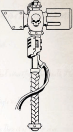

## Agonizer

What started as a series of malfunctioning power swords from the disreputable Clovis Munitorum became a new weapon type after users discovered the faulty field conduits raised the temperature of the blade to over 600 degrees. Loi Metalworks investigated and  created  what  are  now  known  as  burning  blades,  power swords that deliberately create intense heat along their blade so as to burn flesh to the bone with each strike. Heavily insulated so that the user feels little of the inferno raging inches from their palm, these swords are nevertheless extremely dangerous to the wielder as well as their opponents. On a successful hit, the target must pass a Challenging (+0) Agility Test or be set on fire.

## Eldar Powersword

Unlike  the  more  common  Mezoa  power  axe  with  its  broad blade, the Loi model sacrifices some cutting edge length for a longer haft, thus keeping the weight roughly the same. As it can be swung in a longer arc, it can strike with greater penetration. Each is almost a 1.5 meters in length, and some users modify the  top  of  the  axe  in  order  to  fashion  a  very  intimidating walking stick. This weapon requires two hands to use.

## Egerian Shard Glaive

Huge  hammers  featuring  oversized  heads,  these  weapons store  energy  and  then  release  it  in  a  violent  explosion upon impact. The tremendous concussive force released is  equivalent to a concentrated grenade explosion, strong  enough  to  punch  holes  in  vehicles  and knock those nearby to the ground. Though extremely cumbersome to wield, they are often used by Ministorum priests to both smite the wicked and invigorate the faithful. Mezoa patterns are lighter than most  Imperial  versions,  designed  for  use  by  unaugmented humans. They also have only a single concussive front. humans. They also have only a single concussive front.

## Forearm Powerblade

All manner of strange an exotic weapons can be found in the far reaches of the Koronus Expanse. Some are developed by lost human cultures, while others are designed by strange and terrible xenos empires. Their rarity and exotic nature often makes them a prized possession for a Rogue Trader and his crew .

## Galthite Lacerators

One  of  the  favoured  melee  weapons  of  the  vicious  Eldar pirates  is  the  Agonizer,  a  deliberately  cruel  device  often worn as a gauntlet or used as a whip. It acts similarly to a shock  weapon,  but  the  energy  inflicted  on  the  enemy  can bleed through armour easily, causing even more intense pain and physical trauma. Even the mightiest of warriors can be brought low when in the grip of such a weapon.

## Gryphonne-pattern Null Rod

There is perhaps nothing so dangerous as a skilled swordsman wielding one of these deadly blades. Impossibly slender yet strong,  shimmering  with  field  energies,  and  studded  with mysterious glowing gems, an Eldar Powersword is a premier status symbol for any explorer. It is unheard of for these xenos to sell such a weapon and they reclaim them by force, adding even more of delightfully forbidden air to ownership.

An  Eldar  Powersword  adds  +10  to  any  Parry  attempts made by the bearer (with Balanced, this becomes +20 total).## Inertial Hammer

Another relic of the dead planets of the Egerian Domain, these appeared to Explorers to be long poles of black metal, tipped with the jagged crystalline  growths which litter  the  empty maze-cities. It is unknown if they were first used in combat deliberately or in desperation, but it was soon discovered the impacted crystals could slice and splinter, leaving countless glasslike traces behind and causing intense pain as they twist through flesh.

Removing  the  shards  can  take  hours  of  work  and  many doses of pain-blocking medication (along with Wobble or other stiff drink). Careful examination and collection of the shards reveals that, like Egerian geode grenades, the mass of shards and the remaining crystal is greater than before the shattering, something the Adeptus Mechanicus still refuses to validate.

## Macro-hammer

A  defensive  weapon,  powerblades  are  short,  wide  blades attached to the forearm and designed primarily for parrying. Often of xenos manufacture, their energy field allows them to  parry  almost  any  attack,  but  offers  less  in  the  way  of offensive capability. Some wielders pair them with compact pistol weapons, while others wear a single powerblade while carrying a larger ranged weapon in both hands.

A forearm powerblade is mounted on the arm, and does not need to be held in a hand (allowing the wearer to carry something else in that hand or use a two-handed weapon). It is usually deactivated, and while deactivated cannot be used as a weapon. Activating is a Free Action, and the trigger is usually placed in the palm or wrist for easy access.

## Soft Sword

These alien weapons are worn over the hand, each covered with a multitude of razor-sharp short blades. Each strike from a lacerator can slice open several deep ribbons of flesh as the blades cut into their target. As they are not designed for a human hand, the interior of each gauntlet is modified so that it can be worn more comfortably. True Galthite weapons can be discerned from counterfeits as the blades tarnish with a myriad of blue-green patterns when exposed to blood.

*Source:* `Battle Fleet of the Koronus, pages 125–126`
