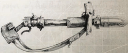

The most common Ork [Macrobatteries](starship-supplemental-components.md) are referred to as Gunz. Though  this  encompasses  any  number  of  different  types  of [Weapons](weapons-general.md), most fire projectiles of some sort or another. It's fairly common  for  Orks  to  loot  weapons  from  defeated  vessels,  so many guns are 'improved' versions of Imperial macroweapons. The Ork inclination towards firepower is such that any gap in the haphazard armour plating is soon filled with a gun.

*Source:* `Battle Fleet of the Koronus, page 77`

# Gunz

## Table of Contents
  - [Big Shoota](#big-shoota)
  - [Burna](#burna)
  - [Deffgun](#deffgun)
  - [Ork Kraftsmanship](#ork-kraftsmanship)
  - [Rokkit Launcha](#rokkit-launcha)

These implanted power cells use body heat and movement to recharge, requiring a day to gain a charge roughly equivalent to  a  lasgun  power  pack.  Unlike  a  Potentia  Coil  implant, this  does  not  generate  enough  power  to  operate  complex machinery  but  is  smaller,  more  easily  concealed,  and  still useful in an emergency. Wiring leads to ports in the skin that accept most standard power conduits. The Power Cell can act as an ammo charge pack for a standard Lasgun or Hellgun and will take a full day to recharge after use.

## Big Shoota

The  pain  ward  implant  redirects  incapacitating  levels  of pain  to  other  regions  of  the  brain,  causing  the  sufferer  to experience that pain as colours, hallucinations, or tastes. The implanted character can ignore Stun effects and involuntary actions or penalties resulting from the pain of critical damage, being on fire, drowning, and so on. Involuntary actions and restrictions caused by the mechanics of a particular injury still occur as normal.

## Burna

This  is  simply  an  emergency  life  support  system  built  into the chest and wired into the spine, intended to sustain fragile flesh  when  it  fails.  It  can  oxygenate  blood  via  electrolytic microfabric  implanted  in  the  lungs,  keep  blood  circulating via  backup  pumps,  and  send  necessary  electrical  stimulus to  the  rest  of  the  body  when  it  senses  catastrophic  injury . While it won't last for longer than a few hours, the actions of  the  Vitae  Supplacement  are  usually  sufficient  to  prevent death until the medicae arrive. Vitae Supplacement grants the Autosanguine Talent and, at the GM's discretion, may give a 50% chance of not dying due to blood loss or other normally fatal consequences of severe wounds. Common Craftsmanship versions  can  preserve  someone  for  up  to  four  hours,  Good and Best versions double and triple this time, respectively.## Deffgun

'Well, 'course dis one's betta! It's lotz 'eavier, and gots dem spikey bitz on de ends.'

-Anonymous Ork

I n a galaxy of guns and swords, Ork weapons stand apart. Ork weapon design is slavishly devoted to two principlesbigger is always better, and more is always better.

Since players can choose to play Ork Explorers, the Ork Armoury has been separated in this book from other weapons for convenience. Orks tend to prefer their own weapons to those of other races, anyway! Throughout this armoury, most items have two different Availabilities listed. The first is for non-Ork Explorers, the second is for Ork Explorers.

## Ork Kraftsmanship

For an Ork, Gunz include anything that fires a projectile, missile, or  anything  that  can  kill  someone  from  a  distance. All  Ork weapons lose the Unreliable Trait when used by an Ork .

## Rokkit Launcha

To the Ork mind, bigger is always better, and as the name suggests, a big shoota is a larger and more destructive version of the standard Ork shoota, though the word 'standard' can only be used in the loosest possible sense when applied to Ork technology .

*Source:* `Into the Storm, pages 142–143`
