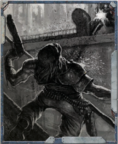

## Combat Shield

These  cruel  weapons  used  by  Eldar  pirates  and  raiders  are  a fearsome sight to many a merchant vessel's crew . The crystalline ammunition is broken into tiny splinters in the firing process, emerging  from  the  weapon  as  a  high-speed  cloud  of  deadly projectiles. The crystals often contain virulent toxins, such that even the tiniest cut can cause festering wounds of intense pain. The weapons themselves carry a wide variety of cutting blades and combat attachments, making them doubly useful in closequarters fighting. Like all Eldar weaponry , they are surprisingly lightweight and deceptively fragile in appearances.

In Melee combat, a Splinter Pistol counts as a Mono-Knife; a Splinter Rifle counts as a Mono-Spear.

## Falchion

Flechette  Blasters  are  terrifyingly  effective  xenos  weapons  of uncertain origin that can be found in the Koronus Expanse in the  hands  of  those  with  a  taste  for  carnage.  They  fire  bursts containing millions of razor-sharp strands that tear flesh into a pulpy mass. Though short-ranged and slow to reload, the power of this indiscriminate weapon to cause terror is prized by many .

## Lacusta Hammer

'Though it is far more efficient to eliminate any opposition at range, those struck down with my axe I dispatch in the name of the Omnissiah.'

-Explorator Orpheus

M elee  weapons  are  even  more  ubiquitous  in  the 41st  Millennium than ranged weapons, from the simple  utilitarian  knives  of  hab  residents  to  the power weapons carried by officers in the Imperial Guard and Imperial  Navy.  All  melee  weapons  listed  here  require  one hand to use unless stated otherwise.

## Parrying Dagger

Primitive weapons, though generally ineffective against Imperial technology, are still common throughout the galaxy. To use primitive weapons the character must have the Melee Weapon Training (Primitive) Talent, or the Thrown Weapon Training (Primitive) Talent, depending on the weapon.

## Swordstick Cane

Small  and  lightweight,  a  combat  shields  can  be  attached directly to the forearm and allow the user to wield a pistol or  other  small  arms.  A  Combat  Shield  provides  3  Armour Points to the Body and Arm wielding the Shield. This stacks with other armour. Some Combat Shields are crafted out of ceramite or adamantium. These Combat Shields count as two steps rarer, but lose the Primitive Quality.

## Weighted Memory-wire

Combining the best of a sword and axe, these short, heavy blades are ideal for close quarters fighting in boarding parties or  when  repelling  attackers.  Similar  to  but  heavier  than  a cutlass, a falchion offers a more brutal offensive capability as it can hack through tougher materials.

*Source:* `Into the Storm, page 122`
