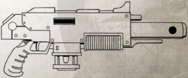

Less advanced than the standard military needle sniper rifle, this  solid  projectile  weapon  is  more  easily  obtainable  and very effective against lightly armoured targets. Complete with  a  tripod  brace,  silencer,  and  telescopic  sight,  in the hands of a skilled marksman it can quickly crush insurrections,  put  down  rebellious  natives,  or  quash labour revolts. Less advanced than the standard military needle sniper rifle, this  solid  projectile  weapon  is  more  easily  obtainable  and very effective against lightly armoured targets. Complete with  a  tripod  brace,  silencer,  and  telescopic  sight,  in the hands of a skilled marksman it can quickly crush insurrections,  put  down  rebellious  natives,  or  quash

## Concealed Bolter-cane

Combi-weapons are an offshoot of the linked weapons system. Whereas Linked Weapons are essentially two of the same weapon mounted together, combi-weapons instead meld two different weapons together. This offers the user more tactical flexibility in the field, as he can switch from one weapon to the other without needing to stow one and draw a  new  one  (as  well  as  save  weight  by  not  having  to  carry  them  both).  A  combi-weapon  contains  a  primary weapon,  usually  a  lasgun,  autogun,  or  boltgun,  plus  a  one-shot  secondary  weapon  mounted  alongside  the  primary barrel. This is normally more powerful than the primary weapon, as it can only be used once, and as such is usually part  of  the weapon  name  (combi-plasma,  combi-melta,  etc).  They  are  prized  weapons  amongst  a  wide  variety  of high-ranking  Imperial  servants,  from  Adeptus  Astartes  officers  to  Imperial  Guard  commanders  to  Adepta  Sororitas Sister Superiors (who naturally favour combi-flamers).

Any two basic  ranged  weapons  or  any  two  pistol  weapons  can  be  combined  into  a  combi-weapon.  First,  select which weapon is the primary weapon and which is the secondary weapon. The primary weapon retains its statistics -rate of fire, ammo capacity, and so forth-while the secondary weapon has its clip size reduced to one and its rate of fire becomes S/-/-. The weight of the new, combined weapon is equal to the weight of the primary weapon plus half the  weight  of  the  secondary  weapon.  The  rarity  is  equal  to  the  rarity  of  the  rarer  of  the  two  weapons,  plus  one additional step. The GM has the final say on which weapons may and may not be combined.

## Perinetus-pattern 'Solo' Mark II Boltgun

The  favoured  personal  weapon  of  those  who  venture into  hostile  jungle  planets  and  Death  Worlds,  this  modified auto-pistol  fires  specially  designed  armour-piercing  rounds containing  a  vicious  cocktail  of  venomous  chemicals.  It  is designed so that if the vicious impact of the bullet doesn't kill the target, the poisons flooding into its bloodstream will, and thus can bring down the largest opponents in a single shot. Often,  they  are  the  final  word  in  terminal  close  encounters. As this weapon is designed to be used with a specific type of ammunition, it may not be equipped with any unusual ammo.

*Source:* `Battle Fleet of the Koronus, pages 112–113`
