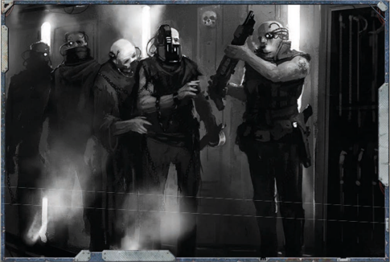
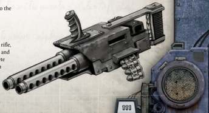

## Civilian Firearm

The  Dervish  laspistol  was  originally  created  by  the  Hox Conglomerate  in  the  Calixis  Sector  as  viable  las-weapon

alternative to the cheap and reliable slug-weapons produced in  Gunmetal City on Scintilla. Although the weapon never truly  caught  on  amongst  the  criminal  underclasses,  it  did find a market amongst those travelling to Frontier worlds or unexplored locations. The Dervish offers them a combination of reliability and power that is appealing to those who do not have access to a steady supply of bullets.

The integral noise baffles built into the rifle make it very quiet. Any attempts to detect the sound of a shot fired by this weapon require a Hard (-20) Awareness Check . This weapon may be equipped with any autogun ammo.

## Disposable Handgun

Designed purely for close range assaults, this gun is heavily reinforced and has a bayonet built into its short and heavy frame. Slots for two power packs are included so the gun can switch to a fresh pack with no reloading. Since the firefights it's designed for are typically over long before two packs are exhausted, it serves its design perfectly.

Each Merovech Assault Lasgun may be used as a spear with the Mono upgrade in melee combat (see ROGUE TRADER page 131). This weapon may be equipped with any lasgun ammo.

## Echon Pattern Mark III Assault Stubber

Used  mostly  for  cutting  through  bulkheads  and  sealed doorways,  lascutters  emit  high  powered  daggers  of  energy which can allow Imperial forces to bypass barricades or rip through  vehicles  and  bunkers.  While  not  as  powerful  as  a plasma cutter or meltagun, many prefer them as they require less  training  and  are  less  dangerous  to  operate.  However, Mezoa-pattern lascutters  are  one  of  the  few  versions  small enough to be considered 'man-portable.'

A lascutter can also be used to cut through plates of hullmetal or adamantium up to 5 cm thick at a rate of 25 cm per round. Each round doing so uses one charge in the weapon's clip. This weapon may not be equipped with any unusual ammo.

## 'Absolution' Sniper Rifle

*Source:* `Battle Fleet of the Koronus, pages 111–112`
