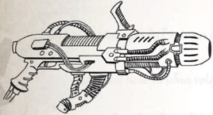

## Argonite Whistler

These  unremarkable-looking  weapons  consist  of  a  simple hollow barrel with a rectangular stock, revealing no sign of their true age or origin. They are assumed to be of human origin,  if  only  because  the  weapon  conforms  to  standard human physiology. Also known as Dustmaker or Heat Death, these weapons are known for the horrific effects they cause. When used, each emits a slight humming sound, belying the impossible effect it is having on its target. Victims struck by the  invisible  beams  find  their  metabolisms  shutting  down as chemical reactions fail or flow too quickly, causing organ shutdown and higher cerebral functions to collapse. Complex molecules such as plastics or fabrics begin to deteriorate, and the  entire  target  deforms  as  the  component  substances  of flesh, bone, and metals become a horrific, melded mass. While the weapon seems to require no actual ammunition, perhaps drawing  on  the  raw  spatial  tension  between  the  Materium and the Immaterium to fuel its baleful energies, it does require time between uses to properly recharge.

Strange +evices of the +istant Past

I have seen members of the courts and nobility sport ancient devices from mankind's distant past, amused by the clever nature of their construction and the humour of their design. +o not assume such devices represent the past of humanity. There are mechanisms beyond the understanding of even our house's most accomplished savants. I have seen the most innocuous of trinkets produce unexpected and total devastation on a foe. Such devices can be extremely useful, but be cautious! I do not wholly trust in anything I cannot understand, and the machine-spirits of these items are beyond our comprehension.

118

118## Dragon's Breath Flamer

These weapons are believed to be of ancient human design, discovered in the deep data vaults of the Lathe Forge worlds in the Calixis Sector. Though not as powerful as many other devices,  they  are  suitably  impressive,  especially  to  native populaces or xenos barbarians. Made of ceramics and glass, when triggered a micro-beam of ionizing energies is focused on the target to create a large electrostatic charge differential between the target and the gun's spiked barrel tip. The longer the trigger is held , the larger the charge created. When the trigger is released, a powerful bolt of lightning leaps from the gun to the target, accompanied by a huge thunderclap.

Add +2 Damage and +2 Pen for a every Half Action spent aiming the weapon before it was fired (to a maximum of +4 Damage and +4 Pen). Note: this still grants the aiming bonus as well.

## Eldar Blaster

Unlike most other solid projectile weapons, this archeotech device fires thin needles of liquefied metal. It can operate with almost any raw material; the user simply feeds metallic chunks or pellets into a large hopper at the rear of the gun, and its internal  batteries  melt  them  into  an  ammunition  reservoir. When discharged, the weapon accelerates a thin beam along the barrel, firing short lances of super-hot, super-sharp metal in bursts of 4-6 spines.

## Eldar Deathspinner

Xenos ranged weapons are born by any number of xenos races. All weapons in this section count as exotic weapons. As with any other exotic ranged weapons, they may not be equipped with unusual ammo (their own ammo is unusual enough!).

## Eldar Lasblaster

Named for the Rogue Trader who first encountered one of their derelict,  drifting  vessels,  the  Argonite  home  world  has  never  been discovered. Their monochromatic ship interiors suggest visual abilities incomparable with humans, and these drab grey rods are thought to be a communication device, emitting a variety of pure tones when gripped in certain ways. Magi-Xenologis discovered that when greater forces are properly applied, the rods can emit a tightly focused sonic beam of destructive power. Whistlers normally feature a handgrip created to standardise a user's grip to fit desired pressure patterns on the rod, making firing much easier for novices.

## Eldar Sunrifle

As elegant and deceptively fragile-looking as all Eldar devices, the Dragon's Breath is more sophisticated and efficient than bulkier  Imperial  flame  weapons.  It  utilises  a  trio  of  rare, highly-compressed chemicals designed to ignite when mixed, forming liquid gouts of flame that arc outward in a deadly spray. The chemicals do not need air for combustion, and the heavy spray adheres to most surfaces, making extinguishing the flames difficult.

The Dragon's Breath flamer must be used in an atmosphere, but that atmosphere does not have to be the standard oxygennitrogen mix.

## Pulse Weapons

Some  Eldar  corsairs  favour  this  small,  pistol-like  weapon for devastating short range attacks against armoured targets. It  fires  a  stream  of  mysterious  dark  energy,  still  under investigation  by  the  Adeptus  Mechanicus  and  the  Ordo Xenos.  This  energy  is  similar  to  laser  emissions  in  some respects, but rather than punching holes through armor and flesh it instead rips apart targets in explosive blasts-leading to its common Imperial designation as a 'Blaster.' Such is the potency of this energy that even the thickest armour can be compromised with ease.

## Larn Cutters

A weapon favoured by Eldar Aspect Cults, the Deathspinner fires a shroud of monofilament thread in a deadly gossamer shroud.  Able  to  fire  more  quickly  and  lethally  than  any Imperial version, they can also entangle small groups, as its  wide  arc  is  capable  of  blanketing  several  foes  with  a single shot.

## Gyro-stabilised

The  Eldar  are  masters  of  laser  weapons,  and  use  a  variety of  elegant  and  lethal  light-based  devices.  Their  Lasblasters can  release  a  fury  of  laser  strikes  at  medium  ranges,  easily outperforming even the most advanced Imperial las weapons. Eldar take particular pride in their ability to use these powerful laser devices, signifying to all their control over light itself.

## Splinter Weapons

A  more  advanced  version  of  the  Lasblaster,  a  Sunrifle sacrifices  a  longer  range  for  even  more  firepower.  Each discharge fires as many bolts of energy as a squad of Imperial guardsmen.| Table 3-3: Exotic Ranged Weapons   | Table 3-3: Exotic Ranged Weapons   | Table 3-3: Exotic Ranged Weapons   | Table 3-3: Exotic Ranged Weapons   | Table 3-3: Exotic Ranged Weapons   | Table 3-3: Exotic Ranged Weapons   | Table 3-3: Exotic Ranged Weapons   | Table 3-3: Exotic Ranged Weapons   | Table 3-3: Exotic Ranged Weapons   | Table 3-3: Exotic Ranged Weapons   | Table 3-3: Exotic Ranged Weapons   |
|------------------------------------|------------------------------------|------------------------------------|------------------------------------|------------------------------------|------------------------------------|------------------------------------|------------------------------------|------------------------------------|------------------------------------|------------------------------------|
| Imperial Exotic Ranged Weapons     | Imperial Exotic Ranged Weapons     | Imperial Exotic Ranged Weapons     | Imperial Exotic Ranged Weapons     | Imperial Exotic Ranged Weapons     | Imperial Exotic Ranged Weapons     | Imperial Exotic Ranged Weapons     | Imperial Exotic Ranged Weapons     | Imperial Exotic Ranged Weapons     | Imperial Exotic Ranged Weapons     | Imperial Exotic Ranged Weapons     |
| Name                               | Class                              | Range                              | RoF                                | Dam                                | Pen                                | Clip                               | Rld                                | Special                            | Wt                                 | Availability                       |
| Meritech cannon                    | Pistol                             | 15m                                | S ± ±                              | 2d10 4 ;                           | 4                                  | 6                                  | 3 Full                             | Blast (1)                          | 0.5 kg                             | Unique                             |
| Ra]orweb /auncher                  | Heavy                              | 10m                                | S ± ±                              | 2d10 4 R                           | 5                                  | 1                                  | Full                               | Blast (1), Tearing                 | 3 kg                               | Extremely Rare                     |
| Rocketfire Gun                     | Basic                              | 80m                                | S ± ±                              | 1d10 5 I                           | 4                                  | 6                                  | Full                               | Tearing                            | 4 kg                               | 9ery Rare                          |
| Sonic RiÀe                         | Basic                              | 30m                                | S 2 ±                              | 1d10 3 ;                           | 2                                  | 8                                  | Full                               | Tearing, Shocking                  | 3.5 kg                             | Rare                               |
| Web Pistol                         | Pistol                             | 30m                                | S ± ±                              | ²                                  | 0                                  | 1                                  | Full                               | Snare                              | 3.5 kg                             | Rare                               |
| Web Gun                            | Basic                              | 50m                                | S ± ±                              | ²                                  | 0                                  | 1                                  | Full                               | Snare, Blast (2)                   | 6 kg                               | Rare                               |
| Heavy Webber                       | Heavy                              | 70m                                | S ± ±                              | ²                                  | 0                                  | 3                                  | Full                               | Snare, Blast (5)                   | 14 kg                              | Rare                               |
| Archeotech Exotic Ranged Weapons   | Archeotech Exotic Ranged Weapons   | Archeotech Exotic Ranged Weapons   | Archeotech Exotic Ranged Weapons   | Archeotech Exotic Ranged Weapons   | Archeotech Exotic Ranged Weapons   | Archeotech Exotic Ranged Weapons   | Archeotech Exotic Ranged Weapons   | Archeotech Exotic Ranged Weapons   | Archeotech Exotic Ranged Weapons   | Archeotech Exotic Ranged Weapons   |
| Name                               | Class                              | Range                              | RoF                                | Dam                                | Pen                                | Clip                               | Rld                                | Special                            | Wt                                 | Availability                       |
| Assault Gauntlet                   | Pistol                             | 20m                                | S ± 8                              | 1d10 4 I                           | 2                                  | 24                                 | 4 Full                             |                                    | 3 kg                               | 9ery Rare                          |
| Entropic Accelerator               | Basic                              | 40m                                | S ± ±                              | 3d10 4 E                           | 3                                  | 1                                  | --                                 | Recharge, Toxic                    | 5 kg                               | Near Unique                        |
| /ightning Cannon                   | Basic                              | 60m                                | S ± ±                              | 2d5 4 E                            | 4                                  | 2                                  | Full                               | 2verheats, Shocking                | 0.5 kg                             | Near Unique                        |
| 4uill Blaster                      | Basic                              | 50m                                | S ± 6                              | 1d10 R                             | 2                                  | 50                                 | 2 Full                             | Tearing, 2verheats                 | 5 kg                               | Near 8nique                        |
| Xenostech Exotic Range Weapons     | Xenostech Exotic Range Weapons     | Xenostech Exotic Range Weapons     | Xenostech Exotic Range Weapons     | Xenostech Exotic Range Weapons     | Xenostech Exotic Range Weapons     | Xenostech Exotic Range Weapons     | Xenostech Exotic Range Weapons     | Xenostech Exotic Range Weapons     | Xenostech Exotic Range Weapons     | Xenostech Exotic Range Weapons     |
| Name                               | Class                              | Range                              | RoF                                | Dam                                | Pen                                | Clip                               | Rld                                | Special                            | Wt                                 | Availability                       |
| Argonite Whistler                  | Pistol                             | 40m                                | S ± ±                              | 3d10 E                             | 6                                  | 8                                  | 2 Full                             | Recharge                           | 2 kg                               | Near 8nique                        |
| Dragon's Breath                    | Basic                              | 30m                                | S ± ±                              | 2d10 2 E                           | 3                                  | 20                                 | Full                               | Flame                              | 4 kg                               | 8nique                             |
| Eldar Blaster                      | Basic                              | 30m                                | S ± ±                              | 2d10 5 E                           | 8                                  | 24                                 | Full                               |                                    | 1.2 kg                             | 8nique                             |
| Eldar Deathspinner                 | Basic                              | 40m                                | S ± ±                              | 4d10 5                             | 2                                  | 30                                 | 2 Full                             | Reliable, Blast (2), Tearing       | 4 kg                               | 8nique                             |
| Eldar /asblaster                   | Basic                              | 120m                               | S 3 6                              | 1d10 4 E                           | 4                                  | 90                                 | Full                               | Reliable                           | 3.5 kg                             | Near 8nique                        |
| Eldar SunriÀe                      | Basic                              | 90m                                | S 4 8                              | 1d10 6 E                           | 4                                  | 60                                 | Full                               | Reliable, Storm                    | 4 kg                               | 8nique                             |
| Pulse Pistol                       | Pistol                             | 40m                                | S 2 ±                              | 2d10 2 E                           | 4                                  | 16                                 | Half                               | Gyro-Stabilised                    | 3 kg                               | 9ery Rare                          |
| Pulse RiÀe                         | Basic                              | 150m                               | S 2 4                              | 2d10 3 E                           | 4                                  | 36                                 | Half                               | Gyro-Stabilised                    | 8 kg                               | 9ery Rare                          |
| Pulse Carbine                      | Basic                              | 60m                                | S ± 3                              | 2d10 2 E                           | 4                                  | 24                                 | Full                               | Gyro-Stabilised                    | 6 kg                               | 9ery Rare                          |
| /arn Cutters                       | Basic                              | 20m                                | S ± ±                              | 4d10 6 E                           | 8                                  | 4                                  | 3 Full                             | Tearing                            | 10 kg                              | Near 8nique                        |
| Splinter Pistol                    | Pistol                             | 50m                                | S 3 ±                              | 1d10 2 R                           | 3                                  | 120                                | 2 Full                             | Toxic                              | 1 kg                               | Extremely Rare                     |
| Splinter RiÀe                      | Basic                              | 80m                                | S 3 5                              | 1d10 2 R                           | 3                                  | 200                                | 2 Full                             | Toxic                              | 2.5 kg                             | Extremely Rare                     |
| ;enos Flechette Blaster            | Basic                              | 20m                                | S ± ±                              | 3d10 R                             | 2                                  | 40                                 | 2 Full                             | Tearing, Blast (2)                 | 2 kg                               | 9ery Rare                          |

## Xenos Flechette Blaster

Often Kroot Mercenaries are seen using weapons far more advanced than their regular rifles, weapons that rival many of the finest Imperial devices. They refuse to reveal their origin, only saying mysteriously that they were given in payment for services 'for the good of all.' These weapons are commonly referred to as Pulse Weapons, as they fire micro-pulses of accelerated plasma at high power and over great distance, comparable in effectiveness to Imperial Bolter weapons. The specialised Pulse Carbine variant sacrifices distance in order to incorporate an under-slung grenade launcher. Treat this as a Mezoa Pattern Grenade Launcher (Rogue Trader page 119). The Pulse carbine may only fire either the grenade launcher or the carbine in a single turn. Most Pulse Carbines in the Expanse have been modified to fire the wide variety of human grenades available, although there are versions only designed to fire photon grenades.

<!-- image -->

*Source:* `Battle Fleet of the Koronus, pages 119–121`
