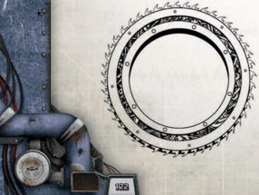

## Neural Whips

This ancient killing device usually takes the form of a metal circlet  roughly  the  width  of  a  human  forearm  and  the thickness  of  a  palm,  surrounded  by  sharpened  metal  teeth. It is human in origin, but as most versions predate much of the  Imperium's  recorded  history,  owning  one  is  a  sign  of considerable wealth.

It  is  heavy  but  when  activated,  micro-gravlifts  negate most  of  the  weight  so  that  it  can  be  hurled,  utilising  a central  grip  for  a  spinning  throw  with  great  range.  The rotating action signals the internal motor to roar into life and fire the chained teeth into rapid rotation, tearing apart flesh and bone on contact in a spray of blood and viscera. Such is the brutality of the weapon, that it is one of the few human weapons that Orks will claim after defeating human forces.

## Shock-knuckles or Shock-nukks

Manufactured  by  a  variety  of  forge  worlds,  these  popular weapons  are  a  familiar  sight  throughout  the  edges  of  the sector  where  memories  of  Saint  Drusus  burn  brightly.  On Drusus  Day,  many  shrines  are  crowded  with  multitudes  of followers, raising their chainswords (or mock replicas for the poor or young) in the air in honour of his works and sacrifice. For those who seek to continue the crusade in the Expanse, the common weapon pattern uses a curved cutlass-like blade. Most are a holy silver in colour, and favour a large spiked basket-guard to better smite the unclean xenos.

## Shock Stars

Some  of  the  more  maniacal  wielders  of  chainswords  use customised models with two ripping edges, created by removing the protective carapace surrounding the near side of the weapon. This  modification  (also  available  as  a  finished  product  due  to demand) makes the weapon dangerous to the user as well, but this is not generally a concern, and wielders proudly wear the numerous self-inflicted scars that using one often entails. Mercy chainswords typically come with a longer haft, so that they can be swung using two hands for deeper strikes.

## Tarsus-pattern Suppression Shield

Shock  weapons  are  melee  and  thrown  weapons  that  have  a powerful electrical charge running through them to shock and stun their targets. To use shock weapons the character must have the  Melee  Weapon  Training  (Shock)  Talent,  or  the  Thrown Weapon Training (Shock) Talent, depending on the weapon.

*Source:* `Into the Storm, page 123`
