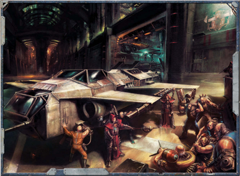

These  [Torpedoes](weapons-torpedoes.md)  are  equipped  with  an  engine  that  burns much hotter, but for a significantly  shorter  length  of  time. This  change  in  the  engine  dynamics  leads  to  an  increased acceleration  that  grants  these  torpedoes  a  higher  velocity, at  the  expense  of  a  shorter  flight  time.  This,  however,  has a  tendency  to  overload  the  augurs  of  a  standard  guidance system's machine spirit, meaning a quicker and more aggressive machine spirit must be used instead.

These torpedoes move at a speed of 15 VU per turn, rather than the 10 VU of all other types. However, their massive [Fuel](weapons-ammunition.md)  consumption reduces their maximum range to 30 VU. In addition, Short Burn Torpedoes grant the torpedo a Torpedo Rating of +15.

*Source:* `Battle Fleet of the Koronus, page 10`
