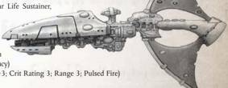

## Essential Components

Large  Solar  Sails,  Warp-Plotter,  Command  [Bridge](starship-anatomy-detailed.md),  Eldar  Life  Sustainer, Eldar [Crew Quarters](starship-essential-components.md), Sensor Array Large  Solar  Sails,  Warp-Plotter,  Command  Bridge,  Eldar  Life  Sustainer,

## Supplemental Components

Choose two prow [Weapons](weapons-general.md) from the following list:

Prow Starcannon Cluster Battery: (Macrobattery; Strength (Macrobattery; Strength

4; [Damage](character-injury.md) 1d10+2; Crit Rating 4; Range 4; Superior Accuracy) 4; Damage 1d10+2; Crit Rating 4; Range 4; Superior Accuracy)

Prow Pulsar Lance: (Lance; Strength 1, Damage 1d10+3; Crit Rating 3; Range 3; Pulsed Fire) Choose one keel weapon from the following list: (Lance; Strength 1, Damage 1d10+3; Crit Rating 3; Range 3; Pulsed Fire)

Detection: Detection:

+20 +20

[Hull](starship-anatomy-detailed.md) Integrity: Hull Integrity:

55 55

Crew Rating: Crew Rating:

Veteran (50) Veteran (50)

Keel Landing Bay: (Launch Bay; Strength 2) This bay holds two [Squadrons](squadrons-overview.md) of Darkstar fighters and two squadrons of Eagle bombers (or their craftworld equivalents, the Nightwing fighter and the Phoenix bomber) (Launch Bay; Strength 2) This bay holds two squadrons of Darkstar fighters and two squadrons of Eagle bombers (or their craftworld equivalents, the Nightwing fighter and the Phoenix bomber)

Keel [Torpedo Tubes](components-torpedo-tubes.md): (Torpedo Tubes; Strength 4; Damage 2d10+14; Range 40; Defensive Holofield, Terminal Penetration [3]) These torpedo tubes are loaded with Eldar plasma [Torpedoes](weapons-torpedoes.md), though they could also be loaded with different torpedoes at the GM's discretion. This Component has 32 torpedoes.

Holofield:

See page 86 for full rules.

## Modifier Summery

The following modifiers apply to the Wraithship:

- -1  Movement  if  heading  towards  the  nearest  sun,  +1 Movement if at right angle, no effect if moving away .
- Inflict  1d5+2  Crew  Population  and  Morale  [Damage](character-injury.md) when part of a Boarding Action.
- Add 1 to Crew Population loss suffered.
- Subtract 1 from Morale loss suffered. (to a minimum of 1).

## Using Shadowhunters

Shadowhunters are intended to operate in [Squadrons](squadrons-overview.md), typically at least one lancearmed  ship  and  two  or  more  starcannon  armed vessels.  Their  [Weapons](weapons-general.md)  are  too  weak  to  prove  a threat to anything but vessels of comparable [Size](character-traits.md) otherwise.  Due to their limited resources, they do  not  range  far  from  their  craftworld  unless accompanying a major Eldar fleet.

In  fleet  actions,  Shadowhunters  pick  off  other escorts  and  defend  larger  Eldar  warships  against ordinance attacks, intercepting [Attack Craft](attack-craft-rules.md)  and [Torpedoes](weapons-torpedoes.md) before they can hit the [Cruisers](hulls-overview.md). However, [Shadowhunter](shadowhunter.md) [Captains](imperial-starship-types.md) are well aware of their fragile vessels,  and  are  willing  to  break  off  engagements rather than destroy themselves needlessly.

- -40 on any Test to hit the ship with [Lances](starship-supplemental-components.md), torpedoes, [Attack](combat-attack-rules.md)  craft  or  by  ramming.  -20  to  hit  the  ship  with macrobatteries.
- -30 on any Extended Action involving Detection.
- +10  to  all  Ballistics  Tests  involving  the  Starcannon Cluster Battery.
- Torpedoes  negate Turret Rating  bonuses  and  use Seeking Rules.

*Source:* `Battle Fleet of the Koronus, page 93`
